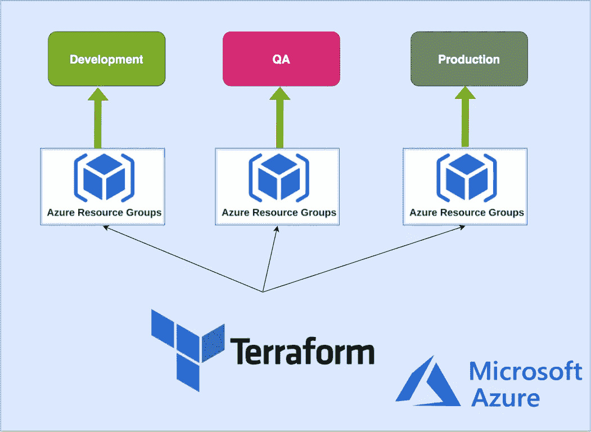

# azure——使用工作区通过 Terraform 构建不同的环境

> 原文：<https://medium.com/bb-tutorials-and-thoughts/azure-building-different-environments-with-terraform-using-workspaces-66e1fb90f2d3?source=collection_archive---------0----------------------->

## 使用 Azure 资源组的示例项目

每个应用程序出于不同的目的需要不同的环境，每个应用程序至少需要 3 个环境。例如，我们需要一个开发环境，供开发人员推送代码并自行测试，一个 QA 环境，供测试人员测试…