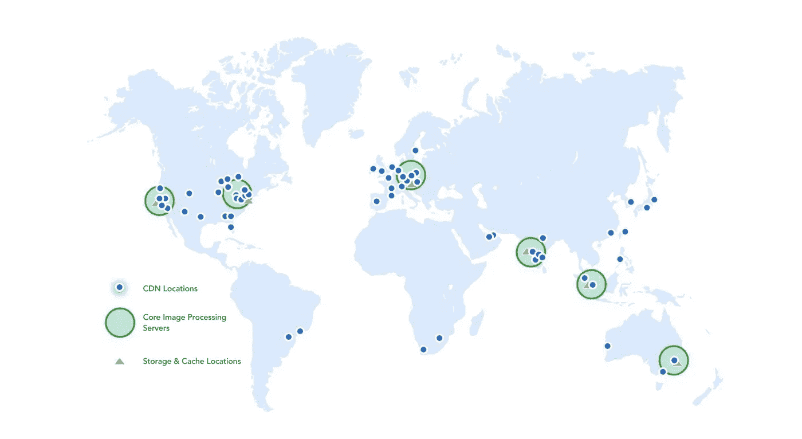
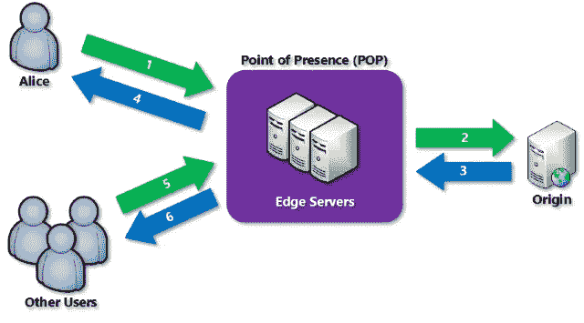
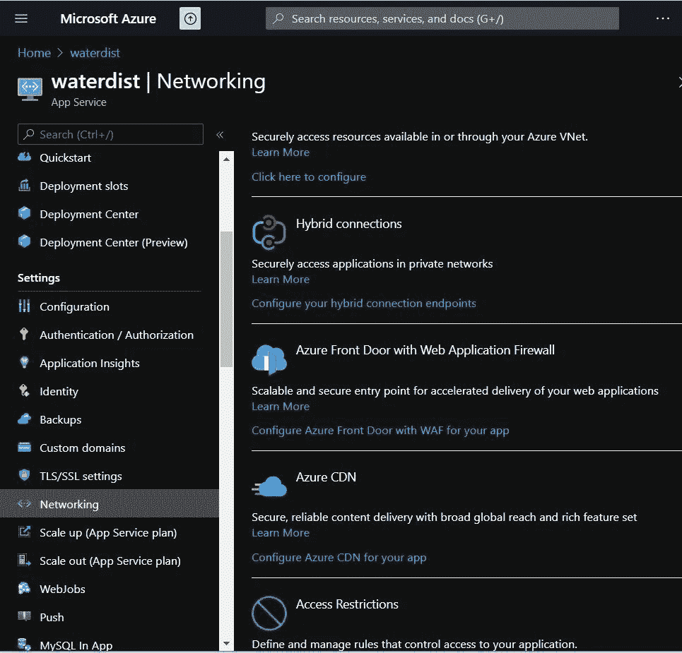
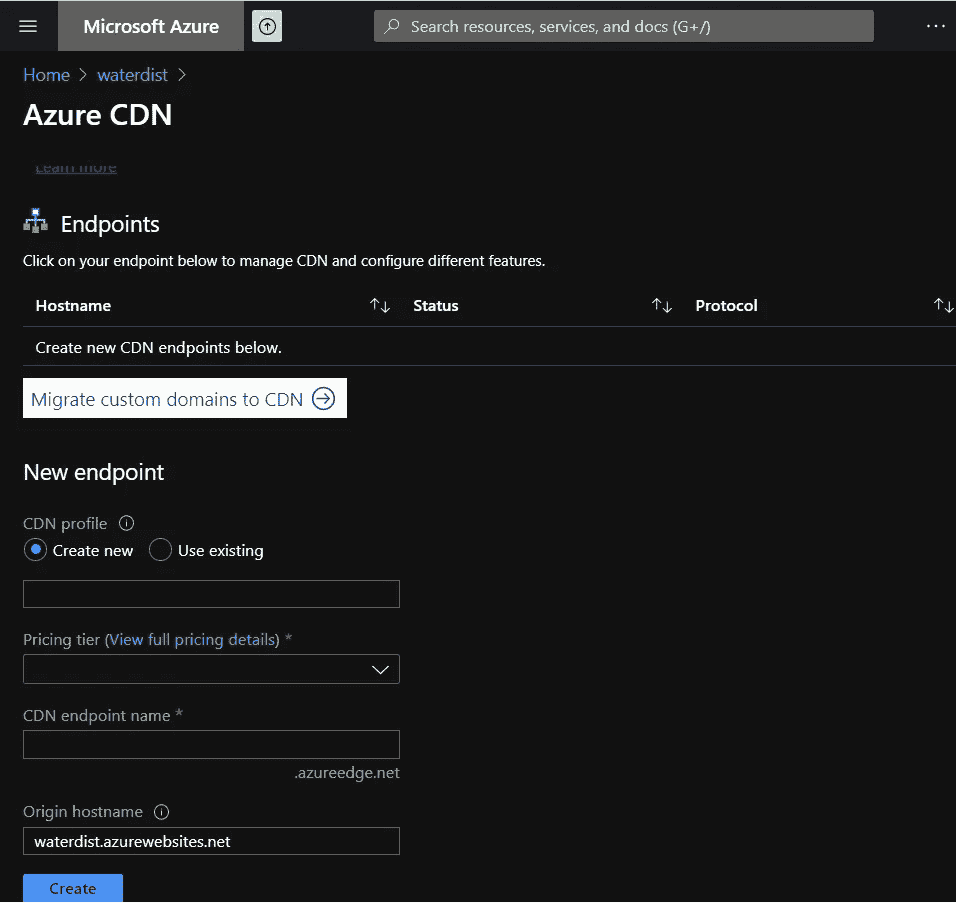
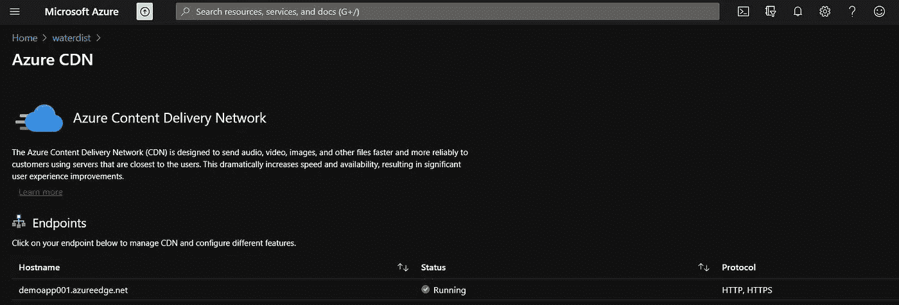
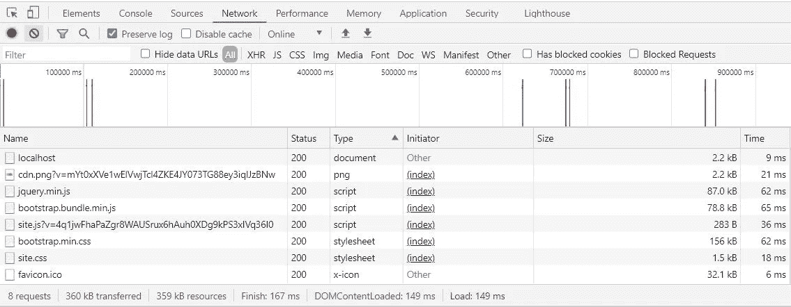
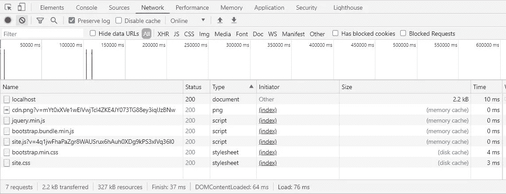

# Azure 内容交付网络(CDN)快速洞察

> 原文：<https://medium.com/globant/azure-content-delivery-network-cdn-quick-insight-d231fea0b581?source=collection_archive---------1----------------------->

# 介绍

本帖将向您解释什么是 Azure CDN(内容交付网络)。CDN 是地理上位于不同区域的服务器集群，以最低的网络和交易延迟向用户提供网站内容，从而以最快的速度提供内容。

(Image courtesy from internet) CDN global presence

# 何时使用 Azure CDN。

> 几乎每一个网站都有 HTML、JS、CSS、图像、视频和字体文件，这些文件在不同用户之间变化不大。为了最大限度地减少应用程序加载时间，我们应该使用 CDN。

CDN 通过从它称为 origin 的原始服务器中提取静态资源来缓存所有静态资源一段时间。此后，用户对与 CDN 相关的资源的任何请求都从该缓存副本中提供。当缓存过期时，资源会随着对源的重新请求而刷新。

一个只包含静态内容的网站可以很容易地通过 CDN 提供服务。

# CDN 的工作原理。

> ***CDN 可以从 Azure 应用服务、Azure 云服务、Azure 存储帐户或任何可公开访问的 web 服务器等来源进行配置。***

(Image courtesy from Microsoft) CDN delivery working model

1.  用户可以通过使用 URL 和域名(<endpoint>)来访问网站。[azureedge.net](http://azureedge.net))，它就变成了一个自定义域。</endpoint>
2.  当在边缘服务器存在点(POP)中找不到缓存时，POP 会向原始服务器请求文件。
3.  原始服务器将文件返回到边缘服务器的 POP。
4.  该文件将在 POP 中保持缓存的生存时间(TTL ),默认 TTL 为七天。
5.  其他用户也使用相同的 URL 请求相同的文件，这些请求将由相同的 POP 发送。
6.  从缓存文件交付的 POP edge 服务器速度更快，对用户体验的响应更快。

> ***让我们为 App 服务配置 CDN，Azure 云服务和 Azure 存储帐户的配置将是相同的，CDN 链接可能位于*** [***Azure 门户***](https://portal.azure.com/) ***的不同菜单部分下。***

# 如何为 App 服务配置 CDN？

**步骤 1** —登录 Azure 门户并创建应用服务(如果您没有 over Portal)。在应用程序服务中，导航左侧菜单并转到网络选项，如下图所示。我们可以在这个刀片中看到许多选项。我们必须选择 Azure CDN，然后单击为您的应用配置 Azure CDN。

Azure CDN configuration under Networking.

**步骤 2** —点击后，我们将导航至 Azure CDN 配置表单，如下图所示。点击创建按钮以获取 Azure CDN 端点。

Required fields for CDN configuration

**步骤 3** —我们可以在下图中看到端点已准备就绪，并配置了选定的应用服务。

CDN endpoint configured

> **使用 CDN 的性能观察。**

正如我们在上面看到的，在没有 CDN 配置的情况下，应用程序的加载时间是**149 毫秒**。配置 CDN 后，我们可以看到加载时间减少到了**76 毫秒**，图像和其他静态文件正在从 POP edge 服务器的内存缓存中读取。

With CDN configuration

# Azure CDN 的优势

*   更好的性能和用户体验。
*   降低原始服务器的负载，因为文件是从边缘服务器(CDN)传送的。
*   启用功能只需要配置。
*   强健且维护较少。
*   易于配置，仅来自资源。

# Azure CDN 的缺点

*   每 GB 大约需要花费 0.10 美元。这看起来不多，但与你的常规托管计划带宽相比，这太贵了。
*   在 CDN 网络上存储一些敏感文件可能会打开潜在的安全漏洞。因为，无论你在 CDN 上存储什么，它都会被复制到所有分布式服务器上。
*   使用 CDN，您正在创建额外的“故障点”。如果 CDN 网络出现故障，您可能会失去网站的可见性。

# 结束语…

我们已经完成了 Azure CDN Quick Insight，并检查了该服务和应用服务配置的优势。包括优点和缺点。Azure CDN 肯定会提高应用性能，我们可以利用这种 Azure PaaS 服务的优势。

快乐学习…

> ***合著者:Gaurav Zambare***