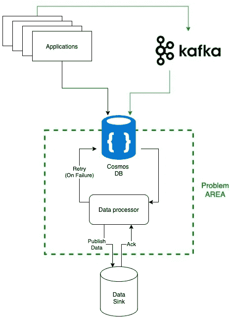
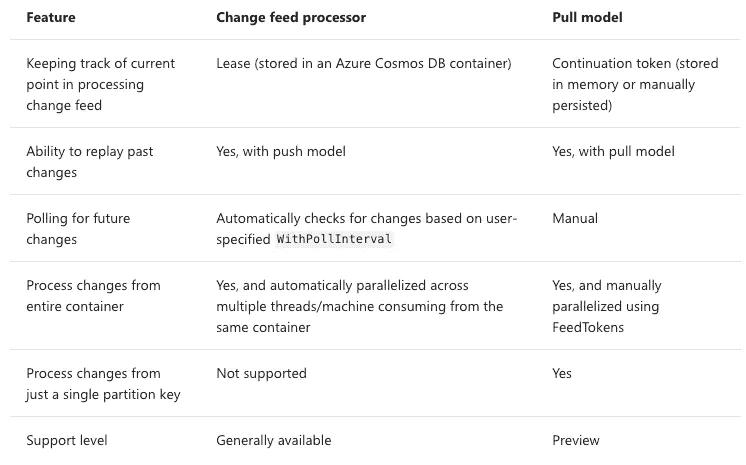
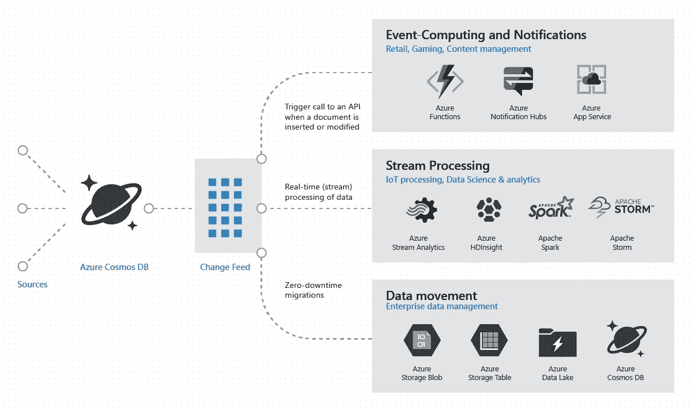
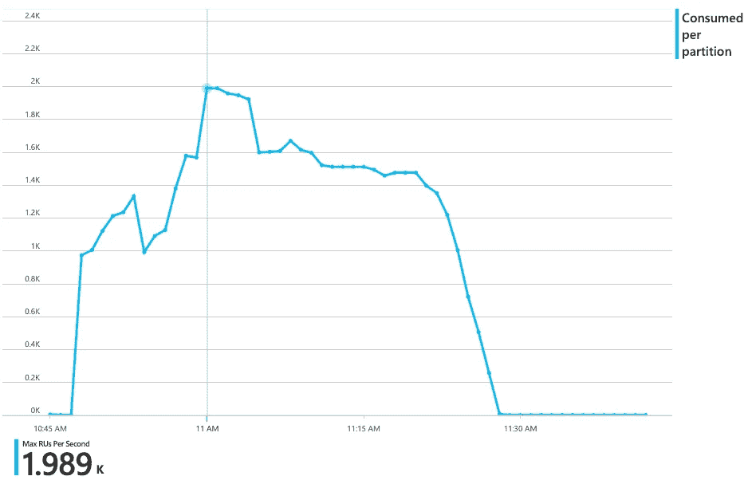

# Azure Cosmos DB:更改 Java 的提要处理器

> 原文：<https://medium.com/walmartglobaltech/azure-cosmos-change-feed-processor-for-java-3e784ac6ef07?source=collection_archive---------0----------------------->

Photo Credit: [Anrita](https://pixabay.com/photos/combine-harvester-agriculture-5401538/)

我最近开始从事一个项目，该项目涉及几个不同系统的集成，一些是遗留系统，一些是新系统。在找出整个解决方案的管道和各种细节的过程中，Azure Cosmos DB 被选为其中一个中间层的中间存储。在这篇文章中，我将具体讨论我们的团队如何使用 Azure Change Feed 处理器来处理从 Azure Cosmos 到数据接收器的数百万个事件。

# 眼前的问题

我们有一个大约数千用户的生产者基础，每天为我们的 Cosmos DB 生成**百万个事件**。事件生产者分布在不同的地理位置。这些事件来自商店设备触发的 API 事件，来自多个系统的 Kafka 事件。除此之外，我们还有多个相关的服务集成，这些集成要求数据以经过处理的格式接近实时。我们需要验证数据、处理数据并将其重新保存到数据库中，以及将其推送到相关的系统中。我们还需要提供 API 来提供关于已处理信息的信息。

# 这项研究

我遇到了 **Azure 的** [**Change feed 处理器模式**](https://docs.microsoft.com/en-us/azure/cosmos-db/change-feed-processor) ，它已经被用于跨多个平台读取 feed，处理和重复大规模数据。但想了解它是如何以不同于现有系统的方式工作的。

您可以使用**推模型**或**拉模型**来处理 Azure Cosmos DB 变更提要。在推模型中，服务器(变更提要)将工作推给客户机，客户机具有处理这项工作的业务逻辑。然而，检查工作和存储最后处理的工作的状态的复杂性是在服务器上处理的。

> 拉模型的延续令牌和变更提要处理器的租约容器都是变更提要中最后处理的项目(或项目批次)的“书签”。

使用 CFP 库或 Azure 函数，你会得到一个推送模型，在这个模型中，你的代码会等待 Azure Cosmos DB 实时推送过来的修改。在拉动模式下，你可以控制消费的速度。类似于(不推荐的)直接方法，您的代码查询变更提要以从中“拉”出变更，而不是等待变更被推送。

虽然推模型通常提供了一种更好的方法，但在某些情况下，拉模型可能更容易使用。首先，它具有通过分区键查询更改的独特能力。此外，通过控制变更馈送消耗，对于那些一次性的数据迁移场景来说也更容易。

使用变更馈送处理器[默认实现]优于拉模型有许多优点，如下所示:

Photo credit : [Official Website](https://docs.microsoft.com/en-us/azure/cosmos-db/change-feed-pull-model)

> Change Feed 处理器库提供“至少一次”保证，确保您不会错过处理任何事件。

更换进料处理器的一些缺点如下:

*   至少一次保证也带来了潜在的问题，即相同的消息被处理多次。我们已经看到，在系统故障、分区上的租约切换或某些应用程序故障的情况下，会收到副本。
*   批处理号是一个很难设置的数字，因为值太高会导致失败时大量重复处理，值太低会导致处理时间延迟，因为存在 feed 轮询延迟。

我们继续使用 change feed 处理器的推送模式有多种原因:

*   我们有多个逻辑分区，数据大小最终也会导致多个物理分区，因此 CFP 推模型保持了分区管理的整洁。
*   为了避免繁琐的租约(光标)管理
*   为了避免手动维护所有的文档确认
*   CFP 的检查点管理确保了在异常情况下零数据故障。

# **天蓝色宇宙变化饲料处理器**

微软官网提到的文章可以总结如下。

> Azure Cosmos DB Change Feed 向 Cosmos DB 外部公开数据库日志。当数据库中有任何变化时，它会立即通知用户。它支持所有的插入和更新。Azure Cosmos DB change feed 支持高效处理大量写入的大型数据集。Change feed processor 还提供了一种替代方法，可以查询整个数据集来确定发生了什么变化。

Photo credit: [Official Page](https://docs.microsoft.com/en-us/azure/cosmos-db/media/change-feed/changefeedoverview.png)

找零进料处理器的组件

*   **被监控的容器**:所有的插入和更新都是对这个容器进行的。变更提要就是从这个容器中生成的。
*   **租约容器**:它充当状态存储，并协调多个工作者之间的变更处理。
*   主机:它是一个应用程序，监听变更提要中的变更。具有相同租用配置的多个主机实例可以并行运行，但是每个实例应该有不同的主机名。
*   **Delegate**:Delegate 是定义您，开发人员，想要对变更提要处理器读取的每一批变更做什么的代码。

# 履行

对于这个博客，我们将使用 4.8.0 版本的 Azure sdk for java。

我们需要 Azure Cosmos DB 中的以下基本参数集:

*   **主机名**:我们可以使用一个简单的名称作为‘host-1’
*   **feedContainer** :我们可以在我们的 Cosmos DB 实例中设置这个容器，记下分区键。
*   **租赁集装箱**:同上。
*   **委托:**委托是您定义的函数，用于处理变更输入处理器输入的每一批变更。

我们需要一个客户端连接到 Cosmos DB 的变化饲料处理器。提供了多个选项，请参见示例代码:

一致性级别——代表 Azure Cosmos DB 服务中 Azure Cosmos DB 客户端操作支持的一致性级别。

> 注意:*请求的一致性级别必须匹配或弱于为数据库帐户提供的一致性级别。
> 按照强度顺序排列的一致性级别为强、有限过时、会话和最终。*

创建简单变更馈送处理器的示例代码:

将变更馈送处理添加到您的模块是一个很好的方法，我们可以使用以下设置让变更馈送与 Azure Cosmos DB 容器进行交互:

> 注意:当
> *未初始化租赁项目时，可使用该选项，但要小心将处理重新设置为从头开始。如果租赁项目存在并且具有有效的延续令牌，将忽略此设置。
> -未指定开始延续标记选项。
> -未指定开始时间选项。*

# 性能试验

在高峰时，我们的解决方案需要并行处理大量的读写操作。作为我们性能测试策略的一部分，我们也想检查这种行为。

**注意相同的 RU 消耗。**

**Cosmos DB 配置:** *多区域部署与* 一致性:强
*最大规模计数:无限制
Cosmos DB 容器最大 RU:4000*

**更改送纸器配置** :
*每页最大项数或送纸响应:****100*** *租用更新间隔:17 秒
租用获取间隔:13 秒
租用到期间隔:60 秒
送纸轮询延迟:****5**秒***

**源容器** —用于写入测试数据的容器，以便在变更馈送处理器中进行后续读取。
**成功容器** —用于存储在更改进给处理器处理方法中进行后处理的数据的容器。

**步骤**

**测试总结和发现**
-在 23 分钟内将 56000 条记录/行插入源容器
-在 23 分钟内完成 32000 条记录的插入(并行读写)后，在 change feed 处理器中进行成功的后处理并存储到成功容器中。
-23 分钟 32360 个请求—在同一容器上并行写入时，每秒处理 23.44 个请求。
- RU 消耗在最大分配 RU 的 50%以内。有效的 RU 使用。

RU usage for Source container

# **值得注意的发现**

*   **每页最大项目数**定义您从变更进料处理器获取多少批次进行处理，这形成了一个瓶颈，因为变更进料处理器会等待您将该批次标记为已处理，然后再进入下一批次进料。
    将该值设置得很高会导致故障场景的复杂情况。假设我们将这个值设置为 200 而不是 100。假设在后处理期间，第 109 个节点失败，那么如果节点处理失败，则整个批次失败。我们需要一种方法来处理失败，并在每页计数的大项目上重试。
*   **Lease fetch Delay :** 我们看到，一旦最后一批页面完成，获取下一批页面大约需要 2 到 3 秒的时间。默认的轮询延迟值是 5 秒，因此设置任何低于 3 秒的值都是多余的，因为下一批将需要大约 3 秒来获得分区离开。还要记住处理每批文档所需的时间。

# 值得关注的事情

## 并行处理

*   多个变更提要处理器可以通过使用租用机制来平均分配工作
*   如果变更馈送处理器实例的数量少于可用的物理分区，则每个变更馈送处理器实例将拥有多个分区的唯一所有权。
*   如果变更馈送处理器实例的数量超过了可用的物理分区，那么其他实例将处于空闲状态
*   如果多个变更馈送处理器想要处理相同的事件，则使用**租用前缀**的概念。每个订阅者将使用不同的租用前缀来处理相同的事件。

## 可量测性

变更馈送处理器实例的数量可以增加和减少，并且变更馈送处理器将通过相应地重新分配来动态地调整负载。

*   如果一个处理器崩溃、挂起或失去网络连接，它的租约将到期，并在其他可用的变更馈送处理器实例之间分配。
*   如果一个处理器拥有所有租约，而另一个租约出现了，后一个将开始从前者窃取租约，这样租约最终将在运行的主机之间平均分配。

## 跳回

如果您的委托实现有未处理的异常，处理该特定批更改的线程将被停止，并将创建一个新线程。新线程将检查租约存储对于该范围的分区键值的最新时间点，并从那里重新开始，有效地将同一批更改发送给委托。这种行为将一直持续，直到您的委托正确地处理变更，这也是变更馈送处理器至少有一次 保证的原因，因为如果委托代码抛出异常，它将重试该批次。

> 为了防止更改提要处理器进入连续的重试循环，我们可以在接收端编写更好的委托函数。我们已经为系统做了一个基于 resilience4j 的二级弹性，以进一步加强我们的系统。我将很快就此写另一篇博客。

## 费用

除了系统行为，我们还在测试过程中监控成本使用情况。我们使用了 11K 的 RUs 来测试不同的场景，每月花费我们大约 500 美元。然后，我们将 RU 消耗调整回 4K，从那时起，我们的系统始终保持在 2K RUs 以内。负载增加会导致成本增加。建议持续监控。

# 接下来呢？

我们已经看到了 Azure change feed processor 的优势，以及在代码中部署和使用它。在这篇文章中，你看到了通过手动添加 Azure Cosmos sdk 和添加 Cosmos change feed processor 的实现是多么容易。添加一个示例代码库供您参考(【https://github.com/Inbaraj-S/ChangeFeedProcessor_Demo】T4)。它也可以通过带有 Cosmos DB 触发器的 Azure 函数来完成，这本身就是另一个博客的主题。Azure change feed processor 对 Java 开发者的在线支持很少。所以如果你尝试了一些东西，一定要和社区分享。快乐编码:)