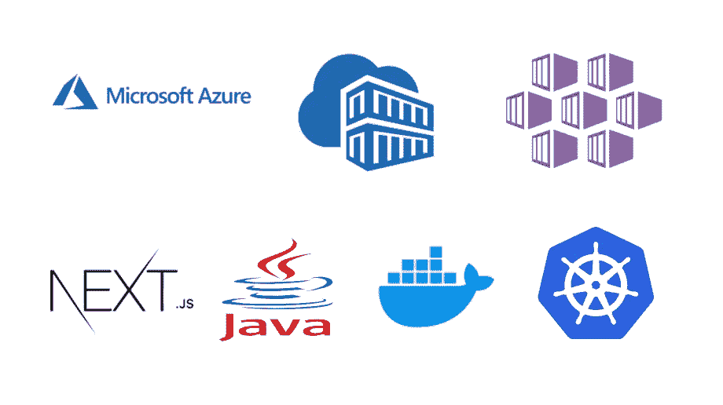

# Azure —下一步部署。AKS 上带有 Java 后端的 JS 应用程序

> 原文：<https://medium.com/bb-tutorials-and-thoughts/azure-deploying-next-js-app-with-java-backend-on-aks-9ba42e257141?source=collection_archive---------0----------------------->

## 包含示例项目的逐步指南

AKS 是微软 Azure 的托管 Kubernetes 解决方案，可以让你在云中运行和管理容器化的应用程序。由于这是一个托管的 Kubernetes 服务，微软为我们处理了很多事情，比如安全性、维护、可伸缩性和监控。这使我们很快…