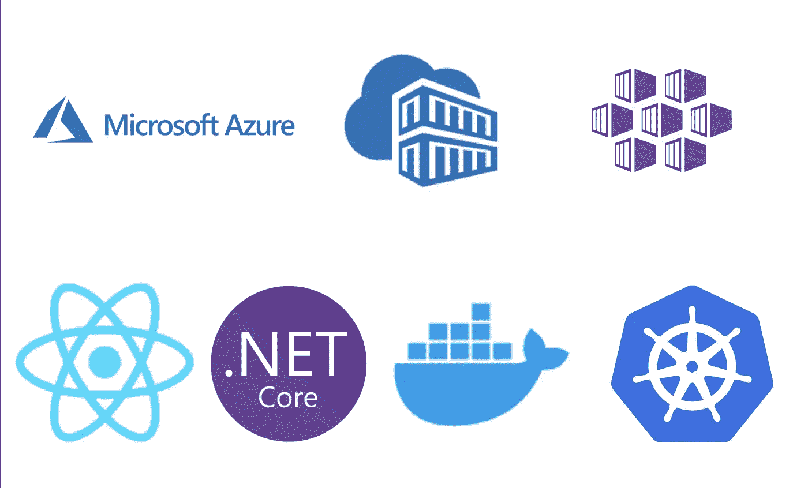

# azure——部署 React 应用程序。AKS 上的. NET Web API

> 原文：<https://medium.com/bb-tutorials-and-thoughts/azure-deploying-react-app-with-net-web-api-on-aks-396b1e66c6cb?source=collection_archive---------0----------------------->

## 包含示例项目的逐步指南

AKS 是微软 Azure 的托管 Kubernetes 解决方案，让你在云中运行和管理容器化的应用程序。由于这是一个托管的 Kubernetes 服务，微软为我们处理了很多事情，比如安全性、维护、可伸缩性和监控。这使得我们可以快速部署…