# Azure DevOps:智能开发的新方法

> 原文：<https://medium.com/edureka/azure-devops-7d7f36e0d0e0?source=collection_archive---------2----------------------->

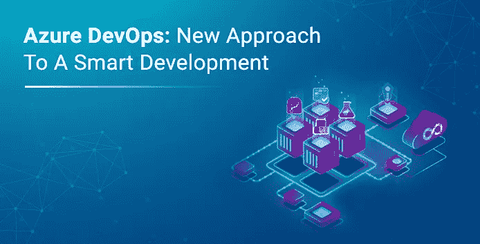

小时候，我们一直被教导要团队合作。我们也被教导要更聪明地工作，而不是更努力地工作。随着我们的成长，我们会将这些经验付诸实践吗？好吧，DevOps 文化肯定充分利用了这些经验。在这篇关于 Azure DevOps 的文章中，我们将了解这些老派的课程是如何派上用场的。

涵盖的主题:

*   DevOps 是什么？
*   什么是 Azure？
*   什么是 Azure DevOps？
*   Azure DevOps 的组件
*   演示:创建并演示 Azure Pipeline 的工作方式

# DevOps 是什么？

我们以烘焙为例。假设你想做布朗尼。你有不同的配料，每一种都有助于布朗尼的味道。你必须使用不同的工具，如烤箱、火炉等。你有食谱，应该一步一步来。没有这两样东西，你甚至都无法接近制作布朗尼。

让我们将这与软件开发过程进行比较。您的成员代表不同的团队，如开发、运营、测试等。烘焙工具象征着不同的 DevOps 工具，如 Git、Jenkins、Docker 等，这使得过程更容易。菜谱象征着软件开发的过程，应该一步一步地遵循它以获得最佳结果。

DevOps 可以被认为是人、过程和产品的联合。

DevOps 是一种开发和部署软件的协作方法。它将开发团队(Dev)和运营团队(Ops)聚集在一起，共同合作，使整个软件开发过程更快、更有效。

# 什么是 Azure？

微软 Azure 是微软打造的云计算平台。它提供各种容易获得的服务。除了易于访问之外，资源的数量还可以动态调整。

这些服务是什么？所以基本上，当你试图构建一个应用程序并在互联网上公开给人们使用时，你需要的东西比你想象的要多得多。您需要服务器、虚拟机、存储设备、数据库和成熟的基础设施。现在，与其从头开始创造它们，或者花很多钱去购买它们，不如你可以借用它们。服务基本上就是你需要的这些需求，可以从像 Azure 这样的云服务提供商那里租用。

# 什么是 Azure DevOps？

一家名为 DORA(devo PS Research and Assessment)的公司，研究软件公司背景下的高绩效。它发现了推动它的因素，并提出了以下关于使用 DevOps 的公司的报告(2018):

1.  部署频率提高 46 倍
2.  更快上市
3.  变更失败率降低 7 倍
4.  变更的交付时间加快了 2，555 倍
5.  收入增加
6.  平均恢复时间加快 2，604 倍

微软 Azure 推出了一款名为 Azure DevOps 的新产品，它肯定可以帮助任何组织实现上述统计数据。如您所知，DevOps 是人员、流程和产品的联合体。显然，微软不会给你提供人员和流程，但它肯定能提供产品。Azure 允许您实现 DevOps 实践，以便您在部署管道中获得更多信心，并让您为各种各样的场景做好准备。

# Azure DevOps 组件

Azure DevOps 由 5 个主要组件组成:

## Azure 板:

Azure Boards 让你可以使用可配置的板、交互式积压和强大的规划工具来跟踪你的工作。它可以让你跟踪每个开发阶段的所有想法，并让你的团队与所有代码变更保持同步。它让你永远做好 scrum 准备。它还可以帮助您使用令人惊叹的分析工具，深入了解项目的健康状况和状态。

## Azure 管道:

这是一个广泛使用的工具。Azure pipeline 让你可以用任何语言在任何平台或任何云上进行构建、测试和部署。尽管它被称为 Azure Pipeline，但它实际上可以让你部署到任何你想部署的地方，无论是 **AWS** 、 **GCP** 、**树莓派、**还是你自己的**平台**。它支持容器，并易于与容器化平台集成，如 Kubernetes。事实上，Azure pipeline 最有活力的特性之一是，如果你正在从事来自 GitHub 或任何地方的开源或**公共项目，它会给你免费的构建、测试和发布。**

在这篇博客中，我将进一步展示 Azure 管道的工作方式。

## Azure Repos:

为您提供灵活、强大的 Git 托管，提供令人惊叹的代码审查和无限的免费存储库来存放您的所有想法。允许您连接任何 IDE、Git 客户端或编辑器。支持 WebHooks 和 API 集成。还提供了一个很酷的语义代码搜索特性，因为它理解变量和类。

## Azure 测试计划:

提供各种各样的手动和探索性测试工具。它允许你在桌面或网络应用上测试你的应用。它在您执行测试时捕获数据，以使缺陷可操作。这有助于更快更有信心地发布。

## Azure 工件:

Azure Artifacts 允许您与整个团队共享来自公共和私有资源的 Maven、NuGet 和 Python 包。它允许您以最有效、可伸缩和简单的方式将包与 CI/CD 管道集成。让您的包裹安全无虞。

# 演示:创建并演示 Azure Pipeline 的工作方式

在这一节中，我将向您展示如何创建 Azure 管道并将其用于 CI/CD。只需遵循以下步骤:

**第一步:**创建一个 Azure DevOps 组织。为此，请访问 Azure DevOps 官方网站并点击**新组织。**

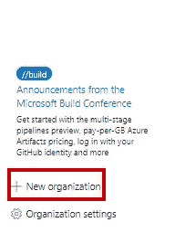

添加组织名称和您希望项目所在的区域。在这种情况下，我将组织命名为 *Kalgi* 和区域 *South India。*

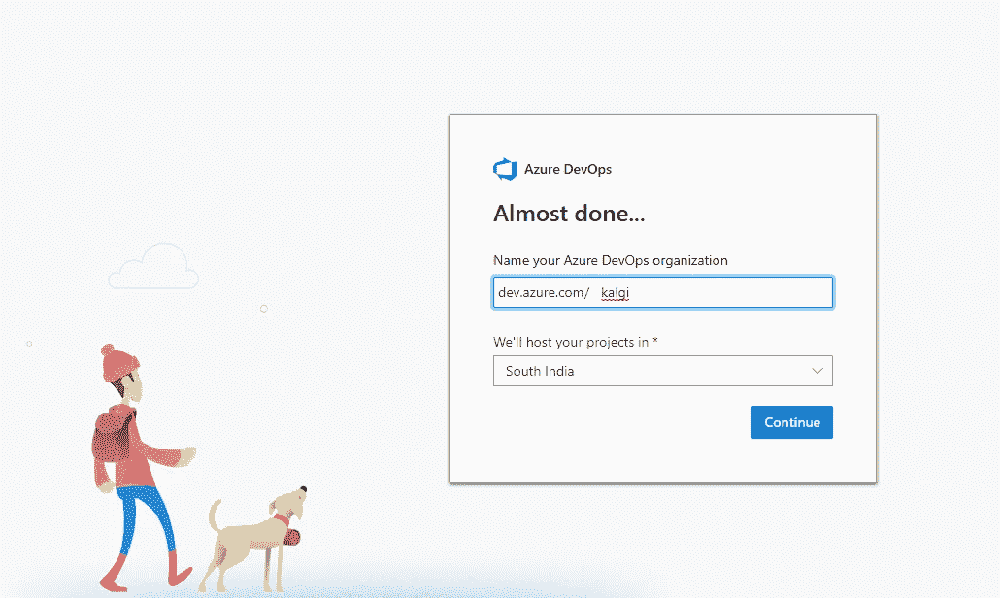

**步骤 2** :一旦你创建了一个组织，你将被提示创建一个项目。输入您的**项目名称。****描述**将包括项目的简短描述。您可以创建两种项目，一种对所有人可见( **public** )，另一种对所有人不可见( **private** )。在私人项目中，您可以添加能够查看或更改您的项目的人员。在本例中，我创建了一个私有项目。填写完所有细节后，点击**创建**。

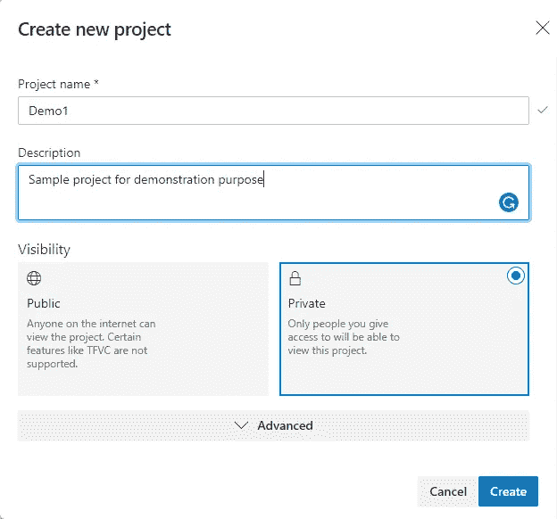

第三步:让我们从创建一个管道开始。您将被定向到您的项目目录。你可以选择创建电路板，回购，管道，测试计划或工件。点击**管道**。

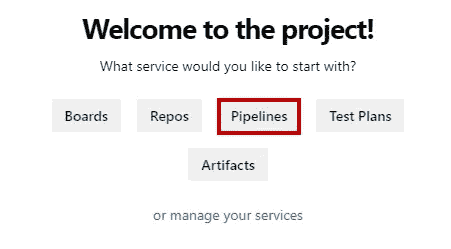

然后点击**新建管道**。

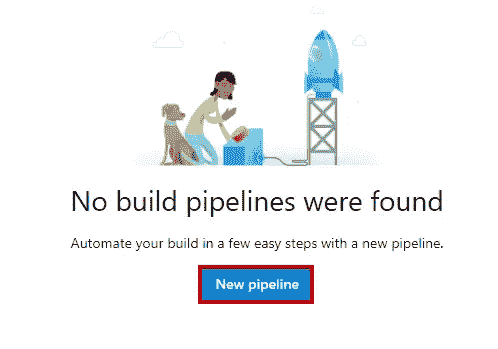

你将被询问你的代码在哪里。在我的例子中，它存储在 GitHub 上，因此我选择 GitHub。您可以相应地进行选择。

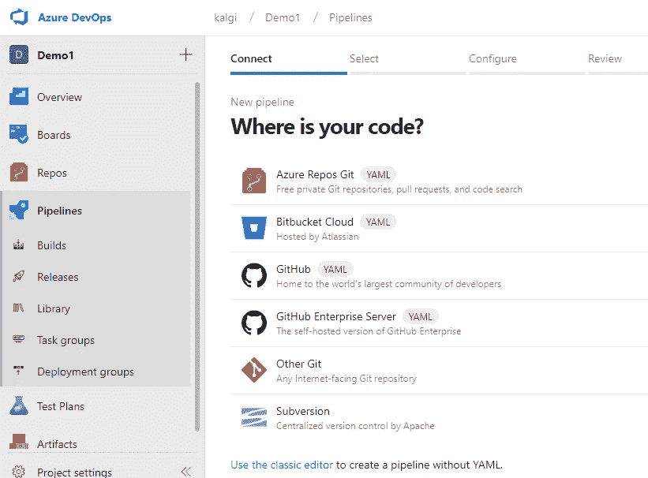

然后会提示您输入 GitHub 密码。输入密码并点击**确认密码**。您现在已连接到您的 GitHub 帐户。

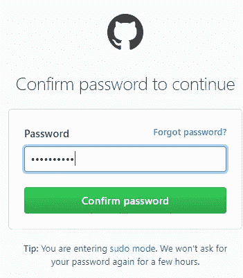

然后会提示你**授权 AzurePipeline** 。只需点击**授权 AzurePipeline** 。

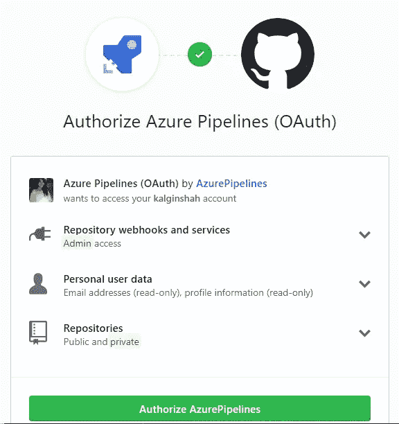

选择您希望用于项目的 GitHub 存储库。出于演示的目的，我已经派生了微软的样本库，名为*pipelines-python-django*，并将在这个 Azure Pipeline 演示中使用它。

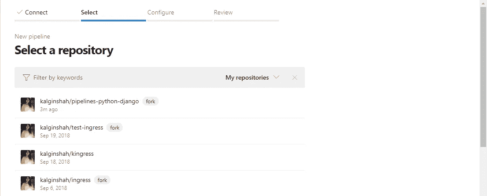

选中**仅选择存储库**并点击**批准并安装**。

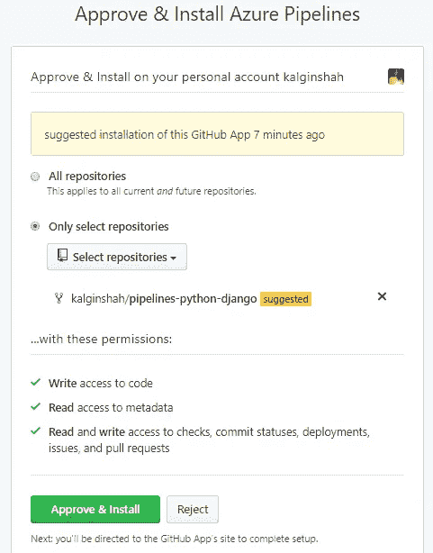

最后，点击**向微软授权 Azure Pipeline**

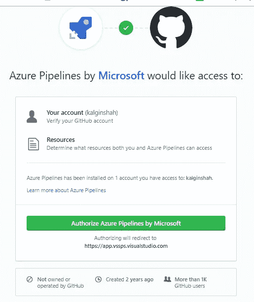

查看管道并点击**运行**。

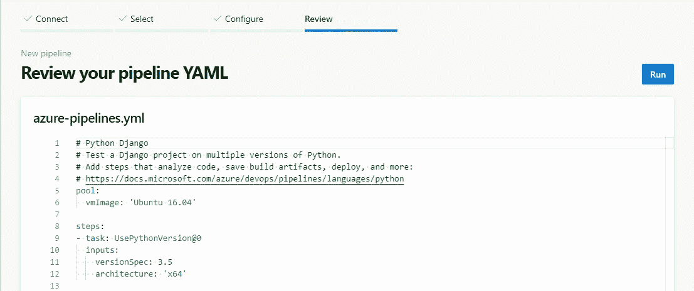

当您运行管道时，您将开始看到正在执行的不同作业的日志。

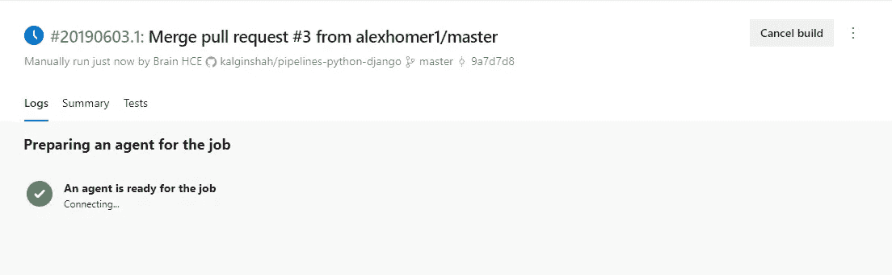

一旦代理准备就绪，作业将开始执行，您将看到它们的状态(成功或失败)。

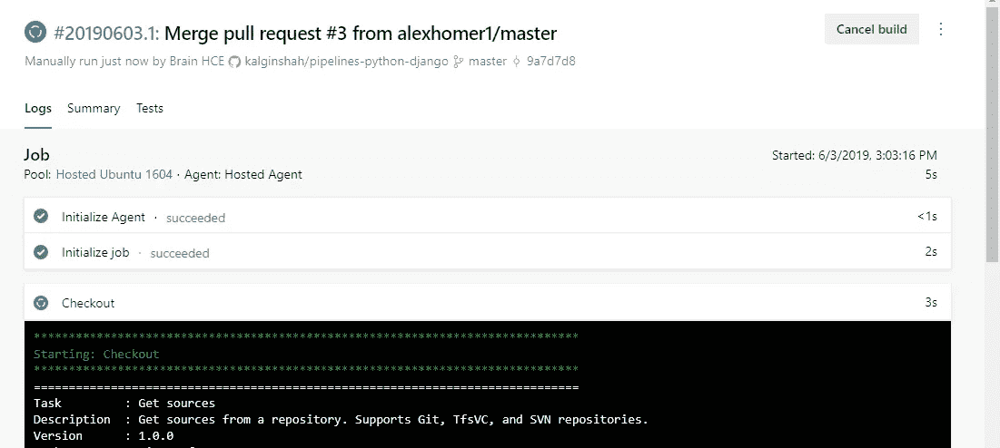

一旦执行完所有作业，您将会看到类似于下面显示的屏幕截图。

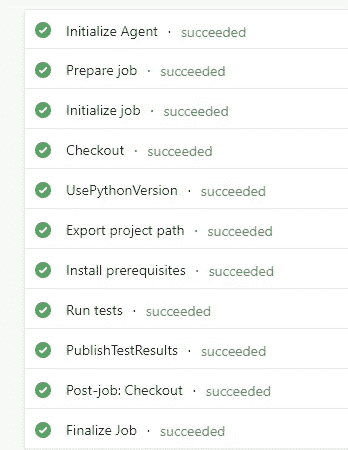

现在，当你去管道，你会看到你刚刚建立的管道。它还显示了构建状态。

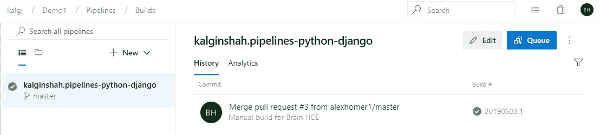

现在让我们继续编辑代码，看看这些变化是否反映在管道中。根据您或组织的要求对您的代码进行更改。在这种情况下，我对自述文件进行了更改。

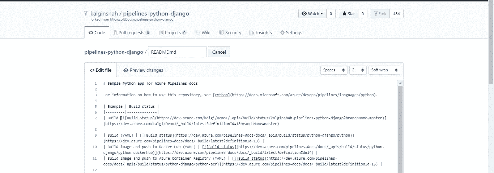

点击**提交更改**保存更改。

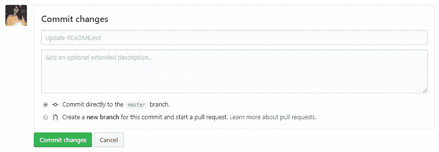

现在您可以检查您的管道，它将在 README.md 文件中显示一个更新。

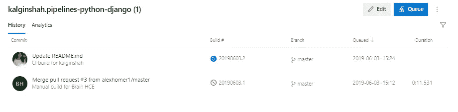

这就是 CI/CD 管道的工作方式，我个人认为微软 Azure 在这项服务上做得非常出色。如果你想查看更多关于 Python、DevOps、Ethical Hacking 等市场最热门技术的文章，那么你可以参考 [Edureka 的官方网站。](https://www.edureka.co/blog/?utm_source=medium&utm_medium=content-link&utm_campaign=introducing-azure-devops)

请留意本系列中解释 Azure 其他方面的其他文章。

> *1。* [*蔚蓝教程*](/edureka/azure-tutorial-5a97e30ee9a7)
> 
> *2。* [*Azure 门户*](/edureka/azure-portal-all-you-need-to-know-about-the-azure-console-8ade1effa474)
> 
> *3。* [*蔚蓝收纳教程*](/edureka/azure-storage-tutorial-an-introduction-to-azure-storage-dae8fd8f555c)
> 
> *4。* [*蔚蓝专用网*](/edureka/azure-virtual-network-securing-your-applications-using-vpc-744eba3aa5b1)
> 
> *5。* [*Azure DevOps 教程*](/edureka/azure-devops-cf755fb334ae)
> 
> *6。* [*天蓝色木板*](/edureka/azure-boards-ce093b2688bb)

*原载于 2019 年 6 月 19 日 https://www.edureka.co***。**