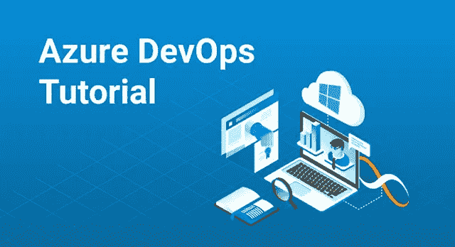

# Azure DevOps 入门——为什么应该在 Azure 上使用 DevOps 的初学者指南？

> 原文：<https://medium.com/edureka/azure-devops-cf755fb334ae?source=collection_archive---------1----------------------->

Azure DevOps Tutorial — Edureka

DevOps 是当前的需要，许多组织都希望采用这种方法来使他们的业务更好地运行。Azure 是领先的云服务提供商之一，支持一套强大的 DevOps 服务。这篇关于 Azure DevOps 的文章帮助你解开使用 Azure 的 DevOps 的实现。

我们将在此讨论以下几点:

1.  什么是 Azure？
2.  DevOps 是什么？
3.  为什么选择 Azure DevOps？
4.  Azure DevOps 的组件

那么让我们开始吧，

# 什么是 Azure？

提供不同服务来满足云计算需求的公司被称为云服务提供商。在各种云服务提供商或供应商中有 ***微软 Azure*** 。

***微软 Azure*** 是由微软**的开发人员和 IT 专业人员创建的云计算平台。**它让您能够通过全球数据中心网络构建、部署和管理应用。

这些是微软 Azure 影响的一些核心服务领域。这些是:

*   计算
*   储存；储备
*   建立工作关系网
*   数据库
*   监视

现在让我们继续这个 Azure DevOps 博客来了解什么是 DevOps？

# DevOps 是什么？

根据定义，

*DevOps 是整合开发人员和运营团队以提高协作和生产力的过程。这是通过自动化工作流和生产效率来持续测量应用程序性能实现的。*

对于初学者来说，这个定义可能看起来模糊不清，因为这里有许多无法解释的术语，让我们先试着去理解它们。

更快地交付软件部署已经成为当前的需要。因为现在的软件市场是不稳定的，你需要保持更新，确保你交付最好的和最新的软件，这可以通过持续交付和持续集成来实现。这就是软件开发人员和系统管理员的角色变得非常重要的地方。

软件开发人员是开发软件的人。他们必须确保软件具有以下参数:

*   新功能
*   安全升级
*   错误修复

然而，开发商必须考虑“上市时间”,时间限制迫使他重新调整其活动，如:

*   待定代码
*   旧代码
*   新产品
*   新功能

这就是当产品投入生产环境时会发生的情况，它可能会出现一些不可预见的错误。这是因为代码是在不同于生产环境的开发环境中编写的。

现在让我们从操作员的角度来看同样的场景:

该团队负责维护，以确保软件在生产环境中正常运行。随着软件开发需求的不断增长，管理员或操作员被迫并行管理许多服务器。

现在，用于管理早期数量的服务器的工具可能不足以管理数量不断增长的服务器。运营团队对代码做了一些小的修改，这样它就可以像在开发环境中一样很好地适应生产环境。因此，需要正确安排这些部署以避免延迟。

当代码被部署时，操作者的责任进一步增加，他们被要求管理代码变更和错误(如果有的话)。有时，开发人员似乎把他们的责任强加给了运营方。这就是问题所在，如果这些团队能够合作，许多问题将会像他们一样得到解决:

这就是 DevOps 所做的，它将这两个团队聚集在一个屋檐下。现在，我相信我们在本节开始时看到的定义更有意义。

现在让我们看看是什么让 Azure 非常适合使用 DevOps，又是什么让 Azure DevOps 成为一个好的选择？

# 为什么选择 Azure DevOps？

我们都知道 Azure 是领先的云服务提供商，绝对是当前的需求。Azure 的以下功能确保以最佳方式实现 DevOps:

## 促进云发展

您现在可以更少地担心创建管道，并专注于软件开发。无论是处理管道、创建新管道还是管理现有管道，Azure 都提供了端到端的解决方案，从而加快了软件开发的进程。

## 更好的可靠性和持续集成

现在，您不必担心管理安全性和基础架构，可以将更多精力放在开发创新解决方案上。有了 Azure 和它支持的 CI/CD，你可以像代码一样利用和使用基础设施，这些代码拥有像 Azure Resource manager 或 Terraform 这样的工具，这些工具可以帮助你创建可重复的部署，同时满足合规性标准。

## 定制的自由

随着 Azure 为你的软件开发提供端到端的解决方案，你可以自由地使用你选择的工具，因为 Azure 很容易与大多数市场工具相结合，从而使定制和实验更容易。

以上原因使得 Azure 成为 DevOps 的高度兼容和首选。现在让我们来了解一下是什么让 Azure DevOps 成为一个很好的组合。

# Azure DevOps 的组件

以下是 Azure DevOps 组件:

*   管道
*   纸板
*   史前古器物
*   回购
*   测试计划

让我们逐一了解它们:

## 天蓝色管道

那么什么是 Azure 管道呢？简而言之，它是一个由 Azure 平台支持的管道，在这里你可以不断地构建、测试和部署应用程序。

## 蓝色木板

如果你有多个团队在一个项目上工作，这些团队需要更好地沟通。Azure 板确保更好的工作跟踪。让您处理积压的工作，并确保创建出色的自定义报告。

## 天蓝色的艺术品

Azure 使您能够创建、托管以及在团队中共享包。Azure 中的构件确保您的管道完全集成了包管理。这可以通过简单的点击来实现。您还可以创建 Maven、NPM 和 NuGet 包。在这里，团队规模并不重要。

## 蓝色仓库

可以把它想象成一个家或者一个仓库。它为您提供无限的云托管的私有 Git 存储库。您可以将您的更改拉、推和提交到这些存储库中。

## Azure 测试计划

它为您提供了一个完整的工具包来执行端到端的手动和探索性测试，确保您的软件功能正常。

这是关于 Azure 组件的。伙计们，关于 Azure DevOps 的这篇文章到此结束。如果你想查看更多关于 Python、DevOps、Ethical Hacking 等市场最热门技术的文章，你可以参考 Edureka 的官方网站。

请留意本系列中的其他文章，它们将解释 Azure 的各个方面。

> 1.[蔚蓝教程](/edureka/azure-tutorial-5a97e30ee9a7)
> 
> 2.[蔚蓝门户](/edureka/azure-portal-all-you-need-to-know-about-the-azure-console-8ade1effa474)
> 
> 3. [Azure 存储教程](/edureka/azure-storage-tutorial-an-introduction-to-azure-storage-dae8fd8f555c)
> 
> 4. [Azure 私有网络](/edureka/azure-virtual-network-securing-your-applications-using-vpc-744eba3aa5b1)
> 
> 5.[天蓝色木板](/edureka/azure-boards-ce093b2688bb)
> 
> 6.[天蓝色管道](/edureka/azure-pipelines-1faa653e4cff)

*原载于 2019 年 4 月 22 日*[*https://www.edureka.co*](https://www.edureka.co/blog/azure-devops/)*。*