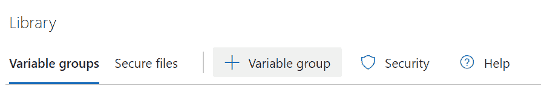

# Azure Devops:实现 Devops 标准指南

> 原文：<https://medium.com/globant/azure-devops-implementing-devops-standard-guidelines-a047b6b287bf?source=collection_archive---------1----------------------->

# **简介:**

多年来，许多组织已经开始适应云文化。他们的基础设施已经迁移到云，毫无疑问，微软已经成为最大的云提供商之一:Azure。当我们谈到云时，DevOps 这个词就会浮现在脑海中，Azure devops 已经成为管理 devops 实践的流行工具。Azure DevOps 支持一种文化和一套流程，将开发人员、项目经理和贡献者聚集在一起完成软件开发。Azure DevOps 为支持团队提供开发人员服务，帮助他们规划工作、协作开发代码，以及构建和部署应用程序。

本文详细阐述了一些标准指导方针，您可以遵循这些指导方针在 Azure devops 中管理您的项目，以在粒度级别上坚持安全性和更好的可见性。

# **背景:**

在 Azure devops 上工作了一段时间后，我提出了一套遵循 devops 文化的标准指南，将在下面的文章中展示。

# **本文涵盖以下几点:**

1.  先决条件
2.  指南
    A .项目 Wiki
    B .工作项
    C .项目权限
    D .分支策略
    E .管理存储库
    F .库变量组

3.优势

4.结论

5.参考

# **1。先决条件:**

*   本文的先决条件包括使用 Azure Devops 创建组织和设置项目的知识。但如果你对 Azure Devops 完全不熟悉，想入门，可以参考微软文档:[注册，签到，邀请队友——Azure devo PS 服务](https://docs.microsoft.com/en-us/azure/devops/user-guide/sign-up-invite-teammates?view=azure-devops)

# **2。指导方针:**

*   本节详细介绍了您可以在 Azure devops 中为您的项目实现的标准指南。指导方针是关于项目管理的:分支策略，项目许可，等等。通读以了解所有指导方针的更多信息:

## **答:项目维基:**

*   Azure devops 提供了一种写下详细项目文档的方法，它有一个称为“wiki”的功能，是维基百科的缩写，意思是你需要知道的关于项目的一切。
*   你可以在这个维基部分写下所有的项目细节或项目概述。要将“维基”添加到项目中，请选择“概述”选项卡，然后选择**维基**，如下所示:

*   向项目中添加一个 wiki 部分是一个需要维护的标准实践，这有助于项目的新成员了解项目的概况。
*   您还可以向项目 wiki 添加多个子页面，以获得多层文档，如主页、简介和概述等。如下图所示:

*   确保在项目 wiki 部分添加一些介绍部分，如下所示:

## B.工作项目:

*   在 Azure devops 中，跟踪工作进度的最佳方式是通过工作项目，Azure devops 提供了多种类型的工作项目来创建。

*   下面显示了工作项的任务类型的一个简单示例，您可以尽可能详细地描述您正在处理的任务，甚至可以非常具体地描述细节，例如实际工作的总小时数:

## C.项目权限:

*   Azure devops 提供了一种在组或用户级别上管理项目权限集的方法。
*   要管理项目级别的权限，请转到项目设置(位于项目内部的选项卡，如下所示):

*   在项目设置中，单击权限选项卡，如下所示:

*   在“权限”页面上，您可以查看当前项目中的组和用户列表。管理作为项目一部分的所有用户的更好的方法是将他们添加到一个定制的团队组中。要创建一个新的团队组，点击如下所示的**新组**按钮:

*   一旦你创建了一个新的组，在这个例子中是它的**开发人员**团队组，你可以将所有开发人员的电子邮件 id 添加到团队组中。之后，您可以为该定制团队组设置权限，值为:Not set / Allow / Deny。默认情况下，所有权限都设置为**未设置**，这意味着不允许该活动。
*   可以允许开发人员对以下活动拥有“允许”权限:

*   当多个用户是团队组的一部分时，管理他们更容易，并且我们可以在团队组级别上设置权限。

## D.**分支策略:**

*   理想的做法是基于主(默认)分支创建一个单独的分支，用于添加新代码和测试代码，最终将其与主分支合并。
*   通常的做法是基于主分支创建至少一个新分支，以测试新的代码更改。为了遵循最佳实践，您可以创建一个名为 **develop** 的分支，如下所示:

*   根据默认分支:master & develop 建立分支策略是一个好主意。要设置分支策略，点击分支右上角的**更多选项**按钮，选择**分支策略**，如下图所示:

*   在设置分支策略时，确保选择适当数量的评审者来评审提交到分支的代码:

*   签入到分支的代码需要有一个链接的工作项，并且每当评审者为拉请求提供注释时，这些注释需要在签入时被解析。这两种策略都可以通过设置以下方式来启用:

*   每当针对主分支或任何父分支创建拉请求时，您可以选择代码将被合并到父分支的类型。如果有被请求合并的批量变更，跟踪提交的历史就变得很困难。根据合并到父分支的更改的频率，您可以选择限制合并类型:

*   Azure devops 还提供了通过预合并和创建拉请求来验证代码的功能。在下图中，我们添加了在预合并步骤触发的 CI 管道，以便在合并前验证代码。最后，在**自动包含的评审者**中，您可以添加将评审代码拉取请求的评审者列表:

*   应用了策略的分支如下所示:

## E.**管理存储库:**

*   与分支策略类似，Azure Devops 提供了一种管理在项目中创建的存储库的方法:

*   在所有存储库中->选择要管理的存储库。您可以设置 Azure devops 提供的存储库策略。如果您希望根据开发人员电子邮件 id 筛选出提交到存储库的内容，可以通过以下方式完成:

*   在存储库管理的“安全性”( security)选项卡中，您可以添加已创建的自定义团队组，以使自定义团队组用户能够访问选定的存储库:

*   对于开发人员团队，您需要设置用户权限。开发人员应该能够贡献给仓库，拉请求，并根据需要创建分支。下面是可以为由开发人员组成的自定义团队组设置的权限集:

*   有多种方法来管理存储库，但是确保进行安全检查是非常重要的。

## F.**库变量组:**

*   最后但同样重要的是，Azure devops 帮助用户以许多不同的方式实现可重用性，其中之一是变量组库。

*   点击**+变量组**按钮添加一个新的变量组。

*   变量组就是一组可以在多个构建/发布管道中使用的变量。
*   使用变量组的最重要的特点是，每当一个变量的值需要更新，而不是更新所有的地方，你只需要更新一个地方，这就是变量组。

*   您可以加密包含机密信息的变量，并在库变量的帮助下将它们保存在一个地方。

# 3.**优点:**

*   Azure devops 提供了许多功能来帮助管理我们的项目
*   向分支添加分支策略有助于开发人员以更好的方式管理他们的代码。
*   将用户添加到团队组可以更容易地管理一组应用相同权限的用户。
*   有许多这样的 Azure devops 功能可以帮助用户以可重用和安全的方式维护他们的存储库。

# 4.**结论:**

这篇文章解释了我们如何在项目中管理我们的存储库和分支，这个项目有很多人在远程工作。Azure devops 帮助组织在分布式环境中远程管理他们的代码。在 Azure Devops 提供的众多功能的帮助下，开发人员将他们的代码迁移到 Azure devops 变得非常高效。除了核心的构建和发布管道之外，本文主要关注 Azure devops 的几个重要特性。

# 5.**参考文献:**

*   [向团队或项目添加用户或组— Azure DevOps | Microsoft Docs](https://docs.microsoft.com/en-us/azure/devops/organizations/security/add-users-team-project?bc=%2Fazure%2Fdevops%2Fget-started%2Fbreadcrumb%2Ftoc.json&toc=%2Fazure%2Fdevops%2Fget-started%2Ftoc.json&view=azure-devops&tabs=preview-page)
*   [查看自己或他人的权限— Azure DevOps | Microsoft Docs](https://docs.microsoft.com/en-us/azure/devops/organizations/security/view-permissions?bc=%2Fazure%2Fdevops%2Fget-started%2Fbreadcrumb%2Ftoc.json&toc=%2Fazure%2Fdevops%2Fget-started%2Ftoc.json&view=azure-devops&tabs=preview-page)