# Azure 持久功能

> 原文：<https://medium.com/globant/azure-durable-functions-610291c1123a?source=collection_archive---------0----------------------->

# 概观

Azure 函数是 Azure 中的无服务器解决方案。在亚马逊网络服务中，它被称为 AWS Lambda。Azure 函数以两种重要的方式提供按需计算。

> 首先，Azure functions 允许你将系统的逻辑实现到现成的代码块中。这些代码块被称为函数。
> 
> 第二，随着请求的增加，Azure 函数会根据需要使用许多资源和函数实例来满足需求——但只是在需要的时候。随着请求的减少，任何额外的资源和应用程序实例都会自动减少。这就是所谓的放大和缩小。用于相同目的的组件称为缩放控制器，它监视事件的速率并确定是向外扩展还是向内扩展。

# Azure 中的持久功能是什么

持久函数是 Azure Function 的扩展，它允许我们编写有状态的函数。耐久功能建立在 [**耐久任务框架**](https://github.com/Azure/durabletask) **之上。**当我们等待[***DurableOrchestrationContext***](https://docs.microsoft.com/en-us/dotnet/api/microsoft.azure.webjobs.durableorchestrationcontext?view=azure-dotnet-legacy)***，*** 时，它写入一个历史表并退出该函数。当输出准备就绪时，它重新运行函数到 await(检查点)点，并将值注入。

# 持久功能模式:

它简化了无服务器应用程序中复杂的有状态协调需求。

**1。*异步 HTTP API:***

aysnc HTTP API 模式解决了与外部客户机协调长时间运行的操作状态的问题。实现这种模式的方法是让 HTTP 端点触发长时间运行的操作。然后，重定向到客户端轮询以了解执行何时完成的状态端点。

Durable Function 为这种模式提供了内置支持，简化甚至删除了与长时间运行的函数执行进行交互所需的代码。

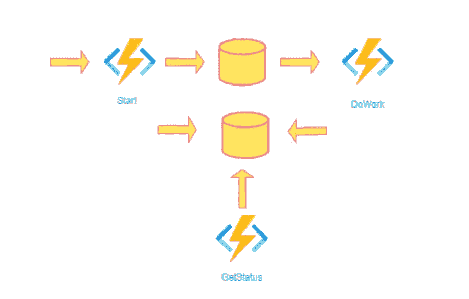

一个简单的 REST 命令，我们可以用它来启动新的 orchestrator 函数实例。实例启动后，扩展会公开查询 orchestrator 功能状态的 webhook HTTP APIs。作为持久函数，运行时为我们管理状态。我们不需要实现自己的状态跟踪机制。

**2。*功能链接:***

函数链是指以特定顺序执行一系列函数的模式。通常，一个函数的输出需要应用于另一个函数的输入。持久函数允许我们用代码简洁地实现这种模式。

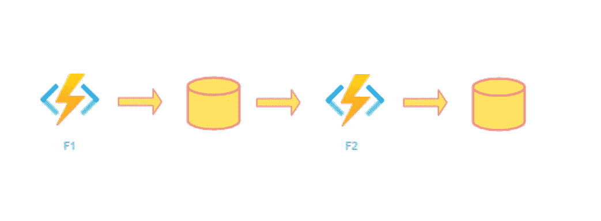

***3。扇出/扇入:***

扇出/扇入是指并行执行多个功能，然后等待所有功能完成的模式。通常会对函数返回的结果进行一些聚合工作。对于普通函数，可以通过让函数向一个队列发送多条消息来实现扇出。然而，扇回更具挑战性。持久函数扩展用相对简单的代码处理这种模式。

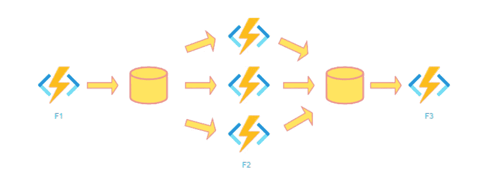

***4。监控:***

监控模式指的是工作流中灵活的循环过程，例如，在满足某些条件之前进行轮询。常规的计时器触发器可以处理一个简单的场景，比如定期清理作业，但是它的时间间隔是静态的，管理实例生存期变得复杂。持久功能支持灵活的重复间隔、任务生命周期管理，以及从单个编排创建多个监控流程的能力。

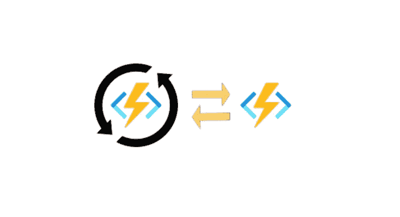

***5。人际互动:***

许多过程都涉及到某种人类互动。让人类参与自动化过程的棘手之处在于，人们并不总是像云服务那样高度可用和响应迅速。自动化流程必须考虑到这一点，它们通常通过使用超时和补偿逻辑来实现这一点。

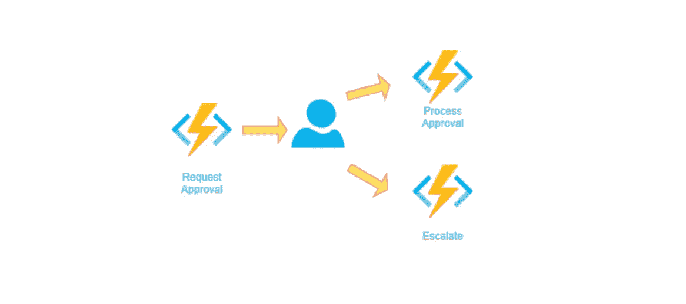

**6。*聚合器:***

在这种模式中，被聚合的数据可能来自多个来源，可能是成批交付的，也可能是长时间分散的。聚集器可能需要在事件数据到达时对其采取行动，并且外部客户端可能需要查询聚集的数据。

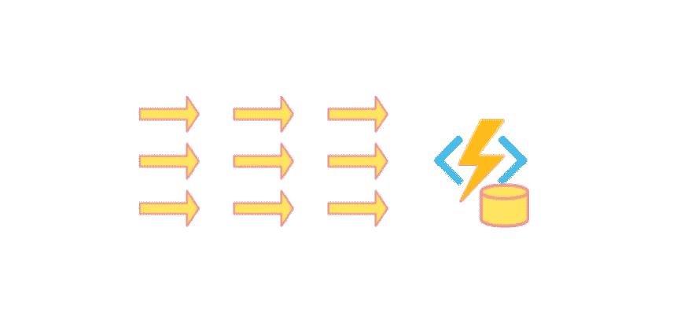

# 持久功能的概念

Orchestrator 函数只有一个角色，即定义工作流。它本身不执行任何操作，比如调用 API 或写入数据库。相反，它将工作流中的所有实际步骤委托给活动功能。当第一个活动完成时，Orchestrator 函数会唤醒并从它停止的地方继续，调用工作流中的下一个活动。因此，一个 Orchestrator 函数调用一个 Activity 函数，Activity 函数就是一个普通的 Azure 函数，它参与工作流。活动函数可以从 Orchestrator 函数接收输入数据，并可以向其返回数据。

# 持久功能的缺点:

*   由于 orchestrator 函数运行多次，因此 orchestrator 函数具有确定性非常重要。(即代码必须为相同的输入返回相同的值。)
*   消费计划的扩展有一些限制，即使是高级计划也有 100 个应用程序功能的上限。

**持久功能所需的库**

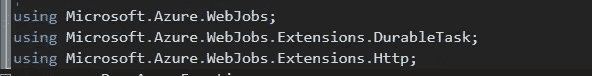

**使用 Visual Studio 2019 创建持久函数的步骤**

1.  打开 Visual Studio 2019，选择 ***新建一个新项目。***

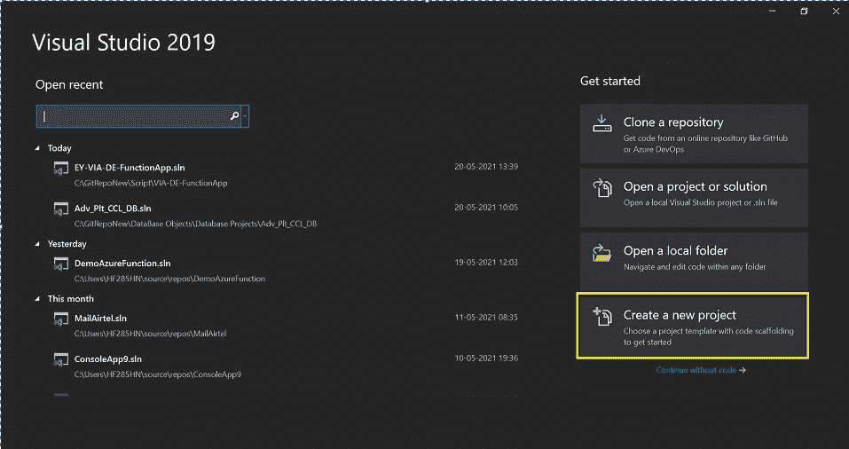

2.搜索 ***Azure Functions*** 模板，点击下一步。

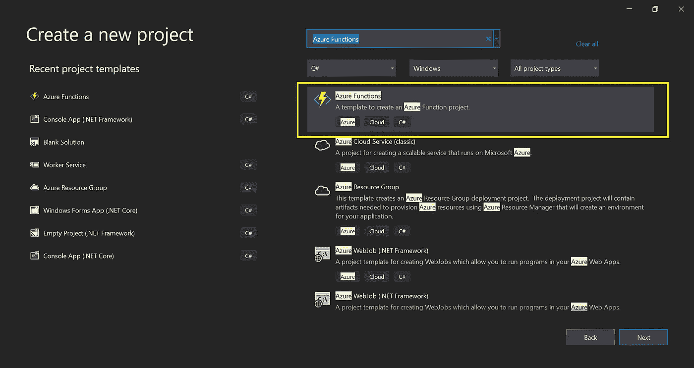

3.输入 ***项目名称*** ，点击 ***创建*** 在配置您的新项目屏幕下

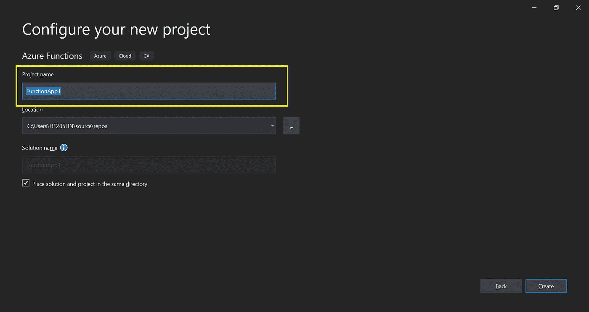

4.选择 ***清空*** 申请类型，点击 ***创建***

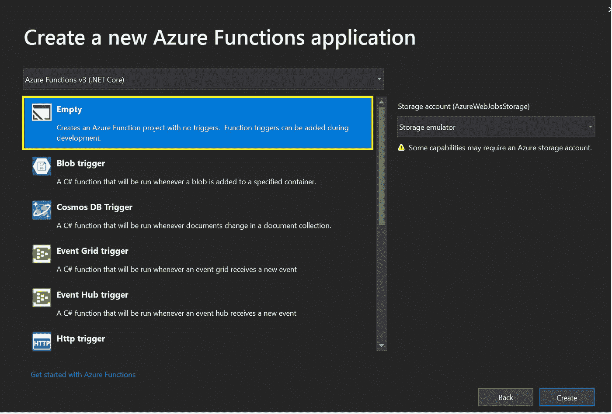

5.在解决方案浏览器中右击项目名称，选择 ***添加*** ，选择 ***新 Azure 函数***

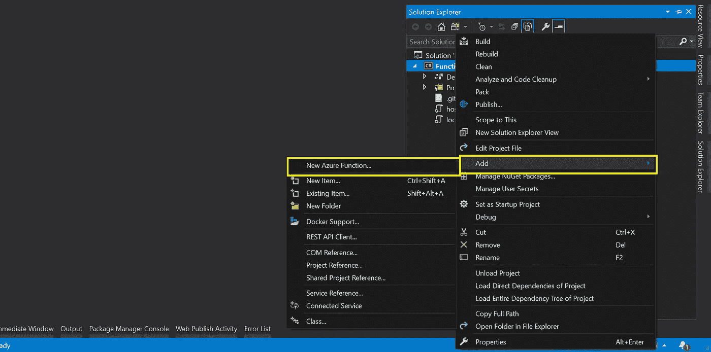

6.选择 Azure 函数，输入类文件 Function1.cs 的名称，点击 ***添加***

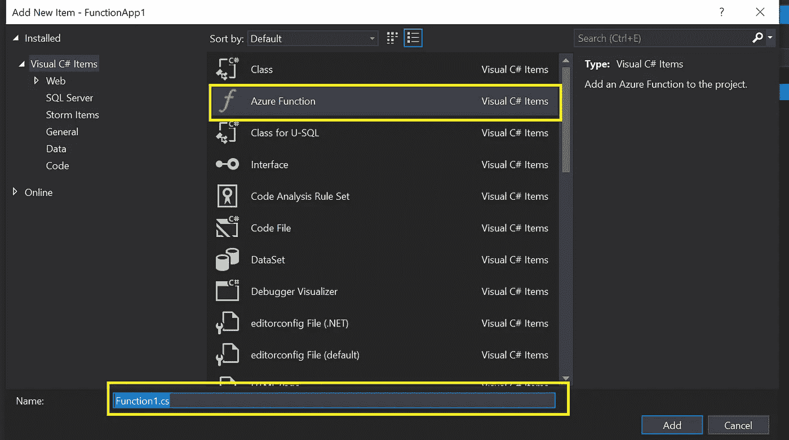

7.选择 ***持久功能编排*** 并点击确定按钮

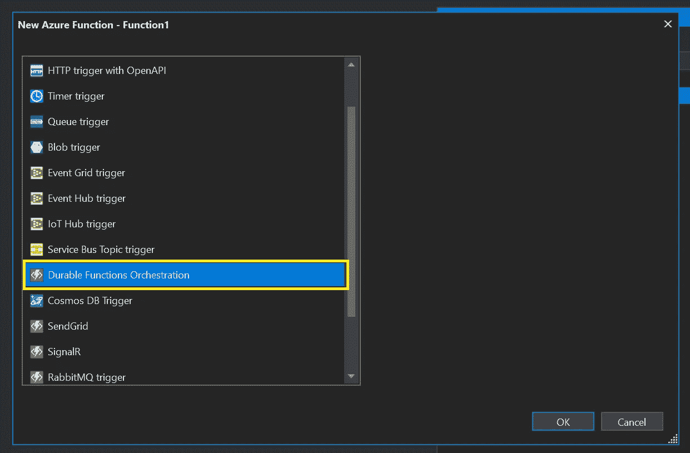

**样本代码**

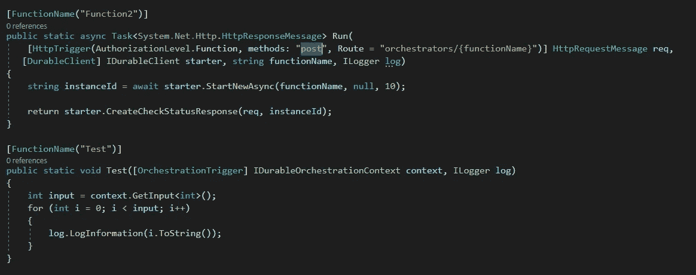

当我们执行上述持久函数时，它将提供 URL*http://localhost:7071/API/orchestrators/{ Function name }*

现在我们可以使用 [*postman*](https://www.postman.com/downloads/) 工具测试 url，{ *functionName* }将被替换为 test，因为我们已经提供了函数名作为测试。一旦我们点击 URL，它将返回如下的 **JSON** 数据，标签 id 被称为实例 id。基于每个请求，这个 id 被生成。

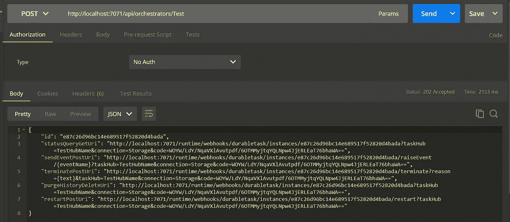

在标签 ***中，statusQueryGetUri*** 被进一步用于通过 id/实例 id 获取特定请求的状态，一旦该 id 的执行完成，则 ***运行时间状态*** 被标记为完成。下面是我们点击浏览器时***statusQueryGetUri***的回应。

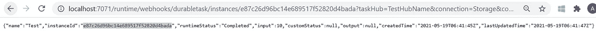

上面写的持久函数的输出如下，

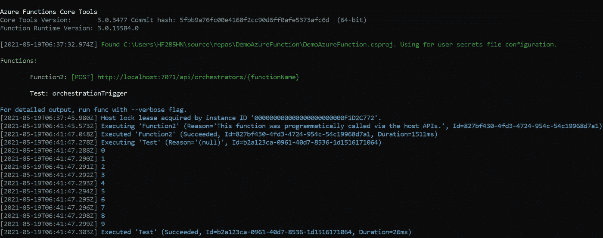

# 结论:

Azure 持久功能为我们提供了对运行工作流的更多控制。这个框架为我们管理可靠性、状态管理和跟踪。