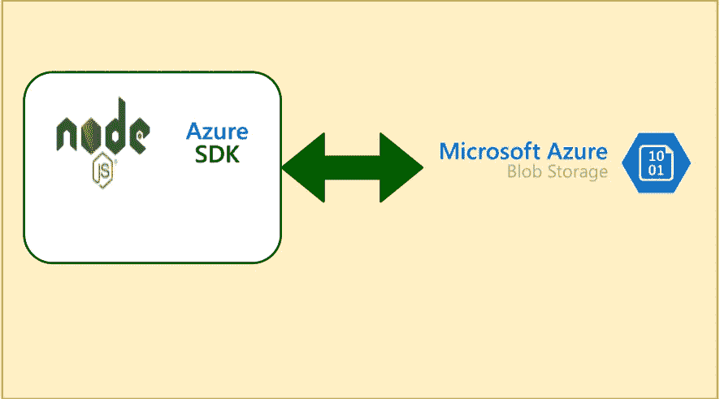

# azure——如何在 NodeJS 应用中使用 SDK 与 Blob 存储进行交互

> 原文：<https://medium.com/bb-tutorials-and-thoughts/azure-how-to-interact-with-blob-storage-with-sdk-in-nodejs-apps-7680c5f937d4?source=collection_archive---------0----------------------->

## 包含示例项目的逐步指南

Azure Blob 存储是可大规模扩展的安全对象存储，适用于云原生工作负载、归档、数据湖、高性能计算和机器学习。有四种方式可以与这个存储交互:Azure 门户、CLI、REST API 和 Azure SDK。使用 Azure…