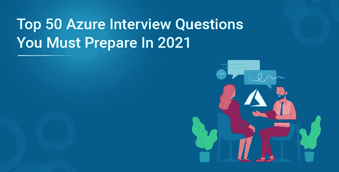
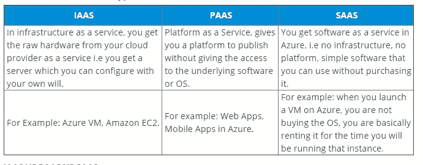
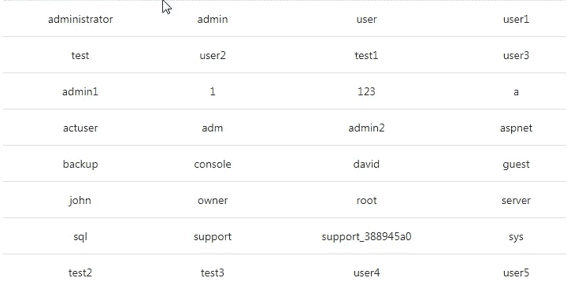
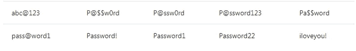

# 2021 年你必须准备的 50 个 Azure 面试问题

> 原文：<https://medium.com/edureka/azure-interview-questions-2fdc7213403a?source=collection_archive---------0----------------------->



# Azure 面试问题

Gartner 在其最新发布的魔力象限中将 Azure 列为基础设施即服务的第二大云提供商。我们 Edureka 将为您的下一次 Azure 面试做好准备！欢迎来到这个关于 Azure 面试问题的博客。

我们编制了一份 azure 面试问题列表供你参考，这些问题围绕 Azure 解决方案架构师、Azure 开发人员和 Azure 系统管理员的角色。

在这个 Azure 面试问题博客中，以下是我们已经涉及的部分:

第 1 部分:一般云问题

第 2 部分:基本 Azure 问题

第三部分:Azure 面试问题

# 第 1 部分:一般云问题

## 1.云中提供了哪些不同类型的服务？



## 2.什么是云计算？

**解释:**是利用互联网上的服务器来“存储”、“管理”、“处理”数据。不同之处在于，你不是使用你自己的服务器，而是使用别人的服务器来完成你的任务，根据你使用的时间向他们付费。

## 3.有哪些不同的云部署模型？

**解释:**以下是三种云部署模式:

**公共云:**基础设施归您的云提供商所有，您使用的服务器可能是多租户系统。

私有云:基础设施归您所有，或者您的云提供商专门为您提供该服务。例如:在你的服务器上托管你的网站，或者在一个专用的服务器上通过云提供商托管你的网站。

**混合云:**当你同时使用公有云、私有云时，就称为混合云。例如:使用内部服务器存储机密数据，使用公共云托管公司面向公众的网站。这种类型的设置是混合云。

## 4.我在自己的场所有一些私有服务器，我还在公共云上分配了一些工作负载，这种架构叫什么？

1.  虚拟专用网络
2.  私有云
3.  虚拟私有云
4.  混合云

**答案:d .混合云**

**解释:**这种类型的架构是混合云。为什么？因为我们同时使用公共云和本地服务器，即私有云。为了使这种混合架构易于使用，如果您的私有云和公共云都在同一个网络上(虚拟地)不是更好吗？这是通过将您的公共云服务器包含在虚拟私有云中，并使用 VPN(虚拟专用网络)将虚拟云与您的本地服务器连接起来而实现的。

# 第 2 部分:基本 Azure 问题

## 5.什么是微软 Azure，为什么用它？

**解释:**如上所述，提供云服务的公司被称为云提供商。有很多云提供商，其中一个是微软 Azure。它用于访问微软的云基础设施。

## 6.Azure 中的哪个服务用于管理 Azure 中的资源？

1.  应用洞察
2.  Azure 资源管理器
3.  Azure 门户
4.  日志分析

**答:B Azure 资源经理**

**解释:** Azure 资源管理器用于“管理”涉及大量 Azure 服务的基础设施。它可以通过一个简单的 JSON 脚本来部署、管理和删除所有资源。

## 7.Azure 可以部署以下哪些 web 应用程序？

1.  ASP。网
2.  服务器端编程语言（Professional Hypertext Preprocessor 的缩写）
3.  WCF
4.  所有提到的

**回答:D 提到的所有问题**

**解释:**微软还发布了 Java 和 Ruby 的 SDK，允许用这些语言编写的应用程序调用 Azure 服务平台 API 来调用 AppFabric 服务。

# 第三部分:Azure 面试问题

## 8.什么是角色，我们为什么要使用角色？

**解释:**角色通俗地说就是虚无服务器。这些服务器是受管理的、负载平衡的平台即服务虚拟机，它们协同工作以实现共同的目标。

Microsoft Azure 中有 3 种类型的角色:

*   Web 角色
*   工人角色
*   虚拟机角色

让我们详细讨论一下这些角色:

*   **Web 角色**—Web 角色主要用于部署网站，使用 IIS 平台支持的语言，如 PHP、.网等。它被配置和定制为运行 web 应用程序。
*   **工作者角色—** 工作者角色更像是 Web 角色的助手，它用于执行后台流程，而不像 Web 角色用于部署网站。
*   **虚拟机角色—** 虚拟机角色由用户用来调度任务和其他 windows 服务。此角色可用于自定义运行 web 和 worker 角色的计算机。

## 9._________ 角色是运行 Microsoft IIS Web 服务器的虚拟机实例，可以接受和响应 HTTP 或 HTTPS 请求。

1.  网
2.  计算机网络服务器
3.  工人
4.  客户

**答:答:Web**

**解释:**答案应该是 Web 角色，没有服务器或客户端角色之类的角色。此外，工作者角色只能与 Azure 存储或通过直接连接到客户端进行通信。

除了这个 Azure 访谈问题博客，如果你想从专业人士那里获得这方面的培训，你可以选择 edureka 的结构化培训！点击下方了解更多信息。

## 10.在使用经典部署创建的虚拟网络中，可以使用 Azure 资源管理器创建虚拟机吗？

**说明:**不支持这个。您不能使用 Azure 资源管理器将虚拟机部署到使用经典部署创建的虚拟网络中。

## 11.Azure 中的虚拟机规模集是什么？

**解释:**虚拟机规模集是 Azure 计算资源，您可以使用它来部署和管理一组相同的虚拟机。由于所有虚拟机的配置都相同，扩展集旨在支持真正的自动扩展，不需要预先调配虚拟机。因此，更容易构建针对大计算、大数据和容器化工作负载的大规模服务。

## 12.秤台内是否支持数据磁盘？

**解释:**是的。规模集可以定义适用于该集中所有虚拟机的附加数据磁盘配置。存储数据的其他选项包括:

*   Azure 文件(SMB 共享驱动器)
*   操作系统驱动器
*   临时驱动器(本地，不受 Azure 存储支持)
*   Azure 数据服务(例如，Azure 表、Azure blobs)
*   外部数据服务(例如，远程数据库)

## 13.什么是可用性集？

**解释:**可用性集是虚拟机的逻辑分组，它允许 Azure 了解如何构建您的应用程序来提供冗余和可用性。建议在可用性集中创建两个或更多虚拟机，以提供高可用性应用程序并满足 99.95%的 Azure SLA。当单个虚拟机与 Azure 高级存储一起使用时，Azure SLA 适用于计划外维护事件。

除了这个 Azure 访谈问题博客，如果你想从专业人士那里获得这方面的培训，你可以选择 edureka 的结构化培训！点击下方了解更多信息。

## 14.什么是容错域？

**解释:**故障域是共享公共电源和网络交换机的底层硬件的逻辑组，类似于内部数据中心内的机架。当您在可用性集中创建虚拟机时，Azure 平台会自动将您的虚拟机分布在这些容错域中。这种方法限制了潜在的物理硬件故障、网络中断或电源中断的影响。

## 15.什么是更新域？

**解释:**更新域是底层硬件的逻辑组，可以进行维护，也可以同时重启。当您在可用性集中创建虚拟机时，Azure 平台会自动将您的虚拟机分布到这些更新域中。这种方法确保在 Azure 平台进行定期维护时，至少有一个应用程序实例始终保持运行。在计划维护期间，重新启动更新域的顺序可能不会按顺序进行，但一次只能重新启动一个更新域。

## 16.什么是网络安全组？

**解释:**网络安全组(NSG)包含一系列访问控制列表(ACL)规则，这些规则允许或拒绝子网和/或网卡的网络流量。NSG 可以与子网或连接到子网的单个网卡相关联。当 NSG 与子网关联时，ACL 规则适用于该子网中的所有虚拟机。此外，通过将 NSG 直接关联到一个网卡，可以限制到单个网卡的流量。

## 17.比例集和 Azure 可用性集一起工作吗？

**解释:**是的。规模集是一个隐式可用性集，包含 5 个容错域和 5 个更新域。超过 100 个虚拟机的扩展集跨越多个*放置组*，相当于多个可用性集。一组可用性虚拟机可以与一组可扩展的虚拟机存在于同一虚拟网络中。常见的配置是将控制节点虚拟机(通常需要独特的配置)放在可用性集中，将数据节点放在规模集中。

## 18.什么是中断修复问题？

**解释:**技术问题被称为中断-修复问题，这是一个行业术语，指的是“当一项技术在其正常运行过程中出现故障时，需要支持组织的干预才能恢复工作秩序的支持工作”。

## 19.为什么要用 Azure Active Directory？

**解释:** Azure Active Directory 是一个身份和访问管理系统。它用于授权您的员工访问您网络中的特定产品和服务。例如 Salesforce.com、推特等。Azure AD 在其图库中有一些对应用程序的内置支持，可以直接添加。

## 20.当你用尽了通过 Azure AD 验证自己的最大失败次数后会发生什么？

**解释:**我们使用更复杂的策略来锁定账户。这基于请求的 IP 地址和输入的密码。锁定的持续时间也会根据攻击的可能性而增加。

## 21.在哪里可以找到与 Azure AD 预集成的应用程序及其功能的列表？

**解释:** Azure AD 有大约 2600 个预集成应用。所有预集成的应用程序都支持单点登录(SSO)。SSO 允许您使用您的组织凭据访问您的应用程序。有些应用程序还支持自动供应和取消供应。

除了这个 Azure 访谈问题博客，如果你想从专业人士那里获得这方面的培训，你可以选择 edureka 的结构化培训！点击下方了解更多信息。

## 22.我如何使用我在本地使用的带有 Azure AD 的应用程序？

**解释:** Azure AD 为您提供了一种简单而安全的方式来连接您选择的 web 应用程序。您可以像在 Azure AD 中访问您的 SaaS 应用程序一样访问这些应用程序，无需 VPN 来更改您的网络基础架构。

## 23.什么是 Azure 服务结构？

**解释:** Azure Service Fabric 是一个分布式系统平台，可以轻松打包、部署和管理可扩展的可靠微服务。Service Fabric 还解决了开发和管理云应用程序的重大挑战。开发人员和管理员可以避免复杂的基础架构问题，并专注于实施可扩展、可靠和可管理的任务关键型高要求工作负载。Service Fabric 代表了用于构建和管理这些企业级、第 1 层、云规模应用程序的下一代中间件平台。

## 24.什么是虚拟网络？

**解释:** VNet 是你自己的网络在云中的表现。它在逻辑上将您在云中启动的实例与您的其他资源隔离开来。

## 25.订阅管理员和目录管理员有什么区别？

**解释:**默认情况下，用户在注册 Azure 时会被分配订阅管理员角色。订阅管理员可以使用与 Azure 订阅关联的目录中的 Microsoft 帐户或工作或学校帐户。该角色被授权管理 Azure 门户中的服务。如果其他人需要使用相同的订阅登录和访问服务，您可以将他们添加为共同管理员。

Azure AD 有一组不同的管理角色来管理目录和与身份相关的功能。这些管理员将有权访问 Azure 门户或 Azure classic 门户中的各种功能。管理员的角色决定了他们可以做什么，如创建或编辑用户、向其他人分配管理角色、重置用户密码、管理用户许可证或管理域。

## 26.使用托管磁盘的客户有规模限制吗？

**解释:**托管磁盘消除了与存储帐户相关的限制。但是，默认情况下，每个订阅的托管磁盘数量限制为 2000 个。

## 27.服务总线队列和存储队列有什么区别？

**说明:**Azure 存储队列简单，开发者体验相当好。它使用本地 Azure 存储模拟器，调试变得非常容易。Azure 存储队列工具允许您轻松查看前 32 条消息，如果消息是 XML 或 JSON 格式的，您可以直接从 Visual Studio 可视化它们的内容。此外，这些队列的内容可以被清除，这在开发和 QA 工作期间特别有用。

Azure 服务总线队列是由许多有用的机制演化和包围的，这些机制使它具有企业价值！它们内置于服务总线中，能够将消息转发到其他队列和主题。它们有一个内置的死信队列，消息有一个你可以控制的生存时间，因此消息不会在 7 天后自动消失。

此外，Azure 服务总线队列能够在可配置的空闲时间后删除自己。当您为每个用户创建队列时，这个特性非常实用，因为如果用户在过去的一个月中没有与队列进行交互，它会自动清理。这也是降低成本的好方法。你不应该为你不需要的储物件付费。这些队列的最大容量限制为 80GB。一旦达到这个限制，你的应用程序将开始接收异常。

## 28.什么是 Azure Redis 缓存？

**Redis** 是一个开源的(BSD 许可的)、内存中的数据结构存储，用作数据库、**、缓存、**和消息代理。Azure Redis 缓存基于流行的开源 Redis 缓存。它让你可以访问一个安全的、专用的 Redis 缓存，由微软管理，可以从 Azure 中的任何应用程序访问。它支持数据结构，如字符串、哈希、列表、集合、带有范围查询的排序集合、位图、超级日志和带有 radius 查询的地理空间索引。

除了这个 Azure 访谈问题博客，如果你想从专业人士那里获得这方面的培训，你可以选择 edureka 的结构化培训！点击下方了解更多信息。

## 29.为什么 Azure Redis 缓存不像其他 Azure 服务一样有 MSDN 类库参考？

**解释:**微软 Azure Redis 缓存基于流行的开源 Redis 缓存，可以被多种编程语言的各种 Redis 客户端访问。每个客户端都有自己的 API，使用 Redis 命令调用 Redis 缓存实例。

因为每个客户端都是不同的，所以在 MSDN 上没有一个集中的类参考，每个客户端都有自己的参考文档。除了参考文档，还有几个教程展示了如何使用不同的语言和缓存客户端开始使用 Azure Redis 缓存。要访问这些教程，请参见如何使用 Azure Redis 缓存，并从本文顶部的语言切换器中单击所需的语言。

## 30.什么是 Redis 数据库？

**解释:** Redis 数据库只是同一个 Redis 实例中数据的逻辑分离。缓存在所有数据库之间共享，给定数据库的实际内存消耗取决于存储在该数据库中的键/值。例如，C6 缓存有 53 GB 的内存。您可以选择将所有 53 GB 放入一个数据库，也可以将它拆分到多个数据库中。

## 31.可以将现有虚拟机添加到可用性集中吗？

**解释:**否。如果您希望您的虚拟机成为可用性集的一部分，您需要在该集合中创建虚拟机。当前无法在创建虚拟机后将其添加到可用性集。

## 32.创建虚拟机时对用户名有什么要求？

**解释:**用户名的长度最多为 20 个字符，不能以句点("."结尾).

不允许使用以下用户名:



## 33.创建虚拟机时有什么密码要求？

**解释:**密码长度必须为 12-123 个字符，并满足以下 4 项复杂性要求中的 3 项:

*   具有较低的字符
*   有大写字母
*   有一个数字
*   有一个特殊字符(正则表达式匹配[W_])

不允许使用以下密码:



除了这个 Azure 访谈问题博客，如果你想从专业人士那里获得这方面的培训，你可以选择 edureka 的结构化培训！点击下方了解更多信息。

## 34.一台虚拟机可以使用多少存储？

**说明:**每个数据磁盘最大可达 1 TB。您可以使用的数据磁盘数量取决于虚拟机的大小。

Azure 托管磁盘是新的和推荐的磁盘存储产品，用于 Azure 虚拟机的持久数据存储。每个虚拟机可以使用多个被管理的磁盘。托管磁盘提供两种类型的持久存储选项:高级和标准托管磁盘。

Azure 存储帐户还可以为操作系统磁盘和任何数据磁盘提供存储。每个磁盘都是一个存储为页面 blob 的. vhd 文件。

## 35.如何在 Powershell 中创建虚拟机？

```
# Define a credential object 
$cred = Get-Credential 
# Create a virtual machine configuration 
$vmConfig = New-AzureRmVMConfig -VMName myVM -VMSize Standard_DS2 |
` Set-AzureRmVMOperatingSystem -Windows -ComputerName myVM -Credential $cred | 
` Set-AzureRmVMSourceImage -PublisherName MicrosoftWindowsServer -Offer WindowsServer ` 
-Skus 2016-Datacenter -Version latest | Add-AzureRmVMNetworkInterface -Id $nic.Id
```

## 36.如何创建网络安全组和网络安全组规则？

```
# Create an inbound network security group rule for port 3389
$nsgRuleRDP = New-AzureRmNetworkSecurityRuleConfig -Name myNetworkSecurityGroupRuleRDP -Protocol Tcp `
 -Direction Inbound -Priority 1000 -SourceAddressPrefix * -SourcePortRange * -DestinationAddressPrefix * `
 -DestinationPortRange 3389 -Access Allow# Create an inbound network security group rule for port 80
$nsgRuleWeb = New-AzureRmNetworkSecurityRuleConfig -Name myNetworkSecurityGroupRuleWWW -Protocol Tcp `
 -Direction Inbound -Priority 1001 -SourceAddressPrefix * -SourcePortRange * -DestinationAddressPrefix * `
 -DestinationPortRange 80 -Access Allow# Create a network security group
$nsg = New-AzureRmNetworkSecurityGroup -ResourceGroupName myResourceGroup -Location EastUS `
 -Name myNetworkSecurityGroup -SecurityRules $nsgRuleRDP,$nsgRuleWeb
```

## 37.如何使用 Power Shell 创建新的存储帐户和容器？

```
$storageName = "st" + (Get-Random)
New-AzureRmStorageAccount -ResourceGroupName "myResourceGroup" -AccountName $storageName -Location "West US" -SkuName "Standard_LRS" -Kind Storage
$accountKey = (Get-AzureRmStorageAccountKey -ResourceGroupName myResourceGroup -Name $storageName).Value[0]
$context = New-AzureStorageContext -StorageAccountName $storageName -StorageAccountKey $accountKey 
New-AzureStorageContainer -Name "templates" -Context $context -Permission Container
```

# 38.如何在 Azure CLI 中创建虚拟机？

```
az vm create ` --resource-group myResourceGroup ` --name myVM --image win2016datacenter ` --admin-username azureuser ` --admin-password myPassword12
```

除了这个 Azure 访谈问题博客，如果你想从专业人士那里获得这方面的培训，你可以选择 edureka 的结构化培训！点击下方了解更多信息。

## 39.虚拟机的各种电源状态是什么？


## 40.如何检索特定虚拟机的状态？

```
Get-AzureRmVM `
 -ResourceGroupName myResourceGroup `
 -Name myVM `
 -Status | Select @{n="Status"; e={$_.Statuses[1].Code}}
```

## 41.如何使用 Power Shell 停止虚拟机？

```
Stop-AzureRmVM -ResourceGroupName myResourceGroupVM -Name "myVM" -Force
```

## 42.为什么我的客户端与缓存断开连接？

**解释:**以下是缓存断开连接的一些常见原因。

*   客户端原因
*   客户端应用程序已重新部署。
*   客户端应用程序执行了缩放操作。
*   在云服务或 Web 应用程序的情况下，这可能是由于自动扩展。
*   客户端的网络层发生了变化。
*   客户端或客户端与服务器之间的网络节点中出现暂时性错误。
*   已达到带宽阈值限制。
*   CPU 绑定操作花费太长时间无法完成。
*   服务器端原因
*   在标准缓存产品上，Azure Redis 缓存服务启动了从主节点到辅助节点的故障转移。
*   Azure 正在修补部署缓存的实例
*   这可以用于 Redis 服务器更新或一般虚拟机维护。

## 43.什么是 Azure 搜索？

**解释:** Azure Search 是一个云搜索即服务解决方案，它将服务器和基础设施管理委托给微软，为您提供一个随时可用的服务，您可以使用您的数据填充该服务，然后使用该服务将搜索添加到您的 web 或移动应用程序中。Azure Search 允许你使用一个简单的 REST API 或者。NET SDK，而无需管理搜索基础设施或成为搜索领域的专家。

## 44.在我更新了 Docker Hub 上的图像后，我的 web 应用程序仍然使用旧的 Docker 容器图像。Azure 支持定制容器的持续集成/部署吗？

**解释:**是的，的确如此。对于私有注册表，您可以通过停止然后重新启动 web 应用程序来更新容器。或者，您也可以更改或添加一个虚拟应用程序设置来强制更新您的容器。

除了这个 Azure 访谈问题博客，如果你想从专业人士那里获得这方面的培训，你可以选择 edureka 的结构化培训！点击下方了解更多信息。

## 45.当我配置运行时堆栈时，启动文件部分的预期值是什么？

**解释:**为节点。Js，您可以指定 PM2 配置文件或您的脚本文件。因为。NET Core，指定您编译的 DLL 名称。对于 Ruby，您可以指定想要用来初始化应用程序的 Ruby 脚本。

## 46.Azure Marketplace 订阅如何定价？

**解释:**

价格会因产品类型而异。ISV 软件费用和 Azure 基础设施费用通过您的 Azure 订阅单独收取。定价模式包括:

**BYOL 模式:**自带执照。您在 Azure Marketplace 之外获得了访问或使用该产品的权利，并且不会因在 Azure Marketplace 中使用该产品而被收取 Azure Marketplace 费用。

**免费:**免费 SKU。使用 Azure Marketplace 不会向客户收取费用。

**免费软件试用版:**在有限时间内免费推广的全功能版本。在试用期内，使用 Azure Marketplace 不会向您收取费用。试用期结束后，将根据使用该服务的标准费率自动向客户收费。

**基于使用:**根据您使用产品的程度向您收取费用。对于虚拟机映像，您将按小时收取 Azure Marketplace 费用。对于数据服务、开发人员服务和 API，您将按照产品定义的计量单位付费。

**月租费:**订购该产品会向您收取固定的月租费(从该特定计划的订购开始之日起)。月中取消或未使用的服务不会按比例收取月费。

## 47.Azure Marketplace 中虚拟机报价的成本结构中的“价格”、“软件价格”和“总价”之间有什么区别？

**解释:**“价格”是指 Azure 虚拟机运行软件的成本。“软件价格”是指在 Azure 虚拟机上运行的发行商软件的成本。“总价格”是指 Azure 虚拟机和在 Azure 虚拟机上运行的发行商软件的总成本之和。

## 48.什么是 Service Fabric 的有状态和无状态微服务？

**解释:** Service Fabric 使您能够构建由微服务组成的应用程序。无状态微服务(如协议网关和 web 代理)不会在服务请求及其响应之外维护可变状态。Azure 云服务工作者角色是无状态服务的一个例子。有状态的微服务(如用户帐户、数据库、设备、购物车和队列)在请求及其响应之外维护一个可变的、权威的状态。今天的互联网级应用由无状态和有状态微服务组合而成。

## 49.应用程序分区的含义是什么？

**解释:**应用程序分区是活动目录系统的一部分，也就是说，它们是复制到域控制器的目录分区。通常，包含在目录分区进程中的域控制器持有该目录分区的副本。应用程序分区的属性和值是，您可以将它们复制到林中的任何特定域控制器，这意味着它可以减少复制流量。虽然域目录分区将其所有数据传输到所有域，但应用程序分区只能集中在域区域中的一个域上。这使得应用程序分区变得冗余且更加可用。

## 50.有哪些特殊的蔚蓝区域？

**解释:** Azure 有一些特殊的区域，您可能希望在出于合规或法律目的构建应用程序时使用这些区域。这些特殊区域包括:

*   **美国弗吉尼亚州州长**和**美国爱荷华州州长**
*   Azure 的物理和逻辑网络隔离实例，面向美国政府机构和合作伙伴，由经过筛选的美国人运营。包括其他合规认证，如 [FedRAMP](https://www.microsoft.com/en-us/TrustCenter/Compliance/FedRAMP) 和 [DISA](https://www.microsoft.com/en-us/TrustCenter/Compliance/DISA) 。
*   **华东**和**华北**
*   这些区域是通过微软和世纪互联之间的独特伙伴关系提供的，微软不直接维护数据中心。
*   **德国中部**和**德国东北部**
*   这些区域通过数据托管模式提供，客户数据由德国电信公司 T-Systems 控制，作为德国数据托管机构。

除了这个 Azure 访谈问题博客，如果你想从专业人士那里获得这方面的培训，你可以选择 edureka 的结构化培训！点击下方了解更多信息。

我希望你喜欢这些 Azure 面试问题。如果你想查看更多关于 Python、DevOps、Ethical Hacking 等市场最热门技术的文章，那么你可以参考 [Edureka 的官方网站。](https://www.edureka.co/blog/?utm_source=medium&utm_medium=content-link&utm_campaign=azure-interview-questions)

请留意本系列中解释 Azure 其他方面的其他文章。

> *1。* [*蔚蓝教程*](/edureka/azure-tutorial-5a97e30ee9a7)
> 
> *2。* [*蔚蓝门户*](/edureka/azure-portal-all-you-need-to-know-about-the-azure-console-8ade1effa474)
> 
> *3。* [*Azure 存储教程*](/edureka/azure-storage-tutorial-an-introduction-to-azure-storage-dae8fd8f555c)
> 
> *4。* [*蔚蓝专用网*](/edureka/azure-virtual-network-securing-your-applications-using-vpc-744eba3aa5b1)
> 
> *5。* [*Azure DevOps 教程*](/edureka/azure-devops-cf755fb334ae)
> 
> *6。* [*天青板*](/edureka/azure-boards-ce093b2688bb)

*最初发表于 2021 年 1 月 21 日*[*https://www.edureka.co*](https://www.edureka.co/blog/interview-questions/azure-interview-questions/)*。*