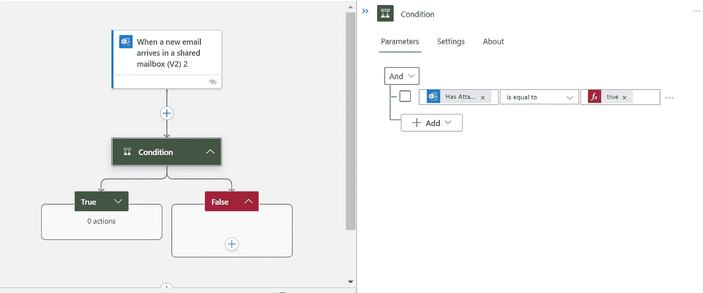

# Azure Logic Apps:如何发布多部分和表单数据

> 原文：<https://medium.com/version-1/azure-logic-apps-how-to-post-multipart-and-form-data-dbc2e8640c67?source=collection_archive---------0----------------------->


Photo by [Piero Nigro](https://unsplash.com/@pieronigro?utm_source=medium&utm_medium=referral) on [Unsplash](https://unsplash.com?utm_source=medium&utm_medium=referral)

# **简介**

本文描述了如何通过 Azure Logic Apps 向 HTTP Post API 发送多部分和表单数据。

> [Azure Logic Apps](https://docs.microsoft.com/en-in/azure/logic-apps/logic-apps-overview) 是一项基于云的服务，允许用户跨多个应用、服务、数据等创建和运行自动化工作流。
> 
> 多部分请求将数据集组合成一个整体，由边界分隔。通常在用户必须通过表单上传文件时使用。


Figure 1: Architecture.

1.  一封电子邮件到达 outlook 邮箱(我们在这里使用共享邮箱)。
2.  逻辑应用 O365 触发，电子邮件被处理。
3.  逻辑应用程序获取电子邮件中的附件。
4.  附件通过 HTTP Post 发送到 API

> 更多相关:[为什么选择版本 1 作为您的微软服务合作伙伴？](http://Why Choose Version 1 as your Microsoft Partner?)

1.  一个 [Azure 订阅](https://azure.microsoft.com/en-in/free)。
2.  接受多部分/格式数据的 API 端点。
3.  来自使用 Azure Logic 应用程序的服务的邮箱，如 Office 365 Outlook 或 Outlook.com。我们在这里使用共享邮箱。

# 程序

**在 Azure 中创建一个逻辑应用资源**

第一步:导航到 Azure 门户网站。


Figure 2: Search Logic app in Azure Portal

第二步:在顶部的搜索框中，搜索“**逻辑应用**，选择逻辑应用。

第三步:点击“添加”创建一个逻辑应用程序。


Figure 3: Add Logic app

步骤 4:在“创建逻辑应用程序”窗格中-

选择 Azure 订阅、资源组(如果需要，新建)。

输入 logic 应用程序的名称，然后选择您所在的地区。

点击“审核+创建”。

确认详细信息并选择创建。

部署后，选择“转到资源”。


Figure 4: Create Logic App

**创建工作流**

步骤 1:在逻辑应用程序资源中-

选择“工作流程”。点击“添加”。

输入工作流名称，并将状态类型选择为“有状态”。

点击“创建”。


Figure 5: Create Workflow

第 2 步:导航到创建的工作流并点击“设计器”。

步骤 3:添加 Office365 触发器-

点击“选择一个操作”。

在“Azure”标签下搜索并添加“当新邮件到达共享邮箱时”触发器。


Figure 6: Add Trigger

将邮箱地址和“包含附件”设置为“是”。


Figure 7: Trigger details

第三步:添加操作:搜索“条件”并添加它以检查附件是否存在。设置“有附件”等于真。


Figure 8: Condition

设置“有附件”等于真作为条件检查。



Figure 9: Condition details

第四步:添加一个动作:HTTP Post。

在条件的 true 部分下，单击“+”按钮并添加一个操作。

搜索“HTTP”并添加“HTTP”操作。


Figure 10: HTTP Action

输入请求的详细信息。将 URI 设置为您的 post 端点。


Figure 11: POST request details

```
"body": {
"$content-type": "multipart/form-data",
"$multipart": [
 {
  "body": "@items('For_each_attachment')?['contentBytes']",
  "headers":
   {
   "Content-Disposition": "form-data; name=file; filename=\"@{items('For_each_attachment')?['name']}\"",
   "Content-Type": "@{items('For_each_attachment')?['contentType']}"
   }
 }]
}
```

最后，单击“保存”按钮保存您的工作流程。

**测试工作流程**

1.  将带有附件的电子邮件发送到配置的邮箱。
2.  进入 logic 应用资源，点击“概述”。
3.  在“运行历史”下检查运行的“状态”。


Figure 12: Run History


**关于作者**

*Geethu Suresh 目前在微软工作。Net 顾问为版本 1 工作。请务必关注 Geethu，获取更多关于创新的博客。*