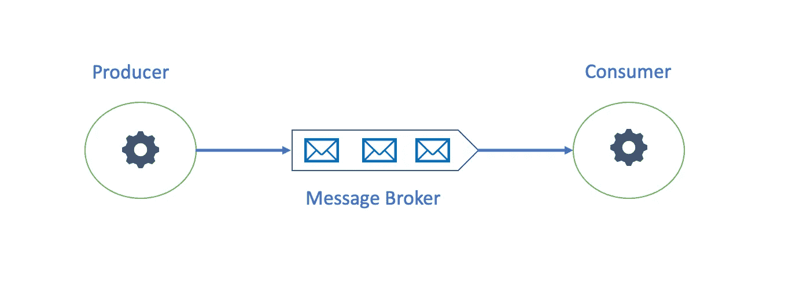
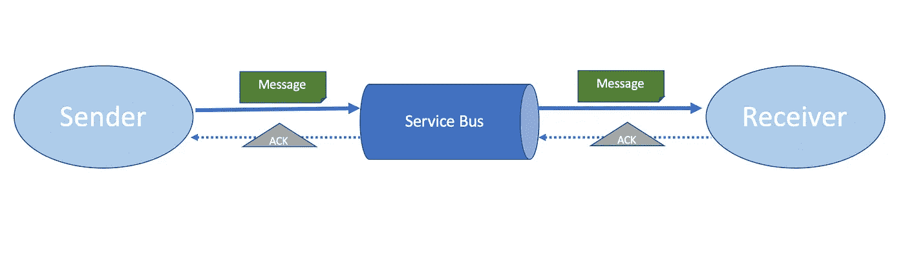
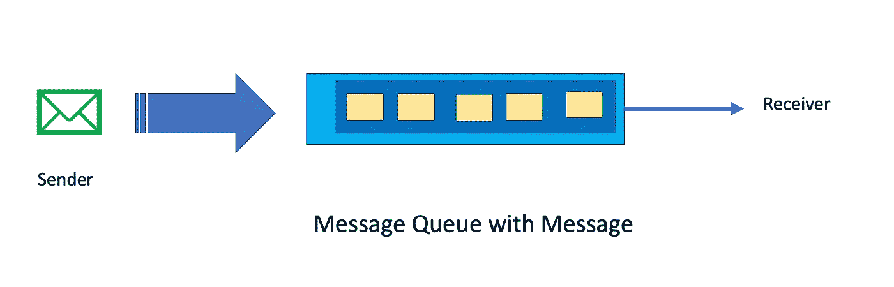
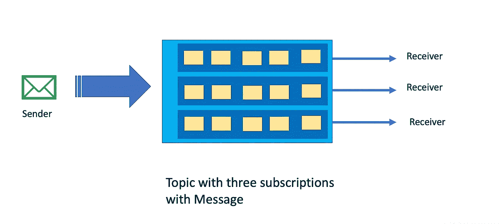
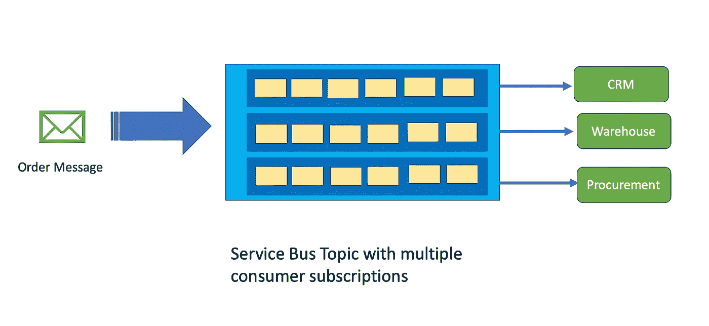
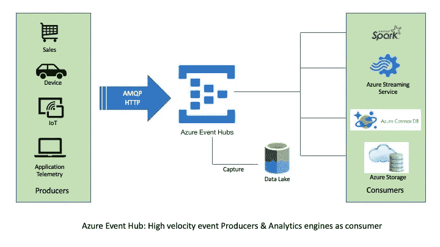
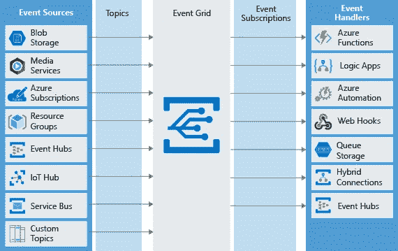
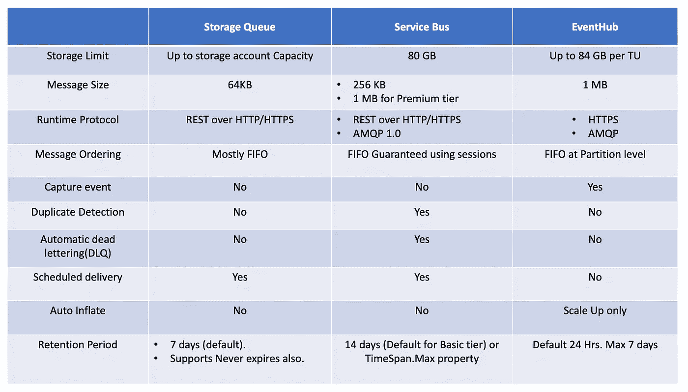
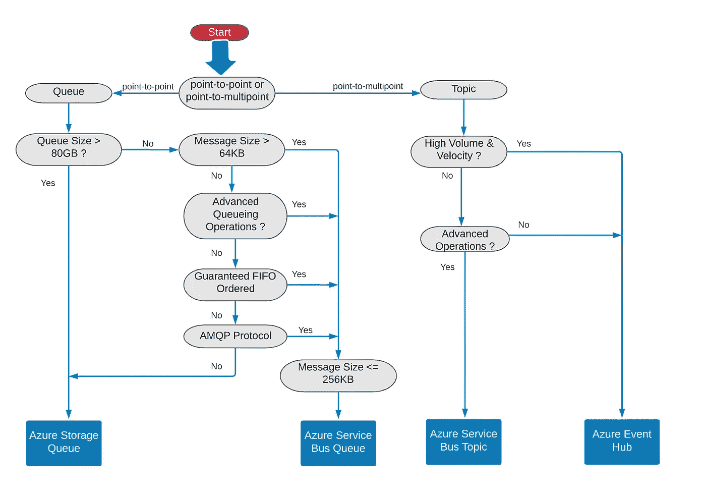

# Azure 消息服务——如何在 Azure 中选择正确的消息技术

> 原文：<https://medium.com/walmartglobaltech/azure-messaging-services-how-to-choose-the-right-messaging-technology-in-azure-eab610b5e986?source=collection_archive---------0----------------------->

Microsoft Azure 提供的消息服务的快速概述，以及选择最适合应用程序的指南

Image by [Gerd Altman](https://pixabay.com/users/geralt-9301/?utm_source=link-attribution&utm_medium=referral&utm_campaign=image&utm_content=4610699)n from [Pixabay](https://pixabay.com/photos/away-feet-shoes-road-surface-4610699/)

# **为什么是信息传递？**

高度可靠的消息传递系统使分布式微服务能够跨网络安全、异步地通信。消息传递系统允许松散耦合，这意味着发送方和接收方不需要同时在线。此外，发送方和接收方都可以按照自己的速度生产和消费，并随着工作负载的增加而横向扩展。

# **Azure 短信服务**

Azur 提供各种消息服务。**这些服务中的每一项都旨在服务于不同的用例，并且不会相互竞争**。让我们了解一下这些服务:

# **1。Azure 存储队列**

Azure 存储队列是 Azure 存储帐户的一部分。它是一个简单、可靠、可伸缩和持久的消息队列服务。它遵循基于 *REST* 的 *HTTP* 动词，如 *GET* 和 *PUT* 来读取消息并将其插入队列。应用程序也可以使用 *PEEK* 命令查看队列头的消息。

一个队列可以存储数百万条消息，最多可达一个存储帐户的总容量，其中每条消息最大为 64 KB，最大 TTL 为 7 天。

## 1.1 Azure 存储队列用例

Azure Storage queue 是一个简单的队列服务，可用于存储大量小型消息。它提供了一种从世界任何地方访问消息的安全方式。它可以用来创建异步处理的工作负载或任务，并且消息顺序保证不是必须的。

# **2。Azure 服务总线**

Azure Service Bus 是一个安全、高度可用和可靠的 [*平台即服务*](https://azure.microsoft.com/en-in/overview/what-is-paas/) *(PaaS)* 企业集成消息代理，用于应用程序之间的异步数据传输。它支持 [*高级消息队列协议*](https://en.wikipedia.org/wiki/Advanced_Message_Queuing_Protocol) *(AMQP)* ，这是一种基于 TCP 的高效、可靠的开放协议，使解决方案与供应商无关。开发人员可以使用不同的客户端库来连接到消息代理。

发送方将消息发送到队列。成功复制消息后，队列发回 ack 回执。另一方面，接收方连接到队列以检索消息，并在完成处理后，发送回删除消息的 ack。一条消息可以被移动到一个[*【DLQ】*](https://docs.microsoft.com/en-us/azure/service-bus-messaging/service-bus-dead-letter-queues)的死信队列中以丢弃或以后消费，以防出错。

Azure 服务总线支持各种 ***高级排队操作*** ，一些关键的差异化功能包括:

*   [消息会话](https://docs.microsoft.com/en-us/azure/service-bus-messaging/message-sessions)
*   [自动转发](https://docs.microsoft.com/en-us/azure/service-bus-messaging/service-bus-auto-forwarding)
*   [预定交货](https://docs.microsoft.com/en-us/azure/service-bus-messaging/message-sequencing#scheduled-messages)
*   [消息延期](https://docs.microsoft.com/en-us/azure/service-bus-messaging/message-deferral)
*   [配料](https://docs.microsoft.com/en-us/azure/service-bus-messaging/service-bus-performance-improvements#client-side-batching)
*   [交易](https://docs.microsoft.com/en-us/azure/service-bus-messaging/service-bus-transactions)
*   [过滤和操作](https://docs.microsoft.com/en-us/azure/service-bus-messaging/topic-filters)
*   [空闲时自动删除](https://docs.microsoft.com/en-us/dotnet/api/microsoft.servicebus.messaging.queuedescription.autodeleteonidle)
*   [重复检测](https://docs.microsoft.com/en-us/azure/service-bus-messaging/duplicate-detection)

## 2.1 Azure 服务总线队列

Azure 服务总线队列是有序的、带时间戳的消息存储。它可以用于*点对点*通信，这意味着单个消息生产者与单个从队列中读取的接收者一起工作。消息以*拉模式(又名* [*竞争消费者模式*](https://docs.microsoft.com/en-us/azure/architecture/patterns/competing-consumers) *)* 传递，消费者负责在消息被处理后*出列*以释放存储空间。

## 2.2 Azure 服务总线主题

Azure 服务总线主题在内部也是一个队列，但是它是为*点到多点*通信而设计的。这意味着我们有一个向主题写入消息的消息发布者，每个主题订阅都会收到一份消息副本。从订阅接收消息的方式与从队列接收消息的方式相同。

## 2.3 Azure 服务总线用例

服务总线高级排队操作使其能够用于企业消息传递。当一个应用程序想要向其他应用程序发送定向消息(命令)并期望它们执行特定的动作时，这是很有用的。

例如，电子商务应用程序在收到订单后向采购服务发送定向消息以采购产品，向仓库系统发送消息以包装产品，向 CRM 系统发送消息以通知客户。

# 3.Azure 活动中心

Azure Event Hub 是一个完全托管的 *PaaS* 大数据事件流平台&事件接收服务，能够以低延迟每秒接收和处理数百万条消息。它被设计来处理大量的、多种多样的事件。它还支持 [*高级消息队列协议*](https://en.wikipedia.org/wiki/Advanced_Message_Queuing_Protocol) *(AMQP)。*每个消费应用程序都有自己的事件流。

事件中心在内部将消息分成称为分区的缓冲区，以维护有序的事件序列。此外，事件中心可以*捕获事件*并将它们存储到 Azure Blob 存储中。所有事件发布者都会获得一个令牌，以安全地允许外部设备和移动应用程序插入事件。

Azure Event hub 可以公开 Apache Kafka endpoint，以允许早期使用 Kafka 作为消息代理的应用程序迁移到事件中心，而无需进行任何代码更改。

## 3.1 Azure 事件中心用例

事件中心最适合高速数据接收场景，如遥测和分布式数据流，我们需要聚合或分析事件流。

当应用程序希望发布诸如状态变化之类的事实，并且不期望消费者采取任何特定的行动时，这是非常有用的。对于从网站发布时间序列点击流以跟踪用户旅程、传感器设备发送温度和压力数据以跟踪这些属性的主要变化等用例。通过活动中心可以轻松实现。

# 4.Azure 事件网格

Azure Event Grid 是一个完全托管的事件路由服务。事件网格将来自不同来源的事件分发到不同的处理程序，如 Azure 函数或逻辑应用程序。**消息被推送到事件处理程序**，这意味着处理程序应该能够处理负载或实现节流机制。

发布者在不知道消费者的情况下向主题发出事件，另一方面，事件订阅者可以在该主题上创建订阅。消费者可以配置某些过滤标准，如事件类型、事件主题或基于有效负载中的数据。

Image By [Microsoft Azure](https://docs.microsoft.com/en-us/learn/modules/choose-a-messaging-model-in-azure-to-connect-your-services/media/4-event-grid.png)

事件源将事件发送到事件网格，事件网格将相关事件转发给订阅者。

## 4.1 Azure 事件网格用例

Azure event grid 在应用程序需要对另一个服务中发生的变化做出反应的场景中非常有用。例如，在 blob 存储中上传新文件时处理文件，在虚拟机启动时标记虚拟机，在资源组中添加新用户时运行工作流等。这避免了对*长轮询*或*锤轮询*的需要，并节省了网络资源。

过滤事件并将其分散到多个目的地也很有用。它通过使用指数补偿在 24 小时内重试事件来确保可靠地传送到目的地。

# 5.比较和决策树

下面是基于最常见特征的每种消息传递技术的快速比较:

我们可以使用以下决策树作为起点，根据用例快速确定消息服务:

**Azure Messaging Services — Decision Tree**

这些服务中的大多数都在不同的层级中提供。服务功能和[成本](https://azure.microsoft.com/en-in/pricing/)因层级而异。因此，在选择消息服务时应该考虑等级。

# 6.摘要

在本文中，我们探索了四种不同的 Azure 消息服务，它们使我们能够开发可靠且有弹性的分布式应用程序。在它们之间进行选择就是决定需要在组件之间传递的数据类型(命令或事实)，然后决定需要什么特性来传递和处理数据。

# 参考

1.  蔚蓝服务巴士:[https://azure.microsoft.com/en-in/services/service-bus/](https://azure.microsoft.com/en-in/services/service-bus/)
2.  azure Event Hub:[https://docs . Microsoft . com/en-us/azure/Event-hubs/Event-hubs-about](https://docs.microsoft.com/en-us/azure/event-hubs/event-hubs-about)
3.  Azure 存储队列:[https://docs . Microsoft . com/en-us/azure/Storage/queues/Storage-queues-简介](https://docs.microsoft.com/en-us/azure/storage/queues/storage-queues-introduction)
4.  蔚蓝事件网格:【https://docs.microsoft.com/en-us/azure/event-grid/overview 