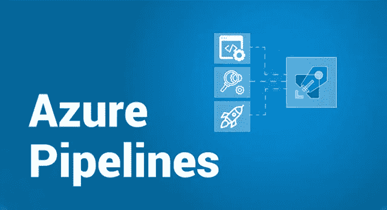

# Azure 管道——了解如何创建 Azure 管道

> 原文：<https://medium.com/edureka/azure-pipelines-1faa653e4cff?source=collection_archive---------1----------------------->

Axure Pipelines — Edureka

Azure 和 DevOps 的崛起并不陌生，这些技术的发展就是如此。这篇关于 Azure Pipelines 的文章将帮助你获得围绕 Azure DevOps 的所有信息，到我们完成时，你将已经创建了一个完整的 Azure Pipeline。我之前的文章关注 Azure Boards，如果你愿意，你可以在这里查看[*。*](/edureka/azure-boards-ce093b2688bb)

*让我们先来看看本文中涉及的要点:*

1.  *为什么选择 Azure DevOps？*
2.  *什么是 Azure 管道？*
3.  *Azure 管道的特点*

*因此，让我们从这篇 Azure Pipelines 文章开始吧。*

# *为什么是 Azure DevOps？*

*如果你读过我之前关于 Azure DevOps 的文章，那么现在你应该知道 Azure 是领先的云服务供应商之一。同样，DevOps 是一种席卷当前软件行业的方法，因为它非常容易地帮助弥合开发人员和运营团队之间的差距。*

*所以很多人想知道是否有可能在 Azure Cloud 上进行 DevOps 实践。DevOps 服务的引入确保了这一切变得非常可能。Azure 推出的不同服务确实有助于:*

## *利用 Azure 管道推动云开发*

*Azure 使得创建管道变得非常容易，因此可以将重点转移到软件开发上。因为 Azure 提供了创建和管理管道的端到端解决方案。*

## *更好的持续集成和部署*

*借助 Azure 上的持续集成和交付，您可以利用并使用基础设施作为代码，通过 Azure Resource Manager 或 Terraform 等工具，您可以创建符合合规标准的可重复部署。*

## *自由定制*

*Azure 是微软的产品，它很容易与几乎所有的微软产品集成。此外，Azure 在与开源工具的集成方面也取得了巨大的进步。这意味着我们有更多的选项可以定制。*

*我相信这些足以成为我们信任 Azure DevOps 的理由。现在让我们试着理解什么是 Azure Pipelines 服务。*

# *什么是 Azure 管道？*

*Azure Pipelines 是一项服务，可以满足在 Azure 云平台上创建管道的需求。它让你可以构建、测试和部署应用 Azure 云和其他支持的平台。您还可以在 Windows、Linux 和 Mac 操作系统上创建管道。您甚至可以免费创建多达十个并行作业。*

**

*因为您可以使用管道自动化您的构建和部署，所以您最终可以花费更少的时间来修复应用程序的小问题，并且可以将更多的精力放在应用程序的创造性方面。*

*现在让我们更进一步，看看 Azure 组件的一些特性。*

# *Azure 管道的特点*

*让我们看看 Azure Pipelines 的一些重要特性，以及为什么它使用起来如此方便。*

## *独立于平台和语言*

*如前所述，您可以使用自己选择的操作系统，也可以决定使用什么来构建您的应用程序，无论是 *Python* 、 *Java、NodeJS、Ruby* 等等。*

## *使用容器的自由*

*由于管道简化了构建应用程序的过程，将应用程序推送到容器变得更加容易，例如， *Docker* **，***Kubernetes**甚至 Azure Container Registry。**

## **可用扩展**

**Azure pipeline 还为您提供了许多社区构建的任务，以实现更好的定制，从而帮助您构建、测试和部署这些任务。**

## **支持部署到其他云供应商**

**Azure Pipelines 服务，让你可以自由地将你的应用部署到不同的云平台，比如， *AWS* ， *GCP* 等等。**

## **开放源码**

**有了快节奏的持续集成/持续交付(CI/CD)管道，现在您可以交付大多数开源项目。**

## **工作流程**

**如果您必须构建链式和多阶段构建，那么可以支持 YAML、测试集成、发布门、报告等。**

**这些特性使得 Azure Pipelines 成为 Azure 's DevOps 物联网方案中的一项重要服务。**

**伙计们，这是关于蓝色管道的。这个 Azure 服务可以做很多事情。您可以自由探索这项服务。就本文而言。我会把它放在这里。如果你想查看更多关于 Python、DevOps、Ethical Hacking 等市场最热门技术的文章，那么你可以参考 [Edureka 的官方网站。](https://www.edureka.co/blog/?utm_source=medium&utm_medium=content-link&utm_campaign=azure-pipelines)**

**请留意本系列中的其他文章，它们将解释 Azure 的各个方面。**

> **1.[蔚蓝教程](/edureka/azure-tutorial-5a97e30ee9a7)**
> 
> **2.[蔚蓝门户](/edureka/azure-portal-all-you-need-to-know-about-the-azure-console-8ade1effa474)**
> 
> **3. [Azure 存储教程](/edureka/azure-storage-tutorial-an-introduction-to-azure-storage-dae8fd8f555c)**
> 
> **4.[蔚蓝专用网](/edureka/azure-virtual-network-securing-your-applications-using-vpc-744eba3aa5b1)**
> 
> **5. [Azure DevOps 教程](/edureka/azure-devops-cf755fb334ae)**
> 
> **6.[蔚蓝海岸](/edureka/azure-boards-ce093b2688bb)**

***原载于 2019 年 5 月 20 日*[*https://www.edureka.co*](https://www.edureka.co/blog/azure-pipelines/)*。***