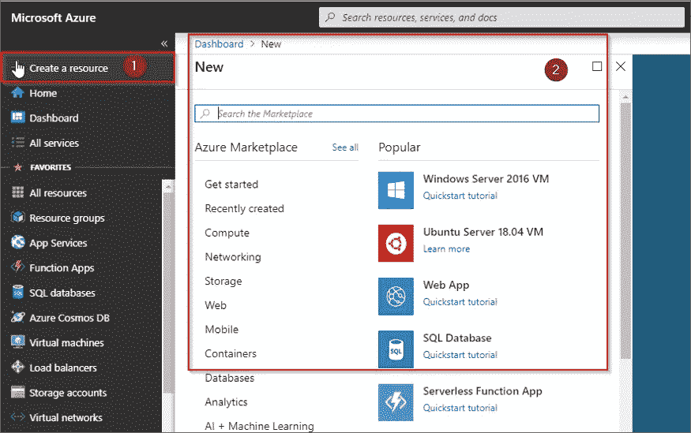
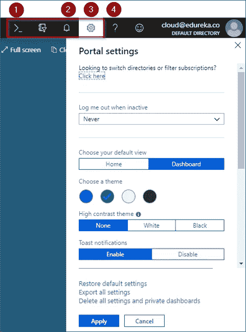

# Azure 门户——Azure 控制台初学者指南

> 原文：<https://medium.com/edureka/azure-portal-all-you-need-to-know-about-the-azure-console-8ade1effa474?source=collection_archive---------0----------------------->

Azure Portal — Edureka

微软 Azure 在云计算领域拥有第二高的市场份额，有可能在不久的将来夺取最高荣誉。这一成功也归功于微软 Azure 的易用性。在这篇文章中，我们将探索 Azure Portal 如何让所有的服务变得简单。下面先睹为快，看看这篇文章关注的要点:

1.  微软 Azure 是什么？
2.  什么是 Azure Portal？
3.  Azure 门户的功能
4.  演示:探索 Azure 门户

让我们先快速介绍一下微软 Azure 。

# 微软 Azure

这就是**微软**要说的话 **' *微软 Azure 是一套不断扩展的云服务，可帮助您的组织应对业务挑战。这是使用您喜欢的工具和框架在一个巨大的全球网络上构建、管理和部署应用程序的自由。*’**

它提供的一些受欢迎的服务领域有:

*   计算
*   储存；储备
*   数据库ˌ资料库
*   建立工作关系网
*   监视
*   分析学
*   迁移等

现在我们对 Azure 有了一些了解，让我们继续并理解下一个讨论点，

# 什么是 Azure Portal？

顾名思义，Azure Portal 是一个单一的门户或单一的连接点，让您可以在一个地方访问和管理所有的应用程序。它让您可以在一个统一的控制台中构建、管理和监控从简单的 web 应用程序到复杂的云应用程序的一切。

# Azure 门户的功能

以下是 Azure Portal 提供的一些功能特性:

## 单点管理

它是一个单点中心，允许您访问计算、数据库、存储、web 应用程序、虚拟机等服务。云壳其集成的命令界面，确保通过提示媒体轻松访问您的应用程序。此外，使用 Azure 门户网站可以确保探索 Azure 图形功能的高度灵活性。

## 个性化体验

让您的应用程序符合您的工作风格对任何个人或企业来说都是一大福音。Azure 门户提供了仪表盘，允许你锁定你需要的应用程序，这样你就可以随时监控和访问它们。此功能确保您不断适应的需求得到满足和妥善处理

## 访问控制和安全性

谈到云计算，安全性是重中之重。Azure Portal 通过确保对谁可以访问什么服务的完全控制，为此做出了贡献。这是通过在个人和组级别授予基于角色的访问控制和订阅来实现的。

## 面向强大体验的服务融合

微软 Azure 为你提供数以千计的服务，既有开源的，也有属于微软软件栈的。既然 Azure 已经使与所有这些服务的集成变得更加容易，人们可以将这些结合起来产生一个伟大的统一效果，排列的数量是巨大的。因此，我会让你在这里做排列。谈到合并这些服务，你可以确保更快的处理速度、更高的可靠性和更好的安全性。

## 更高的可见度

微软 Azure 最好的特性之一是它让你跟踪当前和预计的成本。那么，Azure Portal 在这方面有什么帮助呢？第一，它会自动计算你现有的费用。其次，它可以帮助你预测你每月可能的支出。

不管考虑管理的几个应用程序中的资源数量有多少，上述所有情况都是可能的。Azure Portal 还使它更容易跟踪和监控您的跨云分析和实时活跃使用数据。

到目前为止，我们已经探索了 Azure Portal 的大部分细节，但是从理论的角度来看，让我们向前迈出一步，尝试探索实际的门户。

# 演示:探索 Azure 门户

## **第一步:**

首先，你需要一个 Azure 的免费账户或付费账户。一个人所需要做的就是去链接'【portal.azure.com**'。填写你的详细资料。Azure 为您提供免费服务或信用点数，可使用一个月。请注意，您需要输入您的信用卡或借记卡详细信息。但请放心，Azure 不会在未经您同意的情况下向您收费。**

## **第二步:**

拥有帐户后，您可以登录，并会被定向到下图中的门户网站:

在上图中，左侧部分让您可以一键访问所有服务域。它旁边是蓝色的控制面板，默认情况下是空的，如果有任何应用程序正在运行，这些应用程序可以固定到它上面。最上面是搜索栏，你可以在那里搜索屏幕上没有的服务和资源。

## **第三步:**

如果你点击创建一个新的标签，你可以继续创建应用程序，移动应用程序，聊天机器人，虚拟机等。

**第四步:**

如果你看看左上角。您会发现以下选项卡。首先是 Cloud Shell，它是一个命令行界面，允许您使用命令提示符处理数据。第二个是通知选项卡，您最近活动的所有通知都将突出显示。第三个选项卡让你探索门户设置，而第四个选项卡让你寻找 Azure 提供的帮助支持。

所以这就把我们带到了这篇文章的结尾。我希望你喜欢这篇文章。如果你想查看更多关于 Python、DevOps、Ethical Hacking 等市场最热门技术的文章，你可以参考 Edureka 的官方网站。

请留意本系列中的其他文章，它们将解释 Azure 的各个方面。

> 1.[蔚蓝教程](/edureka/azure-tutorial-5a97e30ee9a7)
> 
> 2. [Azure 收纳教程](/edureka/azure-storage-tutorial-an-introduction-to-azure-storage-dae8fd8f555c)
> 
> 3. [Azure 专网](/edureka/azure-virtual-network-securing-your-applications-using-vpc-744eba3aa5b1)
> 
> 4.[天蓝色棋盘](/edureka/azure-boards-ce093b2688bb)
> 
> 5. [Azure DevOps 教程](/edureka/azure-devops-cf755fb334ae)
> 
> 6.[天蓝色管道](/edureka/azure-pipelines-1faa653e4cff)

*原载于 2019 年 2 月 16 日*[*www.edureka.co*](https://www.edureka.co/blog/azure-portal/)*。*