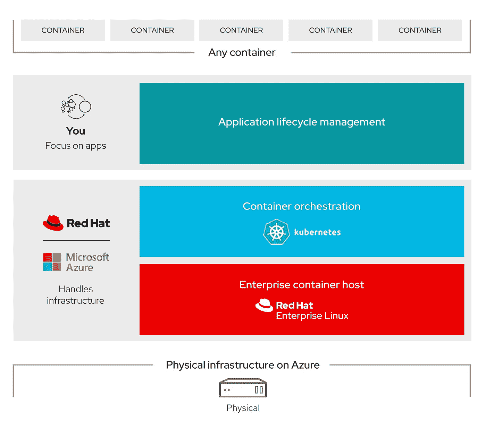
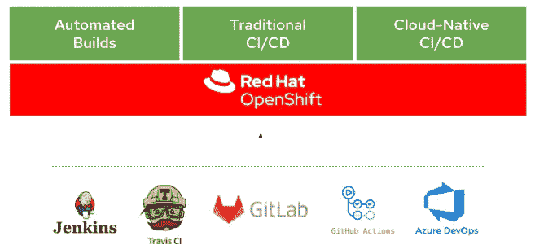
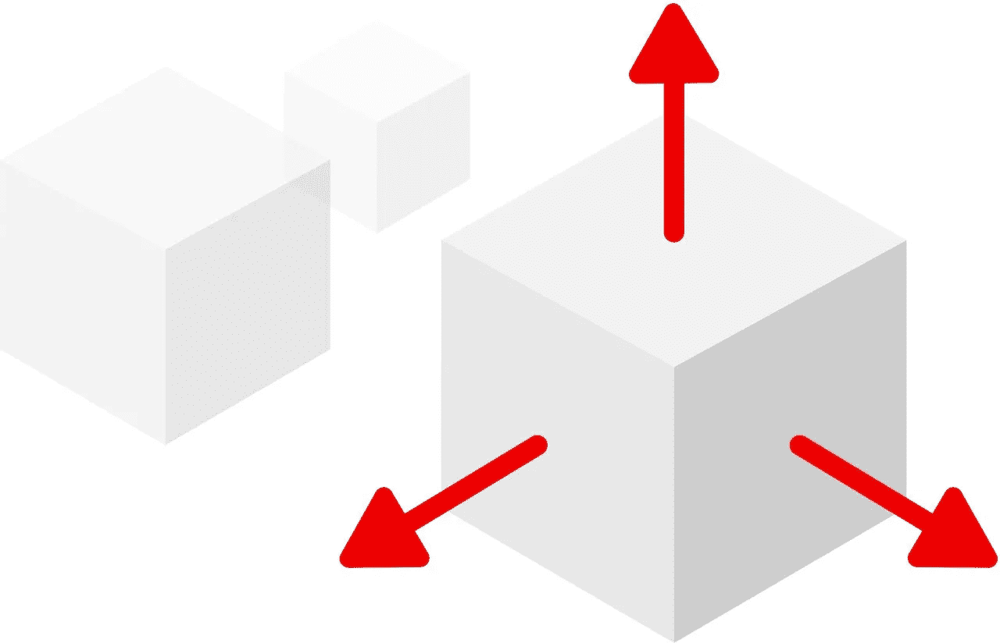
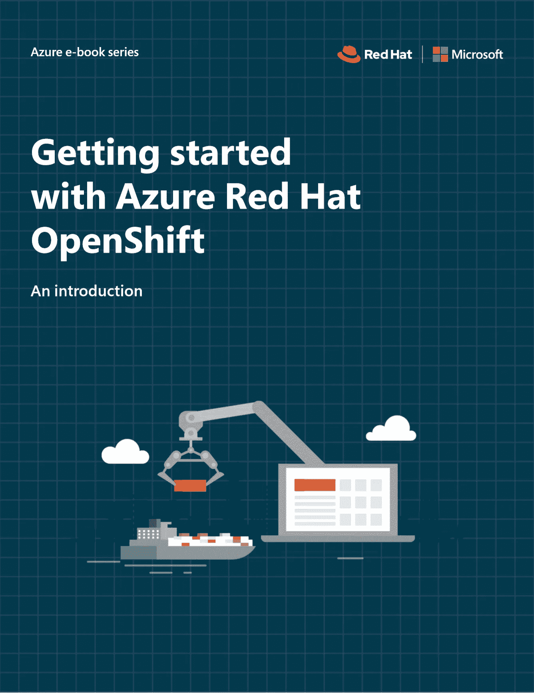

# Azure Red Hat OpenShift —云解决方案架构师的观点

> 原文：<https://medium.com/version-1/azure-red-hat-openshift-ff24b785241?source=collection_archive---------2----------------------->

[Photo Credit: Christina Morillo](https://www.pexels.com/@divinetechygirl)

组织很难将云的意图转化为现实。为了引导他们安全地完成云之旅并简化流程，许多组织使用云采用框架，如 [**这是 Azure**](https://docs.microsoft.com/en-us/azure/cloud-adoption-framework/) **的选项。**

根据我在 [**版本 1**](https://www.version1.com/) 中与客户合作进行云迁移和云采用的经验，通常客户会利用一个采用框架与 [**云战略**](https://www.version1.com/it-service/strategy-and-adoption/) 评估相结合，以确定他们当前状态与期望状态之间的差异，从而定义他们的云战略。

为什么？嗯，有一个明确的战略有助于制定一个可靠的计划，然后我们可以为他们建立第一个着陆区。

有许多不同的选项可以充分发挥公共云的潜力。一些工作负载可以被确定为“提升并转移”迁移的合适候选，在这种情况下，这些现有的工作负载将“按原样”迁移到云平台，而不进行任何转换。

为了充分利用云的强大功能和解决方案，并最大限度地提高可衡量的业务收益(如成本节约、效率提高和数据分析)，云上的“提升和转移”工作负载通常不会是旅程的最终站。例如，除非客户有一个简单的目标，即快速退出数据中心。

通常，一旦工作负载迁移到公共云，Microsoft Azure 等云平台将用于继续云之旅，以创新、更新应用程序或开发更多“云原生”应用程序，这些应用程序将绑定到内部环境中大多数组织无法实现的广泛服务中。

但是，这些组织如何部署、管理和运行支持这种创新的云技术呢？有许多技术选项可以做到这一点，包括自托管容器平台(如 [Azure Kubernetes](https://docs.microsoft.com/en-us/azure/aks/) )、运行 PaaS 服务( [Azure App Services](https://azure.microsoft.com/en-us/services/app-service/) )和 [Azure 容器实例](https://azure.microsoft.com/en-us/services/container-instances/)，在我的同事若昂·冈萨尔维斯的这篇内容丰富的[博客](/version-1/modernising-your-applications-with-azure-tools-user-experience-36c04ce84fce)中有更详细的描述。

我观察到，无论一个组织决定采用哪种方案，都有一个共同的阻碍因素；需要专业技能来应对挑战，例如设置 CI/CD 管道、与其他 Azure 服务集成、日常管理和工作负载的安全。通常情况下，除非组织在云之旅中处于更加成熟的阶段，否则内部无法获得这些技能。

对于那些容器经验有限的组织来说，想要承担这些责任的另一个选择是 [Azure Redhat Openshift。](https://azure.microsoft.com/en-us/services/openshift/)这是一项全面管理的 OpenShift 服务，与自 2019 年 Q2 以来一直存在的 Red Hat 联合运营，为组织提供以下好处:

# **1。完全托管的 Red Hat OpenShift 服务**

Azure Red Hat OpenShift 以“服务”的形式使用，消除了管理底层基础设施和执行升级操作的需求。OpenShift 集群部署在客户订阅的锁定资源组中。

# **2。企业级容器平台**

开箱即用。Azure Red Hat Openshift 解决了安全性和合规性问题，允许组织部署业务关键型应用程序，提供了行业领先的 SLA**99.95%的可用性。**

# **3。创新实现**

Azure Red Hat Openshift 使开发人员能够利用云解决方案和创新:

*   内置的 CI/CD 管道为自动化构建提供支持
*   传统 CI/CD 工具
*   云和 Kubernetes 本地工具和集成
*   与数百个 Azure 服务的本机集成，如 MySQL、PostgreSQL、Redis、Cosmos DB 等等
*   支持多种工具和语言
*   对应用程序可移植性的容器支持

# **4。简单的设置和经济高效的可扩展性**

Azure Red Hat OpenShift 具有简单的设置过程和经济高效地扩展以满足需求的能力，允许组织释放宝贵的 IT 资源和时间，使他们能够专注于更高价值的活动或战略业务目标。

可以在几分钟内为一个高可用性集群配置多个应用节点。当规模或工作负载需求随着时间的推移而变化时，应用程序节点可以通过额外的节点轻松扩展和/或定制，以通过选择标准、高内存或高 CPU 应用程序节点来满足特定于工作负载的需求。

在财务方面，Azure Red Hat OpenShift 的账单由微软直接处理，就像其他微软 Azure 服务一样，两家供应商的合作不需要单独的 Red Hat 合同。

有关更多信息，这本[电子书](https://azure.microsoft.com/en-us/resources/getting-started-with-azure-red-hat-openshift/#:~:text=Getting%20started%20with%20Azure%20Red%20Hat%20OpenShift&text=Azure%20Red%20Hat%20OpenShift%20provides,Red%20Hat%20with%20integrated%20billing.)提供了快速入门 Azure Red Hat Openshift 的简单指南。

**关于马蒂亚斯·劳滕巴赫**

*Mathijs Lautenbach 是第 1 版云解决方案架构师。欲了解更多* [***云资源***](https://www.version1.com/it-service/enterprise-cloud/) *和支持* [***使用 Azure***](https://www.version1.com/it-service/digital-services/is-dgt-amo-modernise-with-azure/) ***、*** *版本 1 更新您的应用，您可以在我们的媒体出版物上以及通过我们的 Azure 加速解决方案获得丰富的资源。*