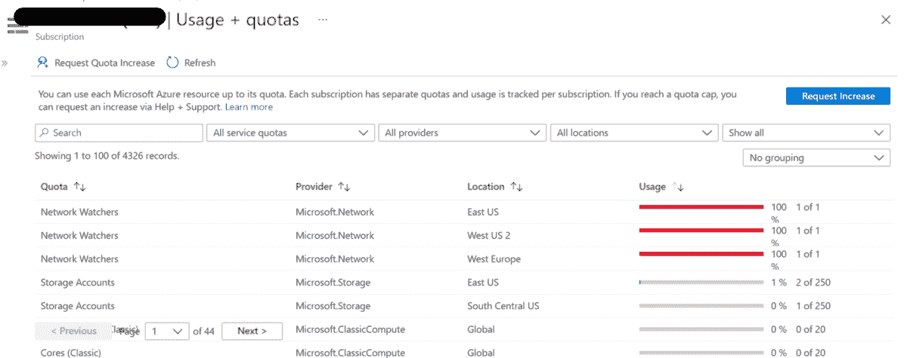
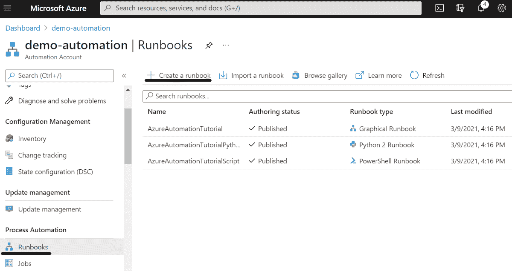
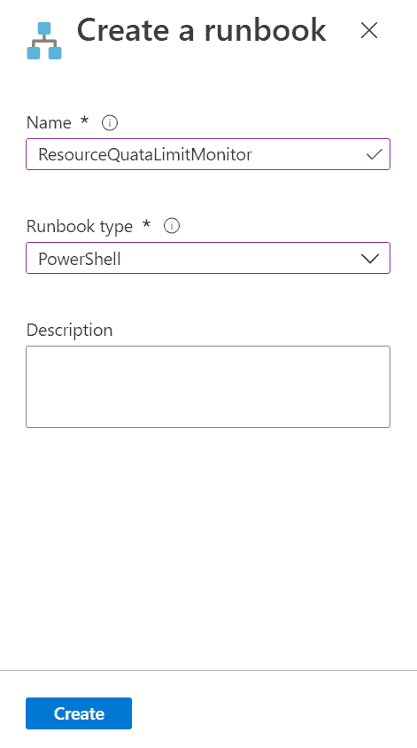
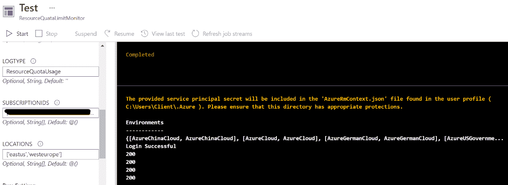
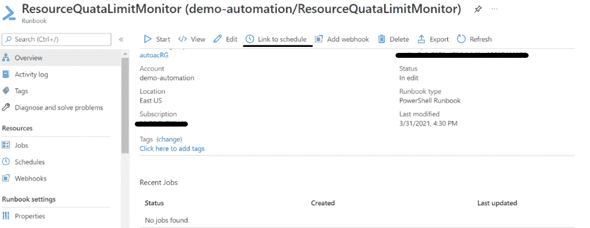
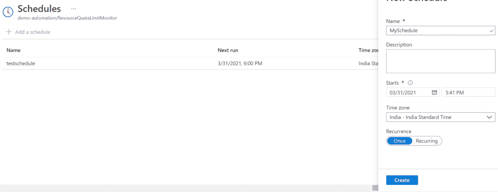
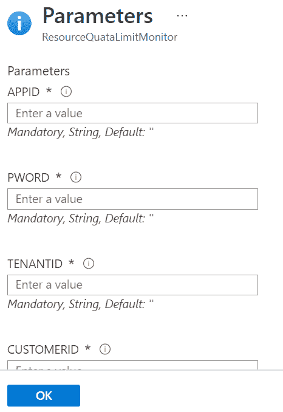
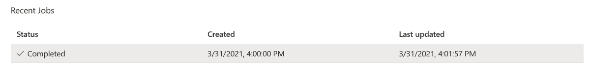
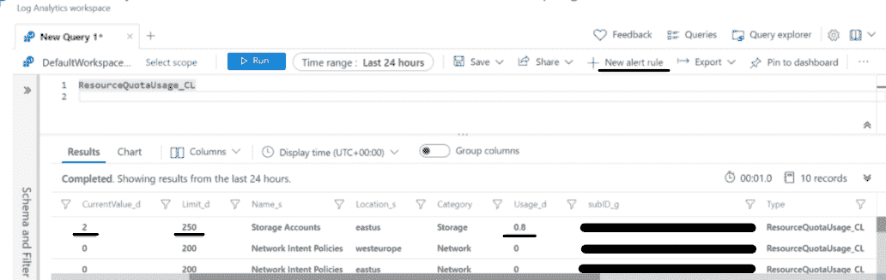
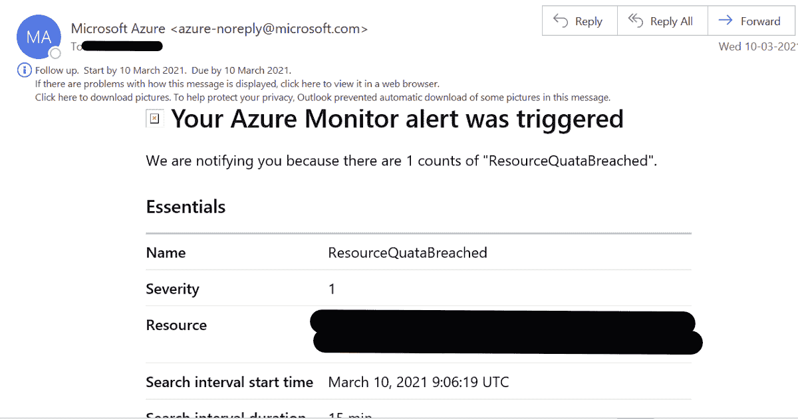

# Azure 资源配额警报

> 原文：<https://medium.com/globant/azure-resource-quota-alerts-7c38d674b07c?source=collection_archive---------0----------------------->

在本文中，您将了解如何针对“**存储帐户&网络意图策略**”设置“**资源配额警报**”。我们可以使用类似的脚本为任何资源创建相同的脚本，并针对资源进行一些修改。

以下几点在 **:** 一文中有所涉及

1.  介绍
2.  先决条件
3.  配置
4.  结论
5.  参考

# 1.介绍

当我们在 Azure 中部署资源时，我们需要知道在 Azure 中为每个资源设置了某些软和硬限制。每个 Azure 订阅都有一个针对特定地区的 Azure 中每个资源的默认限制。

如果我们想要为不同的客户端项目部署相同的资源集，并且有区域限制，那么跟踪资源配额限制是非常重要的。否则，我们可能会耗尽极限，项目可能会面临停工期，直到我们增加极限。需要向 Microsoft 申请支持票来提高限制。

由于我们没有现成的 Azure 解决方案来跟踪配额监控，通过 Azure portal 或 Azure cli 进行手动检查肯定会是一项乏味的任务。

本文有助于创建一种使用自动化解决方案通过警报监控配额限制的方法。我们将利用 Azure Automation account、runbooks、Azure log analytics、Azure Alerts 服务来实现这一目标。



# 2.先决条件

1.  Azure 订阅
2.  Azure 自动化帐户
3.  日志分析工作区
4.  读者对订阅的访问
5.  AZ 模块安装在自动化帐户中。[ [参考](https://docs.microsoft.com/en-us/azure/automation/shared-resources/modules)

# 3.配置

**1。**首先，打开自动化帐户>运行手册>在门户上创建运行手册



**2。**之后，我们需要创建一个指定名称和类型的运行手册。我们将使用 PowerShell 脚本，因此我们将选择“Runbook Type”作为“PowerShell”。



**3。**然后我们打开创建的 runbook(例如 ResourceQuataLimitMonitor)并点击“编辑”>粘贴下面的脚本>“保存”

必需的参数:

1.  APPId [SPN ID]
2.  SPN 键
3.  泰南提德
4.  CustomerID[可从日志分析中获得]
5.  shared key[我们可以从日志分析中获得吗]
6.  log type 用于在日志分析中查询日志的日志类型的名称]
7.  subscription ID 我们要对其配额使用的订阅 ID 列表]
8.  位置[检查使用情况的位置列表]

脚本:-

```
param([Parameter (Mandatory = $true)][string]$AppId = ‘’,[Parameter (Mandatory = $true)][string]$PWord = ‘’,[Parameter (Mandatory = $true)][string]$TenantId = ‘’,[Parameter (Mandatory = $true)][string]$CustomerId = ‘’,[Parameter (Mandatory = $true)][string]$SharedKey = ‘’,[Parameter (Mandatory = $true)][string]$LogType = ‘’,[Parameter (Mandatory = $true)][string[]]$subscriptionIds = @(),[Parameter (Mandatory = $true)][string[]]$locations = @())#AzureLogin$SPWord = ConvertTo-SecureString $PWord -AsPlainText -Force$Credential = New-Object System.Management.Automation.PSCredential($AppId, $SPWord)Write-Host “Trying to login to Azure using SPN”#Login-AzureRmAccount -ServicePrincipal -Credential $Credential -TenantId $TenantIdConnect-AzAccount -ServicePrincipal -Credential $Credential -TenantId $TenantIdWrite-Output “Login Successful”# Replace with your Workspace ID$CustomerId = $CustomerId# Replace with your Primary Key$SharedKey = $SharedKey# Specify the name of the record type that you’ll be creating$LogType = $LogType# You can use an optional field to specify the timestamp from the data. If the time field is not specified, Azure Monitor assumes the time is the message ingestion time$TimeStampField = “”Foreach ($subscriptionId in $subscriptionIds){$accountSet = Set-AzContext -SubscriptionId $subscriptionId# Get Storage QuotaForeach ($location in $locations){# Create the function to create the authorization signatureFunction Build-Signature ($customerId, $sharedKey, $date, $contentLength, $method, $contentType, $resource){$xHeaders = “x-ms-date:” + $date$stringToHash = $method + “`n” + $contentLength + “`n” + $contentType + “`n” + $xHeaders + “`n” + $resource$bytesToHash = [Text.Encoding]::UTF8.GetBytes($stringToHash)$keyBytes = [Convert]::FromBase64String($sharedKey)$sha256 = New-Object System.Security.Cryptography.HMACSHA256$sha256.Key = $keyBytes$calculatedHash = $sha256.ComputeHash($bytesToHash)$encodedHash = [Convert]::ToBase64String($calculatedHash)$authorization = ‘SharedKey {0}:{1}’ -f $customerId,$encodedHashreturn $authorization}# Create the function to create and post the requestFunction Post-LogAnalyticsData($customerId, $sharedKey, $body, $logType){$method = “POST”$contentType = “application/json”$resource = “/api/logs”$rfc1123date = [DateTime]::UtcNow.ToString(“r”)$contentLength = $body.Length$signature = Build-Signature `-customerId $customerId `-sharedKey $sharedKey `-date $rfc1123date `-contentLength $contentLength `-method $method `-contentType $contentType `-resource $resource$uri = “https://” + $customerId + “.ods.opinsights.azure.com” + $resource + “?api-version=2016–04–01”$headers = @{“Authorization” = $signature;“Log-Type” = $logType;“x-ms-date” = $rfc1123date;“time-generated-field” = $TimeStampField;}$response = Invoke-WebRequest -Uri $uri -Method $method -ContentType $contentType -Headers $headers -Body $body -UseBasicParsingreturn $response.StatusCode}# Get Storage account Quota$storageQuota = Get-AzStorageUsage -Location $location$usage = 0if ($storageQuota.Limit -gt 0) { $usage = (($storageQuota.CurrentValue / $storageQuota.Limit) * 100) }$json = @”[{ “Name”:”$($storageQuota.LocalizedName)”,“Location”:”$location”,“Category”:”Storage”,“CurrentValue”:$($storageQuota.CurrentValue),“Limit”:$($storageQuota.Limit),“Usage”:$usage,“subID”:”$subscriptionId”}]“@#$json# Submit the data to the API endpointPost-LogAnalyticsData -customerId $customerId -sharedKey $sharedKey -body ([System.Text.Encoding]::UTF8.GetBytes($json)) -logType $logType# Get Network Intent Policy Quota$nipQuota = Get-AzNetworkUsage -Location $location | Where-Object {$_.ResourceType -match “Network Intent Policies” }$usage = 0if ($nipQuota.Limit -gt 0) { $usage = (($nipQuota.CurrentValue / $nipQuota.Limit) * 100) }$json = @”[{ “Name”:”$($nipQuota.ResourceType)”,“Location”:”$location”,“Category”:”Network”,“CurrentValue”:$($nipQuota.CurrentValue),“Limit”:$($nipQuota.Limit),“Usage”:$usage,“subID”:”$subscriptionId”}]“@#$json# Submit the data to the API endpointPost-LogAnalyticsData -customerId $customerId -sharedKey $sharedKey -body ([System.Text.Encoding]::UTF8.GetBytes($json)) -logType $logType}}
```

**4。**您可以使用“测试盘”测试模板。一旦您正确地提供了参数并开始测试。对于成功的日志传输，您将看到“completed”作为输出。



**5。**我们现在可以安排 runbook 像 cron 作业一样以特定的频率运行。我们可以使用操作手册中的“计划链接”选项。



一旦成功设置了计划作业，就可以跟踪执行情况。



**6。**现在，我们可以使用“日志类型”在 Azure 日志分析中跟踪导出的数据。



使用这些数据，我们可以使用“新警报规则”功能来处理查询以生成警报。

以下是警报邮件示例:



# 4.结论

总结本文，自定义日志和自动化帐户有助于我们自动监控资源配额，让我们免去手动跟踪限制的麻烦，并且可以让我们有大量时间来增加限制，而无需停机。

# 5.参考

1.  [使用 Azure Monitor 中的日志分析代理收集自定义日志— Azure Monitor](https://docs.microsoft.com/en-us/azure/azure-monitor/agents/data-sources-custom-logs)
2.  [https://docs . Microsoft . com/en-us/archive/blogs/Tom holl/get-alerts-as-you-approach-your-azure-resource-quotas](https://docs.microsoft.com/en-us/archive/blogs/tomholl/get-alerts-as-you-approach-your-azure-resource-quotas)

希望这篇文章对你有用！！！