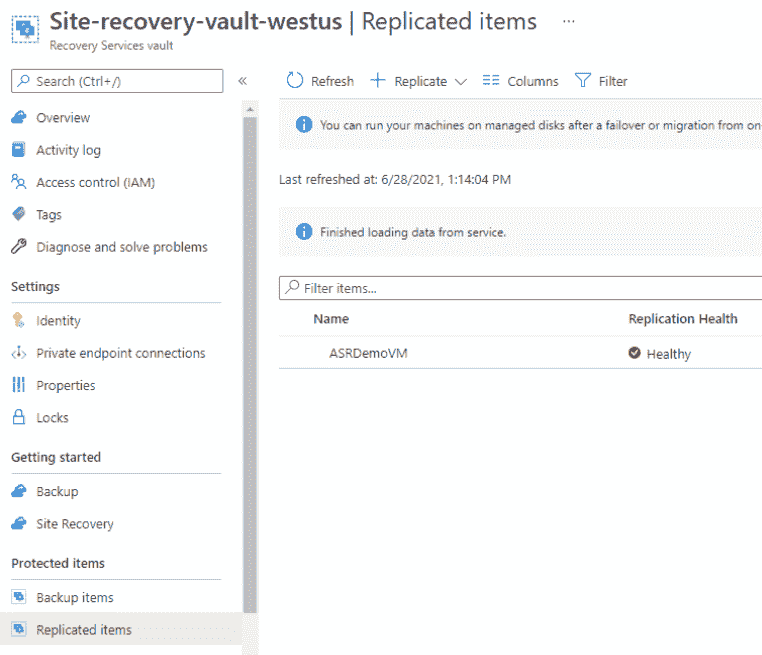

# Azure 站点恢复:使用 Azure 实现灾难恢复

> 原文：<https://medium.com/globant/azure-site-recovery-achieve-disaster-recovery-with-azure-7ff762c3796e?source=collection_archive---------0----------------------->

# **简介**

数据保护至关重要。很难预测灾难将在何时发生，以及它将对您的组织产生多严重的影响。但是，您可以规划业务连续性计划，并控制您的组织从灾难中恢复的方式。Azure Site Recovery 是微软提供的灾难恢复即服务(DRaaS)，它允许您的工作负载复制到 Azure 或辅助本地站点。

Azure 灾难恢复通过将运行在物理机和虚拟机上的工作负载从主站点复制到辅助站点，在停机期间为您的组织提供业务连续性。

如果主站点发生故障，您可以从辅助站点访问您的应用程序，而无需停机。

**在本文中，我们将讨论以下几点:**

1.  Azure 站点恢复功能
2.  演示:将 Azure 虚拟机复制到辅助站点。
3.  使用 Azure Site Recovery 可以复制什么？
4.  为什么应该考虑 Azure Site Recovery？

# **Azure 网站恢复功能**

Azure site recovery 提供了两种功能:

**复制:**同步辅助站点上虚拟机的内容。

**协调:**在主站点因灾难而出现故障的情况下，它负责主站点和辅助站点之间的故障转移和故障回复过程。

在这篇博客中，我们将使用 ASR 将 Azure VM 复制到一个辅助区域。

# **演示**

在此演示中，我们将使用 Azure Site Recovery 将在美国东部地区创建的 Azure VM 复制到美国西部地区。

**先决条件:**

1.  Azure 订阅-您可以使用 Azure 免费订阅进行此演示。
2.  美国东部地区的 Azure 虚拟机。

转到您的虚拟机资源并选择“灾难恢复”刀片选项。这将要求目标地区，这将是你的第二个网站。

点击“高级设置”。这里我们需要配置以下部分:

*   **目标设置**:此部分用于配置您的目标资源订阅、资源组、Vnet、可用性和邻近位置。

*   **存储设置**:此部分用于为您的资源配置您的缓存存储帐户和副本磁盘。

*   **复制设置**:此部分用于配置您的 Azure recovery 保管库和复制策略。

*   **扩展设置**:此部分用于配置你的 Azure automation 账户。

配置完上述所有部分后，您可以单击“创建”, Azure 将开始配置复制，这涉及所需资源的多次部署和配置，如 Azure recovery vault、Azure automation account 等。

一旦复制设置完成，它将执行初始同步。您可以在虚拟机资源的“灾难恢复”部分检查复制和基础架构视图的状态。

您还可以搜索 Azure 订阅中的“恢复服务库”资源，并检查复制的项目及其运行状况。此部分将允许您监视复制资源的健康状况，并为复制添加其他资源。

# 使用 Azure Site Recovery 可以复制什么？

*   **Azure VM to Azure** :当您遇到任何停机时，自动将您的虚拟机从一个 Azure 区域复制到另一个区域。
*   **本地服务器到 Azure** :自动将您的物理服务器和本地虚拟机复制到 Azure VM，几乎不停机。
*   **主站点上的本地服务器到本地辅助站点**:您可以使用 Azure Site Recovery 在主站点和其他本地站点之间迁移数据。

# **为什么您应该考虑 Azure Site Recovery？**

*   **方便复制和测试**

您可以轻松运行灾难恢复(业务连续性计划)演习，而不会影响从主站点到辅助站点的持续复制。ASR 允许您运行故障转移和恢复测试，而不会影响您的生产环境，也不会为 BCP 演习花费额外的资金。这为您提供了一个额外的信心级别，以了解您的故障转移是否会在真实的灾难场景中无缝工作。

*   **简单的部署和管理— *“一个门户管理一切。”***

ASR 允许您从 Azure 门户管理所有与灾难恢复相关的计划和活动。控制台为您提供了所有复制工作负载的整体概览。

如果你已经在使用 Azure 平台，使用 Azure site recovery 是最理想的。

*   **高可用性和即时支持**

ASR 保证 99.9%的服务可用性和来自微软的 24x7 支持。它还承诺低恢复点目标(RPO)和恢复时间目标(RTO)

*   **虚拟机和物理服务器的自动化数据保护和复制**

ASR 提供应用程序一致的快照恢复点来复制您的工作负载。这些快照捕获磁盘数据、内存中的所有数据以及正在进行的所有事务。

*   **借助灾难恢复站点的健康监控实现自动故障转移和恢复**

使用 ASR，您可以针对零数据丢失的预期停机运行计划内故障切换，或者根据针对意外灾难的复制频率等配置，运行数据丢失很少或没有数据丢失的计划外故障切换。验证主站点的可用性后，当主站点再次可用时，您可以快速回切到主站点。

*   **可定制的灾难恢复计划**

ASR 允许您创建自定义的恢复计划，您可以使用该计划自定义在多个虚拟机上运行的 N 层应用程序的故障切换和恢复期间的操作。您可以在恢复计划中对各种虚拟机进行分组，并根据需要选择添加脚本和手动活动。ASR 还提供了与 Azure Automation 的集成。

*   **性价比**

Azure site recovery 消除了对用于灾难恢复练习的辅助数据中心的需求，消除了与维护辅助站点相关的所有成本资源。您还可以预先评估将应用程序从您的本地设置复制到 Azure 所需的存储、网络和计算等资源，并选择仅支付停机期间所需的费用。

# 结论

Azure Site Recovery 是 Azure 中一项强大的服务，每个组织都应该加以利用。要使用 ASR 创建 BC-DR 计划，请确保您了解您的基础架构以及您希望如何复制它。拥有复杂混合云设置的企业，如果希望确保内部部署和云设置之间的连续性，并且没有停机时间，可以使用 Azure site recovery 作为他们的 BC-DR 工具。

# **参考文献**

*   [Azure 站点恢复服务](https://azure.microsoft.com/en-in/services/site-recovery/#customers)
*   [MS Learn:使用 Azure Site Recovery 保护您的 Azure 基础设施](https://docs.microsoft.com/en-us/learn/modules/protect-infrastructure-with-site-recovery/)
*   [Azure 站点恢复文档](https://docs.microsoft.com/en-us/azure/site-recovery/)
*   [关于 Azure Site Recovery 的一般问题](https://docs.microsoft.com/en-us/azure/site-recovery/site-recovery-faq)