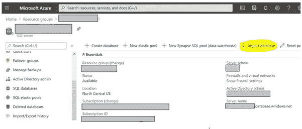
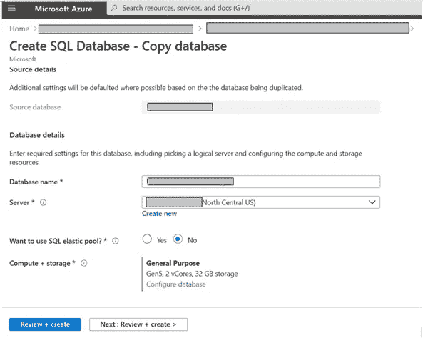

# 订阅或资源组之间的 Azure SQL 数据库(PaaS)迁移

> 原文：<https://medium.com/globant/azure-sql-database-paas-migration-between-subscriptions-or-resource-groups-27fb1da8da4d?source=collection_archive---------0----------------------->

***(针对特定用例的可用选项及其可用性之间的比较)***

的确，这个话题已经被广泛讨论过，并且有多种方法可以用于数据库迁移。Azure-SQL DB 作为一个 PaaS 组件，使我们能够灵活地选择选项来实现复制，但当涉及到已经有许多企业客户在使用的**实时环境**的迁移时，我们总是试图格外谨慎，并再次开始研究最佳可用选项，以最大限度地减少停机时间，并在没有任何数据丢失的情况下实现迁移。

因此，我将尝试总结实现这种迁移场景的可用选项，并根据过程中涉及的多个因素得出哪一个最适合的结论，并详细讨论其实施过程。

**场景**:

我有一个生产环境，运行着大约 35 个金融领域的客户，要求是将整个项目环境迁移到一个新的订阅。

**假设**:

所有其他组件(如 web 应用程序、存储和其他相关组件)都已复制到新的订阅/资源组，但环境仍在旧的(源)订阅上运行，因为数据库仍仅在该订阅上。

计划是在非工作时间内完成停机，并快速拥有数据库，以便只需更改数据库的连接字符串，环境就能在新订阅上运行。

# **1。数据库导出/导入** : -

您可以将数据库模式和数据导出到 BACPAC 文件。BACPAC 文件是扩展名为 BACPAC 的 ZIP 文件，包含数据库中的元数据和数据。

BACPAC 文件可以存储在 Azure Blob 存储中，也可以存储在本地位置的本地存储中，稍后再导入到 Azure SQL 数据库、Azure SQL 托管实例或 SQL Server 实例中。

[1.a]要使用 Azure Portal 导出数据库，请导航到特定的数据库资源，然后单击工具栏上的**导出**。


Export Database from Azure Portal

[1.b]提供 BACPAC 文件名，选择要存储 BACPAC 文件的存储帐户。验证订阅、存储和 BACPAC 文件名，然后单击**确定**。


Store Database BACPAC file to Blob

[1.c]要检查导出进度，导航至导出数据库所在的 SQL server，点击设置下的**导入/导出历史**。


[1.d]导出后，您可以将 BACPAC 文件导入目标 SQL-Server。导航到 SQL 服务器，点击工具栏上的**导入**选项。



Import Azure SQL DB Backup o SQL Server

[1.e]提供所需的数据库配置，如下所示，点击**确定。**


Import Azure SQL DB Backup o SQL Server

上述操作可以使用 Powershell /Azure CLI 以及 Sql 包命令行实用程序来实现。

**关于进出口方式的考虑:**

*   请确保在导出期间没有写入活动，以使导出的数据库在事务上保持一致。
*   将 BACPAC 存储到 Azure-Blob 有最大 200 GB 的限制，并且无法使用此方法导出到高级存储层。
*   对于较大的数据库，导出到本地存储。
*   导入时间取决于数据库的定价层。
*   用户应该在 SQL Server 上拥有执行所需操作所需的权限(SQL Admin)。
*   用户可以将数据验证到新的目标数据库中，并且它应该拥有所有数据，直到复制过程开始时的时间戳。
*   为了避免任何数据丢失，请确保主数据库上没有发生新的写操作。

# **2。数据库复制:**

您可以创建现有数据库的副本，并在相同的 SQL server 或不同的服务器上创建新的数据库。请注意，在使用 Azure Portal 创建数据库副本时，您无法选择为目标数据库选择不同的订阅。

[2.a]导航到要创建副本的数据库组件。点击工具栏上的**复制**。


Create Copy of Azure SQL Database

[2.b]默认情况下，它会将数据库名称作为 <sourcedbname>_Copy，但您可以根据自己的选择更改目标数据库的名称，并可以选择目标 SQL-Server。</sourcedbname>

[2.c]选择数据库所需的配置并点击**查看&创建。**



Select Destination for SQL- Database Copy

[2.d]如果一切正常，它将创建一个新的副本数据库。

要创建副本数据库，我们也可以使用 Powershell 或 SQL-Query，如下所示:
**Powershell:**

```
New-AzSqlDatabaseCopy -ResourceGroupName <MyRGName> `
-ServerName <testsqlsrvr1> `
-DatabaseName <testdb1>`
-CopyResourceGroupName <MyRGName2> `
-CopyServerName <testserver2> `
-CopyDatabaseName <testdb1_copy>
```

**SQL-Query:** `**CREATE**``**DATABASE**``dbname **AS**``COPY **OF**`SQL`servername.dbname;`

**关于复制方法的考虑:**

*   我们无法在不同的 Azure 订阅中创建副本。
*   我们无法将数据库副本追加到现有服务器。
*   用户应该在 SQL Server 上拥有执行所需操作所需的权限(SQL Admin)。
*   用户可以将数据验证到新的目标数据库中，并且它应该拥有所有数据，直到触发复制操作时的时间戳。
*   为了避免任何数据丢失，请确保在复制操作时主数据库上没有发生新的写操作。
*   显然，在创建数据库副本后，如果源(原始)数据库中仍有新的写操作发生，那么在复制操作的时间戳之后，原始&副本数据库的数据之间将不会有同步
    。

***上面提到的两个选项在数据库数量不多时可以考虑。但是如果数据库数量更多，那么最适合的选项将是选项 3，如下所述:***

# **3。故障转移到副本 SQL 服务器&移动副本服务器:**

(有关此选项的更多详细信息，请访问[微软文档](https://docs.microsoft.com/en-us/azure/azure-sql/database/auto-failover-group-overview?tabs=azure-powershell))

[3.a]在不同于源的区域中创建 SQL-Server 的**读取副本，(因为不能为同一区域中的 SQL-Server 创建故障转移组)**

[3.b]在源 SQL-Server 中创建一个**故障转移组**，并将源(主)服务器中的所有数据库添加到故障转移组。

[3.c]上述两个步骤都可以在迁移日之前完成，以最大限度地减少停机时间。

[3.d]迁移时执行**故障转移**操作，使副本服务器充当主服务器。

使用**故障转移**而不是**强制故障转移**来防止数据丢失。


Azure SQL Database Failover to Secondary SQL Server

使用工具栏中的**移动**选项，将这个新的主服务器移动到目标资源组/订阅。

[3.f]移动操作不需要太多时间，并且考虑到所有先决条件都已满足并且没有依赖性，用户将会有流畅的体验。


Move Azure SQL Server to new Subscription/Resource Group

[3.g]确保为移动操作选择所有数据库和相关资源

**考虑:**

用户应该具有执行移动操作所需的最低权限。

微软。源资源组上的 resources/subscriptions/resource groups/move resources/action。

微软。目标资源组上的 resources/subscriptions/resource group/write。

*   主 SQL Server 和辅助 SQL Server 上的 SQL Server 管理员权限。
*   如果某些依赖关系将被破坏，我们将无法移动服务器，例如，如果我们有:
    对数据库指标设置的警报规则
    长期保留备份
    必须确保辅助服务器包含具有完全相同名称的弹性池。
    如果主数据库位于弹性池中，则会在弹性池中自动创建同名的辅助数据库(如果尚不存在)。
    您不能使用上述方法移动单个/选择性数据库，您需要移动包含您需要移动的数据库的整个 SQL Server。

# **值得注意的优点:**

*   SQL 数据库将在移动操作期间可用。
*   在 SQL Server 上启用的所有其他读取副本仍将充当读取副本。
*   通过创建故障转移组，我们自动获得 SQL Server 的两个连接字符串:一个用于读/写端点，另一个用于只读用途。
*   通过使用这些连接字符串，当当前区域出现故障时，应用程序将自动指向当前的主(读写)服务器。(考虑到选择了自动故障转移)。

有关故障转移组的更多详细信息，请访问[微软文档。](https://docs.microsoft.com/en-us/azure/azure-sql/database/auto-failover-group-overview?tabs=azure-powershell)

有关在订阅/资源组之间移动资源的更多详细信息，请访问[微软文档](https://docs.microsoft.com/en-us/azure/azure-resource-manager/management/move-resource-group-and-subscription)

> **在分析了上面讨论的 3 种方法后，我们可以说用户可以根据使用情况灵活地选择选项，但作为一名开发运维工程师，我个人最喜欢的选项/建议是选项 3，即创建副本服务器，故障切换到副本服务器并将其移动到目标订阅/资源组。**