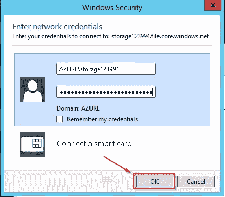

# Azure 存储教程——Azure 存储简介

> 原文：<https://medium.com/edureka/azure-storage-tutorial-an-introduction-to-azure-storage-dae8fd8f555c?source=collection_archive---------1----------------------->

Azure Storage Tutorial — Edureka

Azure Storage 是微软管理的云存储服务，如果您要手动管理，它可以以很低的成本提供高度可用、持久、可扩展和冗余的存储。在这篇关于 Azure 存储的博客中，你将了解 Azure 的不同存储产品，比如*表、blob、文件存储、*和*队列*！最后，我们还在 Azure 中加入了所有这些服务的演示。

以下是我们今天将要讨论的主题:

1.  我们为什么需要储物空间？
2.  存储与数据库
3.  什么是 Azure 存储？
4.  Azure 中的复制
5.  演示

# 我们为什么需要储物空间？

让我们通过一个示例来理解这一点，考虑以下架构:

这是一个图像处理网站的架构。我们尝试在两类服务器中分配负载，即网站服务器和后端服务器。网站服务器的唯一工作是处理我们网站的传入页面请求。后端服务器将处理任何与操作相对应的“处理”,在我们的例子中是图像处理。有两个未知的空白“实体”。

第一个实体将需要存储从我们的网站服务器传入的工作。这些作业将被后端服务器拾取以执行作业。一旦一个任务完成了，它就必须从这个实体中删除，这样就没有其他的服务器再去处理它，因为它已经被处理过了。

你可能会想，为什么我们不能把这个列表存储在后端服务器上呢？这是因为，我们的用例将需要多个后端服务器。因此，这个列表必须出现在每个后端服务器上，并且在每个成功的作业完成时，所有的服务器都必须更新它们的列表。现在，这变成了一项艰巨的任务。

因此，我们需要一个更好的解决方案。因此，我们想出了一个所有后端服务器都可以访问的公共位置，在这里我们所有的作业都可以按照先到先服务的原则存储，这就是所谓的队列。

需要第二个未知实体来存储处理后的图像。我们需要能够以最小的处理开销存储图像的东西。显而易见的答案是用于存储的文件系统。

最后，我们需要为第一个实体使用 ***队列*** 存储，为第二个实体使用 ***文件系统*** 。但是，为什么我们需要文件系统而不是数据库来存储我们的图像或作业呢？

# 存储与数据库

文件系统不仅需要较低的处理，而且还易于访问。如果将图像存储在数据库中，那么每次需要图像时，都必须向数据库发出查询请求。想象一下文件系统的情况，它不会进行太多的处理，因为访问文件非常简单和轻量级。此外，数据库存储比文件系统存储更昂贵。

# 什么是 Azure 存储？

**Azure Storage** 是现代应用程序的云存储解决方案，这些应用程序依靠耐用性、可用性和可扩展性来满足其客户的需求。

要使用 Azure 中的存储，你首先需要的是一个**存储账户。**

## **存储账户**

要在 Azure 中使用任何存储类型，首先必须在 Azure 中创建一个帐户。创建帐户后，您可以在储存帐户中的服务之间传输数据。创建一个存储帐户，在云中存储多达 500 TB 的数据。使用 Blob 存储帐户和热或冷访问层，根据对象数据的访问频率优化成本。

存储帐户有两种类型:

1.  通用
2.  Blob 存储

让我们详细讨论其中的每一个:

***通用存储账户***

通用存储帐户提供了一个空间，在这个空间中，您可以在一个统一的帐户中访问 blobs、队列、文件和表，以及所有这些服务。通用存储帐户可用于存储对象数据，可用作 NoSQL 数据存储，可用于定义和使用队列进行消息处理，并在云中设置 ***文件共享*** 。

如前所述，Azure 中主要有 4 种存储类型:

*   桌子
*   一滴
*   行列
*   文件存储器

## 桌子

Azure Table 存储服务存储了大量的结构化数据。该服务是一个 NoSQL 数据存储，接受来自 Azure cloud 内部和外部的认证调用。Azure 表非常适合存储结构化的非关系数据。

## 一滴

**Azure Blob** storage 是一种将非结构化数据作为对象/**Blob**存储在云中的服务。Blob 存储可以存储任何类型的文本或二进制数据，比如文档、媒体文件或应用程序安装程序。Blob 存储也被称为对象存储。

## 行列

Azure Queue 存储是一项用于存储大量消息的服务，这些消息可以在世界任何地方通过使用 HTTP 或 HTTPS 的认证调用来访问。单个**队列**消息的大小可以达到 64 KB，一个**队列**可以包含数百万条消息，达到一个存储帐户的总容量限制。

## 文件存储器

一个**文件存储**共享是 **Azure** 中的一个 SMB **文件**共享。所有目录和**文件**必须在父共享中创建。一个账户可以包含无限数量的份额，一个份额可以存储无限数量的**文件**，最多可达**文件**份额的 5 TB 总容量。

## Blob 存储

Blob 存储帐户专门用于存储 blob 数据，也可用于选择**访问层**，这允许您指定访问帐户中数据的频率。您可以选择适合您的存储和费用的访问层。

有两种类型的访问层:

**热:**

这种访问层为我们提供了最低的延迟。因此，它应该用于频繁访问的数据。自然，因为它提供低延迟，所以更贵。

**寒冷:**

该访问层的性能不如“热”访问层，即比之前的访问层延迟更高。也就是说，它的价格较低，因此可用于访问频率较低的数据。

接下来，这两种存储帐户类型，即 **blob 存储**和**通用存储帐户**，都被设计为高度可用。有了高可用性，您可以确保 Azure 上托管的文件全天候可用。高可用性只有通过复制才能实现。

# 分身术

Azure 中基本上有 4 种类型的复制:

## **本地冗余存储**

本地冗余存储(LRS)在一个存储规模单位内(即数据中心内)将您的数据复制三次。数据中心位于您创建存储帐户的区域。只有在写入所有三个复制副本后，写请求才会成功返回。这些副本中的每一个都驻留在一个存储扩展单元中独立的容错域和升级域中。

## **区域冗余存储**

区域冗余存储(ZRS)除了存储类似于 LRS 的三个副本之外，还在一两个区域内的数据中心之间异步复制您的数据，因此提供了比 LRS 更高的耐用性。即使主数据中心不可用或不可恢复，存储在 ZRS 的数据也是持久的。

## **地理冗余存储**

地理冗余存储(GRS)将您的数据复制到远离主区域数百英里的辅助区域。如果您的存储帐户启用了 GRS，则即使在整个区域中断或主区域不可恢复的灾难情况下，您的数据也是持久的。

## **读取访问地理冗余存储**

读访问地理冗余存储(RA-GRS)通过提供对辅助位置数据的只读访问，以及 GRS 提供的跨两个区域的复制，最大限度地提高了您的存储帐户的可用性。

好了，现在你有了所有你需要的信息。让我们开始吧，让我们的手指随着演示动起来吧！

# 演示

我们将分两部分进行演示:

## **第一部分:**

我们将尝试建立一个网站，将能够上传文件到 blob 服务。一旦文件被上传，文件的详细信息也将被添加到 Azure 队列中，这将用于在刷新时更改网页的背景。

## **第一步:**

正如我们之前提到的，第一步应该是创建您的存储帐户。请按照下图中的说明进行操作。

1.  首先，在左侧窗格中单击“Storage Accounts”
2.  然后，点击添加
3.  最后，输入所有相关字段，然后单击“Create”。

## **第二步:**

就是这样！我们已经成功创建了我们的存储帐户。我们的帐户中有四种类型的存储服务，即 Blobs、队列、文件和表。在这个 Azure 存储教程中，我将在这一部分演示 Blob 服务和队列服务。另外，关于详细的演示，请参考我们在博客开头附加的关于 Azure 存储教程的视频。让我们首先配置 blob 服务。转到您的存储帐户，然后单击 Blobs。

## **第三步:**

点击*容器*，创建一个新的容器。首先，输入容器的名称，这对于您将在这个特定帐户中创建的所有容器应该是唯一的。接下来，为其分配公共访问级别。Blobs 只不过是文件。如果您指定了 ***私人访问级别*** ，则只有您能够下载该容器的内容。如果您指定了 ***blob 访问级别，*** 任何链接到该帐户**的容器的用户都可以访问其中的文件**。使用 ***容器访问级别*** ，任何拥有链接**的用户都可以访问该容器内的文件和文件夹**。我们将为我们的演示选择 Blob 访问级别。最后，单击确定。

## **第四步:**

在网站代码中指定存储帐户的连接字符串。连接字符串对您的代码进行身份验证，以便与指定的存储帐户及其服务进行交互。为此，只需选择您的存储帐户，然后选择访问密钥，最后复制任何一个连接字符串。将这个连接字符串粘贴到您网站的代码中，就大功告成了！

**第五步:**现在开始排队。在您的存储帐户概述页面上，选择队列。

## **第六步:**

接下来，我们将创建一个队列。为此，单击 Add Queue，为队列指定一个相关的名称，然后单击 OK。最后，替换代码中的相关信息。

## **第七步:**

这是我们制作的网站，选择你要上传的文件，然后点击上传。

这是文件上传后屏幕的外观。

这样，我们就成功地将文件添加到了容器和队列中。您可以在下面的屏幕中看到相同的内容:

现在让我们检查一下在 blob 中是否也有一个条目:

## **第八步:**

让我们转到网站中的进程页面，看看队列和 blob 中的条目是否可以读取，是的！如您所见，图像名称是相同的。

至此，我们结束了演示的第 1 部分。让我们进入第 2 部分。

## **第二部:**

在这部分 Azure 存储教程中，我们将探索 Azure 中的 ***文件服务*** 。Azure 中的**文件服务**使用 SMB 3.0 协议进行文件传输，该服务可以附加到您的 windows 操作系统上，就像它是一个外部驱动器一样。现在让我们在 Azure Portal 中尝试一下:

## **第一步:**

转到您的存储帐户概述页面，并选择文件服务。

## **第二步:**

在下一页上，输入文件实例的名称，以及所需的实例大小。最后，单击确定。

## **第三步:**

选择您的文件服务，然后点击连接。

在“属性”窗格中，复制链接，如图所示:

并将其粘贴到记事本中，这样您就可以区分这些元素:

*   第一点是地址栏
*   第二点是用户名
*   第三点是你的密码

保存，这些细节。在本 azure 存储教程的下一步中，将会用到它们。

## **第四步:**

右键单击桌面上的“我的电脑”图标，然后单击“映射网络驱动器”。

## 第五步:

在文件夹文本框中输入从记事本复制的第一个点，然后单击完成。

## **第六步:**

下一步，从记事本中输入用户名和密码，最后单击 OK。

## **第七步:**

恭喜你！您的 azure 存储驱动器已准备就绪。您现在可以像使用计算机上的任何其他驱动器一样使用它了！

至此，我们结束了我们的演示。如果你想查看更多关于 Python、DevOps、Ethical Hacking 等市场最热门技术的文章，你可以参考 Edureka 的官方网站。

请留意本系列中的其他文章，它们将解释 Azure 的各个方面。

> 1.[蔚蓝教程](/edureka/azure-tutorial-5a97e30ee9a7)
> 
> 2. [Azure 门户](/edureka/azure-portal-all-you-need-to-know-about-the-azure-console-8ade1effa474)
> 
> 3.[蔚蓝专用网](/edureka/azure-virtual-network-securing-your-applications-using-vpc-744eba3aa5b1)
> 
> 4.[蔚蓝色的棋盘](/edureka/azure-boards-ce093b2688bb)
> 
> 5. [Azure DevOps 教程](/edureka/azure-devops-cf755fb334ae)
> 
> 6.[天蓝色管道](/edureka/azure-pipelines-1faa653e4cff)

*原载于 2017 年 10 月 25 日 www.edureka.co***。**