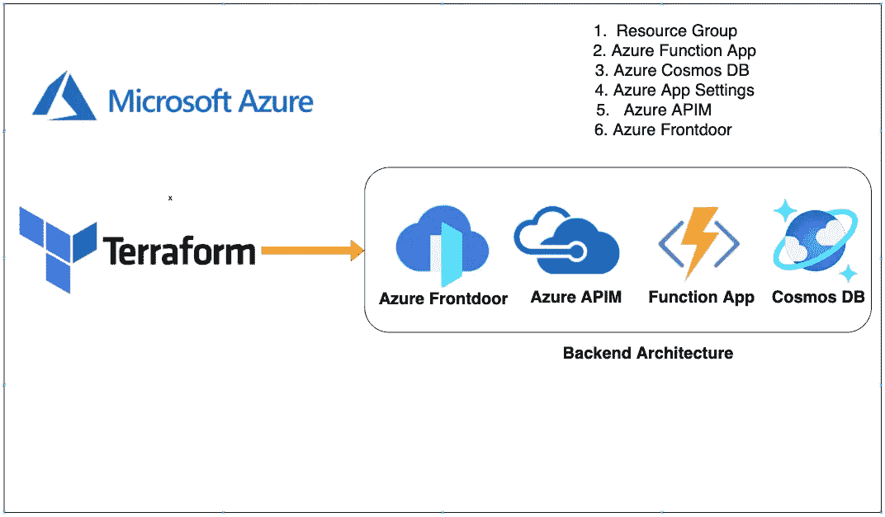

# Azure —带有 Azure Frontdoor、Azure APIM、功能应用程序、Cosmos DB 的 Terraform 模块

> 原文：<https://medium.com/bb-tutorials-and-thoughts/azure-terraform-modules-with-azure-frontdoor-azure-apim-function-app-cosmos-db-a0a23a87341a?source=collection_archive---------0----------------------->

## 包含示例项目的逐步指南

在 Terraform 中，模块是模块化 terraform 代码并使其可重用的方法。我们不应该为每个资源创建一个包装器，并把它称为一个模块。该模块应该是一组可以立即部署的逻辑资源。