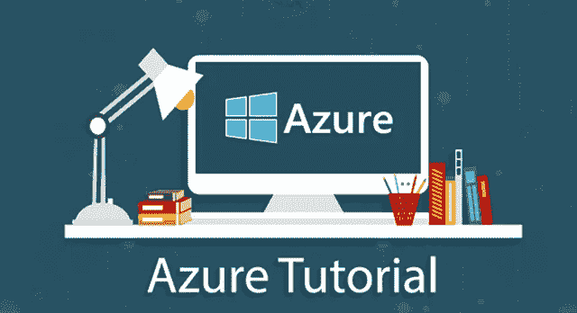
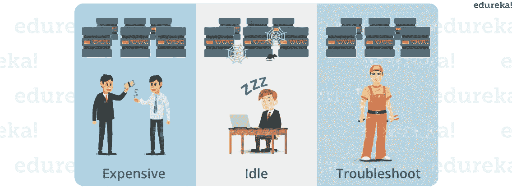
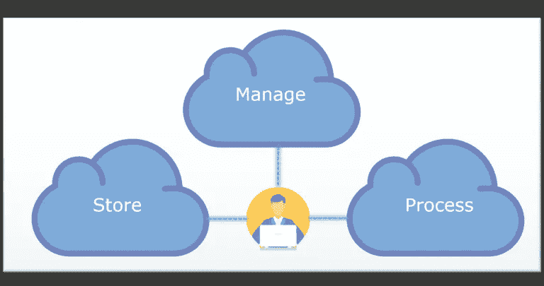
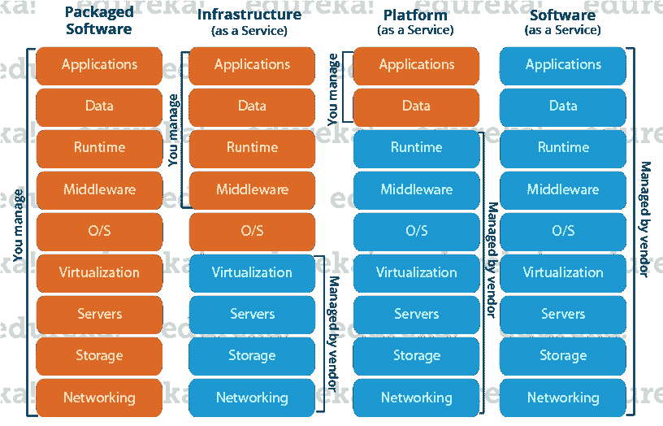
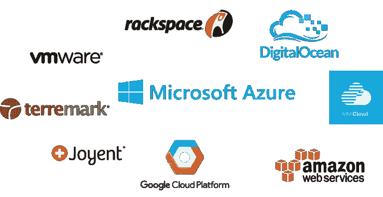
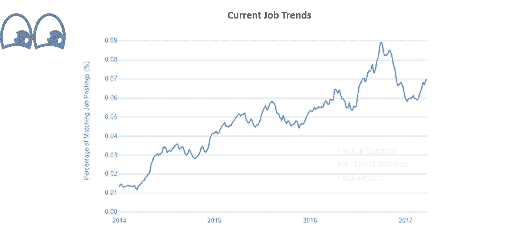
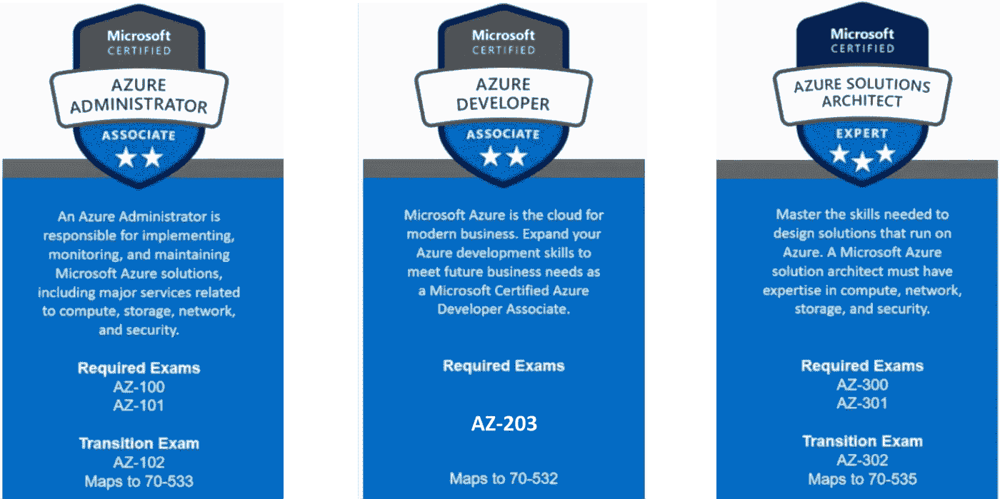
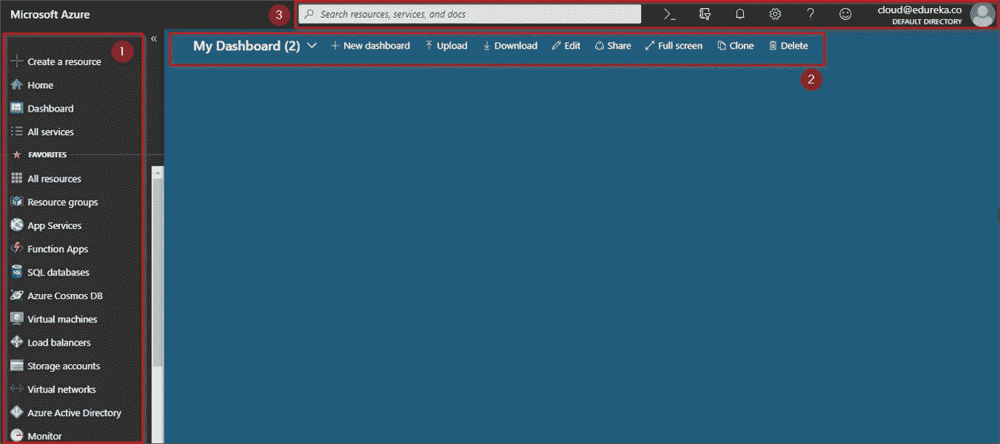
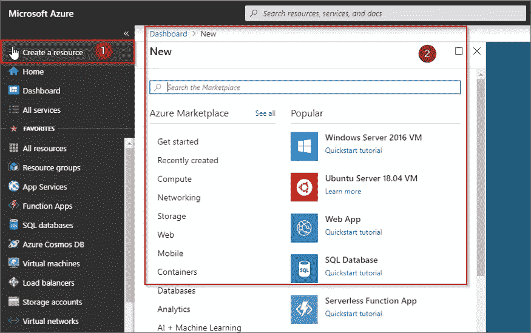
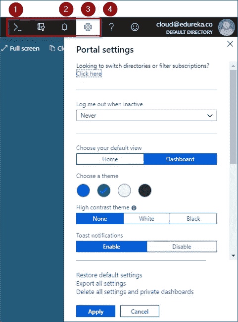

# Azure 教程—微软 Azure 入门

> 原文：<https://medium.com/edureka/azure-tutorial-5a97e30ee9a7?source=collection_archive---------0----------------------->

Azure Tutorial — Edureka

你知道什么是天蓝色吗？你知道为什么以及如何使用它吗？如果你想要这些问题的答案，你就来对地方了。这篇 Azure 教程文章将向你介绍微软 Azure，涵盖它的所有为什么、什么和如何方面。

在本文中，我们将按以下顺序了解微软 Azure:

1.  为什么选择云计算？
2.  什么是云计算？
3.  Azure 工作趋势
4.  微软 Azure 是什么？
5.  Azure 服务
6.  Azure 定价
7.  Azure 认证
8.  Azure 演示:Azure 门户演练

那么让我们开始吧

# 为什么选择云计算？

10 年前，公司将所有东西都存储在内部，即存储在自己的服务器上。但是随着互联网速度的提高，人们发现了一种新的存储方式——“云”方式！什么是云？要了解什么是云，我们先来了解一下它为什么会出现在画面中！

在“云”出现之前，公司离线存储一切，即在其内部服务器上托管网站，并在需要时添加更多服务器。但是，这种设置存在一些问题。这些问题是什么？让我们用本文中的一个例子来讨论它们:

*   你拥有一家公司，运营着一个非常成功的网站，让我们想象一下“云概念”在这个时候还没有被引入。因此，您的网站托管在本地服务器上。看起来很正常，对吧？
*   一个晴朗的日子，你在你的网站上添加了一个新功能，一夜成名。现在，你的流量增加了数倍，不可避免的事情发生了，你的网站崩溃了！
*   哇哦。很痛，不是吗？很明显，你不可能预见到这一点，即使你预见到了，你也不可能在这么短的时间内花费和购买所需的服务器。为什么？嗯，服务器并不便宜，它们非常贵。

假设您可以负担得起这么多服务器，但是您确定每天都要经历这么大的流量吗？在您购买服务器后，第二天您的流量下降了，您现在会如何处理这些服务器？它们大部分时间都是闲置的，因此对你来说是一项糟糕的投资。

现在用这个例子，让我们总结一下这个 Azure 教程中私有模型的问题:

1.  这个装置很贵。
2.  您的服务器大部分时间都是空闲的。
3.  每台机器总有一天会出故障，维护这么多服务器变成了一项单调乏味的任务。

为了解决这些问题，我们必须提出一种新的基础设施模式。因此，我们想出了云。有了云计算，这些问题都迎刃而解了！怎么会？

*   将您的数据放在云服务器上，您就万事俱备了！不再需要购买昂贵的服务器。
*   可扩展性！您的服务器容量将根据流量自动增加或减少。
*   您的云提供商将管理您的服务器，因此无需担心底层基础设施。

在这个 Azure 教程中，我们现在了解了为什么需要云计算，让我们继续了解它到底是什么？

# 什么是云计算？

它是使用互联网上的远程服务器来存储、管理和处理数据，而不是本地服务器或你的个人电脑。

**存储:**在云上存储大型或小型文件，您可以随时随地访问它们！

**管理:**通过优化的云数据库管理您的数据。

**流程:**借助云上可扩展的计算能力，您可以瞬间处理任意数量的数据！

因此，基本上，所有这些任务，即“存储、管理和处理”，不是在你的个人电脑或私人数据中心完成，而是在公共云上完成，这就是云计算的意义所在。

云计算基本上有 3 个类别:

## **SaaS(软件即服务)**

它允许公司使用软件而无需购买，这大大减少了公司的支出，因为它们已经安装在云服务器上，可以快速部署，因此节省了时间。

## **平台即服务**

它允许开发人员构建应用程序，在项目上进行协作，而无需购买或维护基础设施。

## **IaaS(基础设施即服务)**

它允许公司租用服务器、存储空间等。来自云提供商。

由于云计算有如此多的好处，因此公司理解其市场潜力只是时间问题。因此，今天我们有很多云提供商。

今天，在这篇关于 Azure 教程的文章中，我将讨论微软 Azure，它是一个 IaaS。首先，我们讨论一下你为什么要学习微软 Azure。

# Azure 工作趋势

**资料来源:Indeed.com**

从趋势中可以看出对 Azure Solutions Architect 的需求，因此升级自己成为云的主人是有意义的。

让我们继续这个 Azure 教程，了解一下什么是微软 Azure？

# 微软 Azure 是什么？

我们在这个 Azure 教程中讨论了云服务，对吗？提供这些云服务的公司被称为云提供商。现在，有很多云提供商，其中之一是微软 Azure。

***微软 Azure*** 是由**微软**创建的云计算平台，开发人员和 IT 专业人员通过其全球数据中心网络来构建、部署和管理应用程序。

# Azure 服务

微软 Azure 提供了各种服务，以这种或那种方式帮助你进行计算，这些服务被加入到域中。以下是几个值得注意的领域:

*   **Compute** 它通过利用同时服务于多个实例的强大处理器来处理云上的数据。
*   **存储服务** 顾名思义，存储用于在云中存储数据，能够根据需要进行扩展。这些数据可以存储在任何地方。
*   **数据库** 数据库域用于提供由 Azure 管理的可靠的关系型和非关系型数据库实例。
*   **网络** 它让您能够连接到云和本地基础设施和服务，从而获得出色的用户体验

# Azure 定价

这可能是学习和使用微软 Azure 的最流行的原因之一。对于新手和想要学习技术的人，Azure 为你提供了**免费积分**，可以用来在短期内免费访问 Azure 服务。这足以让一个人开始。

Azure 非常灵活，并提供了一种**按需付费的方法**，可以极大地帮助满足您的业务需求。灵活的定价极大地支持根据需要扩展或缩减体系结构。

这是关于 Azure 的定价。现在，让我们继续这个 Azure 教程，讨论 Azure 必须提供什么样的认证？

# Azure 认证

Microsoft Azure 旨在填补行业需求和可用资源之间的技能差距，为此，他们采取了以下措施:

*   引入基于角色的认证
*   提供一致的体验
*   使认证简单明了
*   对所提供的认证有更多的行业认可

在此过程中，他们将 Azure 认证分为三个主要类别，即:

*   **Azure 管理员**
*   **Azure 开发者**
*   Azure 解决方案架构师

这些认证有等级之分，你必须首先获得准等级认证，然后用它作为进阶认证的垫脚石。

# 什么是 Azure Portal？

顾名思义，Azure Portal 是一个单一的门户或单一的连接点，让您可以在一个地方访问和管理所有的应用程序。它让您可以在一个统一的控制台中构建、管理和监控从简单的 web 应用程序到复杂的云应用程序的一切。

## Azure 门户的功能

以下是 Azure Portal 提供的一些功能特性:

*   单点管理
*   个性化体验
*   访问控制和安全性
*   面向强大体验的服务融合
*   更高的可见度

# 演示:Azure 门户演练

## **第一步:**

首先，你需要一个 Azure 的免费账户或付费账户。一个人需要做的就是去链接'**portal.azure.com**'。填写你的详细资料。Azure 为您提供免费服务或信用点数，可使用一个月。请注意，您需要输入您的信用卡或借记卡详细信息。但请放心，Azure 不会在未经您同意的情况下向您收费。

## **第二步:**

拥有帐户后，您可以登录，并会被定向到下图中的门户网站:

在上图中，左侧部分让您可以一键访问所有服务域。它旁边是蓝色的控制面板，默认情况下是空的，如果有任何应用程序正在运行，这些应用程序可以固定到它上面。最上面是搜索栏，你可以在那里搜索屏幕上没有的服务和资源。

## **第三步:**

如果你点击创建一个新的标签，你可以继续创建应用程序，移动应用程序，聊天机器人，虚拟机等。

## **第四步:**

如果你看看左上角。您会发现以下选项卡。首先是 Cloud Shell，它是一个命令行界面，允许您使用命令提示符处理数据。第二个是 Notifications 选项卡，您最近活动的所有通知都将突出显示。第三个选项卡让你探索门户设置，而第四个选项卡让你寻找 Azure 提供的帮助支持。

所以这就把我们带到了这篇文章的结尾。我希望你喜欢这篇文章。如果你正在读这封信，让我祝贺你。因为你不再是 Azure 的新手了！你练习得越多，你学得就越多。

如果你想查看更多关于 Python、DevOps、Ethical Hacking 等市场最热门技术的文章，那么你可以参考 [Edureka 的官方网站。](https://www.edureka.co/blog/?utm_source=medium&utm_medium=content-link&utm_campaign=microsoft-azure-tutorial)

请留意本系列中的其他文章，它们将解释 Azure 的各个方面。

> 1. [Azure 门户](/edureka/azure-portal-all-you-need-to-know-about-the-azure-console-8ade1effa474)
> 
> 2. [Azure 存储教程](/edureka/azure-storage-tutorial-an-introduction-to-azure-storage-dae8fd8f555c)
> 
> 3. [Azure 私有网络](/edureka/azure-virtual-network-securing-your-applications-using-vpc-744eba3aa5b1)
> 
> 4.[天蓝色木板](/edureka/azure-boards-ce093b2688bb)
> 
> 5. [Azure DevOps 教程](/edureka/azure-devops-cf755fb334ae)
> 
> 6.蓝色管道

*原载于 2017 年 6 月 23 日*[*【www.edureka.co】*](https://www.edureka.co/blog/microsoft-azure-tutorial)*。*