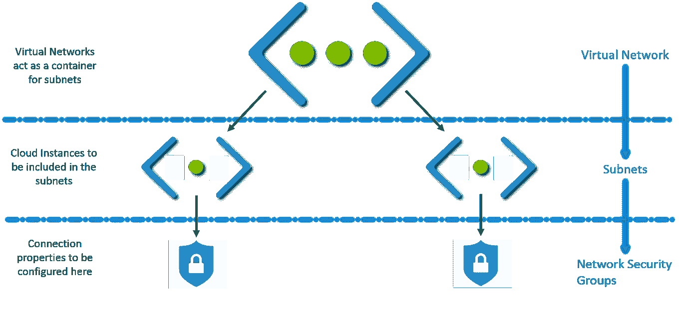
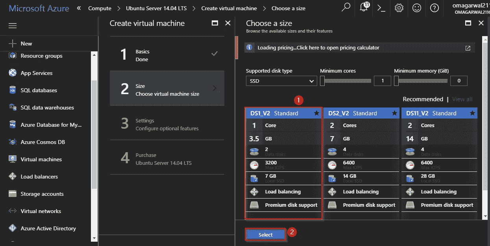
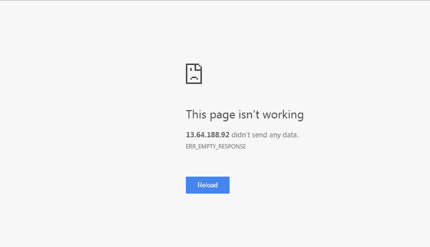
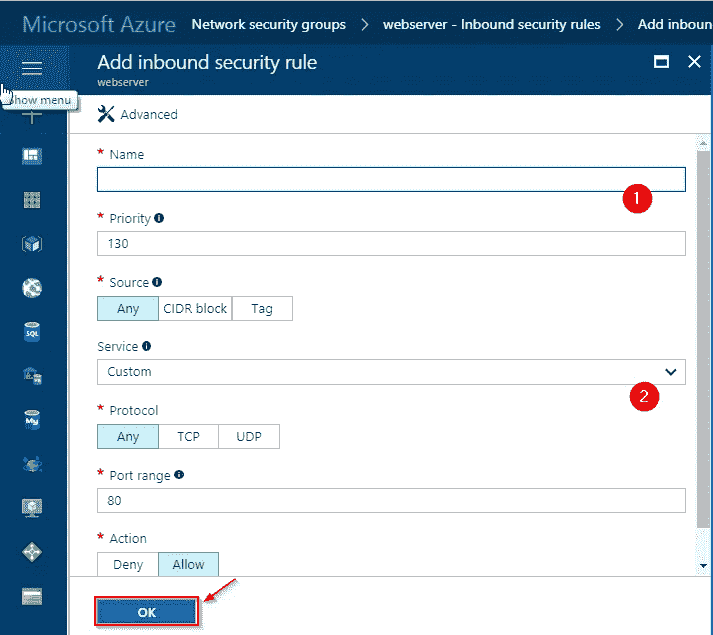
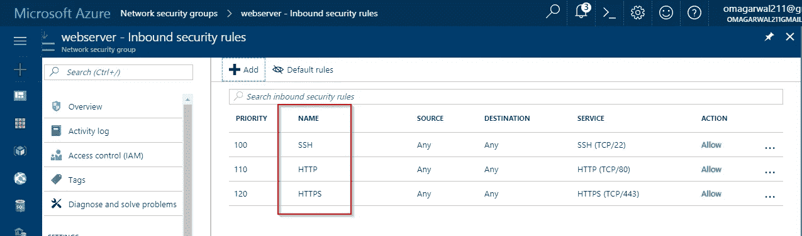

# 使用 Azure 虚拟网络保护您的应用程序

> 原文：<https://medium.com/edureka/azure-virtual-network-securing-your-applications-using-vpc-744eba3aa5b1?source=collection_archive---------1----------------------->

Azure Virtual Network Tutorial — Edureka

欢迎阅读这篇关于 Azure 虚拟网络的文章。在本文中，您将学习如何使用 Azure 虚拟网络保护您的应用程序。在继续之前，让我们先了解一下，为什么我们首先需要虚拟网络。

# 为什么选择虚拟网络？

虚拟网络充当云中启动的资源之间的通信通道。为什么是虚拟的？因为云中没有真正的路由器或交换机。例如，如果您在云中启动一个数据库服务器和一个网站服务器，它们将需要一个交互媒介。这种交互媒介被称为虚拟网络。

## **带虚拟网络:**

# 什么是 Azure 虚拟网络？

**Azure Virtual Network**(**VNet**)是您自己的网络在云中的代表。这是专用于您的订阅的 Azure 云的逻辑隔离。

您在定义中看到了一些沉重的字眼，如“逻辑隔离”和“您自己网络的表示”。暂时忘掉这个定义，记住这一点:

如果两台计算机必须相互交互，它们需要有权限。您可以在虚拟网络设置中添加/删除这些权限。添加这些权限后，只需将这些计算机包含在此虚拟网络中，瞧！你准备好了。这三行是我们今天将要完成的工作的总结。

接下来，虚拟网络进一步分为几个部分。

# 虚拟网络组件

以下是虚拟网络组件:

*   子网
*   网络安全组

## 什么是子网？

每个虚拟网络可以分为几个子部分，这些子部分被称为子网。

子网可以进一步分为:

*   **专用子网**——没有互联网接入的网络。
*   **公共子网**——可以接入互联网的网络。

让我们看一个例子，了解虚拟网络是如何实际使用的:

在上图中，单个虚拟网络被划分为多个子网，每个子网都包含一台服务器。

*   **子网 A** 是一个网络服务器，因此它是一个公共子网，因为您的网站可以通过互联网访问。
*   **子网 B** 是数据库服务器，因为数据库应该能够连接到网络服务器，所以不需要互联网连接，所以它是一个私有子网。

你可能想知道，在哪里进行这些设置，允许哪些连接，不允许哪些连接，对吗？嗯，这就是第二个组成部分出现的地方，即网络安全组。

## 网络安全组

这是您进行所有连接设置的地方，比如打开哪些端口，默认情况下所有端口都是关闭的。不要害怕，本文将指导您完成所有设置，所有设置都很容易配置。

但首先，让我向您展示虚拟网络的最终架构是什么样的:

虚拟网络是这样工作的:

*   首先，你创建一个虚拟网络。
*   然后，在这个虚拟网络中，创建子网。
*   您将每个子网与各自的虚拟机或云实例相关联。
*   将相关的网络安全组连接到每个子网。
*   在 NSG 中配置属性，一切就绪！

现在让我们用一个演示来尝试一下。

# 演示

我们将在虚拟网络中部署两台服务器，一台数据库服务器和一台网站服务器，它们将相互交互。让我们看看如何构建这个网络。

**第一步:**首先，我们将创建一个网络安全组。转到您的 Azure 仪表盘，并按照下图中的步骤操作。

**第二步:**接下来，你将到达这个屏幕，在这里你将填写你的 NSG 中的所有细节，最后点击“创建”。请注意，在第二步的图像中，您正在创建一个资源组。试着把你所有的资源放在同一个组里，这样更容易管理。

**步骤 3:** 我们现在将创建一个虚拟网络，按照下图中的说明创建一个。请记住，在资源组中选择“使用现有的”，然后选择您之前创建的同一资源组。

**步骤 4:** 接下来，我们将创建 2 个子网，一个用于我们的网站，一个用于我们的数据库。按照下图中的步骤操作:

**步骤 5:** 在下一个屏幕上，创建两个子网。按照相同的步骤，一个用于数据库，一个用于 web 服务器。此外，附加相应的网络安全组。

**步骤 6:** 好了，我们的网络已经设置好了，我们现在要做的就是配置网络安全组，并在这个虚拟网络中创建我们的服务器。让我们首先创建 web 服务器。

**第 7 步:**在下一个屏幕上，选择您喜欢的操作系统。对于我们的演示，我们将选择一个 Ubuntu 操作系统。最后点击创建。

**第 8 步:**在首页输入所有相关信息:

接下来，选择相关的配置。我们选择最基本的配置，因为这是一个演示:

**步骤 9:** 在下一页中，您将选择要在其中部署虚拟机的虚拟网络。

接下来，选择子网:

打开“network security group”窗格，选择“None”选项，因为我们已经将网络安全组连接到虚拟网络。最后，单击 Ok，您的虚拟机将开始部署。对您的数据库服务器也做同样的事情。

**步骤 10:** 您可以浏览本文开头所附的视频，了解如何配置 web 服务器和 DB 服务器，它们将指导您如何做同样的事情。让我向您展示我的 web 服务器网络安全组目前的情况:

由于到目前为止入站安全规则中没有添加任何内容，如果我尝试使用 IP 地址连接到我的服务器，我会得到以下错误:

**步骤 11:** 按照下图添加任何连接属性:

我添加了以下连接:

要访问您的网站，您需要添加 HTTP 和 HTTPS。最后，您需要 SSH 来配置您的服务器。如果我现在尝试连接我的 web 服务器，会出现以下屏幕:

这是 SSH 窗口:

**第 12 步:**这是我的数据库网络安全组的样子:

到此，我们结束这篇文章。如果你想查看更多关于 Python、DevOps、Ethical Hacking 等市场最热门技术的文章，你可以参考 Edureka 的官方网站。

请留意本系列中的其他文章，它们将解释 Azure 的各个方面。

> 1. [Azure 教程](/edureka/azure-tutorial-5a97e30ee9a7)
> 
> 2. [Azure 门户](/edureka/azure-portal-all-you-need-to-know-about-the-azure-console-8ade1effa474)
> 
> 3. [Azure 存储教程](/edureka/azure-storage-tutorial-an-introduction-to-azure-storage-dae8fd8f555c)
> 
> 4.[天蓝色木板](/edureka/azure-boards-ce093b2688bb)
> 
> 5. [Azure DevOps 教程](/edureka/azure-devops-cf755fb334ae)
> 
> 6.[天蓝色管道](/edureka/azure-pipelines-1faa653e4cff)

*原载于 2017 年 8 月 22 日 www.edureka.co**的* [*。*](https://www.edureka.co/blog/azure-virtual-network-tutorial/)