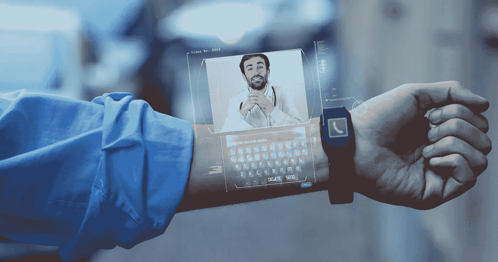
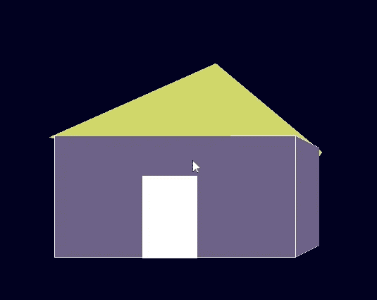
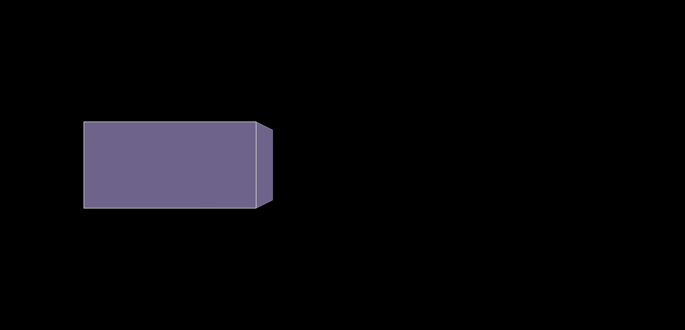
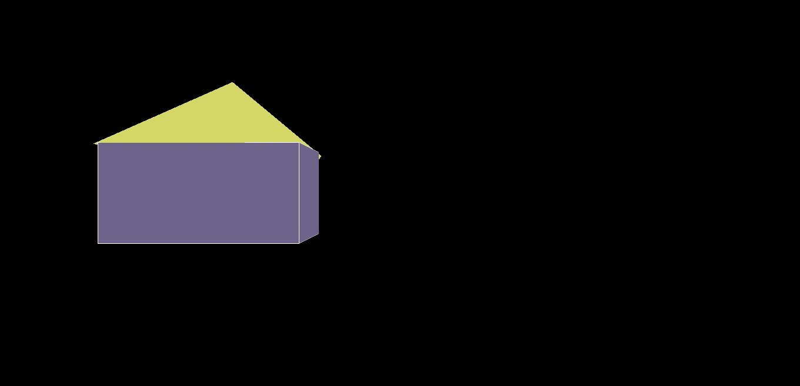
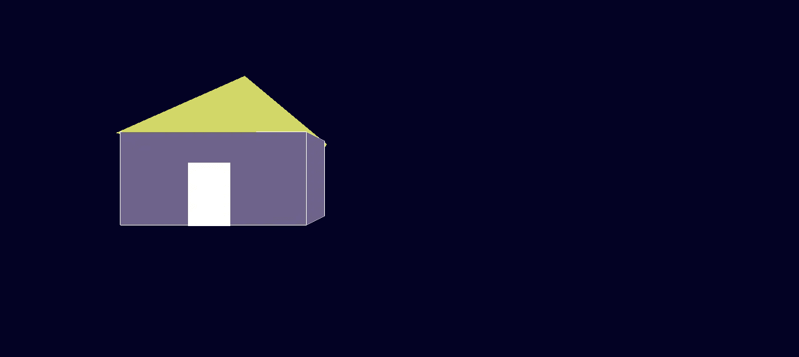

# 用 Three.js 迈向增强现实/虚拟现实的一小步！！！

> 原文：<https://medium.com/globant/baby-step-towards-augmented-reality-virtual-reality-with-three-js-d6646b3eb2e7?source=collection_archive---------2----------------------->

Credit: [https://arvrjourney.com/](https://arvrjourney.com/)

增强现实！这难道不是我们这些天随处可见的事情吗？它看起来如此神奇和有趣，不是吗？然后我们有了让我们兴奋不已的虚拟现实。你是否觉得这些太复杂，难以学习和处理？不要！你不应该。我会帮助你一步一步地创造你自己的东西。所以，系上安全带，享受旅程吧。

我们将使用 **Three.js** 逐步创建我们的第一个 AR/VR 对象。
因此，我们将简要回顾一下什么是 AR 和 VR，然后通过构建我们的第一个 AR/VR 对象来体验一下

Credit: [https://giphy.com/](https://giphy.com/)

## 什么是增强现实(AR)和虚拟现实(VR)？

增强现实是你把你的想象放到这个真实世界和周围环境中。让我用一个简单的例子来解释一下。让我们假设你正坐在一个房间里，你在想这个房间里应该有一棵挂满芒果的树。一个不存在的物理实体或现实世界只是一个房间，而你的想象是有一棵树，树上有芒果。所以，如果你把那棵挂满芒果的树放在这个房间里，这就是现实世界中数字元素的存在，叫做增强现实。

虚拟现实就是创造一个虚拟/刺激的环境。如果我们深入研究上面的例子，*虽然只是在房间内的真实世界中放置物体(树)是增强现实的一部分，但如果我们虚拟地创建整个环境或周围环境，就像虚拟地创建房间和树一样，这两者一起作为虚拟环境可以称为虚拟现实。*

## 什么是 Three.js，如何开始构建你的第一个 3D 对象？

Three.js 是一个 javascript 库，用于创建 3D 对象、模型和计算机图形，这些可以在 web 浏览器中使用 WebGL 进行渲染。

注意:为了在 3D 视图中处理任何东西，我们将需要场景、渲染器、物体/几何体、相机和材质。下面是所有元素的快速信息。

**相机** —在开始或构建任何 3d 对象之前，您的相机投影应该如何，应该保持在什么角度，应该保持多远和多近的距离，所有这些设置都可以在这里处理。

**几何图形/对象** —我们借助几何图形在 Three.js 中绘制的东西，或者您可以直接加载 3D 模型或对象。

**材质** —当绘制或添加任何 3D 对象时，它需要一些外观，如颜色、阴影、不透明度、渐变等等。这可以通过材料来处理。

**场景** —在向用户显示之前，将添加您的 3D 对象输出。因此，基本上需要向最终用户展示的内容应该添加到场景中。

**渲染器** —这是一个将场景添加到 HTML 元素的连接，以便可以在浏览器中查看。

*更多可以在 https://threejs.org/*阅读。

让我们开始使用 three.js 创建我们的第一个 3D 房子。完成本教程后，你将能够看到 3D 房子，如下图所示。

如上所示，我们将把我们的房子分成三个 3D 形状(立方体代表房屋底部，圆锥形代表屋顶，平面代表门)，然后组合起来显示 3D 房屋视图。对于立方体、圆锥体和平面形状，我们将使用三个 JS 几何体。

第一步:创建一个名为 threejs-demo 文件夹，在里面创建一个文件，保存为 index.html。打开这个文件，创建一个基本的 HTML 代码片段，如下所示，并包含 three.js 库 CDN 链接。

**步骤 2** :现在创建一个简单的 JS 文件，并将其保存为“main.js”，我们已经在 HTML 文件中调用了它。在这个文件中，我们将管理在 Three.js 中创建对象的代码。

**Step3** :打开 main.js 文件，添加场景、相机、渲染器实例，如下图所示。

在上面的透视摄像机代码中，传递的参数如下
透视摄像机(视角、方位、近、远)
摄像机的更多信息可以在[https://threejs.org/docs/#api/en/cameras/PerspectiveCamera](https://threejs.org/docs/#api/en/cameras/PerspectiveCamera)查看

**步骤 4** :现在创建一个组，所有的元素都将被添加到这个组中，开始为房子建造一个基座，如下图所示。

*The screen will look as shown above once code will be added.*

第五步:现在我们要为我们的房子建造一个屋顶。为此，我们将向房屋组添加圆锥形几何体，使其形状类似于房屋的屋顶。

After adding the roof element to the scene it will be shown as above.

为房屋基础添加一扇门，我们将使用平面几何图形，并将其添加到房屋组。

最后，如教程开始所示，您的第一个 3D 对象如下所示。

朋友们，这是我的第一篇博客，我希望这篇教程能帮助你从 Three.js 开始。

[点击这里](https://gist.github.com/vinitsaboo/9dd99684bea6fd2486cb5115e92eb33c)查看完整源代码。

在下一个教程中，我们将看到如何给形状添加背景，以及如何在 Three.js 中制作动画。