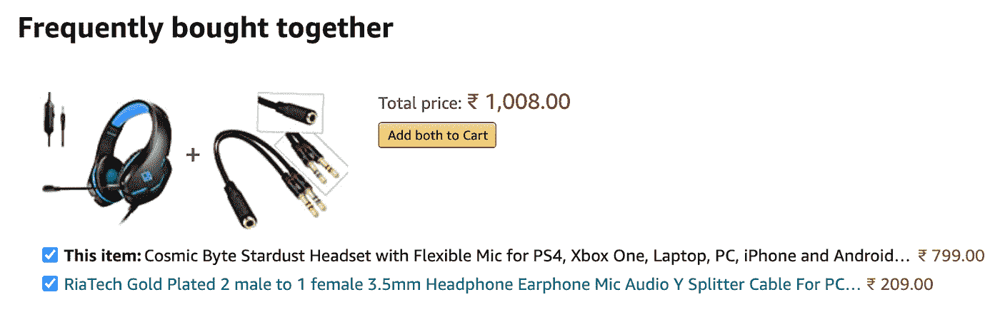

# 2021 年及以后人工智能驱动的数字营销

> 原文：<https://medium.com/globant/back-in-the-90s-did-you-ever-imagine-that-a-day-will-come-when-you-just-have-to-say-and-things-2ed94a0b31eb?source=collection_archive---------2----------------------->

早在 90 年代，你有没有想过有一天你只需要说一句话，事情就会自动完成？不是吧？在人工智能的帮助下，这一切在今天都是可能的。它让你退居二线，观看比赛。是不是很棒？对于大多数行业和数字营销人员来说，人工智能正在成为一项出色的资产，它改变了他们与受众互动的方式。在视觉感知、自然语言处理、机器学习、语音识别和决策的帮助下，计算机像人类一样工作，这些都是早期由人脑完成的。现在，人工智能本身已经能够自给自足地完成这一切。

**人工智能如何与数字营销合作**

人工智能与数字营销相结合，就像用数百个大脑解剖数据一样。这些数据集非常庞大，但只需点击一下按钮就可以处理和实施。

它帮助营销人员积极有效地完成任务。通过选择由人工智能驱动的解决方案，营销人员不仅节省了资金，还节省了精力。

人工智能已经被用来取代聊天机器人等面向客户的角色，通过分析客户的个人资料来实现超个性化，加速内容创建和内容管理，语音识别和语音搜索，为电子邮件营销、数字广告、预测分析、动态定价等提供个性化内容，等等。

# 数字营销解决方案中的人工智能

**聊天机器人:**聊天机器人将取代客服代理、移动应用，甚至取代电子邮件营销。这将降低你的商业成本，给你带来更多的收入。

**超个性化:**当我们浏览亚马逊的一副耳机，界面向用户推荐“经常一起购买”部分。

亚马逊还根据每位顾客的购物习惯、愿望清单和购物车商品为他们创建了一个个性化主页。现在，这是超个性化。

**内容创建和内容监管:**人工智能已经可以创建高质量的可读内容，或许你可能已经读过《纽约时报》等网站上的文章，这些网站上的所有或部分内容都是使用人工智能创建的。同样，人工智能可以策划吸引人的内容，并确保它在正确的时间到达正确的人手中。例如，你可能看过网飞推荐你的电影，或者提醒你看过“XYZ”系列的观众可能也喜欢“ABC”，这都是因为你看过“XYZ”系列的相同类型。

**语音识别和语音搜索:**具有解码人声和执行动作的能力。智能家居是语音识别和语音搜索如何工作的一些很好的例子，在智能家居中，你打开灯和风扇，你的语音助手在汽车中导航你到你想要的位置。如果你曾经与 Siri、Alexa 或 Google Home 交谈过，你会知道这已经变得多么先进。

**邮件营销:**根据 Statista 报告 **—** 仅 2019 年，每天收发邮件 2936 亿封，预计到 2022 年将增至 3473 亿封以上。电子邮件营销曾经是一项手工活动，但在前些年，越来越多的公司开始将营销自动化纳入其核心战略。

人工智能在营销自动化中发挥着重要作用，因为它可以识别应该促进电子邮件通信的事件和行为，并确保消息得到传递以获得预期结果。

**数字广告:**程序化广告正在成为如今的新常态。这是一个自动化的拍卖系统，允许购买和出售广告空间。人工智能对广告商(购买空间者)和出版商(出售空间者)都有好处。人工智能算法可以根据新的模式学习和调整自己的行为，这非常适合程序化广告的实时环境。人工智能可以影响程序化广告的各个方面:

*   **个性化:**AI 收集和组织数据，并根据每个用户显示更多个性化的广告内容。
*   **内容匹配:**使用自然语言处理(NLP)，我们可以比较网站的内容，并确保广告正在相关网站上显示。
*   **预算:人工智能**算法足够智能，可以每小时调整和优化预算，以便

**预测分析:**预测分析就是将数据转化为有意义的见解。

例如，实时跟踪在线客户，以确定提供关于产品或某些优惠的额外信息是否会增加转化的可能性。

tableau 是一种用于预测分析的神奇工具。谈到全球新冠肺炎疫情的现状，他们正在提供免费的数据资源，以帮助行业保持更新，并做出数据驱动的决策。

**动态定价:**优步的价格波动、Ola 服务以及高峰时段或我们持续查看价格时的机票价格就是动态定价的一个很好的例子。AI 可以让它变得更简单更好。有了人工智能，你可以比以往任何时候都更快地确定发生了什么，并在几分钟内改变价格，而不是花时间首先分析情况，然后手动改变价格。

**结论**

人工智能是一项令人难以置信的技术，可以为任何品牌创造奇迹。在数字营销策略中使用人工智能可以在许多方面带来好处，例如:

*   人工智能可以通过分析客户的个人资料来超个性化客户体验。
*   人工智能工具可以决定什么内容更好以及何时分发。
*   它可以根据模式做出最好的预测
*   AI 可以预测客户行为，改善客户体验。
*   提高性能并减少错误。
*   它比人类库存更便宜

人工智能正在许多方面改变数字营销的世界。从提供卓越的客户体验开始，到超个性化的整个客户旅程。想象一下，我们正在考虑买一辆车，然后家里有人会送我们一辆同样的车。多酷啊，不是吗？

这正是人工智能正在为我们做的，在购买任何东西之前，人工智能会在最佳时间根据之前的搜索历史推荐类似的产品。

