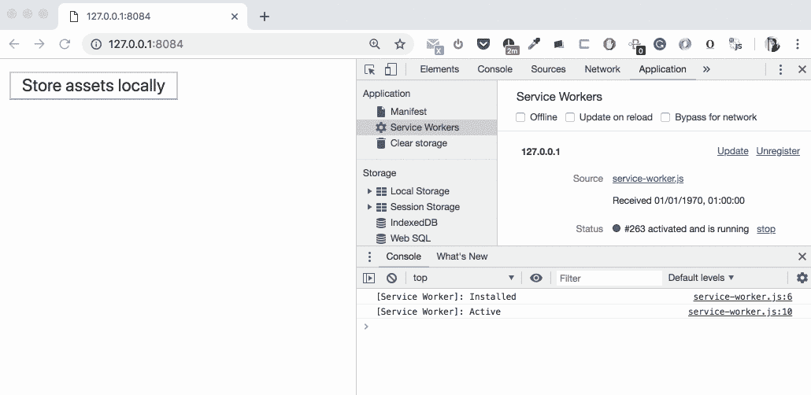
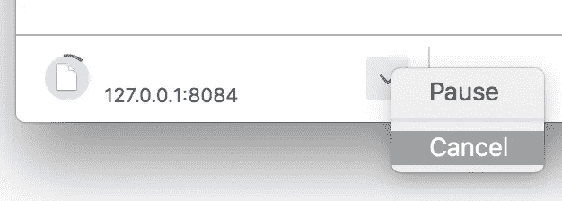
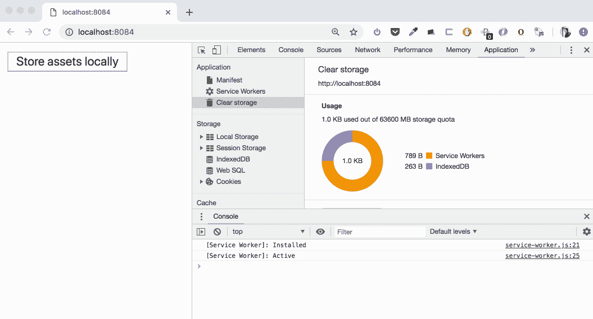
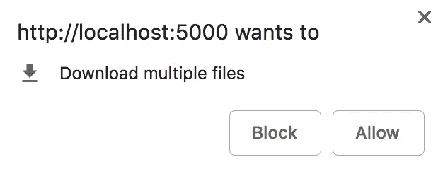
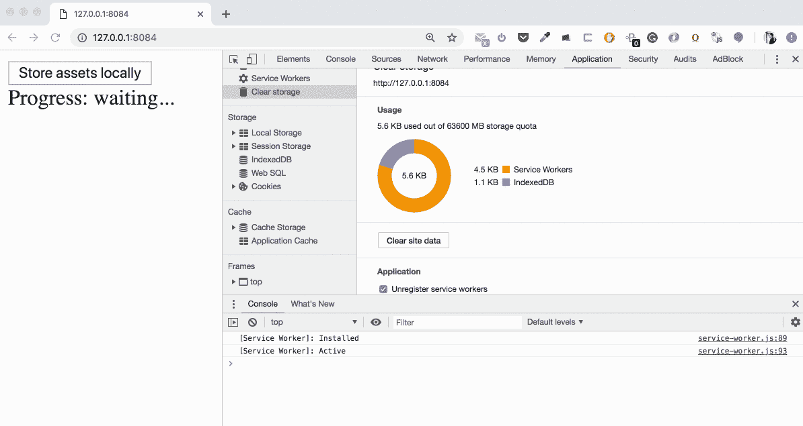
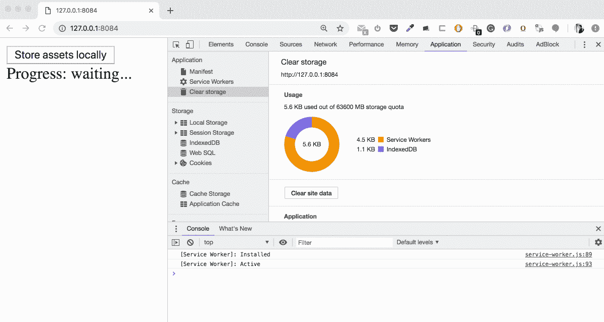
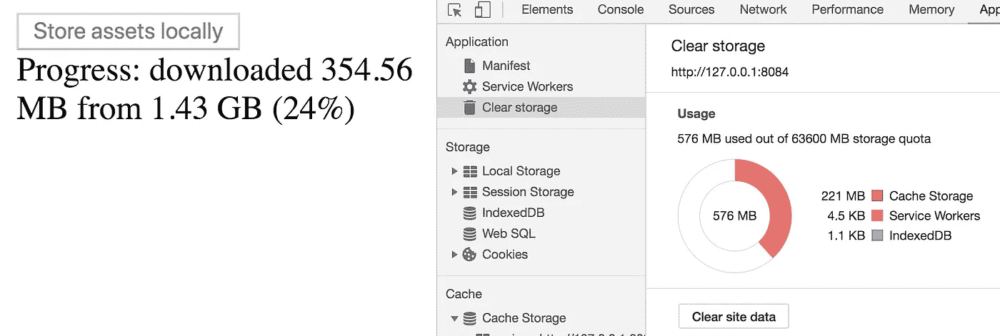
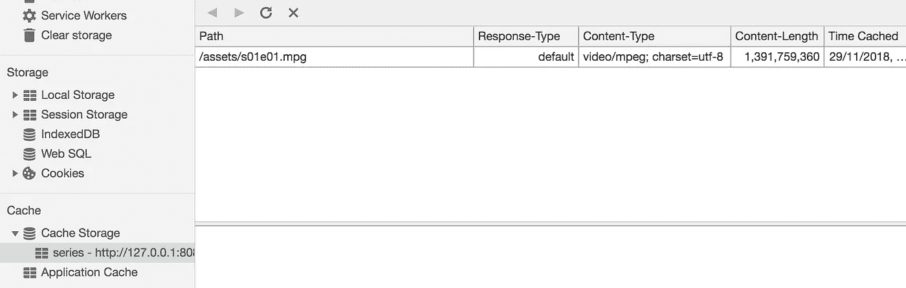

# 后台取 API:准备使用！

> 原文：<https://medium.com/google-developer-experts/background-fetch-api-get-ready-to-use-it-69cca522cd8f?source=collection_archive---------1----------------------->

在过去的 12 个月里，在我的 PWA 幻灯片中，有一部分是关于后台获取 API 的解释。它在我的“高级服务人员”会议的“即将推出的功能”一章中，我只介绍了基本概念，幻灯片上有一些代码。我在 HolyJS 会议上演讲的前一天晚上，我决定在 ChromeStatus.com T2 和 Chrome Canary 查看这个有前途的 API 的状态(我喜欢在我的会议期间报告所有最新的状态),并且……那天晚上我睡得不多——我发现 T4 最新的 API 规范几乎处于工作状态，并花了几个小时进行实验。这篇文章是关于服务人员后台获取的想法，以及如何开始使用它。

> 声明:后台取 API 还是很实验的。它只有粗略的规范建议和 Chrome Canary (M72)中的部分工作实现，并启用了实验性 Web 平台特性标志。所有的概念/接口/方法/事件在未来都可能改变。

# 什么是后台获取？

如果我们从“填补 web 和本地应用程序功能之间的差距”的角度来看待渐进式 Web 应用程序的概念，这个 API 带来了可管理和可预测的大型资产(确切地说是资产集)的下载和上传:文件、资源，应有尽有。大到足以开始担心可能的网络中断和/或脚本超时。例如，在本地存储音乐流媒体服务的 MP3 文件，或播客剧集，甚至可能是一些视频，或大型 PDF 文件。

*   你可能会说，我们在没有任何服务人员的情况下做了很多年——只需点击文件的链接，浏览器就会完成剩下的工作:可以暂停、取消和恢复下载。你是对的，但是你把这个资源下载到了*操作系统的*上下文(文件系统)，而不是你的 web 应用程序。我们使用后台获取 API 从网络上获得的一切都可以存储在相应应用程序的上下文中，供以后使用，没有任何额外的麻烦。
*   现在你说我们只要使用服务工作者的 *fetch* 事件就可以达到同样的效果。是的，我们可以下载一些文件，并将其放入 app origin 的缓存存储中(这是我们通常为 app shell 架构和运行时 API 端点缓存所做的)。这里的区别还是在于该资源的大小——在下载过程中，浏览器是否有可能因为超时而杀死服务人员。此外，从 UX 的角度来看，通知用户下载的事实和进度是有意义的。

后台获取是为了以对开发者和用户友好的方式解决大型资产下载/上传问题。让我们看看 WICG(网络孵化器社区团体) [repo](https://github.com/WICG/background-fetch) 上列出的这个 API 的特性，扮演规范提案的角色:

> -允许获取(请求和响应)继续，即使用户关闭了到源的所有窗口和工作线程。
> 
> -根据应用程序的定义，允许单个作业涉及多个请求。
> 
> -允许浏览器/操作系统显示用户界面以指示该作业的进度，并允许用户暂停/中止。
> 
> -允许浏览器/操作系统通过暂停/恢复下载来处理不良连接。
> 
> -允许应用程序对作业的成功/失败做出反应，也许是通过缓存结果。
> 
> -允许在后台获取资源时访问它们。

简而言之:在我们注册了一个后台获取并通过这个事实启动了传输之后(这可以在我们的主线程和服务工作者中完成)，我们完全被浏览器(或平台)的可能性所覆盖。在传输过程中，我们可以使用应用程序关闭选项卡—传输不会停止。我们可以关闭浏览器，浏览器重启后传输将继续。网络可能会中断，浏览器在恢复后会自动继续传输。操作的结果将被发送给服务人员(因为应用程序选项卡可能会在那时关闭)。尽管这个 API 的名字，它不是 100%的“后台”操作，因为它让用户清楚地了解正在发生的事情。

这个特性集看起来真的很有趣，让我们开始编码，看看它是如何工作的，看起来怎么样！

# 后台获取 MVP

我们从非常小的解开始，只是为了检查它是否可行。计划如下:

*   我们注册了一名服务人员
*   我们通过点击按钮在我们的主应用程序中注册一个后台获取
*   我们在服务工作器中监听后台获取事件。成功时—我们将资产放入缓存存储。失败时—我们仍会尝试将所有可能获得的数据存储到存储中

> 声明:为了专注于我们今天的主题，我们不会创建完整意义上的 PWA(既不会有 app shell 也不会有 web app manifest)，所以我们可以正式地将我们的项目称为“服务工作者驱动的网站/webapp”。

## 看到下载开始的最少代码

步骤 1 的代码如下:

在 app start 上，我们注册了一个服务人员文件`service-worker.js`。请注意，即使在这个演示中，我也使用注册的最佳实践来强调以下几点的重要性:

*   功能检测——不破坏旧浏览器中的应用程序。大多数 PWA 功能的良好方式。
*   注册推迟到`window.onload`。嗯，在我们的例子中，除了`index.html`本身，我们没有任何其他资源可以加载，但是让这个适当的注册片段提醒我们这样一个事实:服务人员**不能**改善*首次加载体验*，但是它很容易使情况变得更糟。

在“本地存储资产”(“*下载*”术语不能 100%正确地反映我们执行的操作)按钮上单击我们调用的`backgroundFetch.fetch()`活动服务工作者注册。它会注册一个后台获取，并立即启动传输。

在我们的服务工作者中，除了实用程序`install`和`activate`事件(为了更简单地跟踪生命周期阶段)，我们目前只有一个有用的事件处理程序:`backgroundfetchsuccess`，在这里我们输出事件的`registration`对象。让我们看看它的实际效果吧！对于我们的例子，我使用 Mac OS 上的`http-server`静态 web 服务器从相同的源下载了 1，39 GB 的电影文件(以便有几秒钟的时间观看电影流)。*(提醒:我们必须使用 Chrome Canary M72 来测试后台获取 API)*

The command and output we have in Terminal

We download the file using Background Fetch API

是啊！有用！我们在浏览器的底部栏看到我们的文件下载(我们通常在那里看到常规下载)。那么，如果:

*   *你用 app* 关闭标签:下载会继续，你会在底部栏看到。
*   *你关闭浏览器*(点击`x`按钮):关闭确认出现。如果我们确认—下载仍将继续，现在状态显示在浏览器图标上:

Chrome is downloading the asset without the window open

*   *您从内存中卸载浏览器*(通过从右键菜单中选择`Quit`):下载将停止，但会在您再次启动浏览器后继续。

厉害！我们有一个下载机制，它在应用程序状态和浏览器重启时都是持久的。我们甚至可以暂停/取消传输:

Using standard browser download UI to manage background fetches

只有一个问题:我们将此资产下载到…任何地方！因为这取决于我们——我们希望如何处理收到的这些字节。是时候实施了！

## 将接收的数据存储在高速缓冲存储器中的代码

我们现在以简化的形式从[后台获取 API 提议报告](https://github.com/WICG/background-fetch)中获取样本代码。同时，在我们的主应用程序中，让我们将第二个要下载的资产添加到后台获取的相同注册中——根据规范，这是可能的。

让我们把它分成几个步骤:

*   *index.html*中的按钮点击:我们注册了一个 ID 为`my-fetch`的后台获取和一个包含两个文件的数组作为目标。我们可以在那里传递 URL 数组(这就是我们所做的)或`Request`(对*上传*用例有用)。就在浏览器开始执行这个请求之后(*下载*)。
*   *在 service-worker.js 中下载就绪*:服务人员获得`backgroundfetchsuccess`事件，其中我们:

1.  打开(或创建)名为 equals background fetch `registration.id`的缓存。缓存名称实际上可以是任何字符串。
2.  使用`registration.matchAll()`获取后台获取的所有记录。我们在后台获取注册期间列出的每个记录= URL/请求。
3.  通过遍历记录来构建承诺数组，等待记录的`responseReady`被解析，并尝试将该记录的响应放入缓存中。
4.  履行承诺

结果是:

Downloading two large files

我们可以看到下载是如何开始的,“使用”图表是如何更新的。在下载期间，我们将数据放在“其他”类别中，然后(在`cache.put()`)将数据移动到缓存中。如果我们打开“缓存存储”部分，我们会在那里找到这两个大文件(1，39 GB 和 140 MB)—现在我们可以拦截对它们的请求，并从缓存中为它们提供服务！

还有一件事。根据规范，浏览器应该显示“下载多个文件”确认对话框，如下所示:

Native confirmation dialogue

有时它会出现，但大多数时候它并不存在。我试图改变来源，重置缓存，在后台使用不同的资产获取注册，但仍然无法重现这个窗口的持续弹出。很可能是当前 Chrome 金丝雀版本的错误。无论如何，我可以解释它是如何工作的:如果你点击“阻止”,你改变这个原点的“自动下载”设置，你会在地址栏看到相应的图标:

这就是为什么我们在后台获取注册的`catch`块中使用了`alert()`来解释如何解决这个问题。最有可能的错误原因正是这个设置。

最后一个与代码相关的注释。如果后台获取注册成功，我们为什么要禁用“在本地存储资产”按钮？为了避免另一个可能的错误:用同一个 id 重复注册。如果第一个注册是活动的(执行网络传输)，则具有相同 ID *的第二个注册将被拒绝*。传输完成后，相应的后台获取注册将被删除，如果我们希望执行与刚刚完成的操作完全相同的操作，我们可以启用按钮(此时未实现)。

一些观察结果:

*   这个转移既不出现在 *DevTools - >网络*标签中，也不出现在 Chrome 金丝雀的*下载*部分。从这个意义上说，这是 100%真实的后台获取。
*   在 *DevTools - > Network* 选项卡中打开“离线”复选框不会影响传输。
*   从内存中卸载浏览器后继续下载会很奇怪。传输再次开始，但每次状态改变后流程停止:下载第一个文件后，您必须重启浏览器开始下载第二个文件。下载完第二个文件后，你必须重启浏览器来调用`backgroundfetchsuccess`事件。我希望这将在发布版本中得到解决。

所以*几乎*一切都很好，但看起来不是很用户友好:准确地说，不是很有信息量。让我们利用这种可能性来提供一些关于资产的元信息，并跟踪进度。

## 组织一个更好的 UX

让我们用关于我们想要注册的资产集的元信息将 JSON 具体化，并为我们的主应用程序和服务人员添加一些额外的特性:

新增内容:

*   带有一些设置的 JSON 文件(关于这个资产集的元信息)。我们`fetch`在主应用程序和服务人员中都有这些数据。在现实生活中，这可能是对您的后端 API 的调用——根据其 ID(在我们的代码中硬编码为`'series’`)获取这个特定资产集的设置。
*   *index.html*:我们现在将可选参数`options`传递给包含`title`、`icons`、`downloadTotal`的后台获取注册，这些属性几乎不言自明。此外，我们将`progress`事件监听器附加到后台获取注册，在那里我们可以访问`downloaded`属性，该属性以一定的周期变化。
*   *service-worker.js* :无论主操作成功还是失败，我们都用当前状态和我们在 JSON 设置文件中指定的后台获取的*标题*来更新下载指示器。当然，代替这个可选的 title 属性，我们可以为主应用程序和服务工作者消息使用后台获取注册 ID，但是这个 ID 不是用于 UI 的(例如，它可以是一个长的自动生成的唯一散列字符串)，所以提供人类友好的标题是一个非常好的主意。

现在我们完全控制了文本和用户通知。一些注意事项:

*   我无法显示自定义图标。也许这个特性还没有实现，或者我使用了错误的对象格式。
*   我们在后台获取注册时传递的`downloadTotal`属性是整个集合的总字节数。也是可选的。如果通过，它就像一个守卫——如果资源的总大小更大，我们将在服务工作器中得到`backgroundfetcherror`事件。此外，如果需要，它也是我们 UI 显示正确下载百分比的好帮手。不幸的是，还有另一个错误:至少在 Mac OS 上，这个数字不能大于 2147483647 (2 GB)，这是文件系统中一个文件的最大大小，但它应该是整个*集*的最大总大小。关于这一点，我将向 Chromium bug Tracker[提交一个 Bug。同时，如果总的集合大小没有超过 2GB(就像我们的例子)，我们的计算是正确的。](https://bugs.chromium.org/p/chromium/issues/list?q=component:Blink%3EBackgroundFetch)

现在，让我们为服务人员添加一些更有用的处理程序，并尝试一些非标准情况来调用一些错误。

## 处理错误

到目前为止，我们只看到了最好的情况，即一切都按计划进行，但在处理网络连接时，情况并非总是如此。让我们为服务人员添加更多的处理程序，为各种可能的错误做好准备。同样，我们将使用来自[后台获取 API 提议报告](https://github.com/WICG/background-fetch)的代码作为基础。

我们期望什么:

*   *任何类型的失败* —让我们尝试至少将我们已经下载的内容保存到缓存中(并让我们继续处理下一个资产，如果有的话)
*   *如果用户中止传输* —我们不会存储可能下载的内容
*   *与错误无关 bu 有用的处理程序* —如果用户点击此传输信息栏，我们只需打开新选项卡，其中包含我们在 JSON 文件中指定的 URL 和资产设置

演示时间！让我们为集合中的一个资产指定错误的 URL:`assets/s01e01.avi`(不是。mpg):

后台获取以`backgroundfetchfail`事件结束，其中`registration.failureReason`等于“*不良状态*”。重要的是，尽管某个特定资产出现错误，我们仍可以继续处理下一个资产，并且可以缓存我们之前所有的成功响应。

我的另一个尝试调用不同类型的错误:

*   从其他来源下载资产。如果 CORS 设置好了，它就能正常工作。如果没有—我们以“*获取错误*”作为`registration.failureReason`的`backgroundfetchfail`事件结束。您只能指定 HTTPS 驱动的源(或本地主机)。
*   关闭服务器，等待网络超时—“*不良状态*
*   关闭服务器并再次启动(模拟暂时停止服务)—效果不佳。它在服务器上线后恢复传输，但很快向`backgroundfetchfail`发送“*错误状态*”。此外，我们有不一致的配额使用数量:

Three different values for what has been downloaded

*   这种情况下还有两个问题。首先，第二个文件的下载甚至没有开始(尽管服务器是活动的)。第二，缓存浏览器中显示的“ *Content-Length* ”令人困惑地等于完整的文件大小，尽管我们只能下载该资产的一部分:

And value number four…

上述错误给了我们一个机会来缓存可以成功下载的内容。根据[规范提案](https://github.com/WICG/background-fetch)，与`downloadTotal`属性相关的错误的行为是不同的。让我们将它设置为等于*140015339*——我们的“小”资产( *s01e02.mpg* )的精确字节大小。传输开始后，我们收到带有“*总下载量超过*”的`backgroundfetchfail`。这是意料之中的事——*s01e 01 . mpg*大于此限制。我们没有预料到的是(但根据规范这是正确的)——在这种情况下，即使是 *s01e02.mpg* 也不会被缓存——传输操作在出现“*total-download-exceed*”错误时立即中止。我们甚至不能将适当大小的资产放入缓存。因此，如果我们从要获取的 URL 数组中删除这个“大小不正确”的文件， *s01e02.mpg* 将位于缓存中。

我们服务工作器中的最后一个处理程序——`backgroundfetchclick`——与错误处理无关。这就是当用户点击这个下载信息栏时发生的情况。在我们的例子中，我们用配置中提供的 URL 打开一个新的选项卡。

演示的完整代码(下载图像而不是大型电影文件)可从以下网址获得:

*   在 [GitHub](https://github.com/webmaxru/background-fetch) 上
*   关于[故障](https://background-fetch.glitch.me/)

# 结论

在我看来，后台获取 API 可能是 PWA 概念的“下一件大事”。在大型应用程序资产网络操作方面，有许多有趣的用例使 web 应用程序与本地应用程序一样强大。但是也有一些风险:

*   *浏览器厂商采用*。是的，我们都知道 PWA 中的一切都基于"*渐进增强*"的理念，我们必须以这种方式设计我们的应用，并使用特征检测积极构建我们的应用。但是我真的不想有一些特定于这个或那个供应商的 API。
*   *用户保护。*浪费网络流量消耗，废弃资源乱放存储，暴露下载网址列表破坏隐私是我主要关注的问题。规范作者和开发人员都应该非常认真地对待下载和存储大型资源的问题。

我不想以“风险”的陈述来结束这篇文章，所以让我给你一个后台获取流程自动化的模块/库/包的概念。让我们假设我们想给我们的用户在本地存储一些静态文件(MP3？)在我们的服务器上。

*   使用某种构建助手，我们生成后台获取清单(看起来像我们在演示中使用的 JSON 设置文件)。它可能是遍历文件夹的脚本。
*   在我们的应用程序 UI 中，我们现在可以生成资产列表。比如文件名+“本地存储”按钮。
*   我们在某种 API 上达成了一致——比如“单击*本地存储*按钮，我们将文件名发送到*/存储管理器*端点”。另一个要删除的端点。
*   此外，在该列表生成期间，检查缓存存储中该资产的状态是有意义的。如果它在那里，我们有“从设备中删除”按钮，而不是“存储”。
*   在我们的服务工作者中，基于我们刚刚在上面构建的后台获取清单和 API，我们为“获取”事件生成路由。现在，我们可以在应用程序发出请求后，在我们的服务人员中注册后台获取。

如果你想把它实现为一个独立的助手或者一个工具箱的插件，我会给你更多的细节。

让我们从后台获取 API 开始我们的实验吧！

# 关于我

我对 PWA 话题很感兴趣。并且一天比一天深入:)我称自己为 PWAdvocate，因为我通过提供这个主题的最新更新，通过介绍和分享开发人员友好和用户友好的方法来构建应用程序，通过回答问题来支持开发人员(作为一名开发人员)。你可以在很多会议上看到我的演讲和培训(我每年有 100+次飞行)——欢迎来和我聊聊 PWA，Web 平台，开发者社区！

此外，我欢迎 2019 年在您的会议或私人企业会议/训练营/hackaton 上发言/培训的邀请——只需在 [Twitter](https://twitter.com/webmaxru) 上给我发消息。