# 什么是反向传播？—反向传播的逐步指南

> 原文：<https://medium.com/edureka/backpropagation-bd2cf8fdde81?source=collection_archive---------0----------------------->


What is Backpropagation? — Edureka

反向传播是一种监督学习算法，用于训练多层感知器(人工神经网络)。

但是，你们中的一些人可能想知道为什么我们需要训练一个神经网络，或者训练的确切含义是什么。

# 为什么我们需要反向传播？

在设计神经网络时，一开始，我们用一些随机值或任何变量初始化权重。

很明显，我们不是超人。因此，我们选择的任何权重值都不必是正确的，也不必是最符合我们模型的。

好吧，我们在开始时选择了一些权重值，但我们的模型输出与实际输出相差甚远，即误差值非常大。

现在，你将如何减少误差？

基本上，我们需要做的是，我们需要以某种方式解释模型来改变参数(权重)，这样误差变得最小。

换句话说，我们需要训练我们的模型。

训练我们模型的一种方法叫做反向传播。考虑下图:

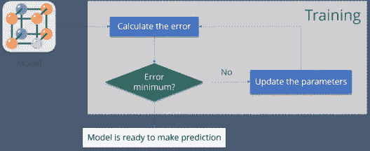

让我为您总结一下步骤:

*   **计算误差** —你的模型输出与实际输出有多远。
*   **误差最小** —检查误差是否最小化。
*   **更新参数** —如果误差很大，则更新参数(权重和偏差)。之后，再次检查错误。重复该过程，直到误差最小。
*   **模型准备好进行预测** —一旦误差变得最小，您可以向您的模型输入一些输入，它将产生输出。

我很确定，现在你知道了，为什么我们需要反向传播，或者为什么，训练一个模型的意义是什么。

现在是理解什么是反向传播的正确时机。

# 什么是反向传播？

反向传播算法使用称为 delta 规则或梯度下降的技术在权重空间中寻找误差函数的最小值。最小化误差函数的权重然后被认为是学习问题的解决方案。

让我们通过一个例子来理解它是如何工作的:

你有一个数据集，其中有标签。

考虑下表:

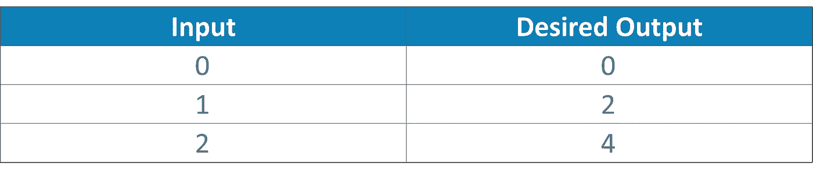

现在你的模型的输出当' W '值是 3:

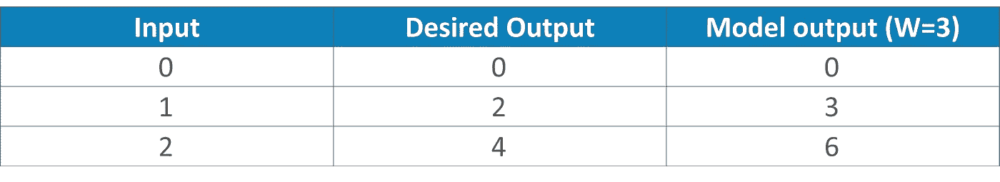

注意实际输出和期望输出之间的差异:

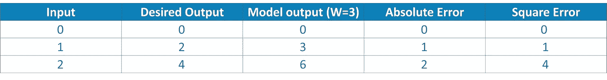

让我们改变“W”的值。请注意“W”=“4”时的错误

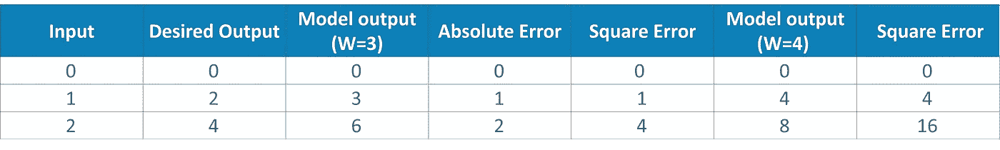

如果你注意到了，当我们增加 W 的值时，误差也增加了。因此，显然没有必要进一步增加“W”的值。但是，如果我减小 W 的值，会发生什么呢？考虑下表:

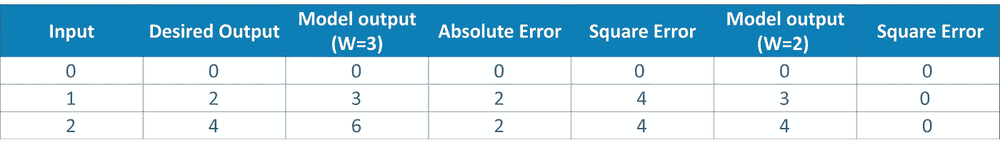

现在，我们在这里做的是:

*   我们首先将一些随机值初始化为“W ”,然后向前传播。
*   然后，我们注意到有一些错误。为了减少这种误差，我们向后传播并增加“W”的值。
*   之后，我们也注意到误差增加了。我们开始知道，我们不能增加“W”值。
*   因此，我们再次向后传播，我们降低了“W”值。
*   现在，我们注意到误差减小了。

因此，我们试图得到重量值，使误差最小。基本上，我们需要弄清楚是否需要增加或减少权重值。一旦我们知道了，我们继续在那个方向更新权重值，直到误差变得最小。您可能会达到一个点，如果您进一步更新权重，误差将会增加。这时你需要停下来，那就是你的最终重量值。

考虑下图:

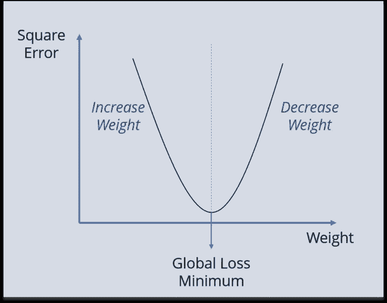

我们需要达到“全球损失最小化”。

这只不过是反向传播。

现在让我们理解反向传播背后的数学原理。

# 反向传播是如何工作的？

考虑下面的神经网络:

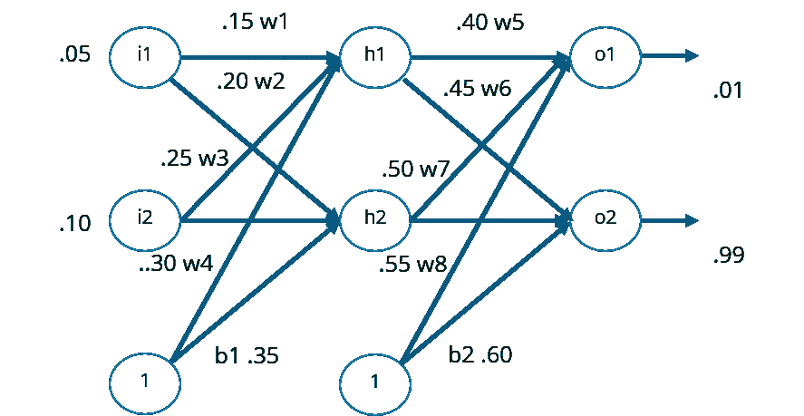

上述网络包含以下内容:

*   两个输入
*   两个隐藏的神经元
*   两个输出神经元
*   两种偏见

以下是反向传播涉及的步骤:

*   步骤 1:正向传播
*   步骤 2:反向传播
*   步骤 3:将所有值放在一起，并计算更新后的重量值

## 步骤 1:正向传播

我们将从向前传播开始。

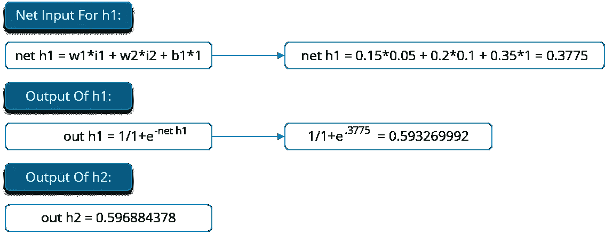

我们将使用隐藏层神经元的输出作为输入，对输出层神经元重复这一过程。

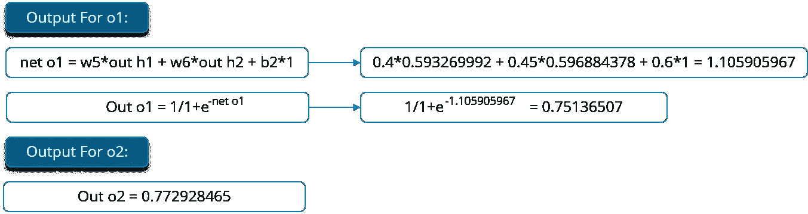

现在，让我们看看错误的值是什么:

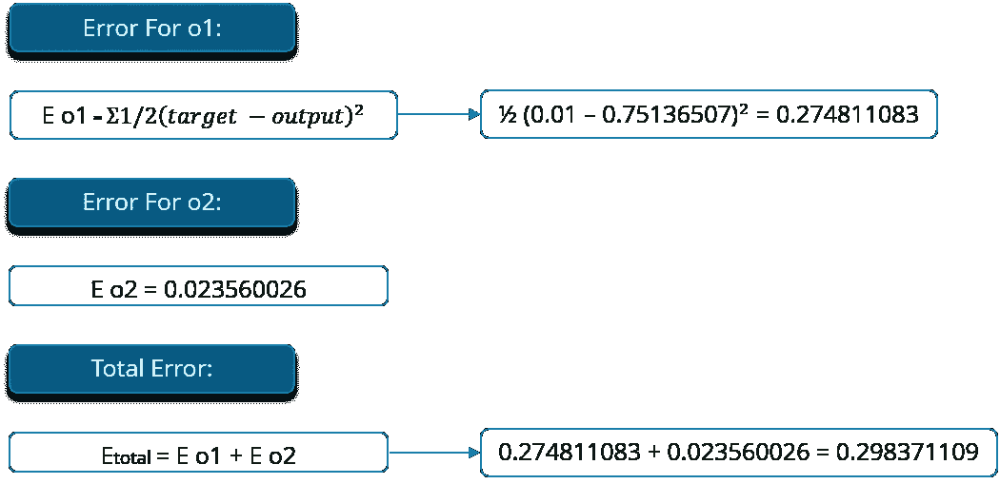

## 步骤 2:反向传播

现在，我们将向后传播。这样，我们将尝试通过改变权重和偏差的值来减少误差。

考虑 W5，我们将计算误差随重量 W5 变化的变化率。

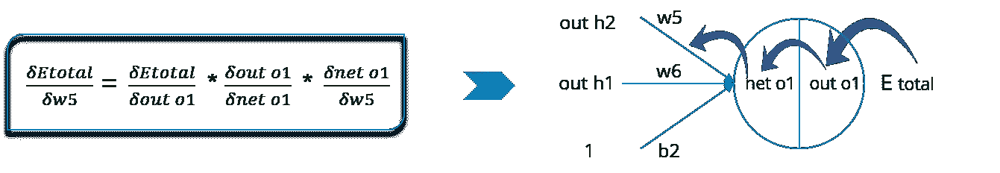

由于我们是反向传播，我们需要做的第一件事是，计算总误差相对于输出 O1 和 O2 的变化。

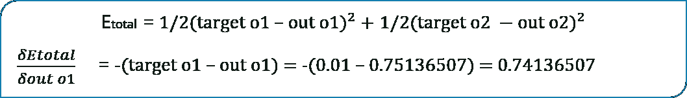

现在，我们将进一步向后传播，并计算输出 O1 w.r.t 相对于其总净输入的变化。

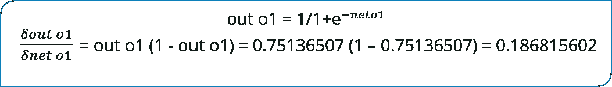

让我们看看 O1 的总净输入对 W5 的影响有多大？

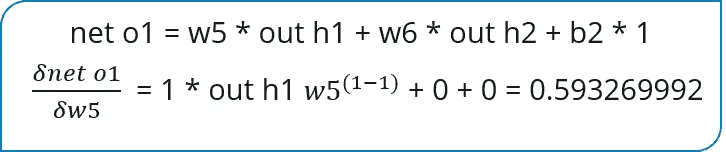

## 步骤 3:将所有值放在一起，并计算更新后的重量值

现在，让我们把所有的值放在一起:

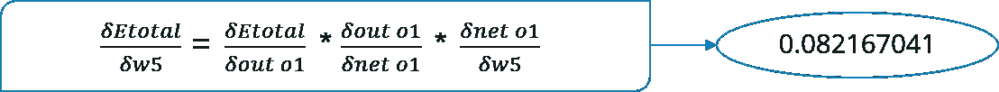

让我们来计算 W5 的更新价值:

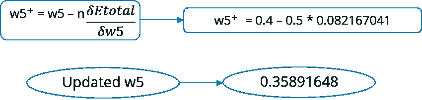

*   同样，我们也可以计算其他重量值。
*   之后，我们将再次向前传播并计算输出。同样，我们将计算误差。
*   如果误差最小，我们将在那里停止，否则我们将再次向后传播并更新权重值。
*   这个过程将不断重复，直到误差变得最小。

# 结论:

好吧，如果我不得不总结反向传播，最好的选择是写同样的伪代码。

## 反向传播算法；

```
initialize network weights (often small random values)doforEach training example named exprediction = neural-net-output(network, ex)  // forward passactual = teacher-output(ex)compute error (prediction - actual) at the output unitscompute {\displaystyle \Delta w_{h}} for all weights from hidden layer to output layer  // backward passcompute {\displaystyle \Delta w_{i}} for all weights from input layer to hidden layer   // backward pass continuedupdate network weights // input layer not modified by error estimateuntil all examples classified correctly or another stopping criterion satisfiedreturn the network
```

这就把我们带到了“反向传播”这篇文章的结尾。我希望这篇文章对你有所帮助，并增加了你的知识价值。

如果你想查看更多关于人工智能、DevOps、道德黑客等市场最热门技术的文章，你可以参考 Edureka 的官方网站。

请留意本系列中的其他文章，它们将解释深度学习的各个其他方面。

> 1. [TensorFlow 教程](/edureka/tensorflow-tutorial-ba142ae96bca)
> 
> 2. [PyTorch 教程](/edureka/pytorch-tutorial-9971d66f6893)
> 
> 3.[感知器学习算法](/edureka/perceptron-learning-algorithm-d30e8b99b156)
> 
> 4.[神经网络教程](/edureka/neural-network-tutorial-2a46b22394c9)
> 
> 5.[tensor flow 中的物体检测](/edureka/tensorflow-object-detection-tutorial-8d6942e73adc)
> 
> 6.[卷积神经网络](/edureka/convolutional-neural-network-3f2c5b9c4778)
> 
> 7.[胶囊神经网络](/edureka/capsule-networks-d7acd437c9e)
> 
> 8.[递归神经网络](/edureka/recurrent-neural-networks-df945afd7441)
> 
> 9.[自动编码器教程](/edureka/autoencoders-tutorial-cfdcebdefe37)
> 
> 10.[受限玻尔兹曼机教程](/edureka/restricted-boltzmann-machine-tutorial-991ae688c154)
> 
> 11. [PyTorch vs TensorFlow](/edureka/pytorch-vs-tensorflow-252fc6675dd7)
> 
> 12.[用 Python 进行深度学习](/edureka/deep-learning-with-python-2adbf6e9437d)
> 
> 13.[人工智能教程](/edureka/artificial-intelligence-tutorial-4257c66f5bb1)
> 
> 14.[张量流图像分类](/edureka/tensorflow-image-classification-19b63b7bfd95)
> 
> 15.[人工智能应用](/edureka/artificial-intelligence-applications-7b93b91150e3)
> 
> 16.[如何成为一名人工智能工程师？](/edureka/become-artificial-intelligence-engineer-5ac2ede99907)
> 
> 17.[问学习](/edureka/q-learning-592524c3ecfc)
> 
> 18. [Apriori 算法](/edureka/apriori-algorithm-d7cc648d4f1e)
> 
> 19.[马尔可夫链与 Python](/edureka/introduction-to-markov-chains-c6cb4bcd5723)
> 
> 20.[人工智能算法](/edureka/artificial-intelligence-algorithms-fad283a0d8e2)
> 
> 21.[机器学习的最佳笔记本电脑](/edureka/best-laptop-for-machine-learning-a4a5f8ba5b)
> 
> 22.[12 大人工智能工具](/edureka/top-artificial-intelligence-tools-36418e47bf2a)
> 
> 23.[人工智能面试问题](/edureka/artificial-intelligence-interview-questions-872d85387b19)
> 
> 24. [Theano vs TensorFlow](/edureka/theano-vs-tensorflow-15f30216b3bc)
> 
> 25.[什么是神经网络？](/edureka/what-is-a-neural-network-56ae7338b92d)
> 
> 26.[模式识别](/edureka/pattern-recognition-5e2d30ab68b9)
> 
> 27.[人工智能中的阿尔法贝塔剪枝](/edureka/alpha-beta-pruning-in-ai-b47ee5500f9a)

*原载于 2017 年 12 月 7 日*[*www.edureka.co*](https://www.edureka.co/blog/backpropagation/)*。*