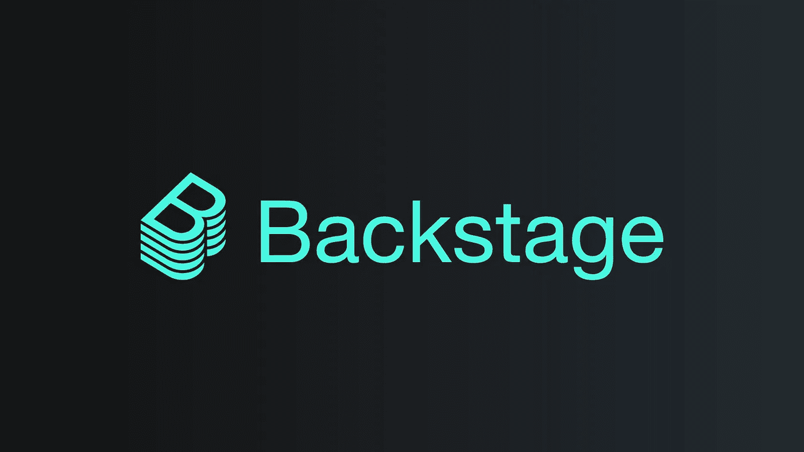
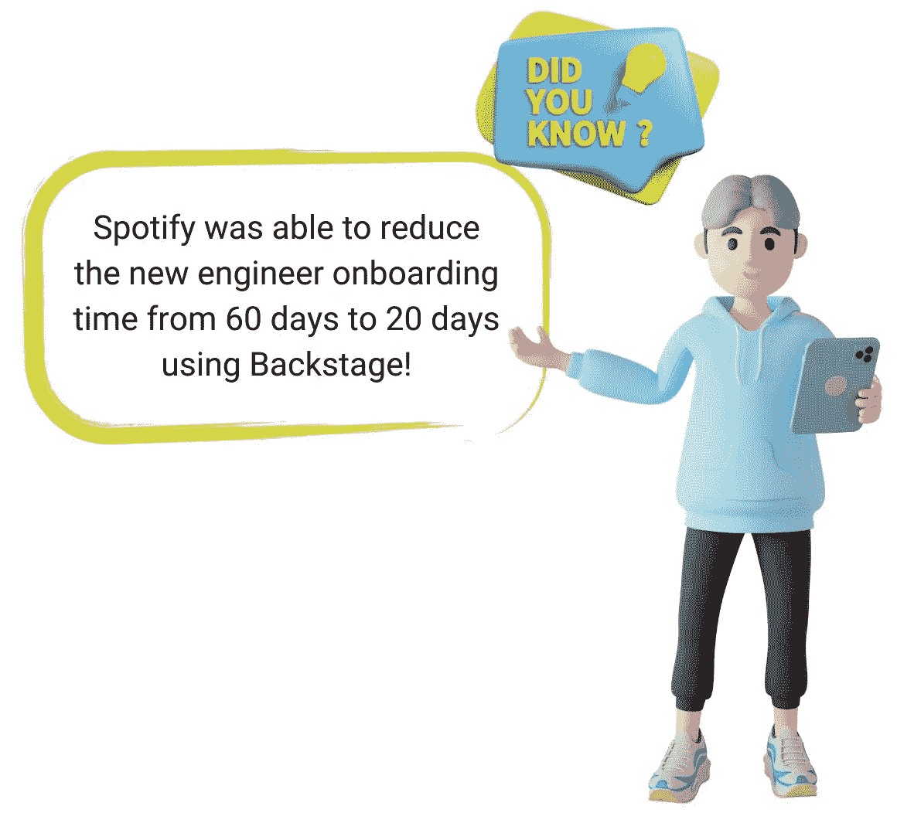
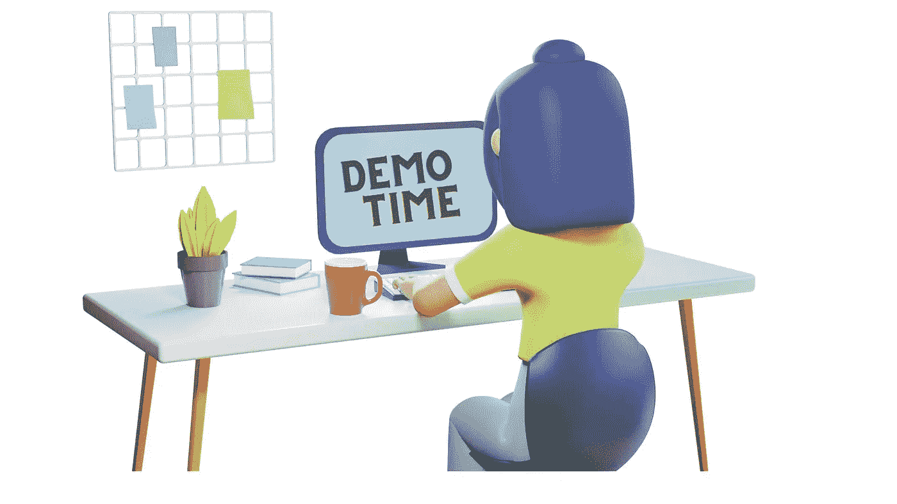

# 后台:提高您日益壮大的工程团队的工作效率

> 原文：<https://medium.com/globant/backstage-boost-productivity-for-your-growing-engineering-team-3c440822ef7f?source=collection_archive---------0----------------------->

**合著者:** [马扬克·沃拉](/@mayank.vora)
LinkedIn:[Jay deep Sheth](https://www.linkedin.com/in/jaydeepksheth/)和[马扬克·沃拉](https://www.linkedin.com/in/mayank-vora/)

今天的开发人员不仅仅是写代码。他们处理部署、安全性、合规工具管理、容器管理、故障排除、搜索可用代码和相关文档等。

> 每个开发人员在使用大量工具和软件执行各种任务时，都会承受大量的认知负荷和上下文切换。因为文档分散在多个来源，所以技术的每个任务和子任务都需要大量的学习。

**The software development ecosystem gets more chaotic as the business grows.**

**Onboarding a new member- A challenging and time-consuming affair:**

任何成长中的企业都必须引进新员工来满足各种项目的需求。由于以下原因，一个新的团队成员可能需要 3-9 个月的时间才能完全适应并独立完成任务:

*   了解现有的项目结构、开发代码以及现有的可重用服务和组件。
*   各种开发和部署流程。
*   依靠现有团队成员进行有效的知识传授和及时协助解决问题。
*   分散在整个项目中的文档。

考虑一下一个普通工程师在两年后离职对公司的影响。他们可能在很短的一段时间内只是部分生产。无疑会对公司的成长和营收产生影响。

# **开发者门户**

**开发人员效率的关键和填补入职差距的桥梁:**

创建软件产品需要软件开发人员之间的协作。由于软件和基础设施的复杂性增加，需要有效协作和合作的平台，而**开发者门户**的出现满足了这种期望。

开发人员门户使开发人员能够从一个位置理解、创建、交互、采用、监控和治理整个产品生态系统。它包括**代码、API、云基础设施、CI/CD 管道、各种工具和基本文档。**

这个门户包含关系、所有权、资源、外部服务以及理解和有效操作产品所必需的任何东西。

诸如 [**后台**](https://backstage.io/) 、 [**OpsLevel**](https://www.opslevel.com/) 和 [**Cortex**](https://www.cortex.io/) 等开发人员门户可以通过弥合入职差距和在一个地方管理各种软件和文档来帮助企业克服上述挑战。

从这篇文章中，我们将通过**演示视频、常见问题以及我们自己的经验和发展历程来了解更多关于 [**后台**](https://backstage.io/) 的信息。**

# **后台:搭建开发者门户的开放平台**

Backstage 是一个集中的软件目录，它通过将基础设施工具、服务和文档整合到一个仪表板中来简化开发过程。Backstage 帮助开发人员无需跳转到不同的屏幕就能发现事物。

**由 spotify 开发**供内部使用**于 2020 年开源**帮助其他公司更有效地管理软件。它被捐赠给了 CNCF 的 [**号，以便在全球捐助者社区的帮助下维护它。**](https://www.cncf.io/)

Backstage 的出现是因为需要有效地搭载工程师，并为开发人员提供日常任务的效率。

**Check out the** [**Spotify story**](https://backstage.spotify.com/blog/measuring-backstage-success-at-spotify/) **where they could reduce onboarding time for new members.**

同样，像**网飞**、**美国航空公司、DoorDash、Unity 和 HBOMAX 等公司**已经看到了采用后台的巨大价值。

**Backstage 为开发者提供以下核心解决方案:**

1.  **软件目录**用于跟踪所有软件(微服务、库、数据管道、网站、ML 模型等)。)
2.  **软件模板**用于快速启动新项目，并使用组织的最佳实践标准化工具。
3.  **技术文档**使用“类似于代码的文档”方法，使创建、维护、查找和使用技术文档变得简单。
4.  **插件**集成最流行的工具，如 AWS、GIT、AWS cloudformation、Datadog、Sentry、Lighthouse 和 cloud carbon footprint。

**例如，使用 Backstage 的开发人员可以执行以下操作:**

1.  发现并跟踪所有项目、**微服务**、**移动特性**或任何其他类型的**软件组件**，包括最佳实践。
2.  **通过高级搜索发现文档**。
3.  监控多个复杂的基础设施并采取适当的措施，例如触发构建、检查详细的日志等等。
4.  获取 API 和沙箱的文档，例如 **Swagger** 、 **Graphiql** 和 **GRPC** 。
5.  将现有的云提供商如 **GCP** 、 **AWS** 、 **Azure** 整合到一个地方。

**Checkout this below to understand the power of backstage with a short demo.**

# **常见问题**

**For the most common FAQs, refer to this page from the Backstage** [**site**](https://backstage.io/docs/FAQ)**. We will address a few more here…**

**1。我如何知道后台是否适合我的公司？** [**经验法则**](https://backstage.spotify.com/) :任何组织如果有 200 个以上的工程师(或者 200 个以上的微服务)，后台都可以帮忙。大型团队肯定会从采用后台中受益。

**2。既然它是管理软件的中心，那么它与现有的企业解决方案如 Atlassian Suite、Gitlab 等有何不同..？** 

这就是 Backstage 可以帮助我们弥合差距的地方，因为几乎任何软件都可以集成到 Backstage 生态系统中。

**3。后台只是只读的详细工具，还是也有交互功能？这是一个高度互动的工具，超越了技术文档。可以使用预先存在的模板，或者可以获得内置插件(如 GRPC、Swagger 和 Graphiql)的游乐场。可以触发自动化，可以运行 CI/CD 管道，可以将应用程序部署到云中，等等。**

**4。有什么可以定制的，可以和后台整合的？** 后台几乎一切都是高度可配置的；我们所要做的就是按照他们的标准将软件添加到现有的系统中。
此外，还有超过 [150 个插件](https://backstage.io/plugins)易于集成。

**5。我们可以通过后台管理多个项目的部署吗？** 是的，我们需要做的只是使用模板并配置 CI/CD 和其他所需的服务。

**6。我们如何衡量后台的采用对开发过程的影响？** 有许多深思熟虑的指标、KPI 和策略可以
参考[这里的](https://backstage.io/docs/overview/adopting)来决定后台采用的成功与否。

**7。它支持认证和授权吗？** 后台自带很多核心库中常见的认证提供者:
1。Auth0
2。天蓝色
3。比特桶
4。GitHub
5。GitLab
6。谷歌
7。谷歌 IAP
8。Okta
9。OneLogin
10。OAuth2Proxy

# **结论**

在未来的时间里，我们可以期待开发人员门户的热情采用，因为加速团队升级和提高生产力的好处是显而易见的。

由于充满活力的社区的热情努力，后台越来越好。如果你想知道后台接下来会发生什么，请点击 **查看完整路线图[**。**](https://backstage.io/docs/overview/roadmap)**