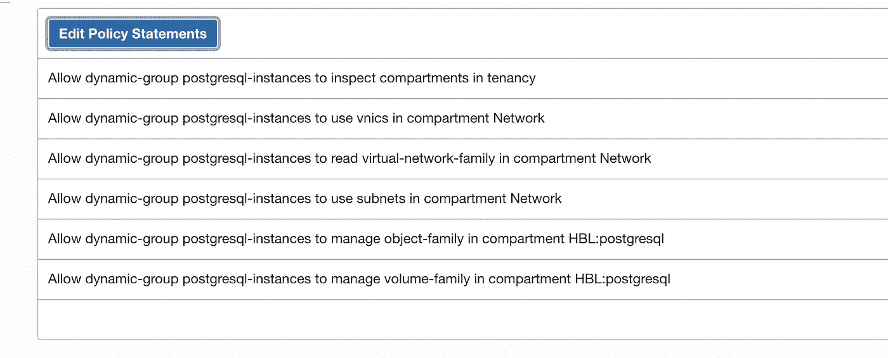

# 将 PostgreSQL 数据库备份到 Oracle 云基础架构对象存储桶

> 原文：<https://medium.com/oracledevs/backup-postgresql-database-to-oracle-cloud-infrastructure-object-storage-bucket-6314052c0661?source=collection_archive---------1----------------------->

## 第 2 篇文章— PostgreSQL 备份到 Oracle 云基础架构

这是 PostgreSQL OCI 系列的第二篇文章。在[第一篇文章](/oracledevs/migrate-postgresql-from-aws-rds-to-oracle-cloud-infrastructure-2c5fdff50135)中，我们将 PostgreSQL 数据库从 AWS RDS 迁移到 Oracle 云基础设施(OCI) IaaS 上的 PostgreSQL。在本文中，我们将把同一个 PostgreSQL 数据库备份到一个 Oracle 对象存储(OCI 操作系统)存储桶。OCI 操作系统是一个几乎无限可扩展的互联网级存储，类似于 AWS S3


## 设置

1.  在 OCI 上安装 PostgreSQL 实例。参考第一篇@ [第三步](/oracledevs/migrate-postgresql-from-aws-rds-to-oracle-cloud-infrastructure-2c5fdff50135)

使用[https://github.com/oracle-quickstart/oci-postgresql](https://github.com/oracle-quickstart/oci-postgresql)部署官方的 OCI Github quickstart PostgreSQL


2.在您的租户中创建 Oracle 对象存储桶，作为您的备份存储库


3.将 PostgreSQL 实例分配给[，使用实例主体通过 OCI](https://docs.oracle.com/en-us/iaas/Content/Identity/Tasks/callingservicesfrominstances.htm) 进行身份验证

a.创建动态组以匹配实例 OCID


b.使用动态组创建策略，以允许访问对象存储和其他 OCI 服务(如果需要)



*如果要从非 OCI 主机备份 PostgreSQL 数据库，则需要* [*安装 oci-cli 并单独配置 API 密钥。*](https://database-heartbeat.com/2021/10/05/auth-cli/)*OCI 上的实例主体避免了在机器上存储 API 密钥，因此是一种更安全的方法。*

4.在 PostgreSQL 实例上配置 oci-cli 以使用实例主体

如果您已经使用我们的 OCI Github quickstart 代码部署了 PostgreSQL，则默认安装 oci-cli。

a.导出使用实例主体的参数

```
export OCI_RESOURCE_PRINCIPAL_VERSION=1.1
export OCI_RESOURCE_PRINCIPAL_RPT_ENDPOINT=”[https://database.ap-melbourne-1.oraclecloud.com](https://database.ap-melbourne-1.oraclecloud.com)"
```

b.通过列出存储桶来测试实例主体是否在工作

```
oci os bucket list --auth instance_principal --compartment-id ocid1.compartment.oc1..aaaa******************ua
```

c.同步 PostgreSQL 备份将在本地驻留的备份目录，并首先手动测试与 Oracle 对象存储的同步

```
oci os object sync -bn pgmaster-imported-db-backups --src-dir /home/opc/backup --dry-run --auth instance_principal
oci os object sync -bn pgmaster-imported-db-backups --src-dir /home/opc/backup --auth instance_principal
```

5.创建一个主 shell 脚本来备份 PostgreSQL，然后将备份目录同步到 Oracle 对象存储

```
#!/bin/bash
export OCI_RESOURCE_PRINCIPAL_VERSION=1.1
export OCI_RESOURCE_PRINCIPAL_RPT_ENDPOINT="[https://database.ap-melbourne-1.oraclecloud.com](https://database.ap-melbourne-1.oraclecloud.com)"
# Oracle Object Storage Vars
bucket='pgmaster-imported-db-backups'
sourcedir='/home/opc/backup' #The directory is same as local backupdir
# Local PostgreSQL Backup Vars
hostname=`hostname`
date=`date +"%Y%m%d_%H%M%N"`
backupdir='/home/opc/backup' #The directory is same as local sourcedir
dbname='demo'
filename="$backupdir/${hostname}_${dbname}_${date}"
# Backup DBs
 pg_dump -U postgres --encoding utf8 -F c -f $filename.dump $dbname
 echo "Starting Upload to Oracle Object Storage"
 sleep 5
# Upload to Oracle Object Storage
 oci os object sync -bn $bucket --src-dir $sourcedir --auth instance_principalexit 0
```

现在，您可以检查您的 OCI 存储桶，您会看到备份转储文件出现在那里。


6.最后，在 Crontab 中按满足您的 RPO(恢复点目标)的时间间隔安排备份脚本

```
crontab -e16 14 * * * /home/opc/Backup_Pgsql_to_OCI.sh
```

## 结论

我们可以看到为 PostgreSQL 到 OCI 对象存储桶创建完整的数据库备份是多么容易。在生产数据库场景中，您可能需要使用一个足够大的本地挂载点来获取本地数据库备份，然后将其上传到对象存储并从本地存储中清除。

使用 oci-cli 进行同步的一个优点是，任何大于 128MB 的文件都会使用多部分上传自动上传，因此如果上传失败，您可以继续备份。

页（page 的缩写）s:如果您想备份实例上的所有数据库，那么您可以在 shell 脚本中使用 *pg_dumpall* 而不是 *pg_dump* 。疯狂上剧本！:)

## 下一步是什么？

在本系列的后续文章中，我们将探讨如何使用 OCI 本地跨区域复制，结合启动和块卷复制将 PostgreSQL 复制到另一个区域。

## 进一步阅读

[1 —](/oracledevs/migrate-postgresql-from-aws-rds-to-oracle-cloud-infrastructure-2c5fdff50135) 将 PostgreSQL 从 AWS RDS 迁移到 OCI PostgreSQL