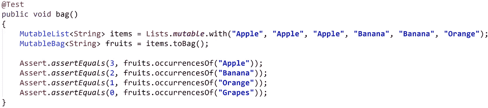
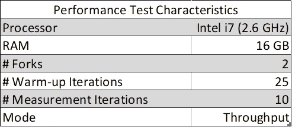

# 包——柜台

> 原文：<https://medium.com/oracledevs/bag-the-counter-2689e901aadb?source=collection_archive---------0----------------------->

[https://www.eclipse.org/collections/](https://www.eclipse.org/collections/)

我经常遇到计算物体数量的需要。我经历了两种方式计数的必要性，第一种是计数满足某一标准的对象的数量，第二种是找到某一特定对象被遇到的次数。在这篇博客中，我们将看到如何解决第二个问题:找到一个特定对象被遇到的次数。

**包(或多件套):**

Bag 是一种数据结构，当您通过输入一个`Map<K, Integer>`来计数对象时会用到它。包类似于您的购物袋或杂货袋，其中您可以有一个或多个事件或特定项目，没有特定的顺序。因此，包是一个像集合一样的顺序独立的数据结构，但是它允许重复。

让我们考虑一个物品清单，你想数一数清单上的每种水果的数量。你可以简单地将物品分组并计数，JDK 有`Collectors`为你做这些。代码如下所示:

Using a Map to count

“苹果”、“香蕉”和“橘子”有一个有效的计数，然而，“葡萄”不是`items`的一部分，该断言必须用于`null`。从而使这个实现不是空安全的。

现在让我们通过在这种情况下使用 Eclipse Collections 包来解决相同的问题。Eclipse Collections 提供了返回一个包的`toBag()` API。

Using a Bag to count

袋子上有`occurrencesOf()` API，它返回计数。从“Grapes”的断言可以看出,`occurrencesOf()` API 是空安全的。

除了在 [RichIterable](https://www.eclipse.org/collections/javadoc/9.2.0/org/eclipse/collections/api/RichIterable.html) 上提供的丰富 API 之外，Eclipse Collections [Bag](https://www.eclipse.org/collections/javadoc/9.2.0/org/eclipse/collections/api/bag/Bag.html) 还有更具体、更直观的 API，比如`occurrencesOf()`、`addOccurrences()`、`topOccurrences()`、`bottomOccurrences()`等等。

Eclipse 集合包实现被称为 HashBag。HashBag 由来自 Eclipse 集合本身的 ObjectIntMap <k>支持。ObjectIntMap 是一个开放的地址映射，它以 Objects 作为键，但值是原始的 int。这种实施方式使得袋子更薄。</k>

下面是 JDK 1.8 HashMap 和 Eclipse Collections 9.2.0 Bag 之间的一些内存和性能比较

**内存占用(数字越低越好)**

这显示了包括数据结构成分在内的总内存占用量。

Memory Comparison HashMap<Integer, Integer> vs Eclipse Collections HashBag<Integer>

Memory Comparison HashMap<String, Integer> vs Eclipse Collections HashBag<String>

**性能测试(数字越大越好)**

所有测量值以操作/秒为单位报告

内存测试和性能测试的源代码可以在 [GitHub](https://github.com/nikhilnanivadekar/MemoryPerformanceTest) 上获得。

**注意:** `Map<K, Integer>`被考虑用于内存和性能测试，而不是`Map<K, Long>`以便比较具有可比性，因为 Eclipse Collections 包由`ObjectIntMap<K>`支持。我已经验证了这些测试的`Map<K, Integer>`和`Map<K, Long>`的内存占用是相同的。

**总结:**

1.  与 JDK HashMap 相比，Eclipse Collections HashBag 的内存占用要少 40%。
2.  对于大小小于 40，000 个元素的 add()和查找操作，JDK HashMap 的性能优于 Eclipse Collections HashBag。
3.  对于大于 40，000 个元素的大小，JDK 散列表和 Eclipse 集合散列表具有相当的性能。
4.  当添加相同的元素 10 次时，Eclipse Collections HashBag 比 JDK HashMap 表现得更好。
5.  对于查找操作，JDK HashMap 的性能略好于 Eclipse Collections HashBag。
6.  Eclipse Collections HashBag 有 API，它有助于特定于包(计数)的操作。
7.  对于包中不存在特定对象的情况，Eclipse Collections HashBag 是空安全的。

*表示支持* [*星美上 GitHub*](https://github.com/eclipse/eclipse-collections/stargazers) *。*

**Eclipse Collections 资源:**
[Eclipse Collections](https://github.com/eclipse/eclipse-collections)自带实现 [List](https://www.eclipse.org/collections/javadoc/9.0.0/org/eclipse/collections/impl/list/mutable/FastList.html) 、 [Set](https://www.eclipse.org/collections/javadoc/9.0.0/org/eclipse/collections/impl/set/mutable/UnifiedSet.html) 和 [Map](https://www.eclipse.org/collections/javadoc/9.0.0/org/eclipse/collections/impl/map/mutable/UnifiedMap.html) 。它还有额外的数据结构，如 [Multimap](https://www.eclipse.org/collections/javadoc/9.0.0/org/eclipse/collections/api/multimap/Multimap.html) 、 [Bag](https://www.eclipse.org/collections/javadoc/9.0.0/org/eclipse/collections/api/bag/Bag.html) 和一个完整的原始集合层次结构。我们的每一个集合都有一个丰富的 API 用于通常需要的迭代模式。

1.  [网站](https://www.eclipse.org/collections/)
2.  [GitHub 上的源代码](https://github.com/eclipse/eclipse-collections)
3.  [投稿指南](https://github.com/eclipse/eclipse-collections/blob/master/CONTRIBUTING.md)
4.  [参考指南](https://github.com/eclipse/eclipse-collections/blob/master/docs/guide.md#eclipse-collections-reference-guide)