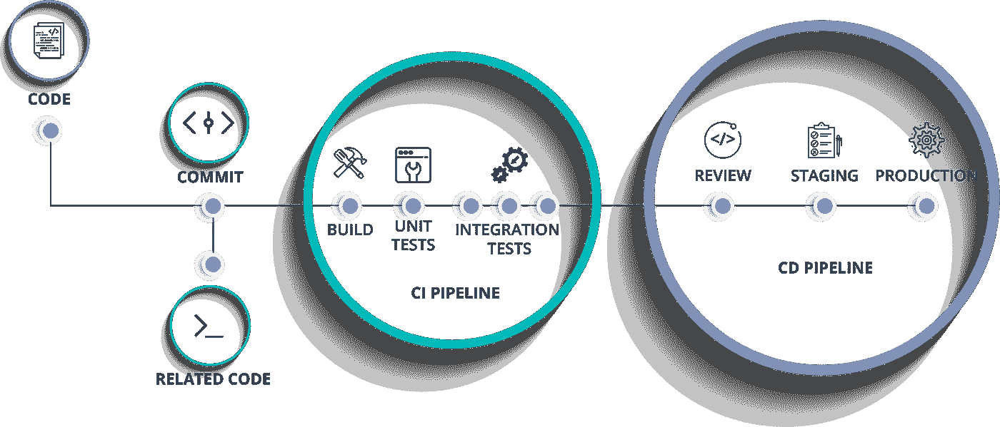

# Bagaimana Membangun CI/CD Sederhana Menggunakan Bitbucket dan Firebase Distribution App di Android

> 原文：<https://medium.easyread.co/bagaimana-membangun-ci-cd-sederhana-menggunakan-bitbucket-dan-firebase-distribution-app-di-android-8e3231be94ea?source=collection_archive---------1----------------------->

Photo by [Ankush Minda](https://unsplash.com/@an_ku_sh?utm_source=medium&utm_medium=referral) on [Unsplash](https://unsplash.com?utm_source=medium&utm_medium=referral)

*Assalaamu’alaykum Warahmatullahi Wabarakaatuh*

Halo semua.. pada kesempatan kali ini, saya akan memberikan tutorial singkat bagaimana menggunakan *tools* CI/CD untuk membantu memudahkan dan mempercepat proses *testing* , *build APK* , dan *deployment* dalam satu kali proses di android. Semua ini tentunya berawal dari masalah yang saya alami. Saat ini saya masih menggunakan cara tradisional ketika sebuah tiket telah selesai dikerjakan dan *dimerge* kedalam *branch* *develop* , lalu setelah itu melakukan *build apk* secara manual. Jika digambarkan secara visual akan seperti ini:

Proses Deliver APK Secara Tradisional

Tentunya jika cara ini dilakukan secara terus menerus tidak akan efektif dan efisien. Contoh kasus ketika seorang QA membutuhkan APK untuk melakukan pengetesan maka *developer* harus menunda terlebih dahulu pekerjaannya dan beralih kepada pekerjaan lainnya yaitu membuat APK. Untuk sya sendiri tidak mudah untuk masuk lagi pada “ *Focus Zon* e” ketika harus berpindah-pindah pekerjaan secara bersamaan. Maka dari itu saya berinisiatif menggunakan CI/CD untuk mengubah cara tradisional menjadi otomatis. Di era pengembangan aplikasi android modern dan perusahaan-perusahaan besar di Indonesia seperti Tokopedia, Traveloka, Bukalapak, dan lainnya untuk penggunaan CI/CD sendiri merupakan suatu hal keharusan karena proses yang ada didalamnya sudah sangat besar dan banyak. Bayangkan saja jika semua itu masih dilakukan secara manual.

# **Apa itu CI/CD?**

[Wikipedia](https://en.wikipedia.org/wiki/CI/CD) menjelaskan

> In software engineering, **CI/CD** or **CICD** generally refers to the combined practices of continuous integration and either continuous delivery or continuous deployment.
> 
> CI/CD bridges the gaps between development and operation activities and teams by enforcing automation in building, testing and deployment of applications. Modern day DevOps practices involve continuous development, continuous testing, continuous integration, continuous deployment and continuous monitoring of software applications throughout its development life cycle. The **CI/CD** practice or **CI/CD pipeline** forms the backbone of modern day DevOps operations.

Singkatnya, CI/CD itu merupakan dua proses yang digabung menjadi satu kesatuan yaitu *Continuous Integration* dan *Continuous Deployment* . CI/CD akan menjembatani antara sisi pengembangan dengan sisi operasi yang setidaknya ada beberapa aktifitas akan bekerja diantaranya *test* dan *deployment* untuk kebutuhan *release* . Secara *scope* pekerjaan masing-masing dapat dilihat perbedaannya melalui visualisasi dibawah ini:

Proses CI/CD Secara Umum

# Bagaimana Implementasinya?

Sebelumnya ada beberapa hal yang harus kita persiapkan diantaranya:

*   Membuat *project* di console firebase ( *jika belum memiliki* ) [disini](https://console.firebase.google.com/) .
*   Lakukan konfigurasi *plugin* dan *dependencies* firebase app distribution di gradle project dan gradle app module. Untuk caranya dapat dilihat [disini](https://firebase.google.com/docs/app-distribution/android/distribute-gradle) .

Setelah dua hal diatas selesai selanjutnya kita memerlukan token yang dibuat oleh firebase. Buka terminal dan tuliskan perintah berikut:

Setelah berhasil cek kembali terminal tersebut. Maka firebase akan memberikan sebuah link yang mana kamu harus menekan link tersebut dan akan diarahkan kepada *browser* untuk melakukan verifikasi. Apabila berhasil maka firebase akan men- *generate* token di terminal seperti ini:

Generating Firebase Token

Sebelum kita bisa menggunakan CI/CD di bitbucket perlu kita ketahui terdapat sebuah file konfigurasi berekstensi ***.yml*** yang mana didalam file tersebut berisikan script untuk mengatur alur proses *pipeline* yang akan berjalan nanti. Untuk lebih dalamnya silahkan pelajari apa dan bagaimana file tersebut dapat bekerja dengan pipeline bitbucket [disini](https://support.atlassian.com/bitbucket-cloud/docs/configure-bitbucket-pipelinesyml/) . Berikut contoh *script* yang akan digunakan pada kesempatan kali ini:

Perlu diketahui bahwa *default* nama file tersebut harus **bitbucket-pipelines.yml** agar *pipeline* CI/CD dapat bekerja sebagaimana mestinya. Pada *script* diatas terdapat 4 langkah yang akan dijalankan ketika proses berjalan yaitu:

Proses Pipeline CI/CD

Untuk menjalankan setiap proses tersebut kita akan memanfaatkan file *shell script.* Kurang lebih ada 5 file yang akan kita buat diantaranya:

**Test shell script**

Test Script

**Debug shell script**

Debug Script

**Release shell script**

Release Script

**Deploy shell script**

Deploy Script

**Licences shell script**

Licences Script

Untuk licences sendiri sifatnya opsional. Karena ketika tutorial ini dibuat penulis mendapatkan *error* di pipeline perihal lisensi android. Untuk lokasi lisensi tersebut dapat dilihat dimana SDK berada lalu masuk **folder licences = > android-sdk-licences.**

Buka file gradle app module dan lakukan konfigurasi seperti berikut ini:

Gradle App Module

Selanjutnya kita akan membuat sebuah *unit test* sederhana dengan menggunakan [Mockk](https://mockk.io/) . Buka direktori test dan buatlah sebuah file yang akan kita uji dengan contoh sebagai berikut:

Test Factory

Didalam *class* TestFactory *.* kt terdapat 3 *class* yang mana *class* Doc1 dan *class* Doc2 menjadi *dependencies* bagi *class* SystemUnderTest. Terdapat sebuah fungsi yang akan mengkalkulasi dua buah nilai. Jika sudah, maka buat sebuah file test baru dengan nama SimpleUnitTest.kt dan tuliskan barisan kode berikut:

Selanjutnya kita perlu mendaftarkan nilai-nilai seperti *STORE_PASSWORD, ALIAS_NAME, KEY_PASSWORD,* dan *FIREBASE_REFRESH_TOKEN* kedalam *environment variable* di repo bitbucket seperti berikut:

Environment Variable Bitbucket

Gunanya agar ketika proses CI/CD berjalan dapat membuat *file* APK mode *release* dan otomatis firebase akan mengirimkan *file* APK kepada tester yang sudah didaftarkan sebelumnya. Semua konfigurasi sudah selesai dilakukan. Sekarang dilakukan uji coba dengan melakukan *push* kode kedalam *branch* develop. Apabila semua konfigurasi sudah sesuai masuk kedalam menu *pipeline* dan pilih *branch* develop. Pilih proses yang sedang aktif maka tampilannya akan seperti ini:

Pipeline Memulai Proses

Jika semua *step* sudah selesai maka tampilannya akan seperti ini:

Pipeline Menyelesaikan Proses

Lalu akan ada invitasi masuk kedalam *email* dari firebase seperti berikut:

Email Invitasi Dari Firebase

Itulah sedikit tutorial bagaimana caranya kita mengimplementasikan sistem otomatis dengan CI/CD di android. Jika ada yang masih kurang paham atau ada masukan yang bagus jangan sungkan untuk melaporkan melalui kolom komentar. Semoga bermanfaat.

*Wassalaamu’alaykum Warahmatullahi Wabarakaatuh…*