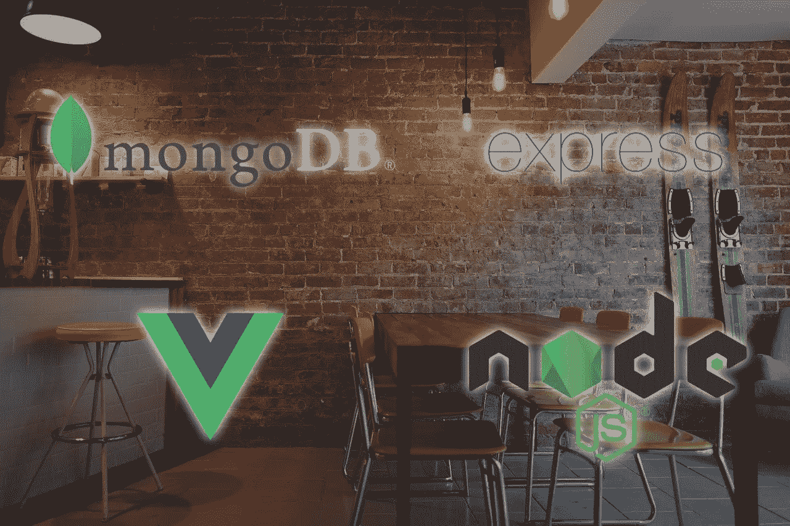
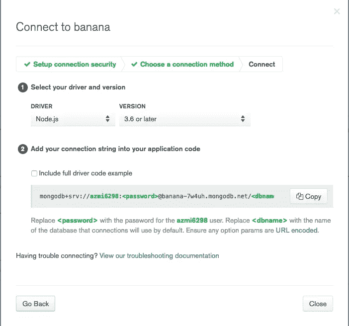

# Membangun Aplikasi Reservasi Meja dengan MEVN — Bagian Pertama

> 原文：<https://medium.easyread.co/bagaimana-saya-membangun-aplikasi-reservasi-meja-dengan-mevn-bagian-pertama-eac108f266a3?source=collection_archive---------0----------------------->

## Bagaimana saya membangun aplikasi reservasi meja dengan MEVN?



Semua berawal ketika saya sedang menonton YouTube beberapa minggu yang lalu, pada tab rekomendasi saya ada beberapa video tutorial mengenai ExpressJS dan VueJS. Saya berpikir untuk memanfaatkan waktu karantina PSBB ini menjadi momen untuk belajar hal baru, dan akhirnya saya memutuskan untuk membangun aplikasi reservasi meja.

Beberapa dari anda mungkin bertanya-tanya kenapa saya memilih untuk membangun sebuah aplikasi reservasi meja. Singkat cerita, beberapa waktu yang lalu saya sempat makan di sebuah restoran Korea, dan di sana mereka menggunakan sebuah aplikasi untuk melakukan reservasi meja dan mencatat rincian pesanan pelanggan. Sehingga saya terinspirasi untuk membuat aplikasi serupa mulai dari nol.

Untuk memulai projek ini, saya mencoba untuk menantang diri saya sendiri untuk menggunakan *tech stack* yang belum pernah saya coba sebelumnya. Saya memutuskan untuk menggunakan framework ExpressJS dan MongoDB sebagai *back-end* dari aplikasi ini, dan VueJS di *front-end* . Selain itu saya juga akan menggunakan TailwindCSS untuk *styling.* Pada bagian pertama ini, saya akan menjelaskan apa saja yang ada pada back-end aplikasi ini.

**Selamat membaca!**

Anyway, anda juga bisa langsung mengakses menuju seri berikutnya melalui daftar seri berikut ini,

# Membangun Aplikasi Reservasi Meja dengan MEVN — Daftar Seri

**1\. Membangun Aplikasi Reservasi Meja dengan MEVN — Bagian Pertama (You’re here)** [**2\. Membangun Aplikasi Reservasi Meja dengan MEVN — Bagian Kedua**](https://medium.com/easyread/membangun-aplikasi-reservasi-meja-dengan-mevn-bagian-kedua-feabd7bd7b00)[**3\. Membangun Aplikasi Reservasi Meja dengan MEVN — Bagian Ketiga**](https://medium.com/easyread/membangun-aplikasi-reservasi-meja-dengan-mevn-bagian-ketiga-12dfbd8709f5)

# Persiapan Back-end

Untuk *back-end* pada projek ini, saya menggunakan

*   **NPM** sebagai *package manager* untuk Node.js
*   **Express** ( *framework* NodeJS)
*   **Mongoose** ( *object modeling* untuk MongoDB)
*   **Nodemon** ( *monitoring script* )
*   **dotenv** (untuk file config)
*   **body-parser** (untuk *parsing* HTTP request)
*   **cors** (agar bisa mengakses API dari *front-end* secara *local* )
*   [**mLab**](https://mlab.com/) ( *hosting* *database* MongoDB)

Pertama, saya membuat folder baru bernama **table-reservation-app** dan inisialisai *package* Node.js baru dengan npm init. Selanjutnya memasang berbagai *dependencies* yang saya butuhkan.

```
**npm i express nodemon mongoose dotenv body-parser**
```

Kemudian saya mendaftar di mLab untuk membuat *database* MongoDB yang di *hosting* secara *online* ( **gratis!** ). Untuk bisa tersambung dengan *database* di mLab, saya perlu mendapatkan *connection string* seperti berikut.



Connection string yang dibutuhkan

# Implementasi Code

Di dalam root folder yang telah dibuat, saya menambahkan *script* ini pada file `**package.json**` untuk menjalankan nodemon, sehingga saya tidak perlu melakukan *restart* server berulang kali setiap ada perubahan kode.

Saya membuat file config baru dengan nama `**.env**` untuk meletakkan *connection string* dari mLab.

```
**DB_CONNECTION = my_connection_string_here**
```

Dilanjutkan dengan membuat `**app.js**` sebagai file utama untuk mengatur *dependencies, routes,* dan *database.*

Delapan baris pertama adalah untuk melakukan import *dependencies* yang saya perlukan. Dilanjutkan dengan `**app.use()**` untuk menggunakan *dependencies* yang sudah di import tadi. Untuk route API nya, saya menggunakan awalan `**/api/v1/orders/**` .

`**mongoose.connect()**` digunakan untuk melakukan koneksi ke *database* . Sedangkan `**process.env.DB_CONNECTION**` adalah file config yang sudah saya buat sebelumnya.

Pada bagian akhir, saya akan menggunakan PORT 5000 untuk terhubung dengan API yang saya buat, dan saya menjalankan `**npm start**` untuk menghidupkan *local server* .

# Model

Tahap selanjutnya adalah membuat model atau file *schema.* Saya membuat folder baru dengan nama **models** dan membuat file *schema* baru `**order.js**` Berikut ini adalah atribut yang ada di dalamnya,

*   `**code**` : untuk menyimpan kode pesanan
*   `**table_name**` : nama meja yang direservasi
*   `**employee_name**` : pegawai yang melayani reservasi
*   `**customer_name**` : pelanggan yang melakukan reservasi
*   `**menu_name**` : menu yang dipesan
*   `**quantity_ordered**` : jumlah menu yang dipesan
*   `**order_date**` : waktu reservasi

*nb: Saya tidak menambahkan atribut id karena sudah disediakan secara default*

Selanjutnya saya *export* dengan `**module.exports**` agar bisa dipakai di file *routes* nantinya.

# Routing

Setelah selesai berkutat dengan model, saya berpindah ke *routes* dengan membuat folder baru bernama **routes** dan membuat file `**order.js**` Di dalamnya saya melakukan *import* **ExpressJS** , **Express router,** dan **model Order** .

Pada bagian ini saya menggunakan berbagai fungsi yang disediakan oleh *middleware* dari Mongoose untuk melakukan operasi **CRUD ( *Create, Read, Update, Delete* )** . Di bagian akhir dari file *routes* ini juga saya tambahkan *export* agar bisa di- *import* di file utama yaitu `**app.js**`

## Create/Buat Reservasi Baru

Route untuk membuat data reservasi baru

Untuk membuat data baru, saya menggunakan fungsi `**router.post()**` untuk melakukan **POST request** menuju **home path** `**/**` Di dalam fungsi async, saya menyiapkan data **Order** yang akan dikirim nantinya.

Dilanjutkan dengan *statement try catch,* yang mana di dalam *try* saya menjalankan fungsi `**.save()**` untuk menyimpan data di database, dan di dalam *catch* saya hanya akan mengembalikan pesan error.

## Read/Ambil Semua Data

Route untuk mendapatkan semua data reservasi

Saya cukup menggunakan `**router.get()**` untuk melakukan **GET** **request** dan menjalankan fungsi `**.find()**` untuk mendapatkan semua data reservasi.

## Read / Data Spesifik

Route untuk mendapatkan data reservasi yang spesifik

Untuk mendapatkan data reservasi yang spesifik, saya menggunakan `**router.get()**` namun saya menambahkan `**orderId**` pada *path* sebagai penunjuk data yang akan dicari. Setelah itu dengan fungsi `**.findById()**` saya bisa mendapatkan data reservasi yang saya inginkan.

## Update/Ubah Data

Route untuk mengubah data reservasi

Untuk mengubah data reservasi yang ada saya menggunakan `**.patch()**` untuk menjalankan **PATCH request** dan memanggil `**.findOneAndUpdate()**` dengan mengirimkan **orderId** dan data reservasi yang baru.

## Delete/Hapus Data

Route untuk menghapus data reservasi

Terakhir adalah menghapus data reservasi dengan `**.delete()**` untuk menjalankan **DELETE request** dan `**.findOneAndRemove()**` dengan mengirimkan data **orderId** yang ingin dihapus.

***Voila!***

# Selanjutnya?

Jadi, ini adalah akhir dari bagian pertama dari seri ***Bagaimana Saya Membangun Aplikasi Reservasi Meja dengan MEVN*** *.* Di bagian berikutnya, saya ingin menceritakan bagaimana saya mengimplementasikan VueJS sebagai *front-end* ke dalam aplikasi ini.

Silakan kunjungi repository untuk projek ini pada link di bawah ini

[**Table Reservation App**](https://github.com/azmi6298/table-reservation-app)

# Referensi

*   [Mongoose Middleware](https://mongoosejs.com/docs/middleware.html)
*   [HTTP Methods](https://www.sitepoint.com/developers-rest-api/)
*   [Apa itu CRUD?](https://www.codecademy.com/articles/what-is-crud)
*   [Fungsi Async Javascript](https://www.youtube.com/watch?v=V_Kr9OSfDeU&t=301s)