# Bagan:使用 Kubernetes 对 Gradle 项目进行自动化实验

> 原文：<https://medium.com/google-developer-experts/bagan-automate-experimentations-on-gradle-projects-with-kubernetes-a9eec002419c?source=collection_archive---------4----------------------->


Bagan 是一个实验性框架，用于使用 Kubernetes 自动执行和收集 Gradle 项目的构建信息:

[](https://github.com/cdsap/Bagan) [## cdsap/Bagan

### Bagan 是一个框架，有助于自动执行，报告和收集不同类型的数据…

github.com](https://github.com/cdsap/Bagan) 

# **什么问题解决了？**

几个月前，我想比较一下 Android 项目中 [R8](https://android-developers.googleblog.com/2018/11/r8-new-code-shrinker-from-google-is.html) 和 Proguard 的影响。我开始使用 [Gradle Profiler](https://github.com/gradle/gradle-profiler) ，然后使用 [Talaiot](https://github.com/cdsap/Talaiot) 来报告数据。我的问题是我的个人笔记本电脑(8gb)上的资源有限，以及我必须等待检查结果的时间。我探索了一些典型的 CI 选项，协调了不同分支中的变化，但我最终提出了一个更灵活的定制解决方案。

另一个需要解决的问题是从 StackOverflow/Twitter 上复制粘贴典型的魔法属性来加速我们的构建。我们的配置中的决策应该由度量/数据驱动和支持，并且应该匹配不同的开发环境。

这就是 Bagan 诞生的原因，它提供:

*   依赖于 Kubernetes Engine 等环境提供的基础设施的可扩展解决方案。
*   实验的快速反馈。
*   不需要客户端在存储库中进行额外的配置。
*   可扩展到其他云解决方案。
*   支持私有存储库。

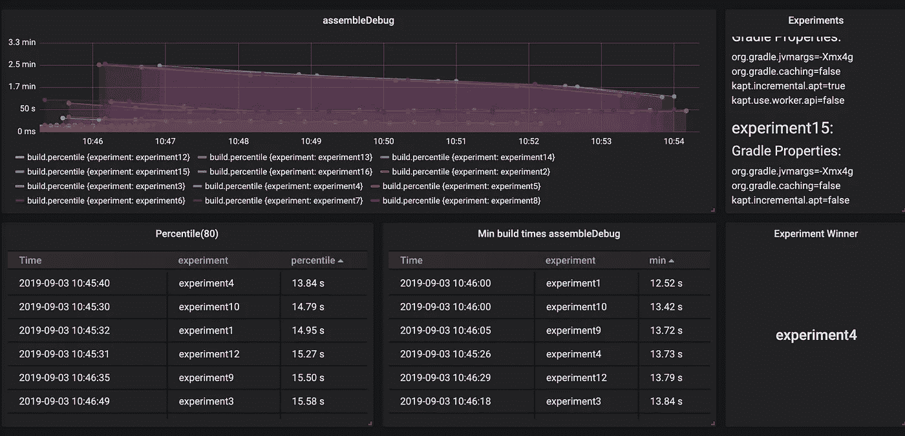

# **执行蒲甘**

一旦下载了存储库，就需要设置`bagan_conf.json`。在这里，您可以包含不同的属性，比如您想要应用的实验类型、目标存储库或者您想要在 Kubernetes 环境中使用的资源。

Bagan 通过遵循下一格式的`./bagan`命令执行:

`./bagan MODE COMMAND`

Bagan 在 Kubernetes 环境中进行实验。对于每个实验，Bagan 将创建一个 Helm 版本，它将运行应用实验的目标存储库的构建。

为了报告构建的信息，Bagan 将在项目的 Gradle 配置中注入 [Talaiot](https://github.com/cdsap/Talaiot) 并收集数据，使用 InfluxDb 作为时间序列数据库，使用 Grafana 作为仪表板可视化工具。Bagan 可以部署一个新的集群或者使用一个现有的集群来执行在主 conf 文件中定义的实验。

示例`bagan_conf.json`:

```
{
   "bagan": {
      "repository": "[https://github.com/android/plaid](https://github.com/android/plaid)",
      "gradleCommand": "./gradlew clean :assembleDebug",
      "clusterName": "bagan",
      "machine": "n2-standard-2",
      "zone": "asia-southeast1-b",
      "private": false,
      "ssh": "",
      "known_hosts": "",
      "iterations": 20,
      "experiments": {
         "properties": [
            {
               "name": "org.gradle.jvmargs",
               "options": ["-Xmx2g","-Xmx4g","-Xmx6g"]
            }
         ]
      }
   }
}
```

该配置将在已配置的存储库中为 Gradle 属性`org.gradle.jvmargs`创建三个不同的实验，其值为“-Xmx2g”、“-Xmx4g”和“-Xmx6g”。

**模式**

Bagan 使用模式来确定 Kubernetes 将用来设置配置和执行实验的环境。

当前支持的模式有:

*   gcloud:它使用了 Google Cloud 的 Kubernetes 引擎解决方案。它需要安装`[gcloud](https://cloud.google.com/sdk/)` [sdk](https://cloud.google.com/sdk/) 。`gcloud`工具将询问运行集群所选择的账户和项目 id。
*   gcloud_docker:它使用了 Kubernetes 引擎解决方案，但是`gcloud`的所有必要配置都封装在一个名为`cdsap/bagan-init`的 docker 映像中。如果您不想安装额外的 sdk，请使用此选项。
*   独立:如果您已经用一个现有的集群在本地配置了`kubectl`客户机，那么使用这个模式，独立于环境。如果你想在本地测试 Bagan(并且你有足够的机器资源)，你可以使用 [Minikube](https://github.com/kubernetes/minikube) 。

**命令**

一旦我们选择了模式，我们需要指定我们想要在 Bagan 中执行哪个命令。有两组主要的命令:

*   元命令:提供完整的 Bagan 执行的命令。它可能包含多个单一命令。
*   单个命令:代表要在 Bagan 中执行的单个动作的命令。

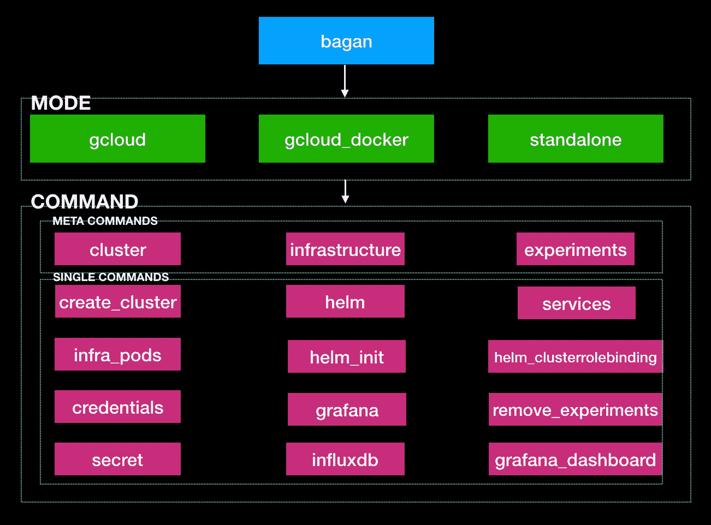

元/单个命令的示例:

*   `./bagan gcloud cluster`:用 gcloud 创建集群，在集群中创建基础设施(Grafana，InfluxDb，services)并执行实验。
*   `./bagan gcloud_docker experiment`:使用`bagan_conf.json`提供的配置执行 gcloud Docker 镜像触发的实验
*   `./bagan standalone experiment`:执行主机配置的`kubectl`中的实验。
*   `./bagan gcloud_docker remove_experiments`:使用 Gcloud Docker 删除集群中以前的实验

点击查看更多可用命令的细节。

**实验**

一个实验是一个代表目标存储库的特定状态的实体。此状态与生成系统或控制版本系统的不同配置相关。

目前，Bagan 支持三种不同类型的实验:

*   Gradle Properties:为 Gradle 属性指定不同的值。
*   Gradle 包装版本:指定包装的不同版本。
*   分支:为实验指定不同的分支。

为了包含实验，我们需要使用`bangan_conf.json`:

```
"experiments": {
        "properties": [
            {
               "name": "org.gradle.jvmargs",
               "options": ["-Xmx3g","-Xmx4g"]
            }
         ],
         "branch": [ "develop","master"]
      }
```

在执行过程中，Kotlin 类`BaganGenerator.kt`将计算配置中包含的实验类型的不同组合。对于上述示例，组合为:

*   `org.gradle.jvmargs="-Xmx3g"`并枝发展
*   `org.gradle.jvmargs="-Xmx3g"`和分局局长
*   `org.gradle.jvmargs="-Xmx4g"`并枝发展
*   `org.gradle.jvmargs="-Xmx4g"`和分公司主

稍后，在“ **Pod 实验执行”**部分，我们将详细介绍实验的内部工作方式。

**仪表板**

一旦执行完成，您可以在生成的 Grafana 实例上检查结果。

对于每次执行，Bagan 都会生成一个带有配置参数的仪表板:

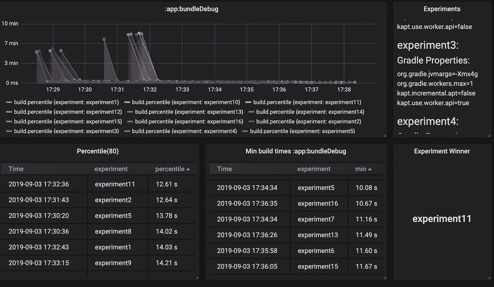

在执行实验之前，创建 Grafana 和 InfluxDb 的部署。Grafana 的发布包括一个为 InfluxDb 提供的数据源。稍后，会生成一个由`bagan_conf.json`提供配置的仪表板。仪表板包含五个面板:

*   实验命令组图表。
*   所配置命令的实验百分比(80%)。
*   实验和命令的最小构建时间。
*   实验赢家。
*   关于实验的信息。

要访问仪表板，您必须访问:

`[http://IP:3000/d/IS3q0sSWz](http://IP:3000/d/IS3q0sSWz)`

要检索 IP，您可以使用 Bagan 命令:

`./bagan gcloud grafana_dashboard`

默认情况下，用户和密码是 admin/admin。

此外，您可以在 Grafana 中创建您的面板。它遵循 Talaiot 中使用的相同方案，即主要点`build`和`task`:

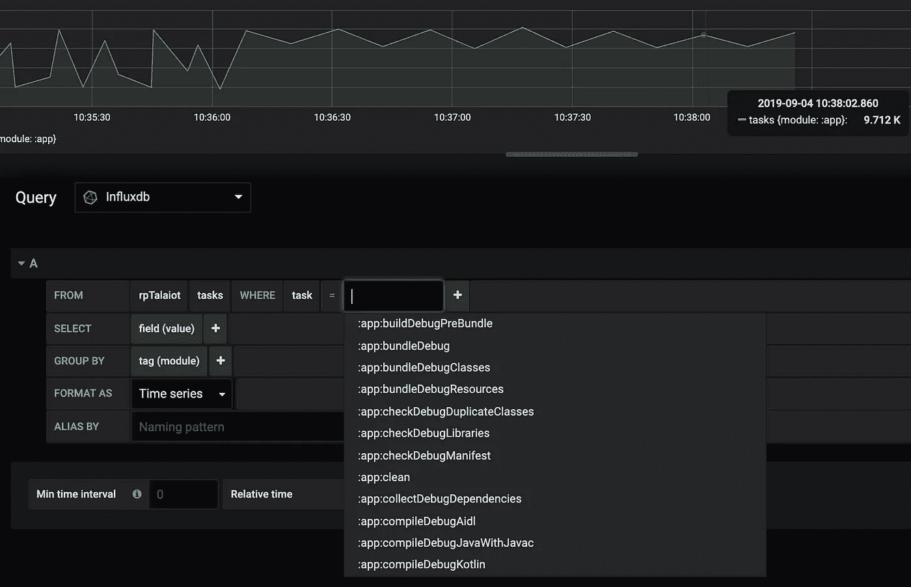

# 蒲甘内部

在本节中，我们将探讨蒲甘的一些内部概念。如果您想更深入地探索，Github 存储库包含更详细的信息。

**Kubernetes 基础设施**

独立于所选择的环境，库贝内特斯的蒲甘的一般基础设施是:

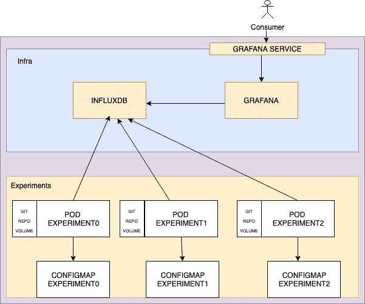

为了创建 Grafana 和 InfluxDb 的实例，我们使用 Kubernetes 包管理器 [Helm](https://github.com/helm/helm) 。Helm 也用于在 Kubernetes 创建实验。

在模式`gcloud`和`gcloud_docker`的情况下，创建额外的集群角色绑定对象供舵手/舵使用。

对于`gcloud`和`standalone`，我们可以使用`kubectl`作为命令行界面来运行针对 Kubernetes 集群的命令:

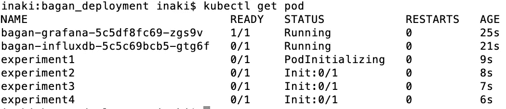

此外，我们可以使用谷歌云控制台，[https://console.cloud.google.com，](https://console.cloud.google.com/)我们有一个用户界面来管理集群:

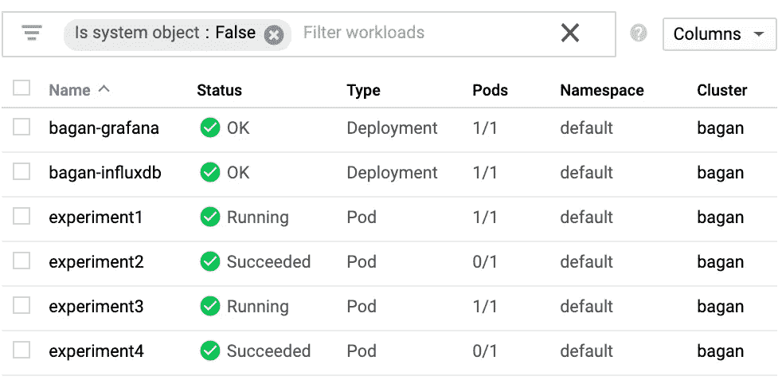

关于舵，我们可以在主机中使用舵命令:

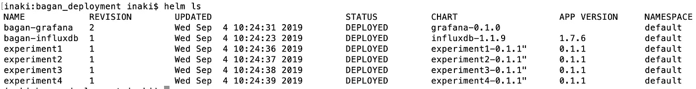

**Pod 实验执行**

之前，我们看到`BaganGenerator.kt`创建了要执行的实验。每个实验都生成一个具有以下结构的舵释放:

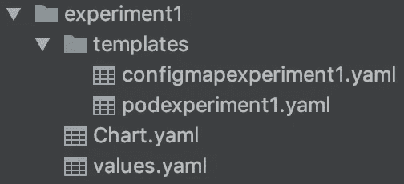

`values.yaml`包含 Bagan conf 中提供的与实验和配置相关的信息。

```
**repository**: https://github.com/android/plaid.git
**branch**: master
**configMaps**: configmapexperiment1
**pod**: experiment1
**session**: sessionId
**name**: experiment1
**image**: cdsap/bagan-pod-injector:0.1.6
**command**: ./gradlew assemble
**iterations**: 10
```

`configmapexperimentN.yaml`包含为实验计算的排列数据:

```
apiVersion: v1
kind: ConfigMap
metadata:
  name: {{ .Values.configMaps }}
  labels:
    app: bagan
    type: experiment
    session: {{ .Values.session }}
data:
  id: {{ .Values.name }}
  properties: |
               org.gradle.jvmargs=-Xmx6g
               org.gradle.workers.max=1
```

构建的执行发生在由`podexperimentN.yaml`创建的 pod 内部。pod 使用的 Docker 图像是`cdsap/bagan-pod`。

该 pod 负责:

*   获取特定卷中的目标存储库。
*   在项目中注入 Talaiot
*   应用 Gradle 属性和 Gradle 包装版本的实验，解析来自配置映射的数据。
*   执行给定 N 次迭代的构建

执行流程是:

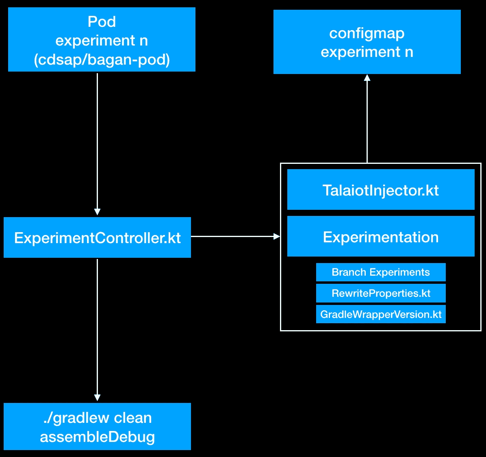

当 Pod 运行时，它将执行`ExperimentController.kt`(使用 [kscript](https://github.com/holgerbrandl/kscript) )开始在主 Gradle 配置文件(groovy/kts)中应用 Talaiot:

```
publishers {
    influxDbPublisher {
        dbName = "tracking"
        url = "http://bagan-influxdb.default:8086"
        taskMetricName = "tasks"
        buildMetricName = "build"
    }
}
```

稍后，`ExperimentController.kt`将解析配置图的数据，并将应用不同的实验。请注意，在分支实验的情况下，实验将在 Pod 中应用，而不是在配置图中应用。

在实验的执行过程中，我们可以在 Google Cloud 控制台中与实验相关的 Pod 日志中检查构建的输出:

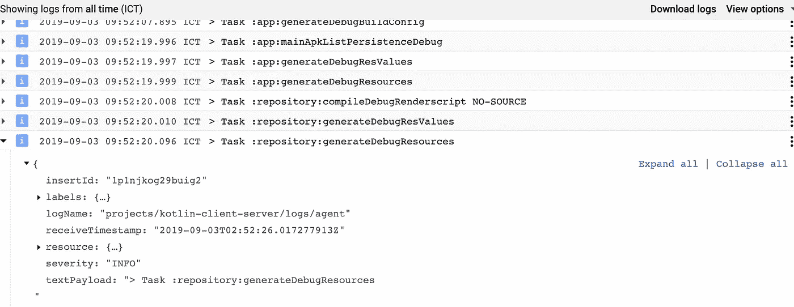

以及实验所用资源的细节:

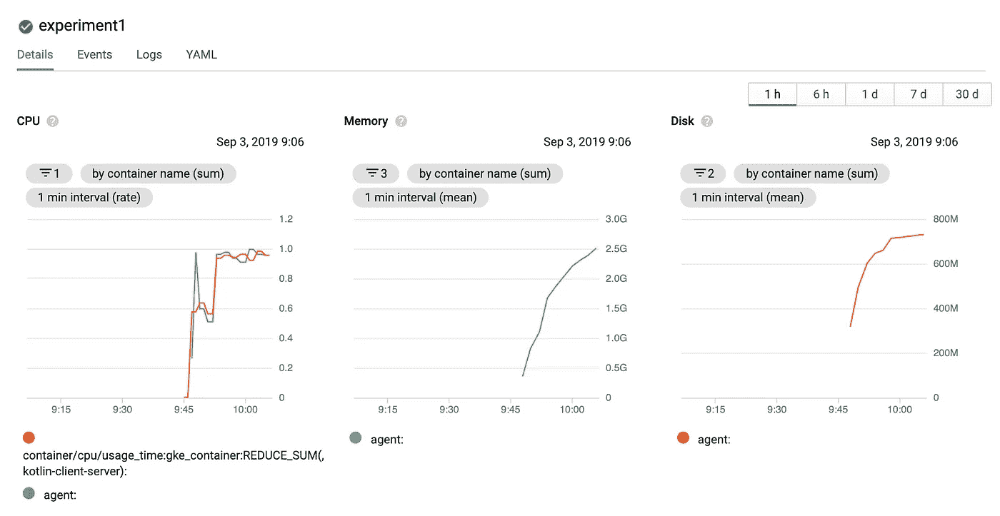

**模式要求**

`gcloud`

*   https://stedolan.github.io/jq/
*   g cloud:[https://cloud.google.com/sdk/](https://cloud.google.com/sdk/)
*   k script:[https://github.com/holgerbrandl/kscript](https://github.com/holgerbrandl/kscript)

`gcloud_docker`

*   jq:[https://stedolan.github.io/jq/](https://stedolan.github.io/jq/)
*   https://www.docker.com/

`standalone`

*   https://stedolan.github.io/jq/
*   `kubectl`用现有集群配置

**蒲甘的成本**

如果您使用 Google Cloud 作为 Kubernetes 环境，您应该考虑试验成本的影响。Android 项目在内存消耗方面非常昂贵，并且在没有足够强大的机器资源的情况下创建多个组合将导致实验失败:

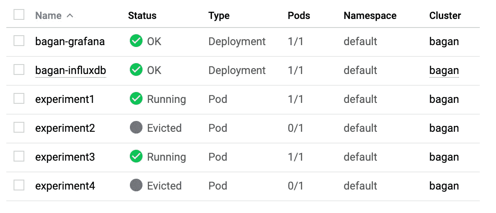

增加机器的资源将有助于实验的成功执行，但它带来了更多的资源消耗，也就是金钱。请记住，不同实验的更多排列将产生更多的豆荚。例如，这种配置:

```
"experiments": {
   "properties": [
      {
         "name": "org.gradle.jvmargs",
         "options": ["-Xmx3g","-Xmx4g"]
      },
      {
         "name": "org.gradle.caching",
         "options": ["true","false"]
      },
   ],
   "branch": [ "develop","master"],
   "gradleWrapperVersion" : ["5.5", 5.4"]
}
```

将产生 16 个实验:

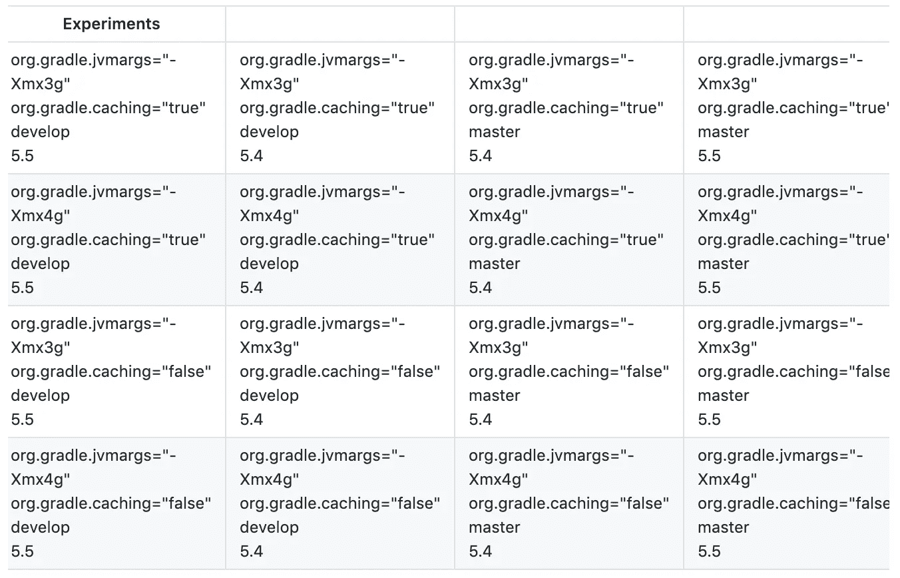

对于在蒲甘使用的机器没有限制，对于中小型项目，我们推荐 n2 系列(每小时成本):

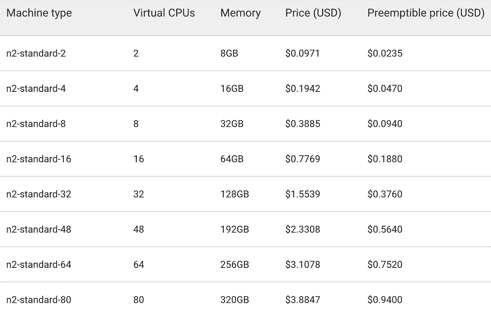

但是，你想用哪种类型的机器来做实验取决于你自己。您可以在此查看机器类型的更多详细信息:

 [## 机器类型|计算引擎文档|谷歌云

### 无论您的企业是刚刚踏上数字化转型之旅，还是已经走上数字化转型之路，谷歌云的解决方案…

cloud.google.com](https://cloud.google.com/compute/docs/machine-types) 

下一份报告描述了在 20-30 次迭代中，使用 4-16-24-16 次实验排列的`n2-standard-8`机器执行六次 Bagan:

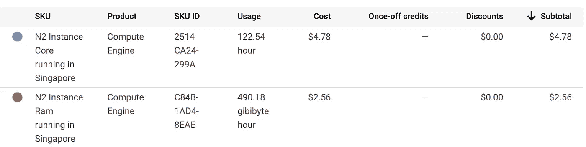

***如果您仅使用 Google Cloud 为 Bagan 创建集群，我们建议在实验和结果评估完成后删除它。***


# 例子

下面的例子只是简单的用例，展示了如何在你的项目中进行实验。

**用例 1**

一个包含三个模块的私有存储库的简单例子。

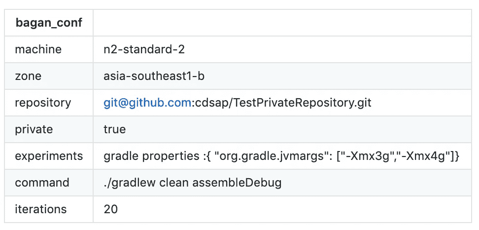

将生成两个 Gradle 属性类型的实验:

*   -Xmx3g
*   -Xmx4g

结果:

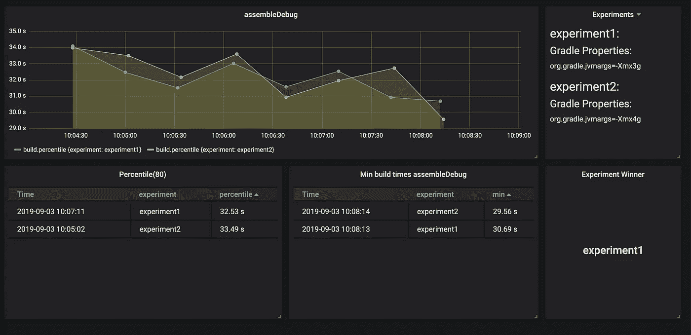

**用例 2**

尝试谷歌项目[格子](https://github.com/android/plaid)，探索 kapt 属性。

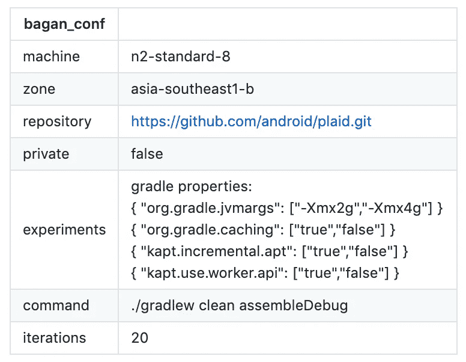

将产生 16 个实验:

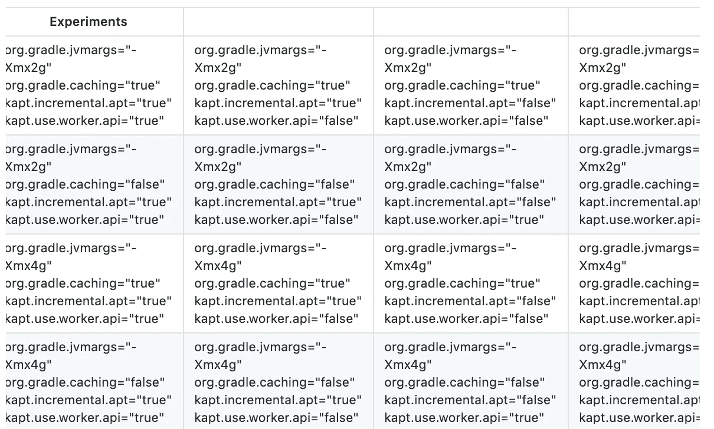

结果:

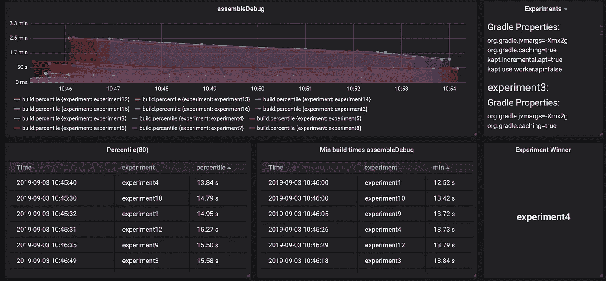

在 Plaid 项目中，我们没有意识到使用像`kapt.incremental.apt`和`kapt.use.worker.api`这样的属性的显著差异。但是，您可以注意到在 Gradle 构建中使用缓存的好处。

**用例 3**

Igor Wojda 对 Android Showcase 项目的实验🤖，具有 Gradle 属性和不同的 Gradle 包装器版本。

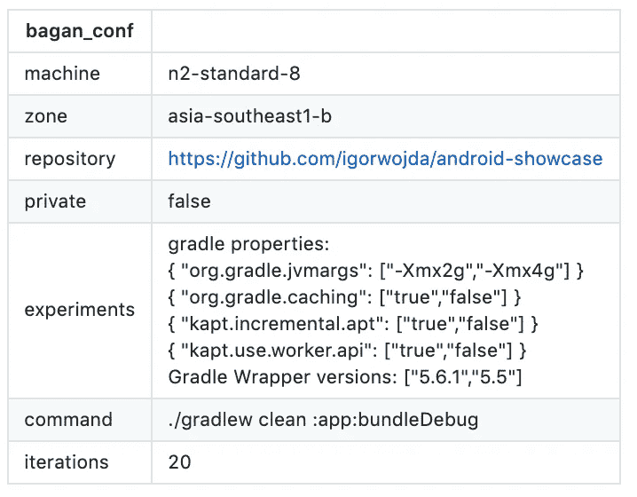

结果:

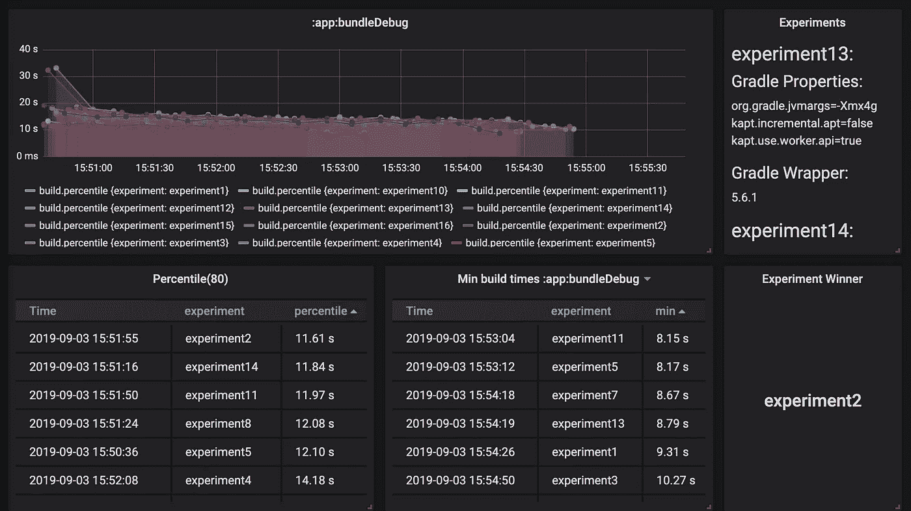

最好的时机是使用格雷尔`5.6.1`。JVM args 实验中没有显著的差异。

# 后续步骤

存储库中有更多的详细信息，比如如何部署定制映像以及 Bagan 的生命周期是如何工作的。

我们希望很快扩展 Bagan，进行更多类型的实验，如不同的 Docker 映像(java 版本控制)，应用 abi 更改，远程缓存和对多个 Gradle 命令的支持。

请继续关注，如果您愿意，您可以投稿，以下是资源库:

[](https://github.com/cdsap/Bagan) [## cdsap/Bagan

### Bagan 是一个框架，有助于自动执行，报告和收集不同类型的数据…

github.com](https://github.com/cdsap/Bagan) 

非常感谢您抽出时间。

PS:当然，如果有机会，去参观一下[蒲甘](https://en.wikipedia.org/wiki/Bagan)，最近被联合国教科文组织列入世界遗产。