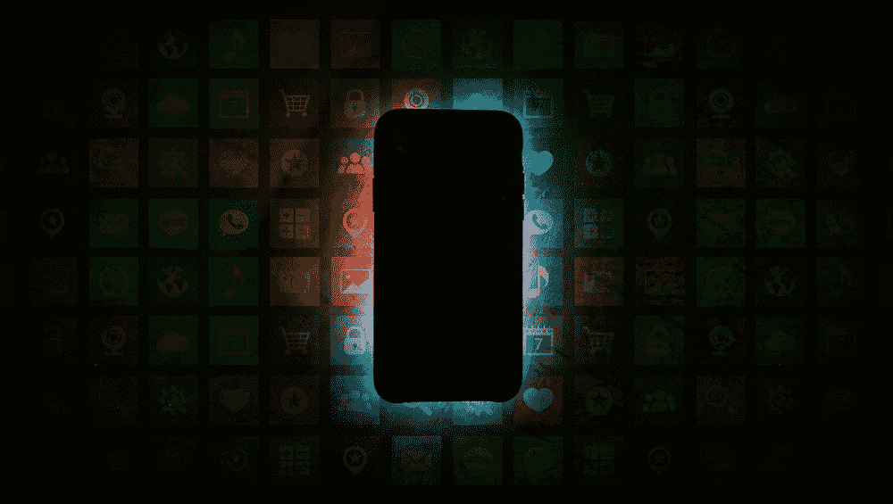
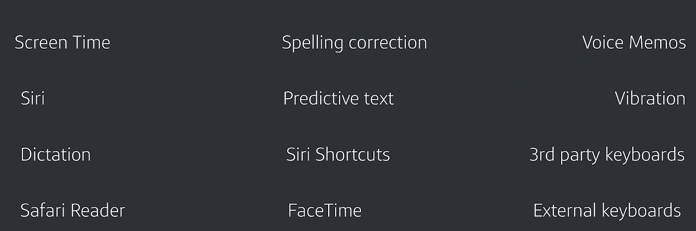
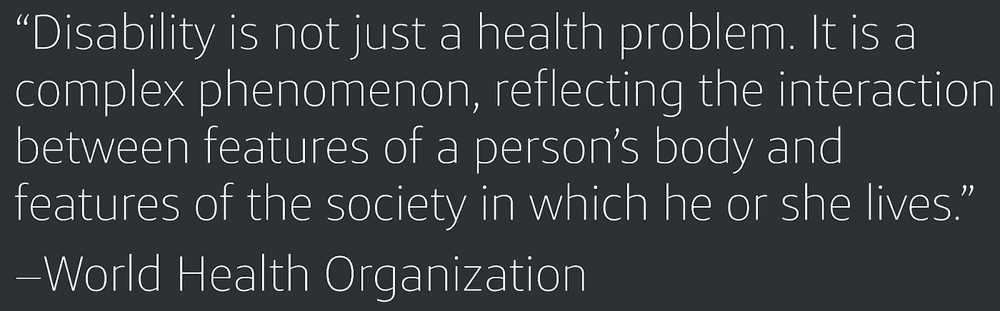
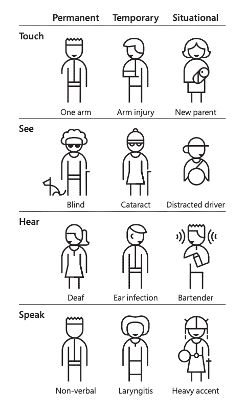
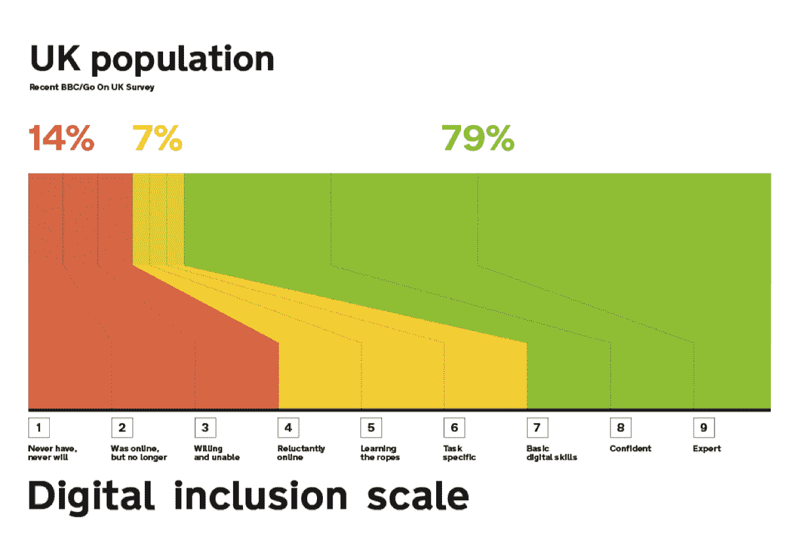

# 将数字包容性融入到您的移动应用中

> 原文：<https://medium.com/capital-one-tech/baking-digital-inclusion-accessibility-into-your-mobile-apps-f0f5d03d9f49?source=collection_archive---------3----------------------->

## *易接近性始于同理心，而你*

卓越的可访问性不仅仅是打勾，而是记住你的服务的每个用户都是一个独立的个体，对你的应用程序有他们自己复杂的需求、体验、愿望和要求。这是关于为尽可能多的人创造美好的体验。在 Capital One 的英国移动团队中，我们始终希望尽我们所能为客户提供最佳体验，并且我们尽最大努力确保我们不会基于客户的能力限制对这些体验的访问。

作为一名 iOS 工程师，我从经验中知道，有时可访问性可能只是开发移动应用程序的众多考虑因素中的一个。但是优先考虑你的应用程序的可访问性意味着考虑真实的人和技术影响他们生活的方式。毕竟，对于全球[10 亿](https://www.who.int/disabilities/infographic/en/)人来说，诸如检查对比度、运行可访问性报告工具和添加可访问性标签等行为可能意味着使用你的服务或被完全拒之门外的区别。

虽然可访问性可能是正确的事情，因为法律规定你必须这样做，或者因为它将你的业务开放给一个全新的客户群，但最重要的是，这是正确的事情，因为这对你的客户来说是公平和道德的事情。

# 可访问性对移动应用意味着什么

手机充满了我们许多人每天都在使用的功能，而不会想太多。如果没有对残疾人的需求给予适当的关注，访问这些功能可能需要用户方面的巨大努力或挫折。例如，FaceTime 是一个方便的功能，允许用户在他们离开时看到他们的亲人。试想一下，如果这个功能不存在呢？如果你身体健康，你可能会给他们打个电话，就像 150 年来人们用座机打电话一样。但是如果手语是你主要的交流方式，固定电话就没用了。

对于第一语言或主要语言是手语的人来说，FaceTime 和类似的视频聊天工具让他们使用最初设计的标准手机，通常是第一次使用。这并没有发生，因为苹果运行了一个自动化的可访问性测试工具。苹果创造了一种适合所有人的产品，通过将所有客户视为个体，创造了一些对大多数人来说是伟大的功能，对一些人来说是必不可少的。

增加移动设备可访问性的其他功能包括虚拟助手，如谷歌助手、[拼写纠正、预测文本](https://www.apple.com/accessibility/iphone/physical-and-motor-skills/)和语音转文本。所有这些特征使用更少的触摸，并且要求更低的触摸精度；非常适合看不到或摸不到按钮的人。

# 在我们的语境中，残疾意味着什么？

作为移动开发人员和工程师，考虑残疾的真正含义非常重要。我们都知道，并非所有的残疾都是可见的，但我们还应该如何定义它呢？我发现最好的说明是世界卫生组织提供的定义的变化。他们最初的定义如下:*“残疾是指以人类认为正常的方式或在正常范围内从事某项活动的任何限制或能力缺乏(由缺陷造成)。”*–世界卫生组织，1980 年。

世卫组织一直致力于创建一个更新的定义，涵盖残疾对经历残疾的人意味着什么。今天访问[世卫组织网站](https://www.who.int/topics/disabilities/en/)，你会发现这个改进的定义:

我觉得这个定义在更真实的意义上涵盖了残疾——残疾不是指某人与众不同，而是指我们作为一个社会在人们周围建立的障碍，这些障碍阻止人们做他们想做的事情。例如，如果我们建造台阶而不提供斜坡，这就是我们发现残疾的地方。在制作移动应用的过程中，我们处于一个独特的有利地位，能够改变一些社会互动，建立我们自己的数字坡道。

# 如何实现移动应用的包容性

有时候，人们很容易认为残疾是其他人遭受的痛苦。但是像生活中的其他事情一样，残疾不是二元的。残疾发生在我们创造的社会的边缘。不仅仅是那些行动不便的人挣扎着爬楼梯，或者是那些拄着拐杖的人。一个有学习困难的人可能会在文书工作中挣扎，或者一个在精神健康中挣扎的人可能会感到被僵化所困。

微软以实践包容性设计而闻名，这种方法鼓励他们的 UX 团队考虑并向具有各种观点的人学习。包容性设计认识到，每个人都有能力，这些能力是有限的，人们适应自己的能力和周围的世界。

*© Microsoft 2016 Licensed under Creative Commons AttributionNonCommercial-NoDerivatives (CC BY-NC-ND)*

微软包容性设计工具包中不可或缺的一部分是[人物角色谱](https://download.microsoft.com/download/b/0/d/b0d4bf87-09ce-4417-8f28-d60703d672ed/inclusive_toolkit_manual_final.pdf)。人物角色谱认识到残疾不是一种固定的体验——每个人的能力都会随着时间的推移而波动，是健康或生活事件的函数。因此，为患有永久性残疾(如失明)的客户解决问题意味着您将帮助其他无法观看屏幕的人，例如最近做了眼部手术的人或正在开车的人。你有没有在购物的时候拎着太多的包，并且希望你的手机在不触摸屏幕的情况下更容易使用？还是更容易单手使用？出于同样的考虑，构建体验也可以帮助那些因为运动障碍或肢体缺失而无法触摸屏幕的人。

但是在创建软件的过程中，这个过程并不一定要随着设计而结束。任何参与制作软件的人都可能拥有的最伟大的技能之一是*。不仅从生活中获取经验的能力；或者你的同事、朋友和家庭成员；但是那些来自你通常的经验范围之外的。观察和考虑这些用户如何使用或可能使用技术，并确定排斥在哪里，将为每个人带来更好的体验。*

> **“当我们用自己的偏见解决问题时，排斥就会发生”——*微软包容性设计工具包*

# *我们能从英国的基本数字技能中学到什么*

*良好的可访问性不仅仅是考虑到人们的残疾；考虑人们的能力也很重要。在英国， [10%的人最近没用过互联网，8.4%的人根本没用过](https://www.ons.gov.uk/businessindustryandtrade/itandinternetindustry/bulletins/internetusers/2018)。英国政府列出了他们认为使用互联网必不可少的五项基本数字技能。他们用从 1(从来没有也永远不会使用互联网)到 9(主要收入来自互联网)的等级来衡量这些技能。这五项技能是:*

1.  ***沟通** —与他人沟通、互动、协作、分享和联系。*
2.  ***交易** —购买和销售商品和服务，管理您的财务，使用数字政府服务。*
3.  ***解决问题** —通过使用数字工具解决问题和寻找解决方案，提高独立性和自信心。*
4.  ***创建** —创建基本的数字内容，以便参与数字社区和组织。*
5.  ***管理信息** —查找、管理和存储数字信息和内容。*

*从最基本的层面来说，拥有这些技能意味着你可以使用谷歌、脸书、亚马逊、Instagram、Dropbox，并且可以在互联网上寻求帮助。作为一名移动应用程序开发人员，你几乎肯定每天都在做这些事情，并且可能认为它们是理所当然的。然而，14%的人不会做这些任务中的任何一项，还有 7%(总计 21%)的人至少缺少一项技能。这意味着，如果你在设计你的应用时考虑到了你自己，你可能会创造出一种只适合专家的体验。*

**

*Contains public sector information licensed under the Open Government Licence v3.0.” [https://www.nationalarchives.gov.uk/doc/open-government-licence/version/3/](https://www.nationalarchives.gov.uk/doc/open-government-licence/version/3/)*

# *可访问性是软件工艺的一部分*

*制作软件是一门手艺，由创建软件的人的技能、知识、经验和情感组成。因此，作为参与创建软件的人，我们应该像其他工匠一样对我们的工作投入同样的关心和自豪。重要的是要确保你的可访问性标签是有序的，有意义的，你在文本和背景之间有高对比度，你的文本是描述性的而不是冗长的——对许多人来说，这是使用或不使用你的应用程序的区别。让自己了解平台上可用的可访问性特性和 API 是非常好的。但是你能产生的最大影响是在你的软件设计中加入同情心和同理心，不管你的角色或级别如何，你都可以这样做。*

**披露声明:2019 首创一。观点是作者个人的观点。除非本帖中另有说明，否则 Capital One 不隶属于所提及的任何公司，也不被这些公司认可。使用或展示的所有商标和其他知识产权是其各自所有者的财产。**