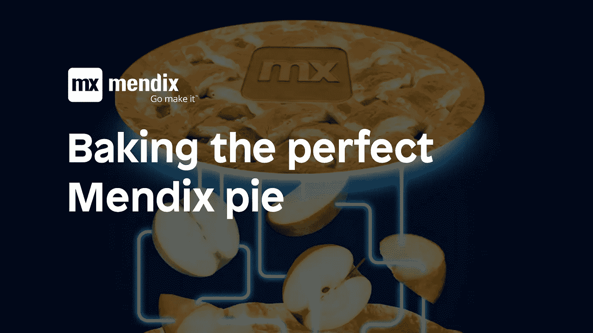
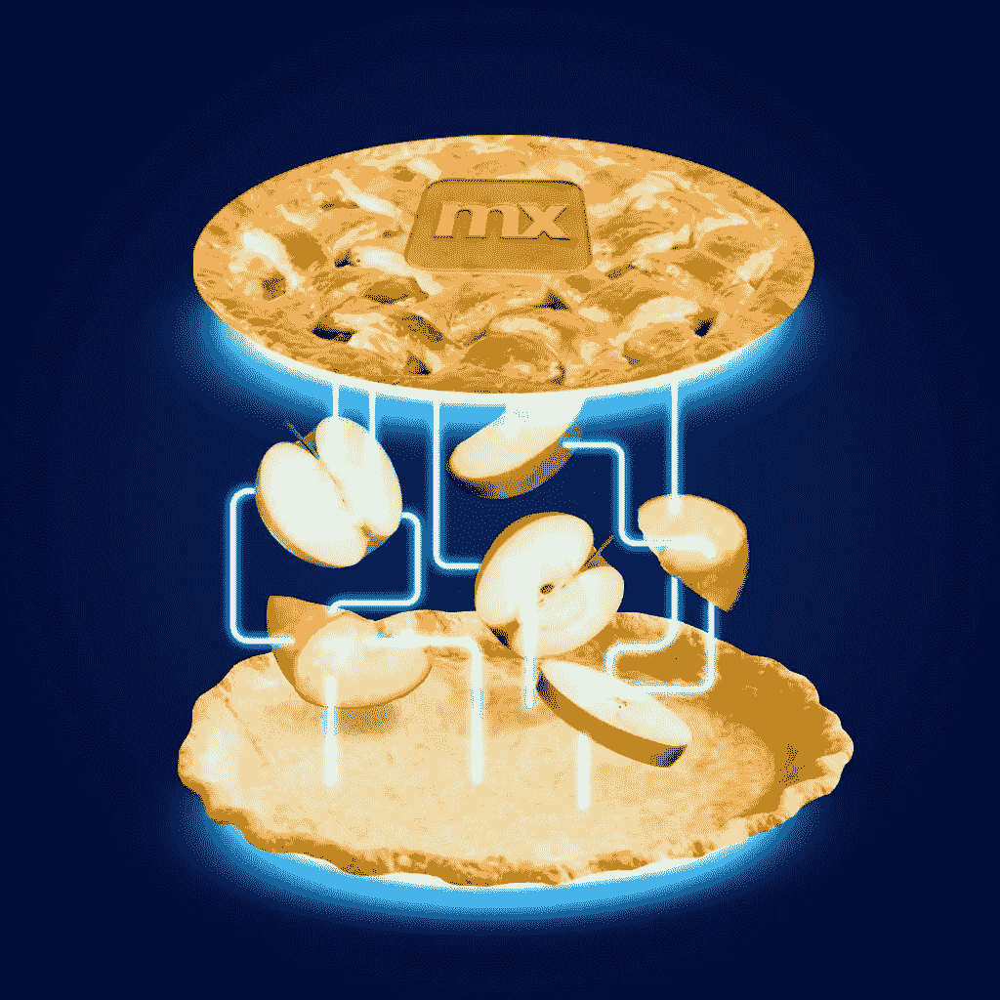
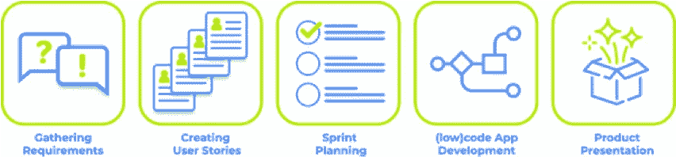
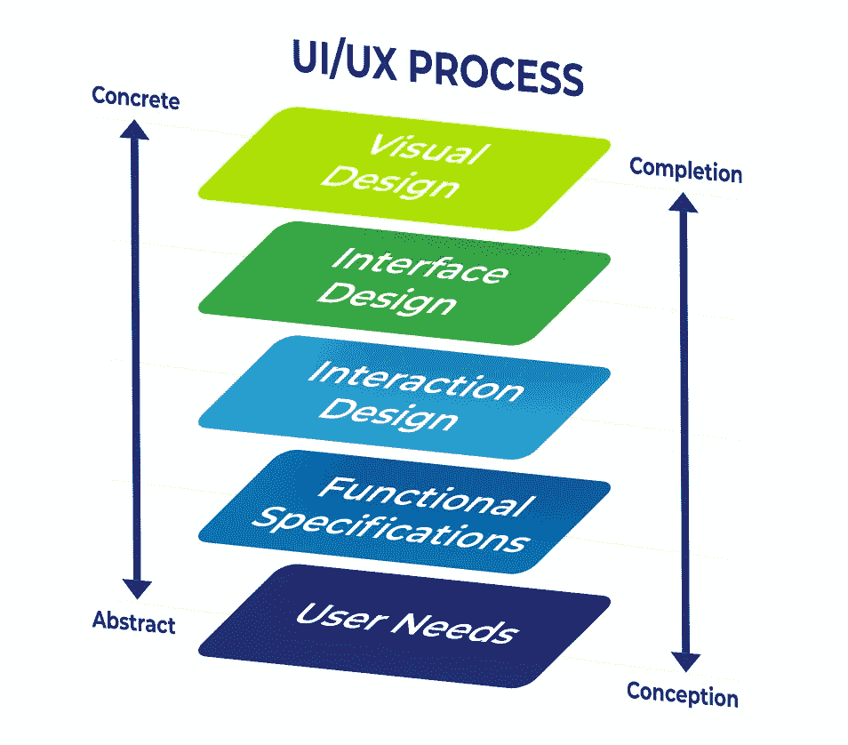

# 烘焙完美的 Mendix 馅饼

> 原文：<https://medium.com/mendix/baking-the-perfect-pie-6b925dbbb0af?source=collection_archive---------7----------------------->

烤一个苹果派似乎很简单，你拿一些苹果、糖、面粉、香料、黄油和一个鸡蛋，在一个碗里混合你的原料，混合它们，然后把混合物放进你的烤箱。一个小时后，你得到了你的苹果派！但在现实生活中，情况并非如此。只是把配料混在一起就会弄得一团糟。

*馅饼是分层的，由不同的部分组成，需要不同的动作来确保它们符合设计。它需要一个很好的面团来做一个酥脆的馅饼底，一个坚实的馅料，当你烤它的时候不会太软，一个金棕色的上层外壳，看起来诱人，让你流口水。*

*当你像烤馅饼一样对待应用程序开发时，一切都变得有意义了。*

现在[西门子和 SAP 合作](https://www.plm.automation.siemens.com/global/en/our-story/newsroom/siemens-sap-accelerate-industrial-transformation/82667)连接他们互补的软件解决方案，馅饼变得更甜了。这两家行业领导者将结合他们的技术，通过利用[工业 4.0](https://blogs.sw.siemens.com/news/how-to-keep-pace-in-tomorrows-industrial-landscape/) 支持的数据，通过从产品设计到服务和资产管理的全面解决方案，将客户洞察纳入产品开发，帮助公司缩短上市时间。

# 馅饼基础(iPaas)

一切从底层开始；在我们的案例中，这是 SAP 云平台。馅饼的基础需要稳定和健壮，这样我们就可以在它上面建立其他层。另一方面，我们要求粉底足够灵活，所以我们有时可以偏离标准配方，添加新的成分和定制。

利用快速应用开发(RAD ),我们在 [SAP 云平台](https://www.sap.com/products/cloud-platform.html)的基础上扩展和区分核心功能。为此，我们依赖 [Mendix](http://mendix.com/) 作为 RAD 平台。Mendix 使我们能够快速开发、部署和运行与 SAP 云平台上连接的后端系统无缝集成的应用。数据库可以在多个部署的定制应用程序之间共享，因此不需要在同一环境中的应用程序之间进行数据集成或复制。

在 SAP 云平台上部署 Mendix 应用的另一个好处是可以获得非常丰富的 API 集合，以构建后端和前端之间的可靠接口。Mendix 和 SAP 都提供了广泛的标准集成内容，加速了集成企业应用程序的开发。例如，使用 Mendix 中的费奥里 UI 模板和 [SAP OData 连接器，基于](https://docs.mendix.com/partners/sap/sap-odata-connector) [SAP S/4 HANA](https://www.sap.com/products/s4hana-erp.html) 的定制企业应用可以在数小时内开发完成。如果需要，可以非常容易地将 API 管理和云集成服务添加到配方中。

# 填充(数据)

没有馅料，馅饼是空的，只是一个空壳。为了填满它，我们需要苹果，或者在我们的情况下，数据。只有当完整和最新的信息显示给最终用户时，企业应用程序才是有用的。为了实现这一目标，我们使用 SAP 云平台集成来连接 SAP 和非 SAP 系统。如果我们想偏离标准的食谱，我们可以选择通过信息映射、内容丰富和价值映射来搅拌配料。

这种在数字核心套件上集成软件的补充方式加快了应用程序的开发过程，开辟了分析数据的新方法，并保持了核心的清洁。通过使用一个可靠且安全的集成框架，我们还使公民开发者和产品所有者能够在开发过程中与我们紧密协作。

# 完美的外壳(前端)

这才是真正吸引眼球的。它只是邀请你咬一口。为了实现这些令人垂涎的优秀设计，我们使用 Mendix 来创建定制前端解决方案。该设计根据客户需求量身定制，并与 SAP 云平台集成无缝交互，以访问和修改云中的数据。Mendix 等低代码开发平台的使用确保了应用程序经得起未来的考验，允许在未来的迭代和低启动成本中进行更改。[据 Gartner 称，未来两年，应用程序开发的市场需求增长速度将比 IT 交付能力至少快 5 倍](https://www.information-age.com/state-application-development-growing-says-gartner-123464619/)。为了促进这种不断增长的需求并满足我们客户的需求，我们使用新的方法来快速开发应用程序。

公民开发人员是精通技术的人，具有客户端的业务流程知识。在开发过程中采用它们可以让我们快速收集业务需求，同时交付最终产品的构建模块。这种方法使我们能够专注于技术方面，以及 UX/UI 设计，而公民开发人员可以专注于增加业务价值。

拥有一个易于使用的前端取决于用户体验(UX)。这个包罗万象的术语指的是几个不同的学科。

我们从客户那里收集功能规格来决定用户需求。这意味着关注应用程序应该做什么，用户看重什么，以及用户的能力和局限性。它促进了交互质量的提高，同时考虑了业务目标。

交互设计应该包含深思熟虑的行为和结构化的模式，让用户容易理解和使用产品。

一旦这些步骤完成，我们就可以通过实现企业标识来完成应用程序的可视化设计，即用户界面(UI)。

# 我们自己面包店的完美馅饼

看看就知道了，难道不是美女吗？相信我们，味道也很棒。通过巧妙地整合组成等式的所有不同部分，我们制作了一个每个人都同意是美味的馅饼。

你有想尝试的食谱吗？给我们发送消息，我们将为您烤出有史以来最好的馅饼！通过[电子邮件](mailto:question@qforit.com?subject=Baking%20a%20pie)或填写我们的联系表格联系我们，我们将尽快回复您。

[***里克·丁格曼斯***](https://www.linkedin.com/in/rikdingemans/) *是资深解决方案专家，拥有商业信息技术背景和 20 多年的 IT 经验。他专门使用 Mendix 结合不同的集成平台(如 SAP 云平台集成)进行低代码应用程序开发。*

[***QforIT***](http://qforit.com/)*是 Mendix 和 SAP 的合作伙伴，专注于企业应用程序与服务和解决方案的集成，支持数字化转型和业务创新。QforIT 的商标在于使用匹配的前端解决方案快速开发和实现可靠、易维护和可扩展的接口。*