# 猛烈抨击——用 Python 替换 Shell 脚本

> 原文：<https://medium.com/capital-one-tech/bashing-the-bash-replacing-shell-scripts-with-python-d8d201bc0989?source=collection_archive---------0----------------------->

> 我们能谈谈你穿的旧帽衫吗？是的，它有一个模糊的标志和一个复杂的、对个人意义重大的故事。是的，它让你远离阳光。不过用胶带把口袋粘在一起似乎并不是最佳选择。肘部有个洞。那是什么污渍？如果你洗了它，还会剩下什么吗…

让我们承认，一个看起来像来自一个废弃网站的免费帽衫的应用程序并不能给人带来多少信心。应用程序的外观很重要，就像衣服一样。因此，许多软件都提供了炫目、奇特的体验，但我们都知道，软件不仅仅是看上去那么简单。在这个外表下，有用户看不到的处理层。有各种各样的纽扣、拉链、腰带和吊带来确保物品固定在一起。

例如，技术操作人员(TechOps)必须启动服务器，确认它正在运行，停止服务器，可能备份数据，可能导出或导入数据。除了操作之外，开发(DevOps)人员还有一套用于集成和部署的工具。这个 DevOps 工具通常与 shell 脚本缝合在一起，以确保 GitHub 中的合并分支变成可部署的工件。

> 那套漂亮的服装肯定是由许多独立的零件组装而成的。

现在，你的连帽衫可能是万能的遮盖物——你可以在任何地方穿着它——就像外壳是将许多软件工具结合在一起的东西一样。虽然这是普遍现象，但它也是 DevOps/TechOps 中经常出现的问题之一。这是一个问题，因为我们经常滥用 shell，把它当成一种编程语言。

以下是一些关注点:

*   语法可能晦涩难懂。我们都习惯了，但这并不意味着好。
*   很慢。虽然 shell 脚本的速度无关紧要，但是试图像编程语言一样使用 shell 会浪费系统资源。
*   我们经常会忽略剧本的关键特征。使用 ***$，检查程序的状态？*** 会被不小心漏掉，导致行为不一致。
*   shell 语言的唯一数据结构是字符串。有很多方法可以将字符串分解成单词。 ***expr*** 程序可以将字符串转换成数字进行运算。 ***日期*** 程序允许一些日期操作，但是规则可能是模糊的。
*   单元测试并不容易。有一些像 [Bats](https://github.com/sstephenson/bats) 这样的包可以帮助单元测试。像 Python 这样的语言有更强大的单元测试能力。

*不是壳破了。shell 不是一种完整的编程语言。它不能满足我们的所有需求。*

## 这就把我们带到了痛击

bash-bashing 的目的是减少 shell 的使用。无需太多实际工作，用 Python 代码替换 shell 脚本是很容易的。修改后的代码更容易阅读和维护，运行速度更快，并且可以有一个合适的单元测试套件。

因为 shell 代码非常常见，所以我将提供一些如何将遗留 shell 脚本翻译成 Python 的详细示例。我假设你对 Python 有点熟悉。这些例子将在 Python 3.6 中出现，包括像 ***pathlib*** 和 f 字符串这样的特性。如果你想跟随，考虑创建一个虚拟环境或使用[康达](https://conda.io/docs/intro.html)。

shell 脚本示例是纯粹的 bash，可以在 bash 运行的任何地方运行。设计模式适用于 Windows 当然，语法会有很大的不同。

## 世界真大

在深入研究代码之前，我想对这个例子做一些界定。很容易举出 Git hooks、Jenkins jobs 或 UrbanCode Deploy 的例子。

我认为这类例子有点太具体了；我想更广泛地了解一下 shell 脚本。我想把普通运动服和我们攀岩时可能穿的特殊装备区分开来。我的代码示例不是为特定的 DevOps 工具链定制的。

这种贝壳可用于各种各样的东西。我将使用一个示例，其中包含一些常见的操作系统级资源操作:

*   读取配置文件
*   终止(和创建)进程
*   做日期算术
*   创建(和删除)目录
*   运行应用程序
*   管理文件

除了管理操作系统资源，还有一些更高层次的考虑因素。这些考虑包括条件处理和对象迭代。我将展示一个迭代文件的例子，但是脚本也可以迭代文件中的进程甚至行。

Shell 脚本通常管理网络资源。这意味着通过 ***curl*** 和 ***wget*** 访问远程资源。使用这些程序使管理网络资源看起来更像运行应用程序和管理本地文件。正因为如此，我不会把网络资源当作一类独特的对象。

## 有代表性的剧本

我有一个小 shell 脚本，其中包含一些不同资源操作的示例。该脚本操纵一些操作系统资源，并运行外部应用程序。*(没错，应用是偷偷用 Python 的。)*

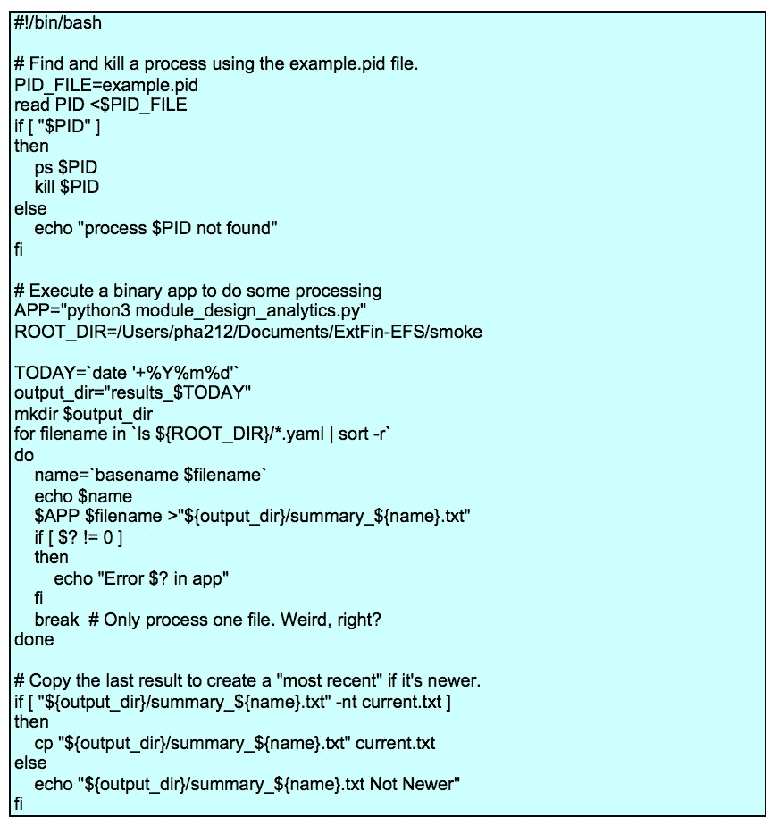

这个脚本似乎有四个重要步骤:

1.  它会终止一个进程。这包括读取一个文件以获得一个进程 id，然后执行***【PS】***和 ***kill*** 命令。 ***example.pid*** 文件由其他进程创建，并由该脚本读取。如果文件没有任何内容，有一个逻辑路径来处理。如果文件根本不存在呢？
2.  它创建一个基于当前日期命名的目录。该目录将在后续步骤中使用。如果该目录已经存在，就会出现一条烦人的消息。这种掩蔽有问题吗？
3.  它运行一个分析程序。对于 循环来说，有一个令人困惑的 ***，它只处理文件名排序列表中的一个文件。我将在下面深入探讨这个结构的细微差别。我将它作为使用 Python 时可以简化的算法的代表。***
4.  最后，它将输出文件复制到第二个位置，名为 ***current.txt*** 。复制操作由 if 语句限定，该语句在替换另一个文件之前检查一个文件是否较新。

我强调短语“似乎有”,因为 shell 脚本可能有难以察觉的副作用。这个具体的例子清楚地说明了它创建的文件和目录以及它终止的进程。通常，shell 背后的原始想法是让资源管理变得非常清晰。然而，这一理想在实践中并不总能实现。

> 你可能会喜欢你的帽衫。但是有胶带把它粘在一起。

shell 晦涩的一个例子是当前工作目录的设置方式。 ***cd*** 命令足够清晰，但是在使用 ***()*** 的子 shell 存在的情况下，很难辨别嵌套 shell 调用的堆栈以及子 shell 退出时工作目录如何变化。

让我们把这个例子改写成可以进行单元测试的东西。我将从头开始，一步步深入细节。

## 从顶部开始

我所说的“顶部”是指对脚本功能的高度概括。这个脚本看起来有四个步骤。下面是一些 Python 代码，它们反映了整体概要:

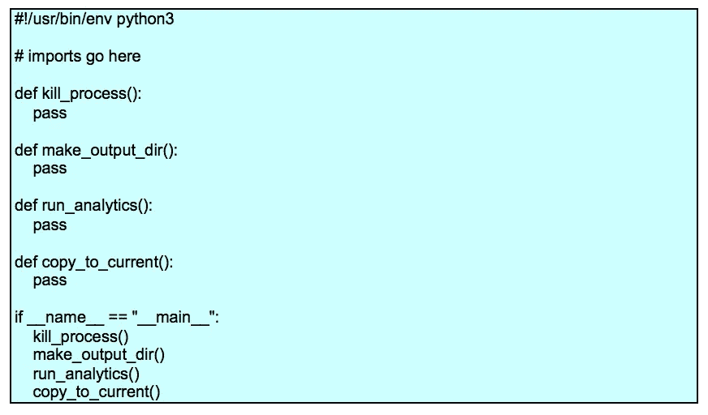

我将这四个步骤理想化为独立的功能。这留下了实现每个功能的空间。我尽量避免做太多假设。实际上，我们通常对 shell 脚本的功能有更清晰的了解；这允许我们以一种更适合脚本意图的方式来定义函数。

## 从配置文件到流程管理

shell 的一个更有趣的特性是变量往往是全局的。但是，有一些例外和警告会导致 shell 脚本被破坏或行为不一致。这意味着像 ***PID_FILE*** 和 ***PID*** 这样的环境变量是一个步骤的*电位*输出和后续步骤的*电位*输入。很少清楚。

重写的一部分意味着识别在脚本的其他部分使用的全局变量。这在复杂的脚本中可能很困难。在这个例子中，很容易检查代码以确保这两个变量是有效的局部变量。

重写的另一部分意味着识别更像配置参数而不是简单变量的东西。像文字目录和文件名这样的东西显然可以作为配置参数。还有其他可配置的项目，如搜索字符串和通配符模式，可能也需要被视为外部配置的一部分。我建议在参数化过程中慢慢来。

我的建议是先让事情运转起来。以后再概括。

下面是***kill _ process()***函数的一个实现:

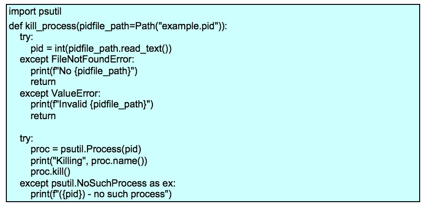

我已经用基于 ***的 Pythonic 习语【PID = PID FILE _ path . read _ text()***的代码替换了 read***PID<$ PID _ FILE***的 shell 的习语。原始的 shell 脚本没有关于文件格式的任何文档；我们还没有给 Python 添加文档。文件内容摘要是一个重要的补充。

这里是 shell 和 Python 之间的另一个变化:shell 使用字符串，但是 Python***psutil***库使用整数作为进程 ID。这导致使用 ***int()*** 函数将字符串转换为整数。这也意味着当文件不包含 PID 的有效数字时，脚本需要做一些有用的事情。

如果文件有一个无效的 PID，原始的 shell 脚本将会默默地做一些晦涩难懂的事情。试试运行 ***ps 什么*** 或者 ***ps ick*** 自己看看这种不太明显的行为。

同样，如果找不到进程， ***kill*** 命令会写一条消息。找不到进程时，脚本不停止；它悄悄地忽略了这个问题。也许这种情况真的不是问题。很难说初衷是什么。这是一个疏忽吗？还是故意的？

无论是 ***ps*** 还是 ***kill*** 程序都在 ***中设置了状态码$？*** 取值为 1 表示程序失败。省略对 ***值的检查？*** 表示这些程序的成败被忽略。

与 shell 不同，当程序没有完成且状态代码为零时，Python 会不断地抛出异常。我们的 Python 脚本必须处理这个异常，以明确各种类型的失败通常无关紧要。在示例中，Python 代码编写了一条警告消息并继续处理。 ***pass*** 语句可以用来代替 ***print*** 函数来沉默异常。

注意， ***psutil*** 包不是标准库的一部分。您需要单独安装它。

## 创建目录

下面是***make _ output()***函数创建输出目录的实现:

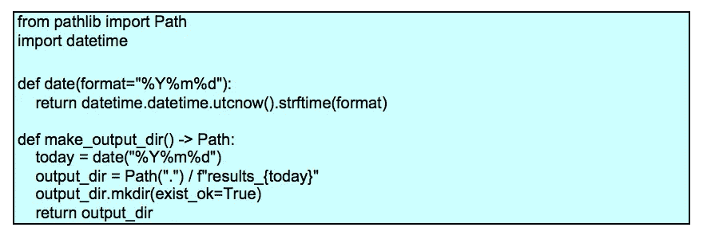

shell 的 ***date*** 程序用相对隐晦的语法做了很多事情。我写了一个简单的函数，它模拟了 ***date*** 程序的一个特性。很容易将其扩展为包含日期偏移功能。

我在***make _ output _ dir()***定义中包含了一个类型提示。这总结了该函数产生的返回值。如果你以前没有看过 Python 3 类型提示，我需要强调一下“提示”方面。它们根本不会改变运行时的行为。通过 ***mypy*** 程序([http://mypy-lang.org/](http://mypy-lang.org/))有一个单独的质量检查，以确认类型提示都被一致地使用。

这个函数利用了 Python 3***path lib***库。 ***output_dir*** 变量被称为“纯”路径——一条*可能*存在的潜在路径。它是由一个 ***路径*** 对象和一个字符串构建的。/运算符从基础 ***路径*** 对象构建复杂路径。

纯道建成后， ***。mkdir()*** 方法从纯路径创建一个实际路径。如果目录已经存在，使用 ***exist_ok*** 选项可以消除***FileExistsError***异常。

在目录已经存在的情况下，遗留 shell 脚本会写一条错误消息。与此相反，Python 代码是沉默的。如果重要的话，可以修改 Python 代码来模拟错误消息行为。省略 ***exist_ok=True*** 并通过打印一条 ***f"{output_dir}*** :文件存在"消息来处理***filexistserror***异常

对源代码的搜索显示， ***output_dir*** 变量的值在脚本的其他地方使用。因此，我将该值作为该函数的显式结果返回。

如果您是 Python 的新手，函数返回多个值是很容易的。在极少数情况下，shell 脚本的一个步骤设置了多个需要返回的变量，只需在 return 语句中列出所有变量。

## 传播变化

当我第一次勾画脚本时，***make _ output _ dir()***的签名没有参数也没有返回值。随着我深入挖掘细节，发现输出目录被***run _ analytics()***和***copy _ to _ current()***使用。返回值和参数的发现过程可能具有挑战性。在许多情况下，它包括单元测试失败，因为变量丢失。

更改 **make_output_dir()** 函数意味着我还需要更改整个脚本。这里有一个版本，反映了每一步所需的所有变量:

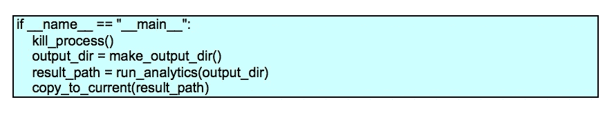

这个人为的例子没有涉及到很多用来传递值的环境变量。不要对现实世界脚本中的大量共享变量感到惊讶。在某些情况下，复制粘贴编程可能意味着在不同的步骤中重复使用变量名。

如果你回头看看***copy _ to _ current()***代码块，它有两个全局变量: ***output_dir*** 和 ***name*** 。但是，这些都是用来构建一个结果路径:***“$ {输出 _ 目录}/summary _ $ {名称}。txt"*** 。我没有提供两个变量，而是做了微小的重新设计，从***run _ analytics()***函数返回整个路径。

## 排序和搜索

下一步，***run _ analytics()***函数为特定的输入文件执行外部程序。下面是整体代码。我们先来看看文件名排序，然后我们来看看运行程序的 ***check_call()*** 函数。

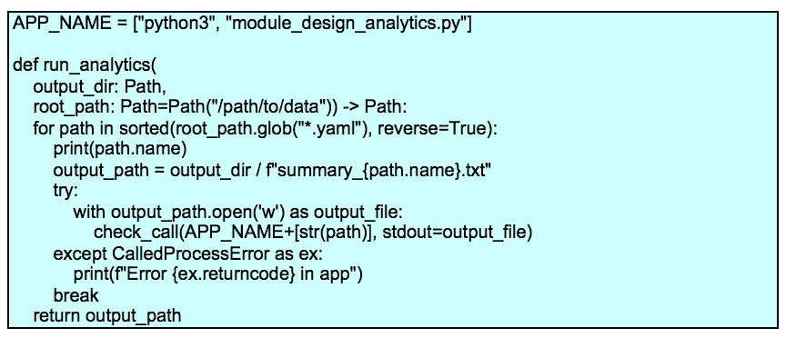

一个 ***路径*** 对象的 ***glob()*** 方法枚举该目录中的所有文件。这就像在 shell 中使用任何引号之外的 ******* 。除了它是明确的。

我在这段代码中保留了最初的外壳设计。有一个包含中断的循环。尚不清楚为什么这个循环首先会存在。但是，我遵循我的策略，先把事情做好，然后再推广。一旦我们有了单元测试，我们可以重写它来优化它。

这段代码包含了一个 shell 中一些低效处理的例子。

语法很简洁，但是它涉及到一个带有管道的子 shell。流水线包括运行两个独立的程序，并将一个程序的输出通过管道传输到另一个程序的输入。虽然 Linux 做得很快，但它涉及的开销是可以避免的。

在 Python 中，我们可以使用以下内容:

虽然 Python 代码更高效，但它还有另一个巨大的优势。在 Python 中，处理复杂的排序键非常简单。

在 shell 中，我们经常会设计这样的排序管道:

第一个 ***sed*** 步骤从文件名中提取一些数值，以便用于排序。排序完成后，最后一个 sed 步骤会删除修饰。有时这是用 ***awk*** 完成的。不管怎样，都是杂乱的。

在 Python 中，我们可以更简单地为 ***函数提供一个 key 函数 sorted()*** 函数。

例如，我们可能有文件名类似于***prefix _ yyyymmdd . ext***的文件，我们希望按 ***_、*** 后面的日期而不是前缀进行排序。我们可以编写一个排序关键字函数，如下所示:

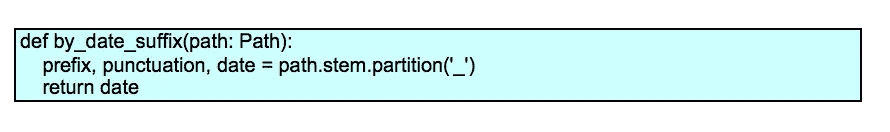

该函数将提取文件名的词干，对其进行分区，并只返回文件名的 ***yyyymmdd*** 部分。这将是排序关键字。当然，我们可以在这里进行任何类型的字符串或数值计算，在这种不太可能的情况下，我们有非常复杂的排序规则。

我们可以如下使用该键功能:

这将应用对象到键的转换函数，从每个要排序的对象创建排序键。

优化？我们可以将 for/break 结构替换为:

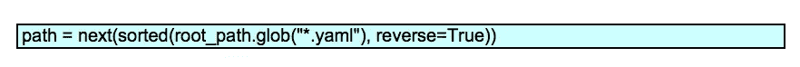

这将从文件名的排序序列中取出一个项目。

这里有一个例子，用一些虚假的数据展示了这种事情是如何发生的。我将使用字符串而不是构造 ***路径*** 对象。

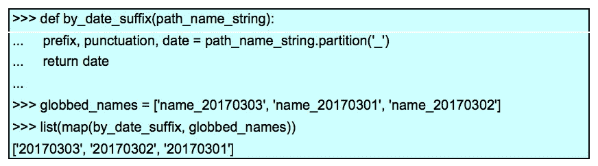

后缀字符串被从文件名中去掉；这些字符串用于排序时的关键字比较。下面是下一步可能的情况。

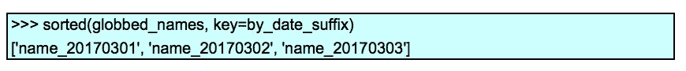

这些按升序排序，其中 ***反转=真*** 将切换键比较的意义。

## 运行程序

Python 和 shell 之间的一个巨大差异是 shell 隐式运行程序的方式。如果这一行的第一个单词不是 shell 的内置特性，那么这个名字会在 OS ***$PATH*** 中找到并作为程序执行。在 Python 中，子进程模块用于运行程序。这里用到的 ***check_call()*** 函数就是我用的。根据所需的精确行为，还有其他一些选择。

从最初的 shell 命令到 Python 的转换包括替换三个 shell 解析特性:

*   一行 shell 代码被解析为基于空格和引号的单词。带引号的字符串被视为单个单词。shell 提供了两种类型的引号来控制这个过程。对于 Python，我在设计时将命令解析成一个单词列表。我们不必使用复杂的引用规则。相反，我们提供单词列表。 ***APP_NAME*** 变量中有一个静态列表。文件名被附加到这个单词列表上。
*   shell 代码的每一行都被处理成“glob”文件名。任何 ******* 都被用作通配符文件规范。要打败这个特性，我们必须给 ******* 加上引号。在 Python 中，我用对一个 ***Path*** 对象的 ***glob()*** 方法的显式调用替换了 shell 的隐式 globbing。[https://docs.python.org/3.6/library/pathlib.html#pathlib.Path.glob](https://docs.python.org/3.6/library/pathlib.html#pathlib.Path.glob)
*   在 shell 中， ***>*** 和 ***<*** 重定向操作符用于将打开的文件连接到要执行的程序。在 Python 中，我显式地打开了文件。然后，我可以将打开的文件连接传递给 ***check_call()*** 函数，以映射到子进程 stdout。

这个转换将简洁的 shell 命令***$ APP $ filename>" $ { output _ dir }/summary _ $ { name }。txt"*** 在 Python 中变成这样:

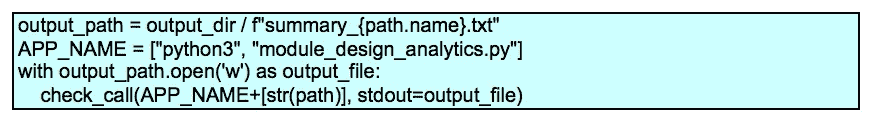

首先，我使用一个 ***路径*** 和 ***/*** 操作符构建了目标文件名。然后，我从 ***APP_NAME*** 和要处理的路径中构建了一个单词列表命令。打开目标文件后，我运行了生成的命令，标准输出指向打开的文件。

*“嘿，等一下，”*你可能会说。"你只是从另一个 Python 脚本运行一个 Python 程序."

说得好。您已经确定了脚本重写的下一个级别。我们可以将这些步骤合并到一个复合应用程序中，该应用程序导入原始的***module _ design _ analytics***应用程序。使用 ***runpy*** 模块从这个脚本内部运行应用程序也是明智的。这些都是重要的潜在优化。

## 检查修改时间和复制文件

最后一步是复制一个比目标文件新的文件。

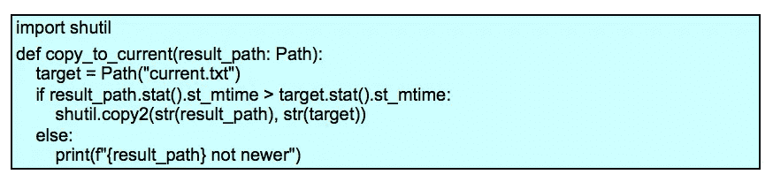

shell 使用***【file-nt file】***来比较两个文件的修改时间。我用一个非常显式的操作来替换它，以获得每个文件的 ***os.stat()*** 结构。然后我对比了一下修改时间，在每个 OS 状态结构内叫做 ***st_mtime*** 。

文件复制通过 ***shutil*** 模块完成。这有一个 ***copy2()*** 函数来复制数据以及元数据。在 ***shutil*** 模块中有替代方法，可以对如何处理元数据提供更多的控制。

## 进口货

以下是该脚本导入的模块列表:

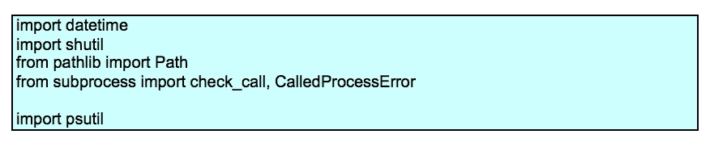

在某些情况下(即 ***datetime*** ， ***shutil*** )，我使用了整个模块。在其他情况下(即 ***pathlib*** ， ***子进程*** )，我只导入了必要的特定类、函数或异常。我这样做是为了展示这两种风格。当一个类似 ***check_call()*** 的函数被导入时，那么这个名字就不需要任何限定。当一个像 shutil 这样的模块被导入时，这个函数需要这个模块作为一个明确的名称空间限定:shutil.copy2()。每种风格都有充分的理由。

psutil 不是标准库的一部分。它必须单独安装。

## 测试

一旦有了一些——据称是——有效的代码，下一步就是创建单元测试。让测试驱动开发是一个很好的实践。理想情况下，我们会在 shell 脚本中为四个高级功能步骤编写单元测试。当我们不确定我们知道一个给定步骤所做的与后续步骤相关的所有事情时，这个理想很难实现。有很多全球性的共享状态需要理解。

如果我们使用 Python 而不是 shell，那么我们就有从头开始的优势。我们可以使用测试优先的开发技术。

无论哪种情况，模拟我们的 Python 应用程序将要接触的操作系统级资源都是必不可少的。为此，我使用了 ***unittest.mock*** 库。为了构建合适的模拟对象，查看代码会有所帮助。一些测试专家称之为“白盒”测试，因为我正在为被测软件裁剪模拟对象。

下面是对我们脚本的一个功能的代表性测试。这将测试***copy _ to _ current()***函数的一个修改时间关系:

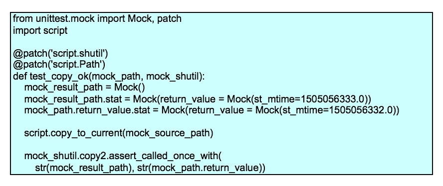

测试导入要测试的脚本；它有着 ***script.py*** 这个毫无想象力的名字。我对脚本执行的名称空间应用了两个补丁。

*   ***shutil*** 的导入被一个 ***Mock*** 对象替换。
*   **T21【pathlib】的导入。路径** 被替换为 ***嘲弄*** 对象，也是如此。

这两个模拟对象都成为测试函数的参数，所以我可以使用它们。当有多个***@ patch***decorator 时，注意参数名从内到外的排序。这是 Python 应用装饰器规则的结果。

我还为 ***result_path*** 参数创建了一个 mock，并将其赋给变量***mock _ result _ path***。在这种情况下，我不是修补导入的名称，而是为函数提供一个参数。

测试中的函数使用如下代码

为了确保这将工作，我创建了一个 ***统计*** 属性。这是一个带有 ***返回值*** 的 ***模拟*** 。返回值是一个带有 ***st_mtime*** 属性的 ***Mock*** 。我模仿了被测试代码所使用的行为。

***mock_path*** 参数是 ***Path*** 类定义的替代。测试中的函数将使用如下代码:

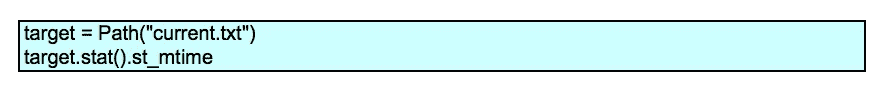

我们期望模拟 ***路径*** 将被评估一次以创建一个 ***路径*** 对象。函数调用的默认行为是创建一个 ***模拟*** 对象。测试可以用***mock _ path . return _ value***引用创建的 mock。根据被测代码，返回的 ***Mock*** 对象必须有一个 ***stat()*** 函数，该函数的结果必须有一个 ***st_mtime*** 属性。

在这个测试语境下评价***script . copy _ to _ current()***的时候，我有一堆期待。最重要的一个是 ***shutil.copy2*** 会被调用。我将这一期望形式化为:

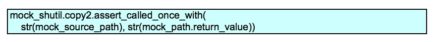

我也有兴趣确认每个参数调用了 ***stat()*** 方法。我可以把这个作为一个断言来补充。

这里的要点是添加具有不同时间戳关系的测试来测试其他行为。 ***py.test*** 包可以找到并运行这些测试，因为它们有一致的名称模式。

## 后续步骤

当然，我们还没完。我还没有真正谈到日志或配置。这个脚本使用外部环境变量吗？一个配置文件？命令行参数？

一些 shell 脚本使用 ***getopt*** 命令来解析选项。其他 shell 脚本使用 ***$0*** ， ***$1*** 等。，以收集位置参数。这些特性中有很多可能被隐藏在脚本中，这使得发现脚本的真正用途和预期用途变得很困难。

此外，还有另一轮优化的可能。如上所述，这个脚本运行一个 Python 程序。将应用程序和脚本组合成复合应用程序可能是合适的。

## 结论

> shell 是一个原始的编程环境。它工作得很好，但是它不是一种非常复杂的语言。我认为这是一套 1970 年的休闲西装，可能由双面针织聚酯制成，带有对比鲜明的顶部缝线。你知道——约会。绝对不适合攀岩或者去海滩玩。

两个最大的问题是缺乏有用的数据结构和单元测试的困难。

我们不需要取消所有对外壳的使用。但是我们可以受益于将 shell 的使用减少到它特别擅长的几件事情上。我喜欢将 shell 脚本简化为几行代码，用来设置环境变量、建立当前工作目录和运行目标程序。

我们想要做的是用编程语言编写的代码取代复杂的外壳脚本，这种编程语言为我们提供了一系列丰富的数据结构。在许多情况下，我们可以找到大块的 shell 代码来进行计算，这是 Python 等编程语言的一个简单的内置特性。

转向 Python 意味着我们可以利用更智能的数据结构。我们可以用一种摆脱字符串处理的方式来处理数字和日期。最精彩的部分？我们可以编写单元测试。对 shell 脚本的一个小改动不会破坏东西。相反，它会像应用程序的其他部分一样接受测试。我们可以满怀信心地将它投入生产，相信它会真正发挥作用。

***声明:以上观点仅代表作者个人观点。除非本帖中另有说明，否则 Capital One 不属于所提及的任何公司，也不被其认可。使用或展示的所有商标和其他知识产权均为其各自所有者所有。本文为 2017 首都一。***

# 相关职位

*   [自动化 NoSQL 数据库构建](/capital-one-developers/automating-nosql-database-builds-a-python-to-the-rescue-story-that-never-gets-old-1d9adbcf6792)
*   [NoSQL 数据库并不意味着没有模式](/capital-one-developers/nosql-database-doesnt-mean-no-schema-a824d591034e)