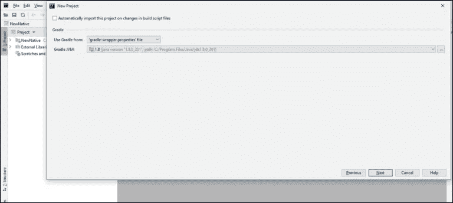

# 如何与 Kotlin Native 合作？

> 原文：<https://medium.com/edureka/basic-kotlin-native-app-a22febf0f6d7?source=collection_archive---------1----------------------->


Kotlin Native — Edureka

Kotlin/Native 是一种将 Kotlin 代码编译成本地二进制文件的技术，它可以在没有虚拟机的情况下运行。对于不熟悉的人来说，这是一件有趣的事情。因此，在本文中，我将更多地关注 Kotlin 原生平台。

我将按以下顺序讨论这些主题:

*   什么是科特林土著？
*   Kotlin Native 如何配置环境？
*   科特林本地格拉德勒
*   优势

我们开始吧！

# **什么是科特林土著？**

Kotlin Native 是 JetBrains 的一款令人震惊的新产品，它允许开发人员为 Linux、macOS、Windows 和其他平台编写本机应用程序。这意味着我们可以在不需要或不可能使用虚拟机的平台上进行编译，比如嵌入式设备或 iOS。


它由基于 LLVM(低级虚拟机)的 Kotlin 编译器后端和 Kotlin 运行时库的本地实现组成。

现在你可能会问，它支持哪些不同的平台。这个问题的答案是:

*   Windows(目前仅 x86_64)
*   Linux (x86_64、arm32、MIPS、MIPS 小端)
*   macOS (x86_64)
*   iOS(仅限 arm64)
*   安卓系统(arm32 和 arm64)
*   WebAssembly(仅限 wasm32)
*   树莓派

既然您已经理解了这一点，那么让我们继续前进，了解如何获得这个编译器。

# Kotlin Native 如何配置环境？

如果你从 Kotlin 开始，你会发现开始时非常容易，然后当你升级到 Kotlin Native 时，你会发现它并不容易，因为没有多少专门的 ide 可以在开发过程中提供帮助。

JetBrains 家族中目前唯一支持它的 IDE 是 CLion，这对于希望使用 JVM、JS 或 iOS 实现多平台的项目来说是个问题。而最大的问题，在我看来，就是 CLion 不支持 Gradle。这是我不使用 CLion 实现的主要原因。

*   Kotlin 本机编译器将 Kotlin 代码转换为 LLVM 中间表示(IR)。
*   LLVM 编译器理解 IR，然后为期望的平台创建二进制文件。

可以用 JetBrains 的另一个产品，IntelliJ 平台。

让我们看看如何选择选项 Kotlin Native。


选择自动导入选项。



然后提供一个项目名称，并单击 Finish。

万岁！你已经清楚如何选择科特林·格拉德。

现在让我们向前看，了解如何用 Kotlin Native 编写一个简单的程序。

让我们看一个简单的 Hello World 程序。

我们可以打开我们最喜欢的 IDE 或编辑器，在一个名为 **hello.kt** file 的文件中编写以下代码。

```
fun main() {
println("Hello Kotlin/Native!")
}
```

现在，在编译过程中有一点变化。要手动编译应用程序，调用下载的编译器并生成一个 **hello。kexe** (Linux 和 macOS)或**hello.exe**(Windows)二进制文件:

```
kotlinc-native hello.kt -o hello
```

虽然从控制台进行编译看起来简单明了，但您应该注意到，对于包含数百个文件和库的较大项目而言，它的伸缩性并不好。除此之外，命令列方法不会向 IDE 说明如何开启这样的专案、来源位於何处、使用哪些相依性，或如何下载相依性等等。

# Kotlin Native Gradle

IntelliJ IDEA 中的新项目向导可用于只需单击一下即可启动新的 Kotlin/Native 项目。只需选择*Native | grade le*选项即可生成项目。

我将首先创建一个项目文件夹。所有路径都将与此文件夹相关。有时，必须在添加新文件之前创建缺少的目录。

现在我们来谈谈对 gradel 的语言支持，gradel 支持 Groovy 和 Kotlin 来构建脚本。

**Groovy** 是 Gradle 最早支持的脚本语言。它利用了动态类型和运行时特性的力量。有时维护 Groovy 构建脚本可能会更困难。

现在为了运行脚本并编译基本的 *HelloWorld* 应用程序，您需要做两件事:

*   首先，您需要创建一个 Gradle 脚本来编译应用程序。
*   其次，将程序移动到 src/main/kotlin 包

从*所在的根目录构建。grade le*文件已定位，现在可以运行以下命令:

*   *grade le build*——将构建应用程序
*   *grade le run*——将执行我们的应用程序

现在，让我们继续讨论本文的最后一个主题。

# 优势

*   Kotlin/Native 的主要优势之一是 GUI、传感器、通知以及对每个设备来说唯一和指定的所有东西，这些都将不受限制地以 Native 语言和运行时进行开发。
*   与其他编程语言相比，障碍减少了。
*   它有助于跨平台的应用程序开发。
*   与其他跨平台工具相比，专注于共享执行所需的尽可能多的代码。

这就把我们带到了本文关于 Kotlin Native 的结尾。希望你对这篇文章中与你分享的一切都很清楚。

如果你想了解更多关于人工智能、Python 和伦理黑客等当今市场最热门的技术的文章，你可以登陆 Edureka 的官方网站。

请务必留意本系列中的其他文章，这些文章将解释 Android 的其他各个方面。

> [如何使用科特林开发 Android 应用？](/edureka/kotlin-android-tutorial-cea896d0ae18)
> 
> [*如何成为一名 Android 开发者？*](/edureka/become-android-developer-4a6424d698f3)

*原载于 2019 年 8 月 8 日*[*https://www.edureka.co*](http://edureka.co/blog/basic-kotlin-native-app/)*。*