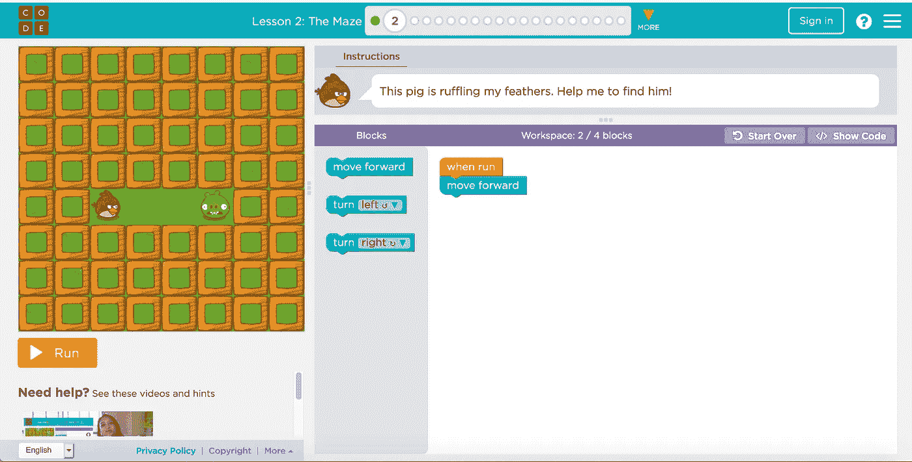
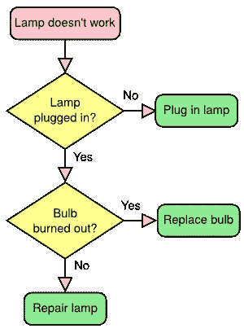
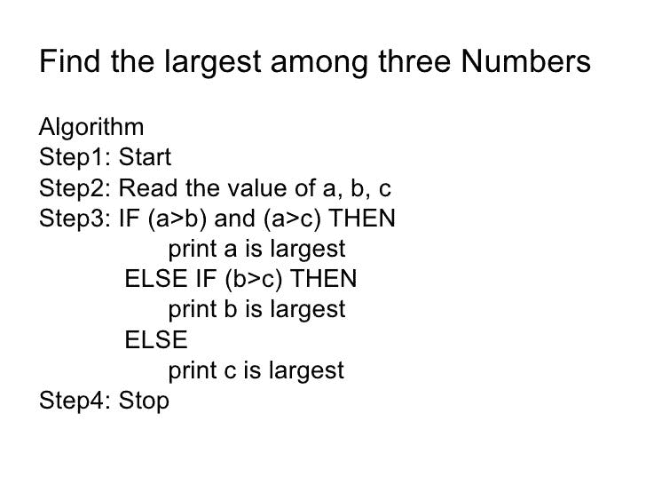
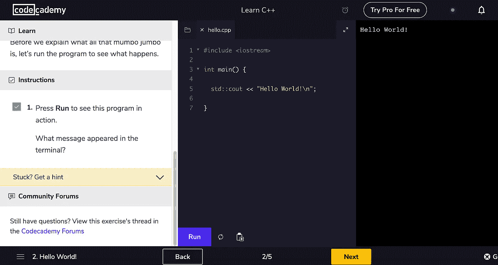
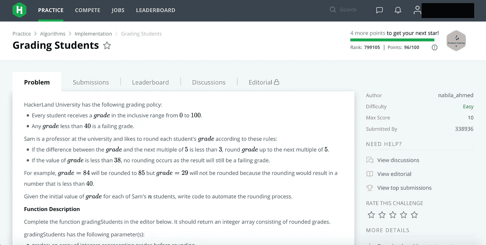

# 基础编程:初学者编程入门包

> 原文：<https://medium.easyread.co/basic-programming-programming-starter-pack-for-beginner-6b6746fba5b3?source=collection_archive---------4----------------------->

## 可以瞬间学会编程吗？你需要的只是“动力”

Photo by [Chris Ried](https://unsplash.com/@cdr6934?utm_source=medium&utm_medium=referral) on [Unsplash](https://unsplash.com?utm_source=medium&utm_medium=referral)

如果你是编程新手，那你来对地方了。你对编程感到兴奋吗？如果是的话，我会给你一些学习编程的诀窍。

你只需要知道编程一点都不可怕。如果你喜欢玩逻辑游戏，我想这很适合你。现在，许多公司需要高薪的程序员职位。所以，编程对你的职业生涯是有益的。我不擅长逻辑思维怎么办？别担心，只要你有坚强的意志，你就能做到。

***好了，我们还在等什么？这是你学习编程需要的入门包。***

# 打破你的耻辱

首先，你要摆正心态。程序员有很强的心态去解决一些具有挑战性的问题。他们必须毫不犹豫地解释解决方案是如何工作的，这样人们才能信任他们的解决方案。提高自己的自尊心是学习编程的核心。

# 玩逻辑游戏

在我开始学习编程之前，我的讲座给我们布置了完成逻辑游戏的任务。打开 Code.org[选这个课程](https://studio.code.org/s/20-hour)。

在这个课程中，你将会被像这个例子一样的程序游戏所服务

Angry Bird Maze : Code.Org Accelerated Intro to CS Course

在这个游戏中，你必须给红色的鸟一些指令来移动和击中绿色的猪。指令是有限的，所以你必须思考有效的移动。不仅是这个游戏，在这个课程中你还可以完成很多游戏。完成游戏后，你可以获得结业证书。有趣吧？

最近刚在 TED-ed 里发现了有趣的动画。这是一个伟大的创新，你可以学习程序员用有趣和富有挑战性的方式解决问题。

于是有个女生(不知道是女生还是男生)想和机器人助手一起越狱。她可以控制机器人来解决这个问题。这就是挑战，你必须帮助她用一些程序来控制机器人。问题会在视频中显示出来，所以你必须暂停它。他们也会给我们一些提示，教我们一些编程基本语法。哦，别担心，他们会给我们解决办法的。

我正在看第一集，但是我想我还想看更多。也许我想在下一篇文章中回顾一下。

# 学习算法

算法是编程的核心，是关于如何解决某个问题的过程。我说的程序是这样的，你想在书架的最后找到科学书。你该怎么办？你必须抬起所有的书架，轻松地拿到书。这是算法的简单例子。

在你开始做算法之前，确保你知道编程的"*词汇*"像

1.  变量
2.  数据类型(整数、字符串等)
3.  条件(如果…那么，情况)
4.  循环(for，while，repeat…until)

这个词汇将在我下一篇文章中解释。

在算法中，你将首先学习流程图和伪代码来解释你的程序。

***流程图*** 是表示过程、程序或条件如何进行的图表。这是一个关于流程图的小例子，这个例子是关于灯的状态以及我们应该如何处理这个例子。

Flowchart For Kids by Kiddle Encyclopedia

你可以看到形状有它的含义，所以在流程图中，你不能只是自己选择形状。如果你想理解流程图你可以访问[这个链接](https://kids.kiddle.co/Flow_chart)。

***伪代码*** 就是你如何以编程的方式编写算法，让人们能够理解。就像你在报纸上用人类语言编码一样。这是一个关于如何在三个数中找到最大值的伪代码的例子。

Source: [https://www.slideshare.net/JAISONISKING/unit-3-foc](https://www.slideshare.net/JAISONISKING/unit-3-foc)

如果你想了解更多关于伪代码和算法的知识，你可以去[这个链接](https://www.slideshare.net/devaashish1/algorithms-and-flowcharts)。

# 学习数学

实际上，数学对于练习你的逻辑是必要的。如果你进入计算机科学学院，你的讲座会给你一些数学问题，可以用算法解决，如奇偶数，质数，阶乘等。

但是数学取决于你需要什么。如果你想学习制作网站或应用程序的编程，我认为数学并不重要。但如果你想学习数据分析师和人工智能的编程，复杂数学是你的主要课程。

# 选择你的编程语言

好了，在你练习完算法后，是时候把它隐含到你的电脑里了。计算机不理解我们的语言，所以你必须用它的语言给你的计算机下达指令。这就是所谓的“编程语言”。

有很多编程语言可以选择，但我建议你先学习 pascal，传统的编程语言来暗示和学习一些基本的算法逻辑。但是我觉得这个世纪很多程序员都不再使用这种编程语言了，所以我觉得你应该选择 C++或者 python。

想学编程语言可以去 [codecademy](https://www.codecademy.com) 。

Codecademy C++

在 codecademy，你可以学习一些编程语言，并进行实践。你可以看到你输入的程序的输出。此外，在课程中，你会得到小测验来测试你的能力。

在你掌握了你的编程语言之后，你也可以在 [Hackerrank](https://www.hackerrank.com/) 中练习你的编程问题解决技巧。

Hackerrank

在 Hackerrank 中，你会得到一些你必须用你的编程语言解决的问题集。每个问题都有难度等级。您可以运行您的程序并查看输出。系统将使用自定义输入和输出检查您的程序。你应该试试。

# 探索每一个计算机科学领域

在你理解了简单编程之后，你可以探索更多关于编程的知识。在我的大学里，我学习面向对象编程、android 编程和设计与分析算法。我还学习人工智能和计算机视觉。嗯，编程是计算机科学的核心。你可以探索很多领域，比如软件工程、人工智能和安全。

你也可以寻求你的职业生涯。如果你想探索这个领域，我建议你去这些网站。

 [## 在线课程-按照您的时间表学习任何内容

### Udemy 是一个在线学习和教学市场，拥有超过 100，000 门课程和 2400 万名学生。学习…

www.udemy.com](https://www.udemy.com/)  [## 学习最新的技术技能；推进您的职业发展| Udacity

### 从行业专家和技术导师那里学习最新的技术技能，推动您的职业发展

www.udacity.com](https://www.udacity.com/)  [## 解码想法，发现潜力

### 职业开发人员。作为创新者和开发者专家的贝拉加·朗松

www.dicoding.com](https://www.dicoding.com/)  [## 在线学习 R、Python 和数据科学

### 使用 DataCamp 的视频教程&编码，按照您自己的步调，在您的浏览器中舒适地学习数据科学

www.datacamp.com](https://www.datacamp.com/) 

这就是我能为你分享的全部。如果你对编程感兴趣，你可以试试这个初学者包。记住这个。

> 编程一点也不可怕，是你的心态告诉你的。让我们享受编程的乐趣。

如果你想分享你的编程经验，你可以发表评论。把这个分享给你的朋友。非常感谢。有一个很好的代码。