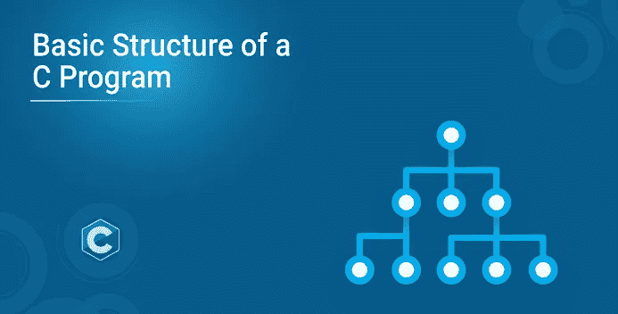
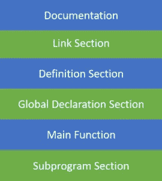
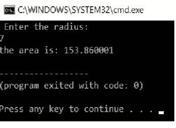

# C 程序的基本结构

> 原文：<https://medium.com/edureka/basic-structure-of-c-program-ed3bf9c72632?source=collection_archive---------2----------------------->



在这篇文章中，我们将学习 C 程序的基本结构。C 程序被分成不同的部分。一个基本的 c 程序有六个主要部分。

这六个部分是，

*   证明文件
*   环
*   定义
*   全局声明
*   主要功能
*   子程序

既然介绍已经结束了，让我们进入主要讨论。整个代码遵循这个大纲。每个代码都有相似的轮廓。现在，让我们详细了解每一层。



**Figure:** Basic Structure Of C Program

转到 C 程序文章的下一个基本结构，

# 文件科

文档部分是程序的一部分，程序员在这里给出与程序相关的细节。他通常会给出程序的名称、作者的详细信息以及其他细节，如编码和描述的时间。它给任何阅读代码的人提供了代码的概述。

**例子**

/**

*文件名:Helloworld.c

*作者:曼坦·纳伊克

*日期:2019 年 8 月 9 日

*描述:显示 hello world 的程序

*不需要输入

*/

转到 C 程序文章的下一个基本结构，

# 链接部分

这部分代码用于声明程序中将使用的所有头文件。这导致编译器被告知将头文件链接到系统库。

**举例**

```
#include<stdio.h>
```

转到 C 程序文章的下一个基本结构，

# 定义部分

在本节中，我们定义不同的常数。该部分使用了关键字 define。

```
#define PI=3.14
```

转到 C 程序文章的下一个基本结构，

# 全球申报科

这部分代码是声明全局变量的部分。所有使用的全局变量都在这一部分声明。用户定义的函数也在这部分代码中声明。

```
float area(float r);
int a=7;
```

转到 C 程序文章的下一个基本结构，

# 主要功能部分

每个 C 程序都需要有主函数。每个主要功能包含两个部分。声明部分和执行部分。声明部分是声明所有变量的部分。执行部分以花括号开始，以花括号结束。声明和执行部分都在花括号内。

```
int main(void)
{
int a=10; 
printf(" %d", a);
return 0;
}
```

转到 C 程序文章的下一个基本结构，

# 子程序部分

所有用户定义的函数都在程序的这一部分中定义。

```
int add(int a, int b) { return a+b; }
```

## 抽样程序

这里的 C 程序将使用一个用户定义的函数和一个保存 pi 值的全局变量 pi 来计算圆的面积

```
* File Name: areaofcircle.c
* Author: Manthan Naik
* date: 09/08/2019
* description: a program to calculate area of circle
*user enters the radius**/
#include<stdio.h>//link section
#define pi 3.14;//defination section
float area(float r);//global declaration
int main()//main function
{
float r;
printf(" Enter the radius:n");
scanf("%f",&r);
printf("the area is: %f",area(r));
return 0;
}
float area(float r)
{
return pi * r * r;//sub program
}
```

**输出**



这是一个 C 程序的基本结构。如果你想查看更多关于人工智能、DevOps、道德黑客等市场最热门技术的文章，你可以参考 Edureka 的官方网站。

> 1. [C 程序求一个二次方程的根](/edureka/c-program-quadratic-equation-1483f6a182af)
> 
> 2.[C 中的斐波那契数列](/edureka/fibonacci-series-in-c-3207f0f57eb6)
> 
> 3.[如何在命令提示符下编译 C 程序](/edureka/compile-c-program-in-command-prompt-e6cd3ce11d8e)
> 
> 4. [C 编程教程](/edureka/c-programming-tutorial-36bc0380175f)

*原载于 2019 年 8 月 22 日*[*https://www.edureka.co*](https://www.edureka.co/blog/basic-structure-of-a-c-program/)*。*