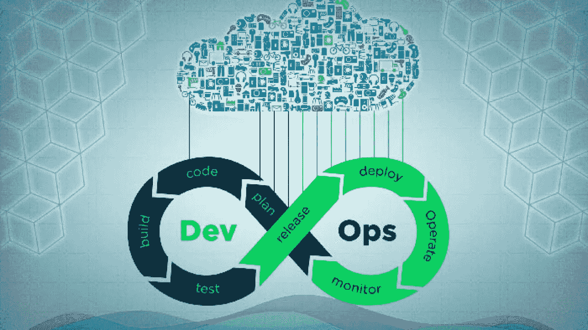
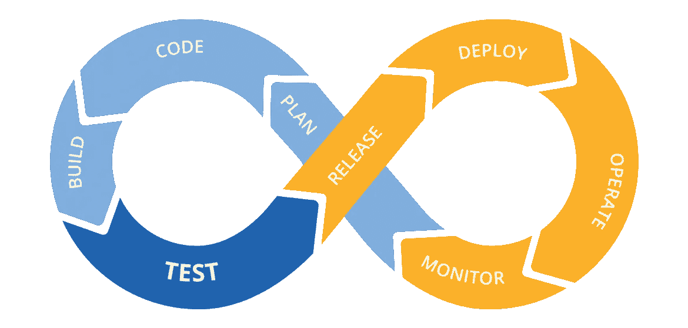
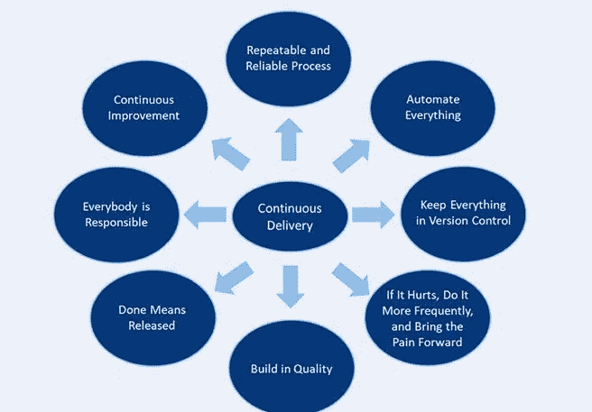
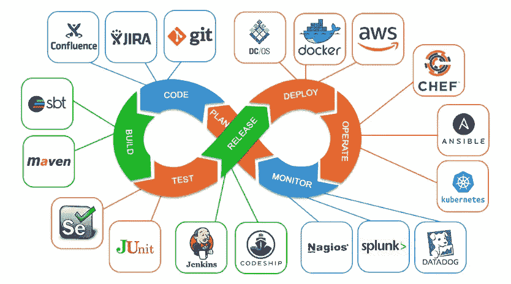

# CI/CD 基础

> 原文：<https://medium.com/globant/basics-of-cicd-7a5aed1eda5a?source=collection_archive---------0----------------------->

Photo by [EINFOCHIPS PES](https://www.einfochips.com/blog/author/einfochips-pes/) on [Einfochips](https://www.einfochips.com/blog/faqs-in-devops/)

您是否曾想过将软件交付生产需要多长时间？

几年？几个月？还是天？

越来越多的公司在几分钟内发布软件。是的，几分钟内。而这一切都是在 CI/CD 的帮助下才有可能实现的。

但是它到底意味着什么，为什么我们需要它，我们可以在这篇文章中得到一个公平的想法。

> **为什么选择 CI/CD :**

通常，团队努力按时按预算将软件交付到客户手中。这是由于缺乏一致性和过多的手工劳动。但是 CI /CD 提供了速度、安全性和可靠性的软件。

*   CI/CD 提高了代码质量并交付了更快的版本。
*   它缩短了新功能的上市时间。
*   自动化降低了成本和人工干预。
*   CI/CD 通过快速反馈循环简化了团队之间的沟通。

> **什么是 CI/CD :**

**持续集成:**
持续集成是开发人员遵循的一种实践。其中包括对共享存储库的不时签入。这些检查被称为推送。每一次推送都经过自动构建的验证，以便在早期发现任何问题。这有助于更容易地定位问题。对于 CI，集成发生在“git 推送”到共享存储库之后。

**连续交付:**
连续交付(CD)在连续集成结束的地方拾取。而竞争情报是自动建立和测试的过程。CD 将所有代码更改部署到构建中的测试或登台环境中。

CD 旨在减少部署或发布过程中的摩擦点。。团队的实现包括自动化构建部署的每个步骤。以便在任何时候都可以进行安全的代码发布。

为了使 CI/CD 成为现实，您需要在软件交付过程中尽可能地自动化一切。并在 CI/CD 管道中运行它。

让我们看看什么是 CI/CD 管道。

> **CI/CD 管道:**

Photo by **Izzy Azeri** on [Mabl](https://www.mabl.com/blog/what-is-cicd)

> **CI 阶段:**

1)推动
2)测试
3)固定

1.  **每天推送掌握**
    在任何软件上工作的时候，都被划分为特性的数量。多个开发人员在同一个特性上工作，共同构成完整的软件。CI 实践是关于将代码推入主分支。因为那是将要被用来发布软件的分支。这个“**推至掌握**”阶段也被称为**基于主干的开发。**
2.  测试
    竞争情报依赖于一套自动化且可靠的测试。这些测试验证开发人员集成的代码。您可以包含任意多您认为关键的测试。但要确定这一点，请记住 CI 的目的是尽快提供反馈。如果一个开发者要等一个小时才能得到反馈，那是行不通的。因此，CI 环路应尽可能短。您可能不得不严重依赖单元测试，而轻微依赖集成测试。
3.  **修复损坏的构建**
    如果您发现任何构建损坏，那么团队应该优先修复它，而不是添加新功能。修复一个坏的构建背后的想法是，这个构建总是会产生可发布的工作代码。

> **光盘原理:**

Photo by [consultancy.uk](http://www.consultancy.uk) on [CD principles](https://www.consultancy.uk/illustrations/news/detail/2018-11-23-083138276-Continuous-Delivery---the-eight-principles.jpg)

**1。可重复且可靠的软件部署流程**

为了便于部署，对所有环境使用相同的发布过程非常重要。这将有助于保持一致性。如果我们对不同的环境使用不同的流程，问题就会突然出现。因此，为了避免这种情况，请在所有环境中使用相同的发布流程。

**2。自动化一切**

人类的时间是非常昂贵的。而且应该花在创造性的练习上，而不是剧本式的任务运行上。所以尽可能自动化。自动化您的构建、测试、发布、配置变更以及其他一切。

**3。持续改进**

在 CD 的所有原则中，它对于有效的自动化是最重要的。它将帮助您跟上不断发展的技术进步。它确保您跟踪变化并改进您的流程以与之匹配。

**4。让一切都处于版本控制中**

保持所有开发、部署和测试方面的版本化是 CD 的关键。代码、配置、脚本、数据库、文档。一切！保持版本化。它确保了高效创建重复性流程的稳定基础。

**5。内置质量**

创建简短的反馈循环，以便在错误产生时立即处理。这将使开发人员能够更快地产生更高质量的代码。此外，很少问题会在以后被发现，那时修复它的成本会更高。

**6。完成意味着释放**

对于 CD，有一个明确的定义，即软件的最终版本应该用于生产。它消除了任何歧义。并帮助每个人达成并交付一致同意的最终版本。

7。如果疼，就更频繁地做，让疼痛提前

首先处理耗时或容易出错的任务是很重要的。重复应用这些有问题的程序将能够更快地检测和修复潜在问题。

8。人人有责

“它在我的工作站上工作”从来都不是一个有效的借口。责任应该延伸到生产。文化变革可能是最难实施的。然而，拥有管理层的支持和热情的拥护者肯定会有所帮助。在整个过程中，每个人都必须分担责任。

> **CI/CD 工具:**

Photo by [tech greek](https://www.techgeeknext.com/) on [DevOps Interview Questions](https://www.techgeeknext.com/devops/ci-cd-devops-interview-questions)

**Jenkins** 是一个强大的基于 Java 的工具，被广泛使用。它最出名的是它的灵活性。它是一个开源的自动化服务器，是用 Java 编写的。它还支持版本控制工具，如 Subversion、Git、Mercurial 和 Maven。它是有据可查的&极度可扩展的，拥有丰富的插件和集成生态系统。

**GitLab** 是一个基于 web 的 Git 库管理器。它有 wiki、问题跟踪和 CI/CD 管道特性，使用开源许可证。

CircleCI 是一个轻量级的基于云的 CI/CD 平台。它自动化了构建、测试和部署过程。它有一个可读的 YAML 配置，易于设置，并且不需要专门的服务器来运行。它适用于需要快速起步的小型项目。

CloudBees 的 Codeship 是一个托管的持续交付平台。它有助于快速、自动、一天多次发布软件。它集成了 GitHub 和 BitBucket。测试通过时自动部署。测试或部署失败时通知您。

**GoCD** 是一个开源的软件开发工具，可以自动化软件的 CD。它具有价值流映射、云原生部署、复杂的工作流建模和高级可追溯性。

除了这些广泛使用的工具，市场上还有一些工具。像 **Azure，Spinnaker，Travis CI，Buddy，Bamboo 等等。**您可以根据自己的需要和适合程度选择其中任何一种**。**

你在你的项目中使用过 CI/CD 工具吗？如果没有，你应该试一试。CI/CD 是一条可行之路。

> **结论:**

总体 CI/CD 提高了软件开发团队的速度、生产力和可持续性。团队可以更快地响应市场的变化。没有那么繁琐重复的任务。这会让团队更加快乐，持续时间更长，生产出更好的产品。