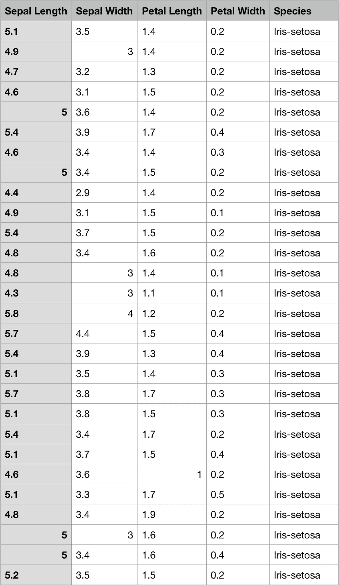
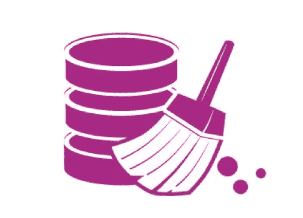
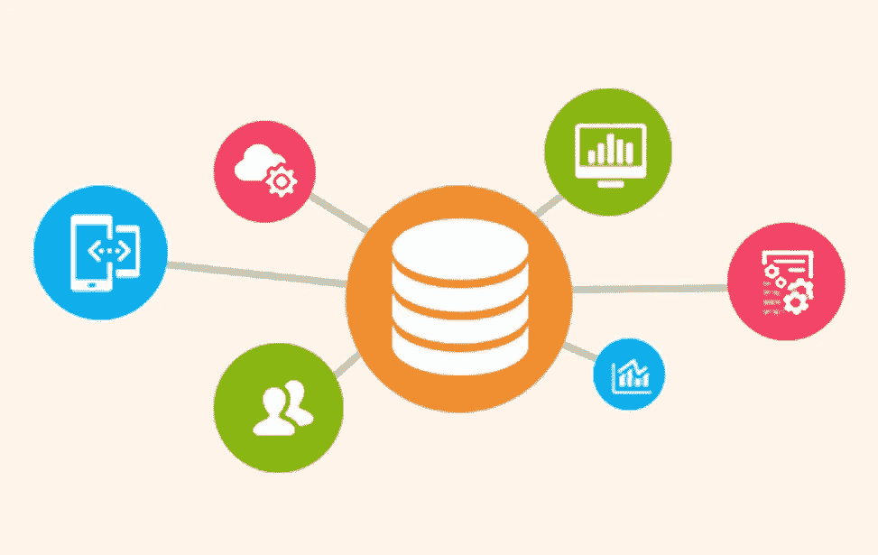
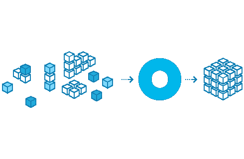
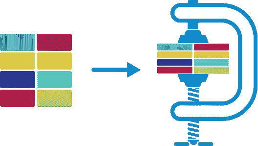

# 数据预处理基础

> 原文：<https://medium.easyread.co/basics-of-data-preprocessing-71c314bc7188?source=collection_archive---------0----------------------->

## 数据预处理的基本理解和技术

The Era of Data is here.

# 什么是数据预处理？

Transforming raw data into appropriate forms.

据[**Techopedia**](https://www.techopedia.com/definition/14650/data-preprocessing)报道，数据预处理是一种数据挖掘技术，涉及将原始数据转换成可理解的格式。真实世界的数据通常不完整、不一致和/或缺乏某些行为或趋势，并且可能包含许多错误。数据预处理是解决这类问题的一种行之有效的方法。

[**Suad A. Alasadi** 和 **Wesam S. Bhaya** ，](https://www.researchgate.net/publication/319990923_Review_of_Data_Preprocessing_Techniques_in_Data_Mining)在他们的杂志中指出，数据预处理是最重要的数据挖掘步骤之一，它处理数据集的数据准备和转换，同时寻求使知识发现更有效。

换句话说，我们可以说数据预处理是数据挖掘中的一个步骤，它提供了帮助我们理解数据并同时进行知识发现的技术。

# 为什么我们需要数据预处理？

Mirela Danubianu 在她的日志中写道，现实世界的数据往往是不完整的、嘈杂的和不一致的。这可能导致收集的数据质量差，进而导致基于这些数据建立的模型质量差。为了解决这些问题，数据预处理提供了将数据组织成适当形式的操作，以便更好地理解数据挖掘过程。

Sample of raw data of Iris Data Sample.

我们可以看到上面的图像是一个原始数据的例子。上面显示的图像是虹膜数据样本。我们无法理解数据的行为或趋势。因此，我们需要通过使用数据预处理来转换或组织它，使其成为合适的格式。

# 数据预处理中提供了哪些技术？

有四种数据预处理方法，由 A. Sivakumar 和 R. Gunasundari 和 在他们的杂志中解释。它们是数据清理、数据集成、数据转换和数据简化。

## 1.数据清理/清洗

Cleaning “dirty” data.

真实世界的数据往往是不完整的、嘈杂的和不一致的。数据清理/清理例程试图填充缺失值，在识别异常值的同时消除噪声，并纠正数据中的不一致。

数据可能有噪声，具有不正确的属性值。由于以下原因，所使用的数据采集仪器可能出现故障。也许在数据输入时出现了人为或计算机错误。数据传输中也可能出现错误。

“脏”数据会给挖掘过程带来混乱。尽管大多数挖掘例程都有一些过程，但它们处理的是不完整或有噪声的数据，这些数据并不总是鲁棒的。因此，一个有用的数据预处理步骤是通过一些数据清洗/清理例程来运行数据。

## 2.数据集成

Combining data from multiple sources.

数据集成涉及数据分析任务，该任务将来自多个来源的数据组合到一个一致的数据存储中，就像数据仓库中一样。这些源可能包括多个数据库、数据立方体或平面文件。数据集成中要考虑的问题是模式集成。这很棘手。

如何将来自多个数据源的真实实体“匹配”起来？这被称为实体识别问题。例如，数据分析师如何确定一个数据库中的 customer_id 和另一个数据库中的 cust_number 指的是同一个实体？答案是元数据。数据库和数据仓库通常都有元数据。简单来说，元数据是关于数据的数据。

元数据用于帮助避免模式集成中的错误。另一个重要问题是冗余。如果一个属性是从另一个表中派生出来的，那么它可能是多余的。属性或维度命名的不一致也会导致结果数据集中的冗余。

## 3.数据转换

Constructing data cube.

数据被转换成适当的挖掘形式。数据转换包括以下内容:

1.  在规范化中，属性数据被缩放到一个小的指定范围内，如-1.0 到 1.0，或 0 到 1.0。
2.  平滑可以去除数据中的噪声。这些技术包括宁滨、聚类和回归。
3.  在聚合中，汇总或聚合操作应用于数据。例如，可以合计每日销售数据，以便计算每月和每年的总量。这一步骤通常用于构建数据立方体，以便以多种粒度分析数据。
4.  在数据的概括中，通过使用概念层次结构，低级或原始/原始数据被高级概念所取代。例如，分类属性被概括为城市或国家的更高层次的概念。类似地，数字属性的值可以映射到更高级别的概念，例如，年龄分为年轻、中年或老年。

## 4.数据整理

Reducing representation of data set.

复杂的数据分析和对大量数据的挖掘可能需要很长时间，这使得这种分析不切实际或不可行。数据简化技术有助于分析数据集的简化表示，而不损害原始数据的完整性，并产生定性知识。数据缩减策略包括以下内容:

1.  在数据立方体聚集中，聚集操作应用于数据立方体构造中的数据。
2.  在降维中，不相关、弱相关或冗余的属性或维度可以被检测和移除。
3.  在数据压缩中，编码机制用于减小数据集的大小。用于数据压缩的方法是小波变换和主成分分析。
4.  在数量缩减中，数据由替代的和更小的数据表示来替代或估计，例如参数模型(仅存储模型参数而非实际数据，例如回归和对数线性模型)或非参数方法(例如聚类、采样和直方图的使用)。
5.  在离散化和概念层次生成中，属性的原始数据值被范围或更高的概念级别所取代。概念层次允许在多个抽象层次上挖掘数据，并且是数据挖掘的强大工具。

# 谢谢你。