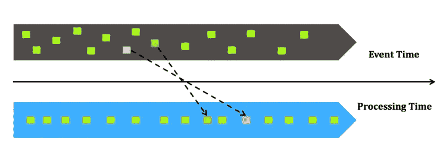

# 数据科学和数据工程世界中的批处理和流式传输

> 原文：<https://medium.com/capital-one-tech/batch-and-streaming-in-the-world-of-data-science-and-data-engineering-2cc029cdf554?source=collection_archive---------0----------------------->

*Capital One 高级数据工程师凯拉·周*

“大数据”的大规模采用创造了大量令人兴奋的新工作角色和技术。数据科学家和数据工程师都已经成为许多技术团队的关键成员，这种共存引发了一场辩论:流还是批处理？为了回答这个问题，理解流和批处理对于数据科学家和数据工程师来说意味着什么是很重要的。如果数据工程师更多地了解建模，数据科学家更多地了解构建管道，制定架构决策可能会变得更容易。

思考它们的区别的一种方式是围绕水的输送进行类比:将批处理想象成使用水桶将水输送给用户，而流式处理就像通过管道输送水，因此更加连续。

## 预测建模

以钓鱼网站预测为例，为了有一个可以预测 URL 好坏的模型，您需要做的第一件事是从数据集中提取特征。这可能是诸如 URL 的长度、域的年龄或者 URL 中是否有前缀或后缀之类的因素。

确定一组特征后，可以将历史数据集分为训练集和测试集，并使用不同的算法或模型参数进行迭代。最终将创建一个经过训练的模型，该模型可以保存并在以后用于预测。

传统上，预测是以批处理或离线方式用于新数据点的。这意味着您将收集所有进入管道的新 URL，并使用您拥有的模型，在整个新数据集上生成预测结果。然而，如今，随着技术的进步，通过将模型部署到流管道中并对数据流中的每个数据点执行模型评分，大多数预测都是实时完成的。

另一个考虑是如何更新一个模型。最传统的方法是“离线”更新模型，这意味着收集所有新的观察结果，例如用户标记为好或坏的所有新 URL，并在夜间或每周重新训练您的模型。

或者，“在线学习”允许对每个新的观察更新模型。这种方法使模型更快地适应新趋势。此外，当数据集太大，无法对整个数据集进行训练时，在线算法有助于以增量方式训练模型。

在线学习有几个要点。在线学习中使用的算法通常计算速度更快，它有助于您的模型更快地适应数据的新趋势。耦合分类算法(例如，逻辑回归)可以用于在线学习，因为它们的优化方法是随机梯度下降。然而，大多数算法只能以批处理方式工作。此外，如果模型的特征提取很慢，可能会影响在线学习和预测的性能。也很难总是以完全自动的方式把事情做好，因为当你进行在线学习时，你不能完全控制进入你的模型的数据。

## 构建流式管道

如果您的团队决定使用流来实现实时决策，重要的是要理解在尝试构建和维护流管道时有几个挑战。

Figure 1

图 1 是一个简单的流管道，它通常有一个存储消息的队列系统、一个流处理引擎(如 Spark Streaming)、一个数据库和一个服务层，它可以是另一个 API 或前端 web 应用程序。

诸如 Kafka 之类的排队系统提供了记录消息的能力。如果您的流处理有一些延迟，或者 Spark 集群关闭，您将不会有任何消息丢失，因为它们都存储在一个队列系统中。

数据的本质让我们思考“时间”有两种主要的方法来推断流式管道中的时间。一种是使用“事件时间”，即事件(例如，用户点击网站上的链接)发生的时间。另一个是处理时间，或挂钟时间，即事件消息到达管道并由程序处理的时间。从下图(图 2)中，我们可以看到一些最先发生的事件，可能实际上在您的系统中已经晚了。

Figure 2

当你建立管道时，你应该考虑事件时间对你是否重要。

图 3 显示了从事件时间不太重要到事件时间很重要的一系列用例。

事件时间无关紧要(也称为时间不可知)的一个例子是 Capital One Second Look 应用程序中的一个特性。它使用机器学习来识别不寻常的消费模式，并向客户发送双重收费、高于上个月的重复收费或高于客户标准的小费的警报。通过名为慷慨小费的功能，我们会在顾客留下异常高的小费时通知他们，例如，原始账单的 50%。这可能意味着我们的顾客真的很喜欢他们的晚餐，或者可能有一个错误。我们想在顾客还在餐厅的时候通知他们，这样他们就可以马上纠正错误。在这种情况下，只要我们能够发现慷慨的提示并通知我们的用户，活动时间就不那么重要了。

Figure 3

在中间地带是我们可以使用近似的用例。例如，对于一家信用卡公司，我们可能会对过去一小时内客户的顶级商户感兴趣。在这种情况下，如果我们没有得到一个准确的计数，也没关系。

即使一些消息被延迟，我们可能仍然能够得到顶级商家的列表。另一方面，事件时间很重要。例如，我们应该在重复数据消除过程中使用事件时间。

## 结论

当决定您的用例需要批处理还是流时，有几件事情需要考虑:

*   会如何影响你的模型精度？
*   您希望在多大程度上控制您的模型更新过程？
*   你允许你的管道有多长的延迟？
*   维护一个管道比维护两个管道更容易吗？

如果您想要实现实时决策，最好以流的方式构建一切，并且批处理可以构建在流的基础上(Kappa 架构)，而不是在流过程旁边有一个批处理过程(Lambda 架构)。

总之，流管道的挑战来自数据流本身和基础设施。流式处理为您提供了更及时的结果，但这是有代价的。然而，并不是每个应用程序都需要实时。此外，如果数据工程师和数据科学家分享他们的知识并了解彼此的挑战，那么架构决策将变得更加容易。

其他资源:

[Github Repo 为例](https://github.com/keiraqz/StreamingLogisticRegression)

[钓鱼网站数据集](https://archive.ics.uci.edu/ml/datasets/Phishing+Websites#)

[火花流 ML 算法](https://spark.apache.org/docs/latest/mllib-linear-methods.html#streaming-linear-regression)

[批量之外的世界:流媒体 101](https://www.oreilly.com/ideas/the-world-beyond-batch-streaming-101)

[λ架构](http://nathanmarz.com/blog/how-to-beat-the-cap-theorem.html)

[卡帕架构](https://www.oreilly.com/ideas/questioning-the-lambda-architecture)

*以上观点为作者个人观点。除非本帖中另有说明，否则 Capital One 不属于所提及的任何公司，也不被其认可。使用或展示的所有商标和其他知识产权都是其各自所有者的所有权。本文为 2017 首都一。*