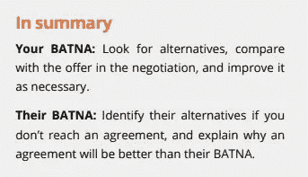

# BATNA(谈判协议的最佳替代方案)

> 原文：<https://medium.com/globant/batna-best-alternative-to-a-negotiated-agreement-17a2768cc2c4?source=collection_archive---------0----------------------->

我们都有一定程度的谈判知识。我们知道不同类型的谈判，我们知道我们需要始终寻找双赢的解决方案，但你如何做到这一点，尤其是在这个时候，你不能与人会面，不能进行面对面的交谈？如果不能达成一致会怎么样？

**什么是 BATNA？**

*BATNA 代表“谈判协议的最佳替代方案”*

这是谈判前准备过程的一部分。但这实际上意味着什么呢？为什么我们需要在任何谈判开始之前发展这个概念？除了让双方都省心之外，它还让我们更好地理解我们愿意“损失”多少，但仍能获得双赢的解决方案。

**我们如何定义 BATNA？**

人们可能认为定义 BATNAs 的一种方法是我们称之为“底线”的方法。如果你是在卖，那就是你愿意卖某个物品的最低价格。如果你正在购买，那就是你愿意购买某个物品的最高价格。底线会保护你不做错误的决定，不以一笔糟糕的交易告终。但是！鉴于你不能改变那些底线，这种方法不是最好的，当然它限制了创造力和想象力。尽可能避免这种方法。

请记住，BATNA 是指你在无法达成协议的情况下的替代方案，在这种情况下，你必须能够在没有协议的情况下离开，如果达成协议，BATNA 必须足够多，并超过你得到的
。

**开发你的 BATNA**

要开发你的 BATNA，你必须遵循两个步骤。确定你和你的对手的选择(这里你必须做出假设)。
2。通过将你最好的想法转化为备选方案来改进它们。

这两个步骤将帮助您定义 BATNA。请记住考虑你的选择的成本，可行性，利弊。
例如:假设我们有一家不在一个小城镇范围内的大工厂，它是该城镇的主要雇主。这个镇经济不景气，如果这个大工厂搬走，这个镇就不复存在了。在这种情况下，工厂没有开发 BATNA，但城镇开发了 BATNA。该镇改变了城镇范围，将工厂包括在内，并向他们收取全额商业费用。这个 BATNA 保持与工厂的对话畅通。

*本文基于 Globant 电子学习平台中的一门课程:谈判培训。*

*更多关于巴特纳:*[*https://www.coursera.org/learn/leadership-collaboration?专业化=组织领导#大纲*](https://www.coursera.org/learn/leadership-collaboration?specialization=organizational-leadership#syllabus)