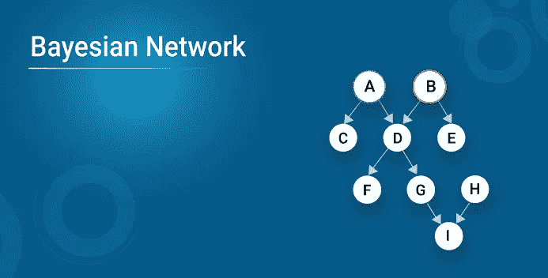
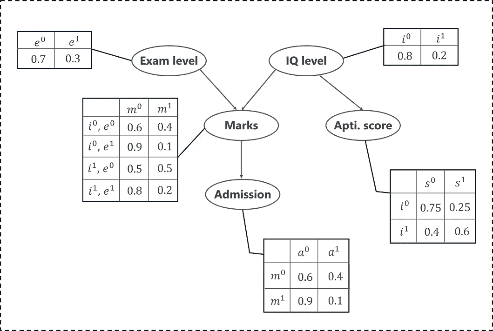
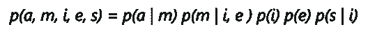
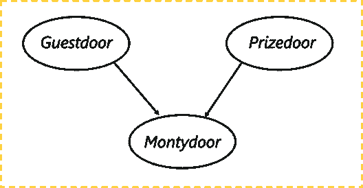

# Python 中的贝叶斯网络

> 原文：<https://medium.com/edureka/bayesian-networks-2499f133d2ec?source=collection_archive---------1----------------------->



贝叶斯网络已经形成了提供有限信息和资源的复杂问题。它正在人工智能和机器学习等时代最先进的技术中实现。拥有这样一个系统是当今以技术为中心的世界的需要。记住这一点，这篇文章完全致力于贝叶斯网络的工作，以及如何应用它们来解决错综复杂的问题。

以下是我将在本文中涉及的主题列表:

1.  什么是贝叶斯网络？
2.  什么是有向无环图？
3.  贝叶斯网络背后的数学
4.  用一个例子理解贝叶斯网络
5.  用 Python 实现贝叶斯网络
6.  贝叶斯网络应用

# 什么是贝叶斯网络？

贝叶斯网络属于概率图形建模(PGM)技术的范畴，该技术通过使用**概率**的概念来计算不确定性。贝叶斯网络通常被称为信念网络，它通过使用**有向无环图** (DAG)来对不确定性建模。

这给我们带来了一个问题:

# 什么是有向无环图？

有向非循环图用于表示贝叶斯网络，并且像任何其他统计图一样，DAG 包含一组节点和链接，其中链接表示节点之间的关系。


这里的节点代表随机变量，边定义这些变量之间的关系。但是这些图表模拟了什么呢？您可以从 DAG 获得什么输出？

DAG 基于每个随机变量的*条件概率分布* (CDP)对事件发生的不确定性进行建模。一个*条件概率表* (CPT)用来表示网络中每个变量的 CPD。

在我们继续前进之前，让我们理解贝叶斯网络背后的基本数学。

# 贝叶斯网络背后的数学

如前所述，贝叶斯模型基于简单的概率概念。那么我们来理解一下条件概率和联合概率分布是什么意思。

## **什么是联合概率？**

联合概率是两个或两个以上事件同时发生的统计量，即 P(A，B，C)，事件 A，B，C 发生的概率。它可以表示为两个或两个以上事件发生交集的概率。

## **什么是条件概率？**

事件 X 的条件概率是在事件 Y 已经发生的情况下，事件发生的概率。

p(X| Y)是事件 X 发生的概率，假设事件 Y 发生。

*   如果 X 和 Y 是相关事件，则条件概率的表达式由下式给出:
    *P (X| Y) = P (X 和 Y) / P (Y)*
*   如果 A 和 B 是独立事件，则条件概率的表达式由以下给出:
    *P(X| Y) = P (X)*

现在让我们看一个例子来理解贝叶斯网络是如何工作的。

# 贝叶斯网络示例

让我们假设我们正在创建一个贝叶斯网络，它将对学生的考试分数(m)进行建模。分数将取决于:

1.  考试水平(e):这是一个离散变量，可以有两个值，(难，容易)
2.  学生的智商(I):一个离散变量，可以取两个值(高，低)

分数将会预测他/她是否会被大学录取。

智商也能预测学生的能力倾向分数。

有了这些信息，我们就可以建立一个贝叶斯网络来模拟学生在考试中的表现。贝叶斯网络可以表示为 DAG，其中每个节点表示预测学生表现的变量。



上面我已经通过 DAG 和条件概率表表示了这种分布。我们现在可以计算这 5 个变量的联合概率分布，即条件概率的乘积:



这里，

*   p(a | m)代表学生根据分数被录取的条件概率。
*   p(m | I，e)代表学生分数的条件概率，给定他的智商水平和考试水平。
*   p(i)表示他的智商水平(高或低)的概率
*   p(e)表示考试水平的概率(难或易)
*   p(s | i)表示根据他的智商水平，他的能力得分的条件概率

DAG 清楚地显示了每个变量(节点)如何依赖于其父节点，即学生的分数依赖于考试水平(父节点)和智商水平(父节点)。同样，性向分数取决于智商水平(父节点)，最后，他能否考上大学取决于他的分数(父节点)。这种关系由 DAG 的边来表示。

如果你仔细观察，我们可以看到一个模式。一个随机变量的概率取决于他的父母。因此，我们可以将贝叶斯网络公式化为:


其中，X_i 表示随机变量，其概率取决于父节点𝑃𝑎𝑟𝑒𝑛𝑡𝑠(𝑋_𝑖).的概率

很简单，不是吗？

贝叶斯网络是应用于预测建模、描述性分析等的最简单而有效的技术之一。

为了让事情更清楚，让我们使用 Python 从头开始构建一个贝叶斯网络。

# 贝叶斯网络 Python

在这个演示中，我们将使用贝叶斯网络来解决著名的蒙蒂霍尔问题。对于那些不知道天魔堂问题是什么的人，我来解释一下:

以电视剧《我们做个交易吧》主持人命名的蒙蒂·霍尔问题(Monty Hall problem)，是一个悖论式的概率谜题，十多年来一直困扰着人们。

这就是它的工作原理。这个游戏包括三扇门，假设其中一扇门后是一辆汽车，其余两扇门后有山羊。所以你从随机选择一扇门开始，比如说 2 号门。另一方面，主人知道车藏在哪里，他打开另一扇门，比如 1 号门(后面有一只山羊)。这里有一个问题，你现在有一个选择，主持人会问你是否想选择 3 号门，而不是你的第一选择 2 号门。


是换个选择更好还是应该坚持第一选择？

这正是我们要模拟的。我们将创建一个贝叶斯网络来了解参与者决定改变选择时的获胜概率。我将使用 Python 来实现贝叶斯网络。

现在让我们开始吧。

***第一步，建立有向无环图。***

该图有三个节点，每个节点代表由以下人员选择的门:

1.  客人选择的门
2.  装有奖品(汽车)的门
3.  蒙蒂选择打开的门



让我们了解一下这里的依赖关系，客人选择的门和包含汽车的门是完全随机的过程。然而，蒙蒂选择打开的门取决于这两扇门；客人选的门，奖品在后面的门。蒙蒂必须以这样的方式选择，门不包含奖品，它不能是客人选择的那个。

```
#Import required packages
import math
from pomegranate import *

# Initially the door selected by the guest is completely random
guest =DiscreteDistribution( { 'A': 1./3, 'B': 1./3, 'C': 1./3 } )

# The door containing the prize is also a random process
prize =DiscreteDistribution( { 'A': 1./3, 'B': 1./3, 'C': 1./3 } )

# The door Monty picks, depends on the choice of the guest and the prize door
monty =ConditionalProbabilityTable(
[[ 'A', 'A', 'A', 0.0 ],
[ 'A', 'A', 'B', 0.5 ],
[ 'A', 'A', 'C', 0.5 ],
[ 'A', 'B', 'A', 0.0 ],
[ 'A', 'B', 'B', 0.0 ],
[ 'A', 'B', 'C', 1.0 ],
[ 'A', 'C', 'A', 0.0 ],
[ 'A', 'C', 'B', 1.0 ],
[ 'A', 'C', 'C', 0.0 ],
[ 'B', 'A', 'A', 0.0 ],
[ 'B', 'A', 'B', 0.0 ],
[ 'B', 'A', 'C', 1.0 ],
[ 'B', 'B', 'A', 0.5 ],
[ 'B', 'B', 'B', 0.0 ],
[ 'B', 'B', 'C', 0.5 ],
[ 'B', 'C', 'A', 1.0 ],
[ 'B', 'C', 'B', 0.0 ],
[ 'B', 'C', 'C', 0.0 ],
[ 'C', 'A', 'A', 0.0 ],
[ 'C', 'A', 'B', 1.0 ],
[ 'C', 'A', 'C', 0.0 ],
[ 'C', 'B', 'A', 1.0 ],
[ 'C', 'B', 'B', 0.0 ],
[ 'C', 'B', 'C', 0.0 ],
[ 'C', 'C', 'A', 0.5 ],
[ 'C', 'C', 'B', 0.5 ],
[ 'C', 'C', 'C', 0.0 ]], [guest, prize] )

d1 = State( guest, name="guest" )
d2 = State( prize, name="prize" )
d3 = State( monty, name="monty" )

#Building the Bayesian Network
network = BayesianNetwork( "Solving the Monty Hall Problem With Bayesian Networks" )
network.add_states(d1, d2, d3)
network.add_edge(d1, d3)
network.add_edge(d2, d3)
network.bake()
```

在上面的代码' A '，' B '，' C '，分别代表客人选的门，奖品门，蒙蒂选的门。这里我们画出了每个节点的条件概率。因为奖品门和客人门是随机抽取的，所以没有什么可考虑的。然而，Monty 选择的门取决于其他两扇门，因此在上面的代码中，我已经考虑了所有可能的情况，画出了条件概率。

下一步是使用这个模型进行预测。贝叶斯网络的优势之一是能够根据“观察变量”的值推断出任意“隐藏变量”的值。这些隐藏变量和观察变量不需要预先指定，观察的变量越多，对隐藏变量的推断就越好。

现在我们已经建立了模型，是时候做预测了。

```
beliefs = network.predict_proba({ 'guest' : 'A' })
beliefs = map(str, beliefs)
print("n".join( "{}t{}".format( state.name, belief ) for state, belief in zip( network.states, beliefs ) ))

guest A
prize {
"class" :"Distribution",
"dtype" :"str",
"name" :"DiscreteDistribution",
"parameters" :[
{
"A" :0.3333333333333333,
"B" :0.3333333333333333,
"C" :0.3333333333333333
}
],
}

monty {
"class" :"Distribution",
"dtype" :"str",
"name" :"DiscreteDistribution",
"parameters" :[
{
"C" :0.49999999999999983,
"A" :0.0,
"B" :0.49999999999999983
}
],
}
```

在上面的代码片段中，我们假设客人选择了门“A”。给定该信息，奖励门为“A”、“B”、“C”的概率是相等的(1/3)，因为它是一个随机过程。但是，既然客人选了门‘A’，那么蒙蒂选‘A’的概率显然是零。另外两扇门有 50%的机会被蒙蒂选中，因为我们不知道哪扇门是奖品门。

```
beliefs = network.predict_proba({'guest' : 'A', 'monty' : 'B'})
print("n".join( "{}t{}".format( state.name, str(belief) ) for state, belief in zip( network.states, beliefs )))

guest A
prize {
"class" :"Distribution",
"dtype" :"str",
"name" :"DiscreteDistribution",
"parameters" :[
{
"A" :0.3333333333333334,
"B" :0.0,
"C" :0.6666666666666664
}
],
}
monty B
```

在上面的代码片段中，我们为贝叶斯网络提供了两个输入，这就是事情变得有趣的地方。我们提到了以下内容:

1.  客人选择门“A”
2.  蒙蒂打开了 B 门

注意输出，汽车在门“C”后面的概率大约是。66%.这就证明了，如果嘉宾切换选择，他获胜的概率更大。虽然这可能会让你们中的一些人感到困惑，但众所周知的事实是:

*   决定换门的客人赢了大约 2/3 的时间
*   拒绝转换的客人赢了大约 1/3 的时间

贝叶斯网络用于预测不确定任务和结果的情况。在下面的部分中，你将理解贝叶斯网络是如何被用来解决更多这样的问题的。

# 贝叶斯网络应用

贝叶斯网络在医疗保健、医学、生物信息学、信息检索等领域有无数的应用。下面是贝叶斯网络在现实世界中的应用列表:

1.  **疾病诊断:**贝叶斯网络常用于医学领域对疾病的检测和预防。它们可以用来模拟可能的症状，并预测一个人是否患病。
2.  **优化的网络搜索:**贝叶斯网络通过理解搜索的意图并提供最相关的搜索结果来提高搜索的准确性。它们可以有效地将用户的意图映射到相关内容，并提供搜索结果。
3.  **垃圾邮件过滤:**贝叶斯模型已经在 Gmail 垃圾邮件过滤算法中使用了多年。他们可以通过理解邮件的上下文含义来有效地对文档进行分类。它们也用于其他文档分类应用。
4.  **基因调控网络:** GRNs 是由许多 DNA 片段组成的基因网络。它们被有效地用来直接或间接地与细胞的其他部分进行通讯。诸如贝叶斯网络的数学模型被用于模拟这种细胞行为，以便形成预测。
5.  **生物监测:**贝叶斯网络在监测药品中使用的化学剂量数量方面发挥着重要作用。

如果你想查看更多关于人工智能、DevOps、道德黑客等市场最热门技术的文章，你可以参考 Edureka 的官方网站。

请留意本系列中的其他文章，它们将解释 Python 和数据科学的各个方面。

> *1。* [*Python 教程*](/edureka/python-tutorial-be1b3d015745)
> 
> *2。* [*Python 函数*](/edureka/python-functions-f0cabca8c4a)
> 
> *3。*[*Python 中的文件处理*](/edureka/file-handling-in-python-e0a6ff96ede9)
> 
> *4。* [*Python Numpy 教程*](/edureka/python-numpy-tutorial-89fb8b642c7d)
> 
> *5。* [*Scikit 学习机*](/edureka/scikit-learn-machine-learning-7a2d92e4dd07)
> 
> *6。* [*Python 熊猫教程*](/edureka/python-pandas-tutorial-c5055c61d12e)
> 
> *7。* [*Matplotlib 教程*](/edureka/python-matplotlib-tutorial-15d148a7bfee)
> 
> 8。 [*Tkinter 教程*](/edureka/tkinter-tutorial-f655d3f4c818)
> 
> *9。* [*请求教程*](/edureka/python-requests-tutorial-30edabfa6a1c)
> 
> *10。* [*PyGame 教程*](/edureka/pygame-tutorial-9874f7e5c0b4)
> 
> *11。* [*OpenCV 教程*](/edureka/python-opencv-tutorial-5549bd4940e3)
> 
> *12。* [*网页抓取用 Python*](/edureka/web-scraping-with-python-d9e6506007bf)
> 
> *13。* [*PyCharm 教程*](/edureka/pycharm-tutorial-d0ec9ce6fb60)
> 
> *14。* [*机器学习教程*](/edureka/machine-learning-tutorial-f2883412fba1)
> 
> *15。*[*Python 中从零开始的线性回归算法*](/edureka/linear-regression-in-python-e66f869cb6ce)
> 
> *16。* [*用于数据科学的 Python*](/edureka/learn-python-for-data-science-1f9f407943d3)
> 
> *17。* [*Python 正则表达式*](/edureka/python-regex-regular-expression-tutorial-f2d17ffcf17e)
> 
> *18。*[*Python 中的循环*](/edureka/loops-in-python-fc5b42e2f313)
> 
> *19。* [*Python 项目*](/edureka/python-projects-1f401a555ca0)
> 
> *20。* [*机器学习项目*](/edureka/machine-learning-projects-cb0130d0606f)
> 
> *21。*[*Python 中的数组*](/edureka/arrays-in-python-14aecabec16e)
> 
> *22。* [*在 Python 中设置*](/edureka/sets-in-python-a16b410becf4)
> 
> *23。*[*Python 中的多线程*](/edureka/what-is-mutithreading-19b6349dde0f)
> 
> 24。 [*Python 面试题*](/edureka/python-interview-questions-a22257bc309f)
> 
> *25。*[*Java vs Python*](/edureka/java-vs-python-31d7433ed9d)
> 
> *26。* [*如何成为一名 Python 开发者？*](/edureka/how-to-become-a-python-developer-462a0093f246)
> 
> 27。 [*Python Lambda 函数*](/edureka/python-lambda-b84d68d449a0)
> 
> *二十八。* [*网飞如何使用 Python？*](/edureka/how-netflix-uses-python-1e4deb2f8ca5)
> 
> *29。*[*Python 中的套接字编程是什么*](/edureka/socket-programming-python-bbac2d423bf9)
> 
> *30。* [*Python 数据库连接*](/edureka/python-database-connection-b4f9b301947c)
> 
> *31。*[*Golang vs Python*](/edureka/golang-vs-python-5ac32e1ef2)
> 
> *32。* [*Python Seaborn 教程*](/edureka/python-seaborn-tutorial-646fdddff322)
> 
> *33。* [*Python 职业机会*](/edureka/python-career-opportunities-a2500ce158de)

*原载于 2019 年 7 月 12 日*[*www.edureka.co*](https://www.edureka.co/blog/bayesian-networks/)*。*