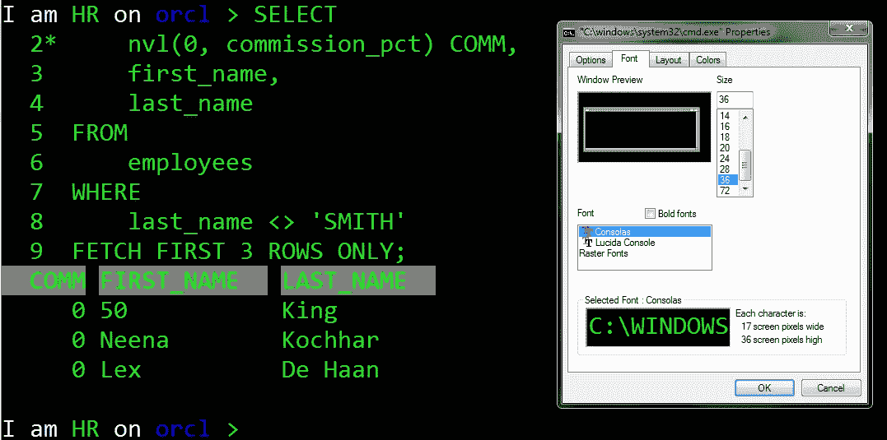
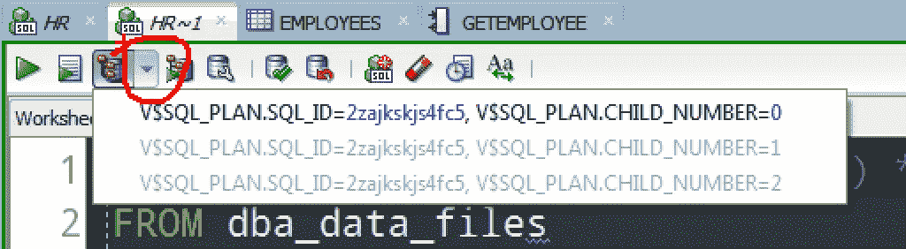

# 友善待人..当在演示或演示中显示代码时

> 原文：<https://medium.com/oracledevs/be-nice-when-showing-code-in-a-demo-or-presenation-b6d1c26ab026?source=collection_archive---------0----------------------->

作为一个 80 年代的孩子，我用电影台词来生活。其中一个来自 Roadhouse。

我希望你在不友善的时候变得友善。

这么说让我很难过，但你们中的很多人并不友善。但是你离成功已经很近了。

作为一个经常展示和讲述我们的开发工具的人，我每天花很多时间演示涉及 SQL 和 PL/SQL 的特性——包括图形用户界面和命令行界面。

我有很多技巧和窍门可以让用户尽可能地愉快，但是有两个技巧同样适用于这两种环境:

#1 增加你的字体大小

并非所有人都坐在“前排”。而且不是每个人都是视力 20/20 甚至更好的退役飞行员。

This is really easy — just increase the Font Size.

这是不是意味着当涉及到换行或者窗口大小时，你必须重新考虑你的代码在屏幕上的显示方式？是的。但是如果你是去传递信息或者帮助某人，那就帮助他们。

如果他们能清楚地看到你在展示什么，那么他们就能更容易地跟随你的思路，他们会完整地带着你的信息离开。

尽可能高。在 Windows CMD 中我是 36，在我的 GUI 中，我目前是 22。

#2.大量使用屏幕放大镜。

像平常一样实时做幻灯片或演示。暂停半秒钟，然后倒回到动作镜头的开头。放大。显示您是如何开始这个过程的，确切地显示您点按的位置，或者准确地重复您使用的键盘顺序。人们会问，他是怎么做到的/在哪里做到的？

The ZoomIt utility on Windows even allows you to draw on the screen for extra emphasis after you have zoomed in.

让他们记下来。

然后做这件事，并再次放大结果。

如果你提前预见到你的听众的需求和问题，你就离赢得他们的心更近了。

不要失去他们，因为他们不知道你在屏幕上做什么。

# 有争议的说法:考虑一下白屏黑字是否真的有用

我会说，‘不，不，不是这样的。’这是主观的说法。但是我见过很多演示文稿，其中的代码样本和截屏看起来像是直接从记事本或 vi 中出来的，而没有考虑它会如何出现。

如果你的代码是一篇短文，那么就要注意美观。不要因为有人被你产品的适合度和光洁度分散了注意力而输掉技术辩论。

也许你不喜欢我在上面展示代码的方式，但是对我来说，以白色为主要背景和主题的幻灯片上更暗的图像似乎更好。