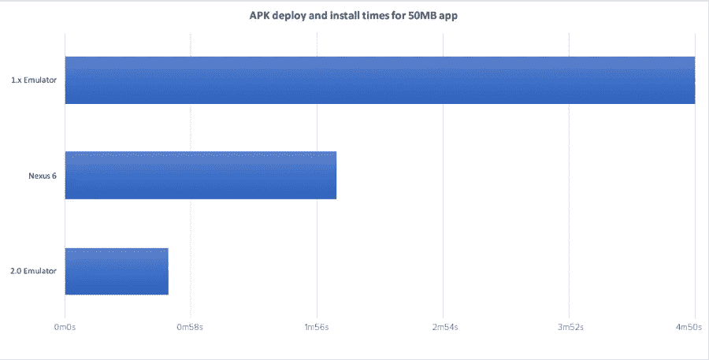
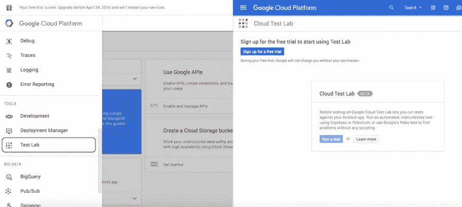
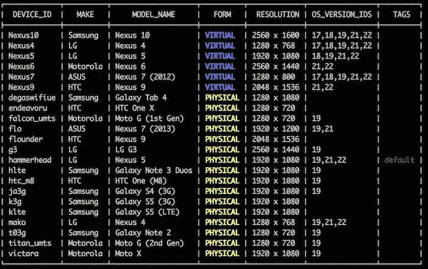
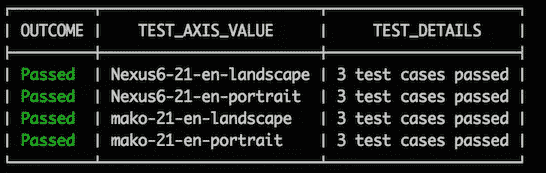
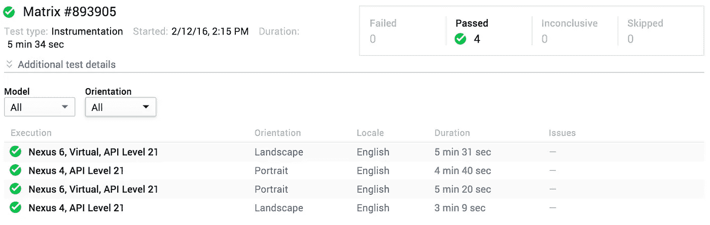

# 测试驱动的开发——准备好，设置好，使用谷歌云测试实验室

> 原文：<https://medium.com/capital-one-tech/be-ready-for-tdd-google-cloud-test-lab-20b07ddabc8b?source=collection_archive---------0----------------------->


你是否曾经开发过一个 Android 应用程序，为它编写配置了 CI 的测试，并觉得这是一个非常累人的设置过程？如果是这样，你不是唯一的一个，这篇文章是专门为你！

在 2015 年谷歌 I/O 大会上，谷歌宣布了一项名为 [**云测试实验室**](https://developers.google.com/cloud-test-lab/%20for) 的新测试服务，该服务将允许开发者提交一个应用程序，并从云中对多个 Android 设备进行自动测试。目前，有 11 种物理设备和 6 种虚拟设备可供选择，包括一些最受欢迎的 Android 型号和品牌。

云测试实验室如何承诺减轻 Android 自动化测试的复杂性？

## 竞争持续集成选项

我对 Android 的几个持续集成(CI)选项有经验。在过去的项目中，我使用了:

1.  詹金斯与 Genymotion。
2.  用模拟器圈 CI(在 Android Studio 2.0 之前，这是*我们熟知已久的模拟器*)。
3.  詹金斯与 USB 连接的物理设备。



APK deploy and install duration comparison

但是，这些选项都没有真正满足我的 CI 需求，原因如下:

**复杂的配置** —所有这些选项都需要一定程度的脚本，不能简单地启动和运行。例如，有些需要一个脚本来启动，这意味着等待一个在线信号，可能需要五分钟才能找到。

**不稳定性**——有时这些选项是不可预测的——没有实际原因的失败和没有实际原因的成功。有一次，构建失败了两次，在第三次尝试时，没有更改任何设置，它成功了。总的来说，构建不一致，没有为失败提供任何好的原因，因此没有关于如何避免失败的可教的时刻。

**速度慢**——这听起来可能很傻，但很重要。并非所有人都能负担得起多时隙 CI 服务。有时我会在一个实例上运行多个应用程序的任务。一项工作的延迟会导致另一项工作的瓶颈，从而影响下一项工作，然后一切都会被延迟。

**可扩展性** —由于速度较慢，我不会考虑在上面列出的 CI 选项上运行多个设备和多个方向的测试。通常，在一个设备上运行一个方向的测试，对于一个一般大小的项目来说，需要大约 15-20 分钟。当我尝试在多个设备上运行测试时，在多个设备上进行配置并不总是那么容易。

此外，只使用一个配置运行验收测试不会创造很多价值；特别是考虑到 Android 屏幕从小到 x-大各不相同，分辨率在主要设备之间从高到 XXX-高各不相同。

# **用云测试实验室做实验**

鉴于 Android 其他持续集成选项的复杂配置、不稳定性、速度慢和可扩展性问题，云测试实验室会成为游戏改变者吗？我乐意将测试从这些选项转移到云测试实验室吗？

*这里是建立云测试实验室的基本纲要。*



云测试实验室仍处于测试阶段。你需要在 https://console.cloud.google.com[的](https://console.cloud.google.com/)注册测试版才能使用。

登录后，打开左上方的导航抽屉，选择“测试实验室”。如果您尚未注册，请单击“注册免费试用”并按照说明进行操作。

接下来，在 https://console.developers.google.com/project 的[创建一个谷歌项目。](https://console.developers.google.com/project)

## 设置

关于如何使用云测试实验室，有几个选项。因为我的目标是用 CI 进行测试，所以我选择了命令行选项。

**安卓工作室选项，请参考**[**https://developers.google.com/cloud-test-lab/android-studio**](https://developers.google.com/cloud-test-lab/android-studio)

```
1\. Install Google Cloud SDK. Open terminal and 
$***curl https://sdk.cloud.google.com | bash***2\. Restart the terminal. Now you can use gcloud command3\. On terminal, make sure to have sdk up-to-date
$***gcloud components update beta***4\. Configure your project ID. You can find yours at [https://console.developers.google.com/](https://console.developers.google.com/)
$***gcloud config set project your-project-id***5\. Authenticate to use Cloud Test Lab with gcloud
$***gcloud auth login***
```

## 现在我们跑吧，指挥官！

*假设您使用的是 Gradle wrapper。
* *我在底部添加了一个示例应用程序的 GitHub 链接，所以你可以自己尝试一下。如果你有自己的应用程序，我鼓励你设置你的应用程序。

```
1\. Generate app and app test’s apk.
$***./gradlew assembleDebug assembleAndroidTest***2\. ***cd app/build/outputs/apk***3\. Run Run Run  
$***gcloud beta test android run \
 --type instrumentation \
 --app app-debug.apk \
 --test app-debug-androidTest-unaligned.apk \
 --device-ids Nexus6,mako \
 --os-version-ids 21 \
 —-locales en \
 —-orientations portrait,landscape***
```

要查找可用的设备 id，请键入$***g cloud beta test Android 设备列表***



同样，$ ***gcloud beta 测试 android 版本列表*** 和$ ***gcloud beta 测试 android 语言环境列表，*** 查找可用版本和语言环境，相应地。

更多选项:[https://cloud . Google . com/SDK/g cloud/reference/beta/test/Android/run](https://cloud.google.com/sdk/gcloud/reference/beta/test/android/run)

# 容易吗？

简单。

不再需要脚本，不再需要自己使用仿真器或设备准备设备。

和

只需一个简单的命令，您就可以将配置为在多个设备/多个方向上运行。

## 结果输出



您可以像这样查看控制台输出，也可以在[https://console.developers.google.com/testlab](https://console.developers.google.com/testlab)查看更详细的分解



## 这是游戏规则的改变者吗？

在引入云测试实验室之前，我提到了对当前 CI 解决方案的四个抱怨——复杂的配置、不稳定性、速度慢和可扩展性。让我们将这些问题与云测试实验室进行比较。

***复杂配置:*** 一般配置和设置体验是目前为止用云测试实验室最好的。没有云测试实验室，我不得不使用一些脚本和命令来准备测试设备。现在，我可以只用四行命令来实现。

***不稳定:*** 现在判断这个还为时过早。在对云测试实验室进行试验时，我运行了一个简单的应用程序，其中只有三个测试，它表现良好。为了真正了解云测试实验室有多稳定，我需要用一些包含更多测试的工业应用程序来测试它。

***速度慢:*** 这个问题基本不变。一个包含三个 Espresso 测试的测试项目需要 3-6 分钟/配置，另外还需要几分钟将 app.apk 和 app-test.apk 上传到云测试实验室。

***可扩展性:*** 一方面，云测试实验室易于设置和运行多种配置。然而，缓慢的速度仍然存在，并且在多种配置上运行要花费相当多的时间。

# **结论**

从我个人的使用来看，测试问题要么得到了改善，要么与谷歌云测试实验室保持一致。随着额外的新功能(如自动屏幕记录)和对配置复杂性等问题的改进，以及可用设备的冗长列表，Cloud Test Lab 无疑是为最大限度地使用而设计的。

然而，谷歌云测试实验室仍处于测试阶段，仍有改进的空间。例如，总体性能可以得到提高，虽然日志视频是一个很好的特性，但是视频延迟使得很难调试测试失败。

我肯定会关注云测试实验室在正式发布中的进展，即使在此期间我会保留我的选择。

*   *带测试的示例应用:[https://github.com/emmasuzuki/EspressoSpoonDemo](https://github.com/emmasuzuki/EspressoSpoonDemo)

如需了解更多关于 Capital One 的 API、开源、社区活动和开发人员文化的信息，请访问我们的一站式开发人员门户网站 DevExchange。[*https://developer.capitalone.com/*](https://developer.capitalone.com/)