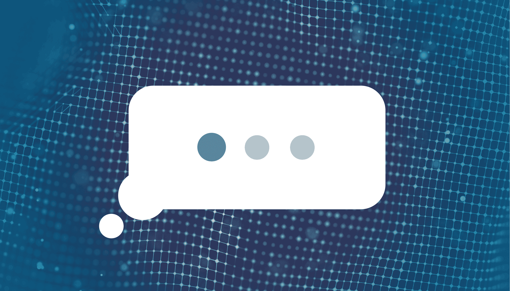
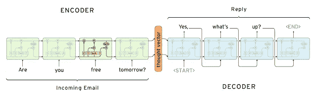
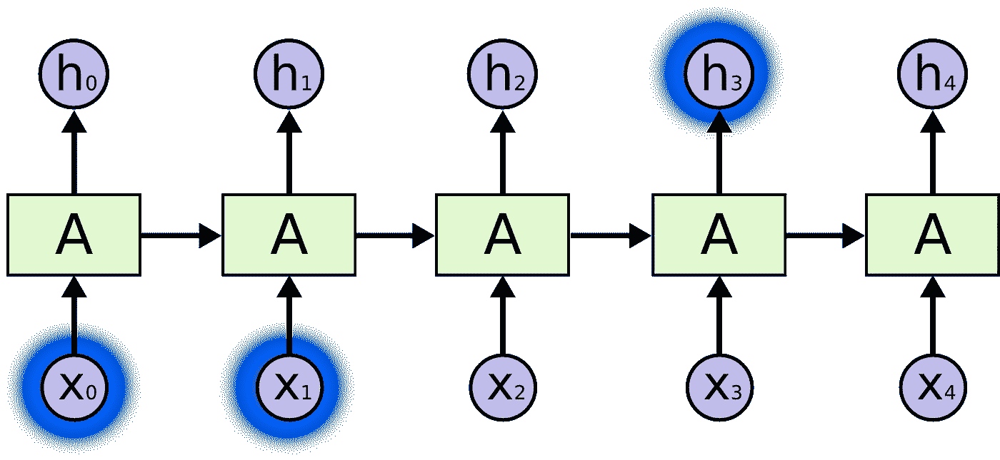
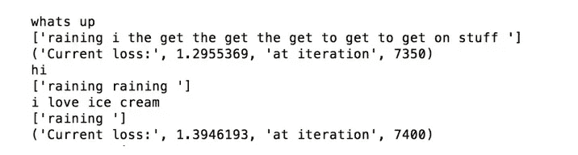
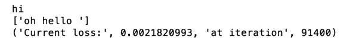
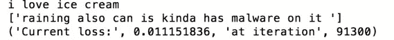

# 不到一小时就成为机器学习专家

> 原文：<https://medium.com/capital-one-tech/become-a-machine-learning-expert-in-under-an-hour-8437939ae1e2?source=collection_archive---------1----------------------->

*Capital One 的数据工程师 Domenic Puzio 和软件工程师 Jennifer Van*

下周，我们将前往奥斯汀，在 SXSW 上发表演讲，我们非常激动！(当然说话是爽，但是我们真的等不及电影节了。)我们的演讲名为*如何在一小时内成为机器学习专家*，顾名思义，这将是所有机器学习(ML)的速成班。我们将深入研究的最酷的事情之一是深度学习，我们将把它应用于一个基于文本的问题:创建聊天机器人。

**深度学习炒作上的关卡设置**

深度学习是两件事:

*   一种利用传统神经网络并对其进行增压的想法。
*   一个巨大的流行语。

我们谈话的目标是打破围绕机器学习的宣传，并了解它是如何工作的，因此我们作为消费者，可以更好地了解如何适应一个日益由机器学习驱动的世界。我们希望这篇博客文章能够进一步推断我们将在舞台上讨论的一些技术，此外还提供了创建我们的聊天机器人示例的详细过程。

*但是首先，我们为什么关注深度学习？这项技术什么时候变得如此重要了？*

对我们来说，“为什么”很简单:深度学习将无处不在。它正在改变我们开车的方式(特斯拉)，我们挑选电影的方式(网飞)，甚至我们约会的对象(Tinder)。深度学习让嘈杂、不清楚的数据变得有价值，比如你的照片库或你滚动新闻订阅的速度——所有这些都可以转化为关于你说话方式、你去过的地方和你是什么类型的人的情报。这种智慧可以转化为金钱。深度学习应该改变我们对数据的思考方式以及我们选择分享数据的方式。

至于“何时”，深度学习背后的想法已经存在了 50 多年，但直到过去几年才开始流行。深度学习需要大量的数据来理解复杂的问题；要达到专家水平，一个模型需要大约 1000 万个数据点。处理所有这些数据需要软件方面更智能的算法，以及硬件方面更强的计算能力。幸运的是，我们在云端拥有按需计算资源，以及使用 GPU 处理来加速计算的专门机器学习机器，这两者都极大地增强了深度学习的能力。实现深度学习技术所需的工具也变得更加容易获得——许多机器学习软件现在都是开源的，因此比以往任何时候都有更多的人可以为这个不断增长的领域做出贡献。更广泛地说，在过去几年中，软件、硬件和社会对技术进步的接受程度的变化已经促成了深度学习应用的广泛采用和日益增长的需求。

由于深度学习需要大量的计算能力和一公吨的数据，所以我们只希望在必要的时候使用它。深度学习应该保留给存在客观事实的问题(因此我们的模型可以评估它是如何做的，并相应地学习)，并在规模非常大的空间中进行。我们也不想用机器学习来执行可以用一系列规则总结出来的任务。给交通灯编程不需要深度学习，但训练计算机驾驶汽车需要。

我们在 Capital One 将深度学习用于各种用例，从网络安全到图像识别。我最喜欢的一个例子是 [**Eno**](https://www.capitalone.com/applications/eno/) ，我们的 ML 驱动聊天机器人可以帮助你通过短信管理你的 Capital One 银行和信用卡账户。虽然我们的团队没有专门研究 Eno，但我们认为建立自己的聊天机器人会很有趣，这只是一个例子，不会投入生产，但仍然很有趣——我们开始创建一个可以像我们一样说话的聊天机器人！

**建造我们假想的聊天机器人**

首先，我们遵循的所有步骤和代码都可以在 [GitHub](https://github.com/sugargreenbean/deep-learning-workshop) 上找到，所以如果你想在家里尝试，先去那里。

就像我们之前说的，建立深度学习模型需要大量的数据。我们可以从哪里获得大量关于我们说话方式的数据呢？我们前往脸书。正如你可能意识到的，脸书跟踪你的每个赞、照片、状态、消息和戳。虽然这很可怕，但也有一点好处:他们让你可以下载这些信息。因此，我们将使用我们的 Facebook Messenger 数据来训练一个聊天机器人。

第一步是从脸书下载您的数据，然后使用开源工具将其解析为消息和响应(这些步骤在 GitHub 资源库中有详细说明)。现在，我们训练模型！为了训练深度学习模型，我们需要为我们的网络提供许多样本输入(发送给我们的消息)和许多样本(我们的回复)。通过接收许多消息和响应，该模型学习了我们使用的语言中存在的潜在模式:不同单词的含义、造句的语法，甚至如何交谈。

如果你不经常使用脸书信使，或者如果你不使用它来交谈(我的大多数消息都是我想与朋友分享的链接)，网络可能无法拾取构成你说话方式的潜在模式。但最起码，结果会很有趣！

对于学习这些复杂关系的神经网络来说，它需要成千上万的输入，并且它会多次查看每个输入。由于这些时间密集的需求，模型将需要一段时间来训练——在标准笔记本电脑上至少需要四个小时(同样，开始模型训练的步骤在 GitHub 上)。所以，当你的模型在训练的时候，让我们重温一下这种模型背后的一些理论。

在引擎盖下，这个聊天机器人模型是一个序列到序列的长短期记忆(LSTM)网络。那里有很多东西要打开。

序列到序列意味着模型以一个序列(在这种情况下，一个单词序列形成一条消息)接收数据，并输出一个序列(回复，另一个单词序列)。这是两个协同工作的神经网络；第一个，有时被称为编码器，接受输入序列，并学习如何将其压缩为总结最重要部分的“思想向量”。第二个是解码者，学习如何获取这些想法，并用适当的回复来回应它们。编码器可能会解释为你的朋友在问问题和谈论天气；解码器可以学习用当前的温度和降雨量来回答天气问题。这两个网络通过查看我们的训练数据中的许多例子，通过查看你的信息历史，来学习表达想法和回应想法的最佳方式。您可以在下面看到序列到序列网络的结构。

长短期记忆网络(LSTMs)是一种神经网络，旨在捕捉消息文本等顺序输入中的关系。它们提供了整个序列的短期记忆，允许网络回忆以前的决定。假设我们的 LSTM 正试图解读这条信息，“明天天气会怎么样？”

模型将在句子的末尾看到问号，并记住它在序列的前面看到了单词“天气”。我们称之为*捕获时间依赖*，这是 LSTMs 擅长的挑战。从句子到股票价格，我们关心的许多数据都是按顺序出现的，因此 LSTMs 是机器学习工程师工具箱中非常有价值的技术。

LSTMs 的惊人之处在于，它们可以捕捉到很长一段时间内的时间依赖性。也许这条信息看起来更像这样:

*“我真的很担心我们明天远足的天气。上个月，我穿着旧衣服，天下雨了。我们玩得很不愉快，因为岩石太滑了！你怎么看？”*

尽管这是在问一个关于明天天气的类似问题，但“天气”这个词离最终的问号要远得多。对于其他神经网络体系结构，记住很久以前的依赖关系会很困难，但 LSTMs 更有能力。LSTM 记忆的秘密有两个方面:循环连接和细胞状态。

在这种情况下，LSTM 神经元一个字一个字地顺序接收输入。对于每个新单词，LSTM 给出一个输出值；它将这个值传递给网络中的其他神经元，但也将这个值*返回给它自己*。这意味着当神经元获得一个新单词时，它也从前一个单词中获得它的想法。对前一个单词的思考基于该单词，但模型对前一个单词之前的单词的思考也是基于前一个单词之前的单词。这是递归:我们最后的预测是基于整个序列中出现的值。神经元对第一个单词的想法会影响它对第二个单词的想法。从每个单词中提取的信息在每个后续预测中重复出现(或*重现*，影响最终输出。如下图所示，这些循环连接是 LSTMs 建立短期记忆的一部分。

循环连接的问题是它们给序列中最近的项目更大的权重。虽然“天气”可能会对神经元关于“远足”(三个单词之外)的想法产生相当大的影响，但它对神经元关于问号(三十个单词之外)的看法的影响却是指数级的小。简而言之，我们序列中的项目的价值会随着时间的推移而降低。这就是 LSTM 的细胞状态来拯救。

每个 LSTM 神经元——除了接收当前单词和之前单词的信息——还保持一种状态，一种随着时间推移而失去相关性的记忆。一个 LSTM 神经元可能会选择记住我们正在处理的句子类型(问题)；一个神经元可能关心一个重要的概念(天气)；另一个可能存储位置(旧抹布)；一个神经元可能会记录时间框架(明天)。考虑到所有这些信息，LSTM 网络作为一个整体(所有这些单个神经元的组合)可以对整个语句的含义做出准确的判断:一个关于 Old Rag 明天天气的问题。

LSTMs 维持这种单元状态或存储器的方式是通过两个门。第一个门告诉神经元是否要忘记它的细胞状态。例如，我们知道一个神经元正在跟踪正在讨论的位置(旧 Rag)。如果文章继续提到一个新的徒步旅行地点(比如说白橡树峡谷)，我们应该忘记老拉格。

接下来，我们需要记住我们细胞状态中的新地方:白橡树峡谷。这是第二个门处理的，向单元状态添加新信息。这两个门由单元的输入控制，这是有意义的，因为当我们在序列中看到新的位置时，我们只需要忘记旧的 Rag。此外，我们只知道通过查看新的输入来记住旧的内容。*遗忘门*和*记忆门*形成了一个动态的细胞记忆，随着时间的推移保持其重要性。

下面，我们可以看到一个例子 LSTM 的神经元正在学习使用细胞状态来捕捉像行长度和引用这样的关系。

LSTM 神经元细胞状态的最后一个方面是至关重要的:每个神经元*学习*它应该记住的东西。作为机器学习工程师，我们不会告诉网络回忆位置或时间或其他任何事情。该网络将学习我们数据中的哪些关系是最重要的，然后捕捉这些关系。这就是深度学习如此强大的原因。我们的模型可以学习我们自己可能无法描述的关系(许多人类语言理解发生在潜意识中)，并且可以记住信息，而无需被告知什么信息是相关的。

现在我们知道了我们的模型是如何学习的，让我们检查一下它是如何做的。

我们在许多时期或时间段上训练我们的模型，在此期间，模型看到我们的输入和输出值。在最初的时代，我们的模型只是学习。我们向它传递示例消息(比如，“你是认真的吗？”)，但它无法给出回复(因此出现了空括号)。

在我们的训练进行到大约一半时，我们可以开始在模型的反应中看到单词；我们可以看聊天机器人学英语。从这些早期的回复来看，很明显，当天气不好，我们不在外面玩的时候，我们会更频繁地使用 Facebook Messenger。

LSTM 开始使用常用词汇和说话风格。我们向它展示的信息越多，我们对它的期望就越高。最后，我们的反应开始变得有意义了。

这就是珍说话的方式！看起来我们的 LSTM 正在回忆有一次我们为了一个黑客马拉松项目不小心在 Jen 的笔记本电脑上安装了恶意软件…

虽然它并不完美，但请记住，这个算法必须学习如何拼写单词，这些单词的含义，以及如何将单词缝合在一起。这不是一个小任务！

那么，为什么它看起来不像一个完美的、人为的反应呢？最大的原因是缺乏数据。虽然我们在训练期间可能需要查看数千条脸书消息，但这种复杂性的深度学习模型需要数百万个数据点才能真正听起来像我们。有鉴于此，我们的模型在资源有限的情况下做了出色的工作。

当然，这个项目只是为了好玩——我们不会把这个聊天机器人放到网上。但是我们希望它阐明了一些重要的概念。第一，深度学习是不可思议的强大；它有能力发现甚至人类都难以解释的复杂关系，比如我们如何在人群中认出朋友的脸，或者你如何理解你现在正在阅读的这句话。第二，深度学习有局限性。如果没有大量组织良好的数据和处理这些数据的计算能力，深度学习模型就无法发挥其全部潜力。第三点，也是最重要的一点，你也可以做到这一点！感谢这个演示中使用的工具(以及许多其他机器学习工具)背后的开源哲学，任何人都可以在人工智能的世界中入门。

你可能还不是机器学习专家，但通过逐步完成深度学习模型的训练，你已经不再是时髦的词汇，并且正在理解深度学习为什么重要，何时使用它，以及它是如何工作的。

如果你在奥斯汀参加 SXSW，一定要[看看我们关于机器学习的介绍性演讲](https://schedule.sxsw.com/2018/events/PP80739)！

*以上观点为作者个人观点。除非本帖中另有说明，否则 Capital One 不属于所提及的任何公司，也不被其认可。使用或展示的所有商标和其他知识产权都是其各自所有者的所有权。本文为 2018 首都一。*