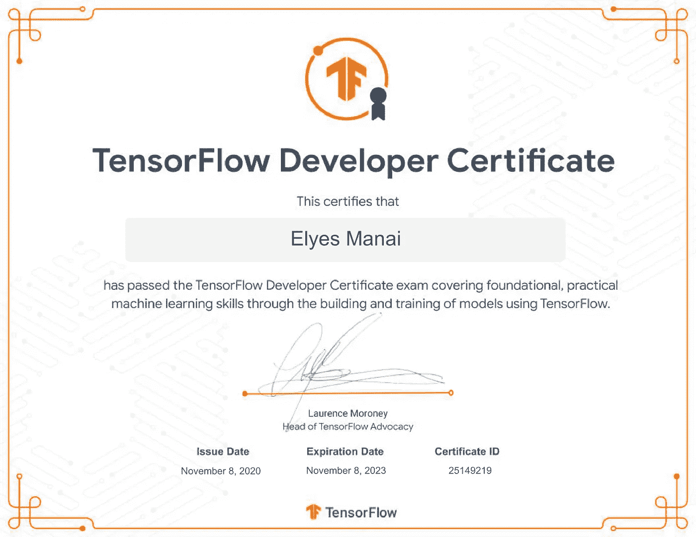
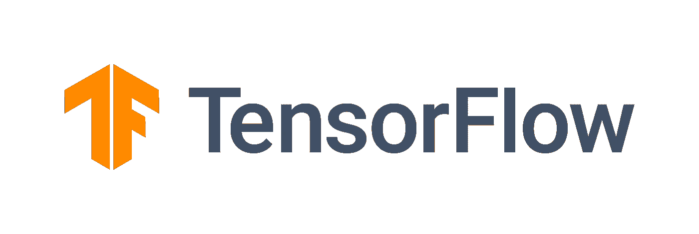
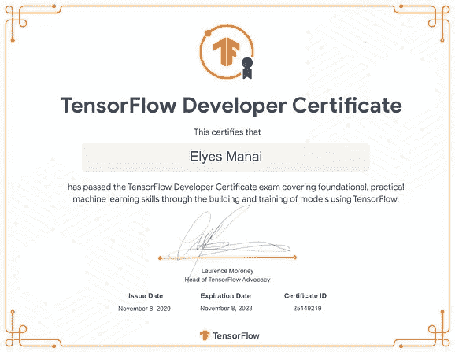
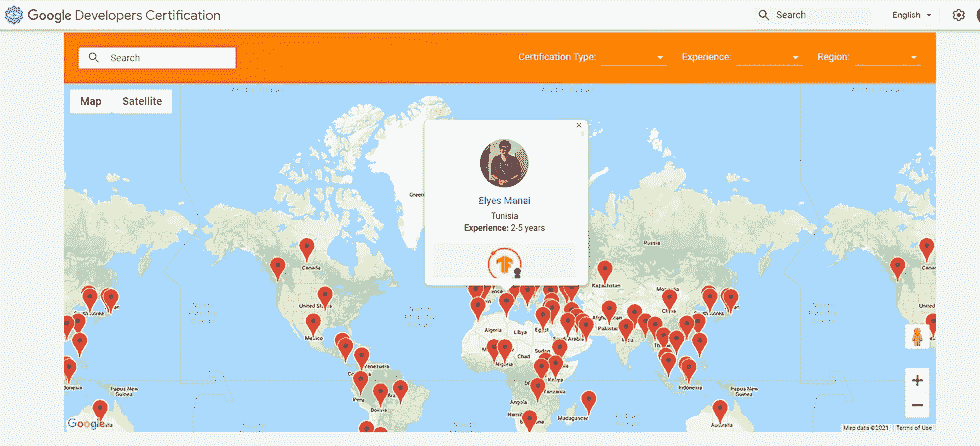

# 成为 Tensorflow 认证开发人员—这比您想象的更容易！

> 原文：<https://medium.com/google-developer-experts/become-a-tensorflow-certified-developer-its-easier-than-you-think-5a5b1e9e2105?source=collection_archive---------0----------------------->

从数据科学和机器学习起步仍然很难，因为人们可以采取不同的方法，并提出了不同的建议。更困难的是必须向潜在客户和招聘人员证明你的熟练程度。

虽然在与其他开发人员讨论时，证明你知道自己在做什么可能更容易，但要让人们相信你有多好却要困难得多。当然，参加 Kaggle/Zindi 竞赛和在 Github 中有项目是证明这一点的一种方式，但是一些不知道的人可能会担心你复制粘贴了现有的代码。毕竟开发者就是这样的，对吧？(内部笑话，用一勺盐拿着)。

一个展示你技能的客观方法是通过认证。然而，像 Udacity / Coursera 等网站上的大多数电子学习证书都不值得信任，因为人们可以很容易地重复考试，直到他们拿到为止。这些课程和证书是为了自我激励和学习的激情。它们本身并不被认可。与此同时，由谷歌、亚马逊、IBM 和微软等知名公司创建的证书具有更大的价值，但代价是有点过于先进，并且面向该公司的技术。不太理想的人仍然新鲜和开始！

那我该怎么办？很高兴你问了！因为现在我们有了 [**Tensorflow 开发者证书**](https://www.tensorflow.org/certificate) ！

# Tensorflow？

对，Tensorflow (TF)。PyTorch 和 Keras 是最受欢迎的深度学习框架之一(尽管 Keras 和 TF 现在一起发布)。

Tensorflow 的一个主要方面是它面向生产部署，因此更侧重于模块化、可伸缩性和管道。在现有基础设施的情况下，这是快速培训和大规模部署模型的完美工具。我不是在贬低其他框架，它们在其他方面比 TF 更好，但当涉及到快速训练和部署可以扩展到数百万用户的模型时，Tensorflow 轻而易举地胜出。这就是它在业界如此受欢迎的原因，也是新的深度学习爱好者的绝佳起点。

最酷的事情是，一旦你学会了用 Tensorflow 编程，你可以很容易地切换到其他专门研究 ML 某个方面的框架，这两者都允许你瞄准更难的认证。

# 似乎很酷！那么我如何获得认证呢？

哦，我看到你们都被点燃了！好吧，那我们就开始吧。获得 100 美元证书的步骤如下:

*   上官方 [**认证网站**](https://www.tensorflow.org/certificate) 通读网站
*   仔细阅读 [**考生手册**](https://www.tensorflow.org/extras/cert/TF_Certificate_Candidate_Handbook.pdf) ，里面包含了你需要准备的一切。
*   (可选)参加 Coursera 上的 [**Tensorflow 课程。**](https://www.coursera.org/professional-certificates/tensorflow-in-practice) 它会大大提高你通过考试的几率！
*   (可选)您可以申请教育津贴，免费参加上述课程+价格降至 50 美元
*   [**报名考试**](https://app.trueability.com/google-certificates/tensorflow-developer) **。一旦你这样做了，你有 6 个月的时间来服用。之后，你需要再次注册(并付费)。**
*   一旦你付钱，你会得到一本新的手册，这次会更详细。更仔细地阅读它
*   安装 PyCharm 并在其中安装 Tensorflow 考试扩展。这两个都是**需要的*。***
*   一旦你准备好了，点击开始考试，你将有 5 个小时的时间来完成它并提交你的考试。

# 我应该期待什么？

考试是实践性的，你将学习回归、分类、计算机视觉、自然语言处理和时间序列。没有什么太难的，只是足以证明在框架和心态的熟练程度。我能告诉你的就是，你的模特质量会被评分。

# 如何得到它有什么建议吗？

我们所有参加考试的人都签署了 NDA，所以我不能告诉你考试的具体内容，但是，我可以给你一些已经公开的最重要的信息:

*   您可以自由地使用您在编码时通常使用的任何资源。这意味着你可以使用 Google、StackOverflow、GitHub 等。以及 Google Colab、GCP、AWS 等只要您能够将. h5 模型下载到您的本地计算机上，并将其放在正确的文件夹中，一切都会顺利。
*   即使你有 5 个小时的时间，你可能也不需要。这是考虑到缓慢的计算机和糟糕的互联网连接。因此，如果你使用 Colab，你至少会赢得大量的训练时间。
*   习惯写代码，而不是复制粘贴。虽然这很诱人，但编写自己的代码的好处是，它可以在你的手指上建立肌肉记忆，并创建一个思维路线图，让你可以自主地开始新的项目。
*   最后，尽一切努力参加 Tensorflow 开发者课程。和考试很像。

# 我参加了考试。还不算太糟。现在怎么办？

您将在未来几天(有时更短)收到一封电子邮件，告知您的结果。如果你做得很好，我当然希望你做得很好，你会得到一个证书，一个徽章，你美丽的脸会出现在 [**认证目录**](https://developers.google.com/certification/directory/tensorflow) **。**

Examples of what you get after passing the Tensorflow Exam. It does feel cool!

恭喜你。你现在是国际的:)现在去和你的社区分享你的成就，继续提升你的条件。不要忘记把这篇文章分享给那些现在想成为你这样的人！