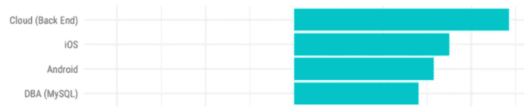
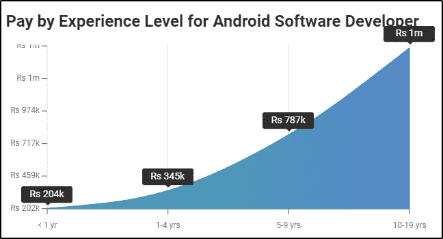
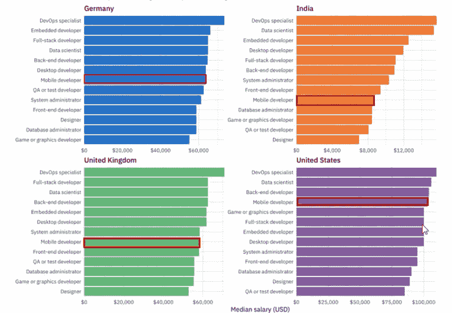
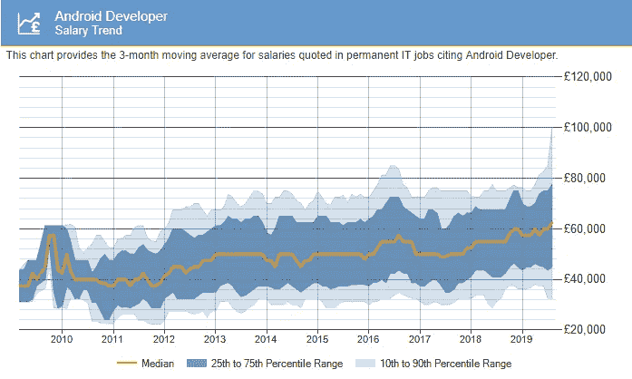

# 如何成为一名 Android 开发者？

> 原文：<https://medium.com/edureka/become-android-developer-4a6424d698f3?source=collection_archive---------2----------------------->

你是否曾经对一个应用程序的设计方式感到惊叹，并想知道它是如何构建的？你知道这是一个由安卓开发者组成的团队负责的吗？因此，这篇关于如何成为一名 Android 开发者的文章将帮助你成为一名成功的开发者，他们的唯一目的是构建一个被全球接受的应用程序。

我将讨论以下主题:

*   谁是 Android 开发者？
*   为什么选择 Android 开发？
*   工作角色
*   如何成为一名成功的 Android 开发者？

我们开始吧！

# 谁是 Android 开发者？

Android 开发人员通过开发相应的移动或桌面应用程序来帮助我们的日常活动，从而使我们的生活变得简单。所以，如果你问谁是 Android 开发者，我会说，他/她是专门为 Android marketplace 设计应用程序的软件开发者。

这意味着一个 Android 开发者在一个组织中的角色是根据你的公司工作的领域来创建应用程序。他/她可以创建简单的应用程序，也可以创建复杂的应用程序，如游戏应用程序(PUBG、Candy Crush、Word Cookies 等)。

作为一名 Android 开发人员，你需要非常清楚你的职位发布和你的责任。所以，我记下了一个 Android 开发者的几个关键角色和职责。看一看！

这些角色和职责定义了谁可以成为成功的开发人员。

*   你应该构建和设计 Android 应用程序
*   应该与设计和测试团队合作，以开发更好的产品，减少错误
*   了解如何使用不同的 API 和数据源
*   知道如何修复 bug
*   持续评估，发现新技术并加以利用

现在，下一个问题是，当你有这么多其他开发工作角色时，为什么要选择一个 Android 开发人员的角色。让我们看看成为 Android 开发者的主要原因是什么。

# 为什么选择 Android 开发？

有太多的理由让你选择 *Android 开发*。其中一些值得注意的例子如下:

## **牌照**

Android 是一个开源平台，因此它降低了软件包许可成本，从而增加了低投资和高 ROI(投资回报)。他们有一个巨大的社区，允许你在出现问题或未来版本时直接与开发者互动。

## **Android 是一个不断发展的平台**

创建的应用程序要么越来越受欢迎，要么在 Google play 商店排名靠前。谷歌不断改变某些功能，并不时发布新版本。因此，您可以定期获得更新，包括添加到您的应用程序中的临时功能。这也是一项具有挑战性的任务，可以吸引任何用户的眼球。

## **很容易采用**

如果你从事任何技术工作，比如软件测试，全栈开发，你会发现了解 Java 编程语言(T2)是如何被用来开发应用程序的最值得信赖的语言之一是很容易的。同样，任何具有 Java 相关知识的用户都可以轻松开发 Andriod 应用程序。

## **简单易学**

开发人员肯定会觉得花在学习如何开发 Android 应用程序上的时间比花在其他技术上的时间要少。了解 Java 和脚本语言，如 Perl、PHP，工作就完成了。

接下来，我们来讨论工作角色。

# 工作角色

*   移动应用开发者
*   安卓工程师
*   移动建筑师
*   嵌入式软件工程师—移动
*   首席软件工程师-移动
*   Android 开发者
*   安卓工程师
*   移动开发者

现在，谁能成为 Android 开发者？

# 谁能成为 Android 开发者？

Android 应用程序开发人员可以通过一条简单的途径成为一名成功的 Android 开发人员，因为他们已经知道应用程序是如何工作的。然而，如果你是一个初学者，并希望在 Android 应用程序开发方面建立职业生涯，你可以参加 Edureka 提供的 *Android 开发培训*。

现在，让我们来看看就业趋势。

## **工作趋势**

Android 应用程序开发是福布斯 2019 年最想要的技术技能之一。正是这种技术提供了永恒的就业机会。因此，通过了解就业趋势，抓住一些 Android 开发工作的机会。

*来源:堆栈溢出*

你可以看到 Android 开发人员的工作正在付出代价。它正在成长为市场上的顶级领导者之一。

随着 Android 市场需求的增长，印度的移动应用开发也在增加。有知识和经验的开发人员将在这个行业获得一个令人敬畏的包裹。在印度，大约有 25，000 个 Android 移动应用程序开发的职位，这个数字显示了这个行业的巨大增长。

# 薪资趋势

说一个 Android 开发者获得的工资，看看这个图。

根据 Glassdoor 的说法，对于一名大学新生来说，实际工资接近 4 英镑，而且随着工作经验的增加而不断增加。纽约的平均基本工资为 108，210 美元/年，比全国平均工资高出 11%。

此外，由于职位空缺的数量更多，工资也相当不错。下图是 2019 年的薪酬趋势。

请注意获得的工资中位数的上升。每年将近 65，000 欧元，这是一大笔钱。

既然你们已经了解了谁是 Android 开发人员，工作趋势和薪水是什么，那么让我们继续，看看如何才能成为一名成功的 Android 开发人员。

# 如何成为一名成功的 Android 开发者

要成为一名成功的 Android 开发者，你必须精通 Android 开发中的不同主题，包括技能集。下面是一些值得注意的技能，为了获得 Android 开发者的角色，你应该掌握这些技能。

**技能:**

*   应该对 Android SDK 和不同版本的 Android 有很强的了解。
*   Java/Kotlin 等编程语言的效率。
*   精通 Android UI 设计原则、模式和最佳实践。
*   对 SQL 有一定的了解。
*   精通代码版本控制工具，如 **Git** 。
*   熟悉将 Android 应用连接到后端服务的 RESTful APIs。
*   体验脱机存储、线程和性能调整。
*   具备围绕用户界面设计应用程序的能力，如*触摸。*
*   能够理解业务需求并将其转化为技术需求。
*   熟悉云消息 API 和推送通知。
*   了解 Google 的 Android 设计原则和界面指南。
*   熟悉持续集成。

掌握这些技巧，一定会帮助你成长为一名成功的 Android 开发者。也请注意，Android 是一个这样的领域，在那里工作永远不会缺货。所以现在就开始成为一名出色的开发者吧。

所以说到这里，我们就到了这篇“如何成为一名 Android 开发者”的文章的最后。我希望你清楚本文涉及的主题，并准备好开始成为一名 Android 开发者。

如果你想查看更多关于人工智能、Python、道德黑客等市场最热门技术的文章，你可以参考 Edureka 的官方网站。

请留意本系列中的其他文章，它们将解释 Android 的各个方面。

> [如何使用 Kotlin 开发 Android App？](/edureka/kotlin-android-tutorial-cea896d0ae18)
> 
> [如何与 Kotlin Native 合作？](/edureka/basic-kotlin-native-app-a22febf0f6d7)

*原载于 2019 年 8 月 28 日*[*https://www.edureka.co*](https://www.edureka.co/blog/become-android-developer/)*。*