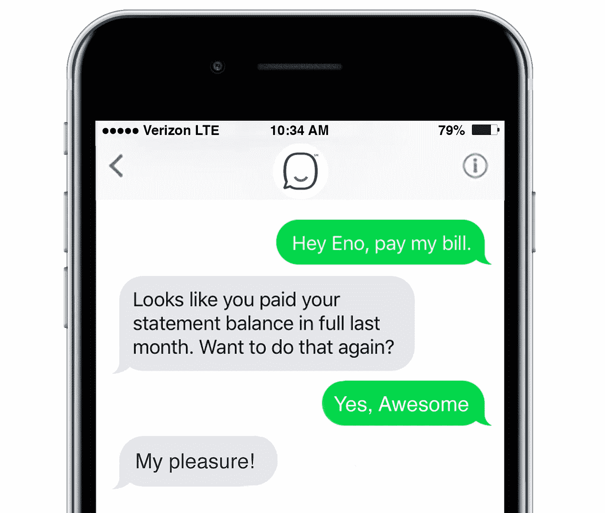
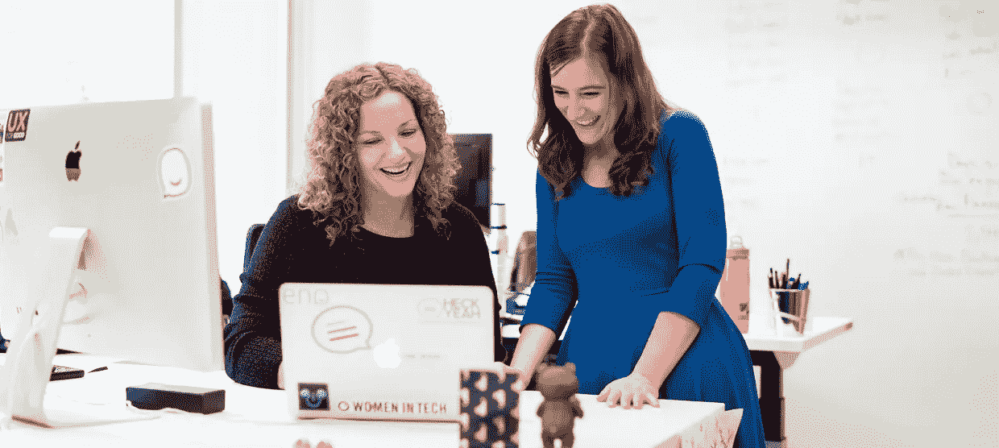

# 成为机器人:Capital One 的人工智能设计团队是如何创造出 Eno 这个角色的

> 原文：<https://medium.com/capital-one-tech/becoming-a-bot-how-capital-ones-ai-design-team-created-the-character-eno-ba7962ec575a?source=collection_archive---------7----------------------->

*作者 Colleen Krieger，Capital One 品牌高级经理*

“玫瑰是红色的，紫罗兰是蓝色的，帮你理财，就是我做的。”

这可能不是莎士比亚，但这首诗背后的诗人比吟游诗人有更多的交易性质…见见来自 Capital One 的 [Eno](https://www.capitalone.com/applications/eno/) ，这是美国银行的第一个基于短信的智能助理。Eno 最近在今年德克萨斯州奥斯汀的 SXSW festival 上亮相，客户可以随时发送短信，以便掌握他们的 Capital One 账户，支付信用卡账单，或谈论生活的意义。在一个智能助手，如 [Alexa](https://www.capitalone.com/onefocus/bank-alexa/) 倾向于展示一点个性的世界里，Eno 有自己的风格可能并不令人惊讶。但可能会让你惊讶的是，一名前电影制作人、一名人类学家、一名记者和一名用户体验设计师是如何走到一起，将这个角色带入生活的。

## 这是什么机器人？

即使是最精通表情符号和单词最准确的短信发送者也很难通过短信准确传达他们想说的话。那么，你如何着手创造一个机器人来完成这个任务，并有一点个性，同时谈论财政问题呢？这要从 Eno 设计背后的团队说起。在曾为梦工厂、卢卡斯影业和皮克斯等工作室工作过的前电影制作人 Audra Koklys Plummer 的领导下，Eno 的设计师们在共同创作过程中融入了广泛的经验。人类学家马基科·谷口在 Eno 的设计中嵌入了对客户情绪和行为的理解，同时提供了对人们如何通过短信谈论他们的金钱的见解。前记者 Lauren Lucchese 在 Eno 的响应结构中应用了精通语言，用户体验设计师 Adrian Herritt 考虑了人们可能如何与 Eno 交互，并帮助创建了一个传达 Eno 人性的视觉标识。

团队一起从各个角度接近 Eno 的角色，不仅关注机器人可能如何响应特定的查询，还关注它为什么会以特定的方式响应。这个任务导致了一种创造 Eno 语言的方法，这种方法始于 Eno 是谁背后的角色设计和哲学。

## 多好的性格

机器人可以有背景故事吗？在 Eno 的案例中，答案是肯定的。当考虑到它的各种性格特征时，这个团队做出了关于 Eno 是谁的明确决定。

奥德拉说:“我们首先就创造一个中性角色达成共识。“我们做了一个非常慎重的决定，不传达种族、年龄或性别。这样我们就觉得我们在避免唤起任何无意识的，甚至是有意识的偏见。Eno 可以是客户脑海中想象出来的任何东西。”

他们还决定确保 Eno 具有类似人类的特征，但作为机器人是完全透明的。“我喜欢说，如果伊诺有一个保险杠贴纸，上面会写着，‘机器人和骄傲’，因为这是伊诺性格的一部分。”

为了充实伊诺的角色，团队创造了适用于机器人的各种特征。他们最终选择了九种，每一种都旨在以一种易于识别的方式将 Eno 与其客户联系起来，并在情感上产生共鸣。然后，他们继续创造一个视觉参考，作家可以在创作人物反应时借鉴。例如，奥德拉说。“如果伊诺是人类，它会充满自信地在太空中行走，脚步轻盈。如果你和 Eno 坐在同一个空间，它会拉一把椅子让自己舒服，就像它有足够的时间听你说什么。你还会注意到这个机器人有些不寻常，如果你和它面对面交谈的话——也许它的眼睛眨得不够。这提醒了我们它不是人类。”

这个(字面上的)机器人特征帮助团队决定了 Eno 最重要的一个方面:它的性格缺陷。“这也是塑造伊诺这个角色最具挑战性的事情之一，”奥德拉说，“因为角色的缺陷是让一个角色与观众产生共鸣的原因。这就是我们如何产生共鸣和理解，然后导致信任和建立更深的关系。挑战在于 Eno 应该是一个非常智能、值得信赖的机器人，可以处理你的财务信息。让它有缺陷是有风险的，因为你希望人们信任 Eno。”

团队认定的缺陷是围绕 Eno 的自我意识建立的。“Eno 知道它不是人类，”Audra 说，“这赋予了它使命和目的，但 Eno 的人性在每一次互动的表面下蠢蠢欲动，它推动 Eno 采取行动并建立联系。我们的决定是，也许有时伊诺试图连接有点太努力，就像，伊诺有点太急切了。这是一个相关的性格缺陷。”

## 有什么好话？

Eno 使用自然语言处理解决方案，这意味着越多的人向机器人发短信和说话，它就越能理解和学习如何回答客户提出的问题。但是为了做出这些回答，研究小组必须确定 Eno 在回答每个特定问题时可能使用的语言类型。与此同时，语言必须捕捉 Eno 的可联系性和移情性，以便客户始终感觉他们在与一位值得信赖的导师交谈，例如最喜爱的教授、老师或顾问。

另一个例子:当开发 Eno 的幽默感时，团队发现 Eno 喜欢双关语。“我们写其中一些很有意思，”奥德拉说。“我想到了我们写的关于天气的回应，我完全想用一个关于住在有点暴雨的云中的真正书呆子式的讽刺来回应，”她说。该团队最终决定反对它，因为担心用户会将 Eno 与有时与盗版相关的技术联系起来——这表明该团队在考虑什么样的响应符合要求时对细节的关注。

“每一个回答都是经过深思熟虑的，”奥德拉说。“你真的会惊讶于我们在一个句子上来回戏谑了多少次，只是为了让它正确，并确保我们保持了 Eno 角色的完整性。”

## 下一步是什么

现在 Eno 已经开始建立一个等待名单，该团队正在专注于进一步开发机器人的角色，包括角色边界等内容，如 Eno 可能如何回应冒犯和粗鲁的言论。“这不仅是一个设计挑战，也是一个巨大的技术挑战，”奥德拉说。“一个人可以用很多方式提出要求，或者说同样的话。我们需要理解说话背后的意图，并能够做出与上下文相关的回应。如果我们做错了，就有得罪客户或失去客户信任的风险。”

其他即将出现的项目:根据试点用户的反馈设计新的体验，包括在聊天中获得一点乐趣，以及调整机器人的响应结构以适应不断变得越来越复杂的技术。“我们设计对话的方式将会彻底改变，”奥德拉说。考虑到你现在可以和一个健谈的机器人发短信谈论你的财务状况，变化似乎已经到来了。

[*注册成为第一个与 Eno 讨论您的银行业务的人。*](https://www.capitalone.com/applications/eno/)

*科琳·克里格是第一资本公司数字品牌战略高级经理。*

*这件作品最初出现在 Capital One 的*[*One FOCUS*](https://www.capitalone.com/onefocus/becoming-a-bot/)*博客，2017 年 5 月。*

这些是作者的观点。除非本帖中另有说明，否则 Capital One 不属于所提及的任何公司，也不被其认可。使用或展示的所有商标和其他知识产权都是其各自所有者的所有权。本文为 2017 首都一。